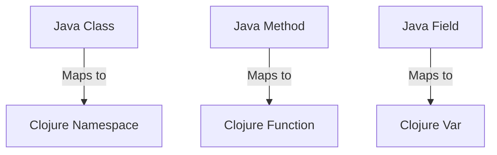

## 20.3 Documentation Strategies for Functional Code

In the realm of functional programming, where Clojure stands as a beacon of simplicity and power, effective documentation becomes a cornerstone for maintaining clarity and ensuring the scalability of applications. Documentation strategies in functional code are pivotal for both individual developers and teams, as they provide insights into code functionality, design decisions, and usage patterns. In this section, we will explore several strategies to document functional code effectively, focusing on self-documenting practices, metadata annotations, example-driven documentation, and automatic documentation generation tools.

### Self-Documenting Code

Self-documenting code is an ideal in software development where the code itself is clear and understandable without requiring additional explanatory comments. In Clojure, this is achieved by leveraging the language's expressive syntax and functional paradigms.

#### Naming Conventions

Use descriptive names for functions, variables, and namespaces. This practice makes the code more readable and reduces the need for extensive comments.

```clojure
;; Example of descriptive naming in Clojure
(defn calculate-total-price
  "Calculates the total price given a list of item prices and a tax rate."
  [prices tax-rate]
  (let [subtotal (reduce + prices)
        tax (* subtotal tax-rate)]
    (+ subtotal tax)))
```

In this example, the function name `calculate-total-price` clearly indicates its purpose, and the parameter names `prices` and `tax-rate` are self-explanatory.

#### Code Organization

Organize code into logical sections using namespaces and modules. This helps in maintaining a clean structure and facilitates navigation.

```clojure
(ns ecommerce.pricing
  (:require [clojure.string :as str]))

(defn apply-discount
  "Applies a discount to the given price."
  [price discount]
  (* price (- 1 discount)))
```

By organizing related functions under the `ecommerce.pricing` namespace, we create a clear separation of concerns, making the codebase easier to understand and extend.

### Use of Annotations

Annotations in Clojure can be used to add metadata to functions and variables, which aids in documentation and tooling.

#### Adding Metadata

Clojure allows you to attach metadata to symbols, providing additional context that can be utilized by tools or during runtime.

```clojure
;; Adding metadata to a function
(defn ^{:author "John Doe"
        :version "1.0"
        :description "Calculates the square of a number."}
  square
  [x]
  (* x x))
```

In this example, metadata is added to the `square` function to document its author, version, and description. This metadata can be accessed programmatically, making it useful for generating documentation or providing runtime insights.

#### Leveraging Metadata in Tools

Tools like `clojure.spec` can leverage metadata for validation and documentation purposes, providing a more robust development experience.

```clojure
(require '[clojure.spec.alpha :as s])

(s/def ::price number?)
(s/def ::discount (s/and number? #(<= 0 % 1)))

(defn apply-discount
  "Applies a discount to the given price."
  [price discount]
  {:pre [(s/valid? ::price price)
         (s/valid? ::discount discount)]}
  (* price (- 1 discount)))
```

Here, `clojure.spec` is used to define specifications for `price` and `discount`, which serve as both documentation and validation, ensuring that the function is used correctly.

### Example-Driven Documentation

Including examples in your documentation is a powerful way to illustrate how functions should be used and what results can be expected.

#### Inline Examples

Provide examples directly within the function's docstring to demonstrate typical usage scenarios.

```clojure
(defn calculate-discounted-price
  "Calculates the discounted price.
  
  Example:
  (calculate-discounted-price 100 0.2) ;=> 80.0"
  [price discount]
  (* price (- 1 discount)))
```

This approach gives immediate context to anyone reading the function, showing how it can be applied in practice.

#### Dedicated Example Files

Create separate files or sections in your documentation dedicated to examples and use cases. This can be particularly useful for complex functions or libraries.

### Automatic Documentation Generation

Automating the generation of documentation from code comments and annotations can save time and ensure consistency.

#### Tools for Automatic Documentation

Several tools exist to help generate documentation automatically from Clojure code:

- **Marginalia**: Generates beautiful documentation from code comments.
- **Codox**: A tool that produces API documentation from your Clojure source code, similar to Javadoc for Java.

#### Setting Up Codox

To set up Codox for your Clojure project, add it to your `project.clj` dependencies:

```clojure
;; project.clj
:plugins [[lein-codox "0.10.7"]]
```

Run the following command to generate documentation:

```bash
lein codox
```

This will produce HTML documentation that you can host or distribute, providing a comprehensive view of your codebase.

### Try It Yourself

To solidify your understanding, try modifying the `calculate-total-price` function to include a discount parameter and update the documentation accordingly. Experiment with adding metadata and generating documentation using Codox.

### Visual Aids

To further illustrate the concepts discussed, let's include a diagram showing how Java classes map to Clojure namespaces and functions.



**Diagram Description:** This diagram illustrates the mapping between Java OOP concepts and their equivalents in Clojure, highlighting how classes, methods, and fields correspond to namespaces, functions, and vars, respectively.

### References and Links

- [Clojure Official Documentation](https://clojure.org/reference)
- [Clojure Community Resources](https://clojure.org/community/resources)
- [Transitioning from OOP to Functional Programming](https://www.lispcast.com/oo-to-fp/)
- [Codox Documentation](https://github.com/weavejester/codox)
- [Marginalia Documentation](https://github.com/gdeer81/marginalia)

### Knowledge Check

Let's reinforce your understanding with some questions and exercises.

1. **What are the benefits of using metadata in Clojure functions?**
2. **How does example-driven documentation enhance code clarity?**
3. **Experiment with Codox: Generate documentation for a sample Clojure project.**
4. **Refactor an imperative Java method to a functional Clojure function and document it.**

### Encouraging Engagement

Embracing functional programming in Clojure can transform your approach to software development. By mastering documentation strategies, you not only enhance your code's readability but also empower others to build upon your work. Remember, each step you take in documenting your code makes it more accessible and maintainable for the entire development community.

## **Test Your Knowledge: Documentation Strategies for Functional Code Quiz**



### What is the primary goal of self-documenting code?

- [x] To make the code clear and understandable without additional comments
- [ ] To ensure every line of code has a comment
- [ ] To reduce the need for testing
- [ ] To eliminate the use of metadata

> **Explanation:** Self-documenting code aims to be clear and understandable on its own, reducing the need for extensive comments.

### How can metadata be used in Clojure?

- [x] To add additional context to functions and variables
- [ ] To replace function arguments
- [x] To aid in documentation and tooling
- [ ] To execute code at runtime

> **Explanation:** Metadata provides additional context and can be used by tools for documentation and runtime insights.

### Which tool is used for generating documentation similar to Javadoc in Clojure?

- [x] Codox
- [ ] Marginalia
- [ ] Leiningen
- [ ] Reagent

> **Explanation:** Codox is used to generate API documentation from Clojure source code, similar to Javadoc for Java.

### What is a benefit of example-driven documentation?

- [x] It illustrates function behavior with practical examples
- [ ] It replaces the need for metadata
- [ ] It reduces code size
- [ ] It increases execution speed

> **Explanation:** Example-driven documentation provides practical examples that illustrate how functions should be used.

### Which of the following is a tool for automatic documentation generation in Clojure?

- [x] Marginalia
- [ ] Re-frame
- [x] Codox
- [ ] core.async

> **Explanation:** Both Marginalia and Codox are tools for generating documentation from Clojure code.

### What does the `:pre` condition in a Clojure function do?

- [x] Ensures preconditions are met before executing the function
- [ ] Executes code after the function returns
- [ ] Replaces the function body
- [ ] Generates documentation

> **Explanation:** The `:pre` condition checks that certain conditions are met before the function executes.

### How does organizing code into namespaces help?

- [x] It creates a clear separation of concerns
- [ ] It reduces the number of lines in the code
- [x] It facilitates navigation and maintenance
- [ ] It increases runtime performance

> **Explanation:** Namespaces help organize code logically, making it easier to navigate and maintain.

### What is the purpose of the `lein codox` command?

- [x] To generate HTML documentation from Clojure code
- [ ] To compile Clojure code
- [ ] To run tests
- [ ] To deploy applications

> **Explanation:** The `lein codox` command generates HTML documentation from Clojure source code.

### Why is it important to use descriptive names in Clojure?

- [x] To make the code more readable and self-explanatory
- [ ] To reduce the need for testing
- [ ] To increase execution speed
- [ ] To comply with Clojure syntax

> **Explanation:** Descriptive names enhance readability and help make the code self-documenting.

### True or False: Metadata in Clojure can be accessed programmatically.

- [x] True
- [ ] False

> **Explanation:** Metadata can be accessed programmatically, providing additional context and insights.



By implementing these documentation strategies, you'll not only improve your Clojure code's clarity and maintainability but also foster a more collaborative and productive development environment.
