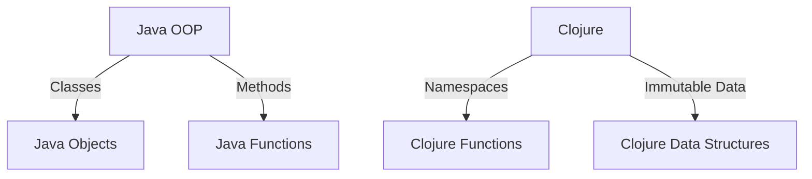

## 20.4 Common Pitfalls and How to Avoid Them

In the journey of mastering functional programming with Clojure, developers often encounter several pitfalls that can hinder their progress and the effectiveness of their applications. Understanding these common pitfalls and learning how to avoid them is crucial for building efficient, scalable applications. In this section, we will explore some of the most prevalent challenges developers face and provide strategies to overcome them.

### Over-Abstracting

One of the most common pitfalls in programming, especially in functional programming, is over-abstraction. While abstraction is a powerful tool for managing complexity, creating abstractions that are too general or unnecessary can lead to code that is difficult to understand, maintain, and use.

#### Understanding Over-Abstraction

Abstraction involves creating a simplified model of a complex reality. In functional programming, this often means creating functions or data structures that hide implementation details. However, when abstractions become too broad or are applied prematurely, they can obscure the logic and intent of the code.

##### Example of Over-Abstraction

Consider a scenario where we have a simple function to calculate the area of a rectangle:

```clojure
(defn rectangle-area [length width]
  (* length width))
```

In an attempt to generalize, one might create a more abstract function:

```clojure
(defn shape-area [shape]
  (case (:type shape)
    :rectangle (* (:length shape) (:width shape))
    :circle (* Math/PI (Math/pow (:radius shape) 2))
    :triangle (/ (* (:base shape) (:height shape)) 2)))
```

While this abstraction supports multiple shapes, it introduces complexity and potential for errors, especially if new shapes are added.

#### Avoiding Over-Abstraction

- **Keep It Simple**: Start with simple, concrete solutions. Only introduce abstractions when they provide clear benefits.
- **Refactor When Necessary**: Refactor code to introduce abstractions only when patterns emerge and the need for generalization is evident.
- **Document Intent**: Clearly document the purpose and limitations of abstractions to aid future developers in understanding the code.

### Ignoring Lazy Evaluation Traps

Lazy evaluation is a powerful feature in Clojure that allows for efficient data processing. However, it can also lead to subtle bugs and performance issues if not handled correctly.

#### Understanding Lazy Evaluation

Lazy evaluation means that expressions are not evaluated until their values are needed. This can save computational resources and allow for the creation of infinite data structures.

##### Example of Lazy Evaluation Trap

Consider the following code that generates an infinite sequence of numbers:

```clojure
(defn infinite-sequence []
  (iterate inc 0))

(defn take-even-numbers [n]
  (take n (filter even? (infinite-sequence))))
```

While this code works, if the `take-even-numbers` function is called with a large value of `n`, it can cause memory issues due to the retention of the head of the sequence.

#### Avoiding Lazy Evaluation Traps

- **Use Realized Collections**: Convert lazy sequences to realized collections when necessary to avoid holding onto large data unnecessarily.
  
```clojure
(defn take-even-numbers-realized [n]
  (vec (take n (filter even? (infinite-sequence)))))
```

- **Be Mindful of Resource Retention**: Understand that lazy sequences can retain resources. Use functions like `doall` to force realization when needed.

### Inefficient Data Processing

Choosing the right data structures and algorithms is crucial for efficient data processing. Inefficient choices can lead to poor performance and scalability issues.

#### Understanding Data Processing Efficiency

In Clojure, data structures such as lists, vectors, maps, and sets each have their own performance characteristics. Understanding these characteristics is essential for making informed decisions.

##### Example of Inefficient Data Processing

Consider a scenario where we need to frequently append elements to a collection:

```clojure
(defn inefficient-append [coll elem]
  (conj coll elem))
```

Using a list for this operation is inefficient because it requires traversing the entire list to append an element. A vector would be more appropriate.

#### Avoiding Inefficient Data Processing

- **Choose the Right Data Structure**: Use vectors for fast appends and random access, lists for sequential processing, and maps for key-value associations.
- **Leverage Clojure's Built-in Functions**: Use functions like `map`, `reduce`, and `filter` to process data efficiently.

### Not Embracing the Functional Paradigm

Fully adopting functional programming practices is essential for leveraging the benefits of Clojure. Mixing paradigms haphazardly can lead to confusion and suboptimal code.

#### Understanding the Functional Paradigm

Functional programming emphasizes immutability, pure functions, and declarative code. It contrasts with imperative programming, which focuses on state changes and side effects.

##### Example of Mixing Paradigms

Consider a scenario where a developer uses mutable state within a Clojure function:

```clojure
(defn calculate-sum [numbers]
  (let [sum (atom 0)]
    (doseq [n numbers]
      (swap! sum + n))
    @sum))
```

This code uses an atom to accumulate a sum, which is unnecessary and goes against functional principles.

#### Embracing the Functional Paradigm

- **Use Pure Functions**: Ensure functions have no side effects and always return the same output for the same input.
- **Favor Immutability**: Use immutable data structures and avoid mutable state.
- **Adopt Declarative Code**: Describe what should be done, not how to do it, using higher-order functions and composition.

### Try It Yourself

To solidify your understanding, try refactoring the following code to avoid the pitfalls discussed:

```clojure
(defn process-data [data]
  (let [result (atom [])]
    (doseq [d data]
      (swap! result conj (inc d)))
    @result))
```

- **Challenge**: Refactor this code to eliminate the use of mutable state and embrace a more functional approach.

### Visual Aids

To better understand the transition from Java OOP to Clojure's functional paradigm, consider the following diagram:



**Diagram Description**: This diagram illustrates the mapping of Java OOP concepts to Clojure's functional programming constructs. Java classes and methods map to Clojure namespaces and functions, while Java objects are replaced by immutable data structures in Clojure.

### References and Links

For further reading and to deepen your understanding, explore the following resources:

- [Clojure Official Documentation](https://clojure.org/reference)
- [Clojure Community Resources](https://clojure.org/community/resources)
- [Transitioning from OOP to Functional Programming](https://www.lispcast.com/oo-to-fp/)
- [Clojure STM Guide](https://clojure.org/reference/refs)

### Knowledge Check

Let's test your understanding of the common pitfalls in functional programming with Clojure:

## **Test Your Knowledge: Common Pitfalls and How to Avoid Them Quiz**



### What is a common issue with over-abstraction?

- [x] It can lead to code that is difficult to understand.
- [ ] It always improves code readability.
- [ ] It simplifies debugging.
- [ ] It makes code faster.

> **Explanation:** Over-abstraction can obscure the logic and intent of the code, making it difficult to understand.

### How can you avoid lazy evaluation traps?

- [x] Use realized collections when necessary.
- [ ] Always use lazy sequences.
- [ ] Avoid using sequences altogether.
- [ ] Use mutable data structures.

> **Explanation:** Realized collections can prevent memory issues by not retaining unnecessary data.

### Which data structure is efficient for appending elements in Clojure?

- [x] Vector
- [ ] List
- [ ] Map
- [ ] Set

> **Explanation:** Vectors provide efficient append operations due to their underlying structure.

### What is a key characteristic of the functional paradigm?

- [x] Immutability
- [ ] Mutable state
- [ ] Side effects
- [ ] Imperative code

> **Explanation:** Immutability is a core principle of functional programming, promoting stability and predictability.

### How can you embrace the functional paradigm in Clojure?

- [x] Use pure functions.
- [ ] Use mutable state.
- [x] Favor immutability.
- [ ] Write imperative code.

> **Explanation:** Pure functions and immutability are fundamental to functional programming.

### What is the impact of ignoring lazy evaluation traps?

- [x] Resource retention
- [ ] Faster code execution
- [ ] Simplified code
- [ ] Improved memory usage

> **Explanation:** Lazy evaluation can lead to unintended resource retention if not managed properly.

### Why is it important to choose the right data structure?

- [x] It impacts performance and scalability.
- [ ] It has no effect on code efficiency.
- [x] It determines data processing speed.
- [ ] It only affects code readability.

> **Explanation:** The choice of data structure affects both performance and scalability of applications.

### What does the `doall` function do in Clojure?

- [x] Forces realization of a lazy sequence.
- [ ] Creates a lazy sequence.
- [ ] Appends elements to a sequence.
- [ ] Filters a sequence.

> **Explanation:** `doall` forces a lazy sequence to be realized, preventing resource retention.

### What is a benefit of using pure functions?

- [x] Predictable behavior
- [ ] Increased complexity
- [ ] Mutable state
- [ ] Side effects

> **Explanation:** Pure functions provide predictable behavior by always returning the same output for the same input.

### True or False: Mixing paradigms in Clojure is recommended.

- [ ] True
- [x] False

> **Explanation:** Mixing paradigms can lead to confusion and suboptimal code, and is not recommended.



By understanding and avoiding these common pitfalls, you can leverage the full power of Clojure's functional programming paradigm to build scalable and efficient applications. Embrace these practices, and you'll find your codebase becoming more robust and maintainable.
