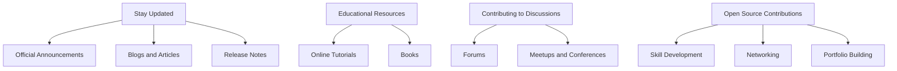

## 20.5 Continuous Learning and Community Engagement

In the rapidly evolving landscape of software development, continuous learning and community engagement are crucial for staying relevant and advancing your skills. Mastering functional programming with Clojure is no exception. This section will guide you through strategies for staying updated, engaging with the community, and contributing to the vibrant ecosystem surrounding Clojure.

### Staying Updated

#### Official Clojure Announcements

To keep abreast of the latest developments in Clojure, it is essential to follow official announcements and release notes. These updates often include crucial information about new features, bug fixes, and improvements that can significantly impact your projects. 

- **Clojure Official Website**: The [Clojure Official Documentation](https://clojure.org/reference) is a primary source for updates and detailed documentation on language features.
- **Clojure Blog**: The [Clojure Blog](https://clojure.org/blog) provides insights into the language's development and community news.

#### Blogs and Articles

Reading blogs and articles written by experienced Clojure developers can provide valuable perspectives and practical insights. Many developers share their experiences and solutions to common problems, which can be incredibly beneficial.

- **Planet Clojure**: This is an aggregator of Clojure blogs and articles. It offers a wide range of content from various authors, making it a great resource for diverse viewpoints.
- **ClojureVerse Blog**: The [ClojureVerse Blog](https://clojureverse.org/c/blog) features articles from community members on various topics related to Clojure.

#### Release Notes

Release notes are an essential resource for understanding changes in new versions of Clojure. They provide detailed information about new features, deprecated functionalities, and bug fixes.

- **GitHub Repository**: The [Clojure GitHub Repository](https://github.com/clojure/clojure) is where you can find release notes and track the progress of upcoming releases.

### Educational Resources

To deepen your understanding of Clojure and functional programming, consider exploring various educational resources. These can range from online tutorials to comprehensive courses and books.

#### Online Tutorials and Courses

- **ClojureBridge**: This initiative offers workshops and resources to help beginners learn Clojure. It's a great starting point for those new to the language.
- **Coursera and edX**: These platforms offer courses on functional programming and Clojure, often taught by experts in the field.
- **Practicalli**: This is a collection of free and open-source resources for learning Clojure, including guides and video tutorials.

#### Books

Books provide in-depth knowledge and are invaluable for mastering complex topics.

- **"Clojure for the Brave and True"**: This book is a fun and engaging introduction to Clojure, suitable for beginners and experienced programmers alike.
- **"Programming Clojure"**: A comprehensive guide to the language, this book covers both basic and advanced topics.
- **"Living Clojure"**: This book offers a practical approach to learning Clojure, with exercises and real-world examples.

### Contributing to Discussions

Engaging in discussions with other Clojure developers can enhance your understanding and expose you to new ideas. Participating in forums and online communities is an excellent way to connect with others and share knowledge.

#### Forums and Online Communities

- **ClojureVerse**: [ClojureVerse](https://clojureverse.org/) is a friendly forum where you can ask questions, share projects, and discuss Clojure-related topics.
- **r/Clojure**: The [Clojure subreddit](https://www.reddit.com/r/Clojure/) is a vibrant community where developers share news, articles, and discussions about Clojure.
- **Stack Overflow**: This platform is a valuable resource for finding solutions to specific programming problems. The Clojure tag on Stack Overflow contains a wealth of information and community-contributed answers.

#### Meetups and Conferences

Attending meetups and conferences is a great way to network with other developers and learn from experts.

- **Clojure/conj**: This is an annual conference dedicated to Clojure and functional programming. It features talks from prominent figures in the community and is an excellent opportunity for networking.
- **Local Meetups**: Many cities have local Clojure meetups where developers can gather to discuss the language and share their experiences.

### Open Source Contributions

Contributing to open-source projects is one of the most effective ways to improve your skills and give back to the community. It allows you to work on real-world projects, collaborate with other developers, and gain recognition for your work.

#### Benefits of Open Source Contributions

- **Skill Development**: Working on open-source projects exposes you to different coding styles and problem-solving approaches, enhancing your technical skills.
- **Networking**: Collaborating with other contributors helps you build a network of contacts in the industry.
- **Portfolio Building**: Contributions to open-source projects can be included in your portfolio, showcasing your abilities to potential employers.

#### How to Get Started

- **Find a Project**: Look for projects that interest you on platforms like GitHub. The [Clojure GitHub Organization](https://github.com/clojure) is a good place to start.
- **Join the Community**: Engage with the project's community by joining mailing lists or chat rooms. This will help you understand the project's goals and how you can contribute.
- **Start Small**: Begin with small contributions, such as fixing bugs or improving documentation. This will help you get familiar with the project's codebase and build confidence.

### Try It Yourself: Contributing to an Open Source Project

To get started with open-source contributions, try the following exercise:

1. **Choose a Clojure Project**: Visit the [Clojure GitHub Organization](https://github.com/clojure) and select a project that interests you.
2. **Read the Documentation**: Familiarize yourself with the project's documentation and contribution guidelines.
3. **Identify an Issue**: Look for open issues labeled "good first issue" or "help wanted" and choose one to work on.
4. **Fork the Repository**: Create a fork of the repository and clone it to your local machine.
5. **Make Your Changes**: Implement your changes and test them locally.
6. **Submit a Pull Request**: Once you're satisfied with your changes, submit a pull request to the original repository.

### Visual Aids

To help visualize the process of engaging with the Clojure community, consider the following diagram:

**Diagram Description**: This flowchart illustrates the different aspects of continuous learning and community engagement in Clojure. It highlights the importance of staying updated, leveraging educational resources, participating in discussions, and contributing to open-source projects.

### References and Links

- [Clojure Official Documentation](https://clojure.org/reference)
- [Clojure Blog](https://clojure.org/blog)
- [Clojure GitHub Repository](https://github.com/clojure/clojure)
- [ClojureVerse](https://clojureverse.org/)
- [r/Clojure](https://www.reddit.com/r/Clojure/)
- [ClojureBridge](https://www.clojurebridge.org/)
- [Planet Clojure](https://planet.clojure.in/)
- [Clojure/conj Conference](https://clojure.org/community/conferences)

### Knowledge Check

To reinforce your understanding of continuous learning and community engagement in Clojure, consider the following questions:

- What are the benefits of contributing to open-source projects?
- How can you stay updated with the latest developments in Clojure?
- What are some recommended resources for learning Clojure?
- Why is participating in community discussions important?

### Encouraging Engagement

Embracing continuous learning and community engagement can be challenging, but the rewards are immense. By staying updated, participating in discussions, and contributing to open-source projects, you'll not only enhance your skills but also become an integral part of the Clojure community. Remember, the journey of mastering Clojure is a collaborative effort, and every step you take brings you closer to becoming a proficient functional programmer.

## **Test Your Knowledge: Continuous Learning and Community Engagement Quiz**



### What is the primary benefit of following official Clojure announcements?

- [x] Staying informed about new features and updates
- [ ] Networking with other developers
- [ ] Learning about Java OOP concepts
- [ ] Finding job opportunities

> **Explanation:** Official announcements provide information about new features, updates, and improvements in Clojure.

### Which platform is recommended for finding diverse Clojure blogs and articles?

- [x] Planet Clojure
- [ ] ClojureVerse
- [ ] Stack Overflow
- [ ] GitHub

> **Explanation:** Planet Clojure aggregates a wide range of blogs and articles from various authors.

### How can contributing to open-source projects benefit your career?

- [x] Skill development and networking
- [ ] Access to exclusive job listings
- [ ] Guaranteed job offers
- [ ] Free software licenses

> **Explanation:** Open-source contributions enhance your skills and help you build a professional network.

### What is a good starting point for beginners learning Clojure?

- [x] ClojureBridge workshops
- [ ] Advanced Clojure books
- [ ] Clojure/conj conference
- [ ] GitHub repositories

> **Explanation:** ClojureBridge offers workshops and resources tailored for beginners.

### Which forum is known for its friendly Clojure community discussions?

- [x] ClojureVerse
- [ ] r/Clojure
- [ ] Stack Overflow
- [ ] LinkedIn

> **Explanation:** ClojureVerse is known for its welcoming community and active discussions.

### What type of issues should you look for when starting with open-source contributions?

- [x] "Good first issue" or "help wanted"
- [ ] "Critical bug"
- [ ] "Feature request"
- [ ] "Security vulnerability"

> **Explanation:** These labels indicate issues that are suitable for newcomers to the project.

### What is the benefit of attending Clojure conferences like Clojure/conj?

- [x] Networking and learning from experts
- [ ] Free swag and merchandise
- [ ] Guaranteed speaking opportunities
- [ ] Access to private code repositories

> **Explanation:** Conferences provide opportunities to network and learn from industry experts.

### How can you stay updated with Clojure release notes?

- [x] Follow the Clojure GitHub repository
- [ ] Subscribe to a Clojure newsletter
- [ ] Attend local meetups
- [ ] Join a Clojure book club

> **Explanation:** The GitHub repository contains detailed release notes and updates.

### What is a key advantage of reading Clojure-related books?

- [x] In-depth knowledge and comprehensive coverage
- [ ] Instant access to the latest updates
- [ ] Direct communication with authors
- [ ] Free online access

> **Explanation:** Books provide detailed and comprehensive information on Clojure topics.

### True or False: Engaging in community discussions can enhance your understanding of Clojure.

- [x] True
- [ ] False

> **Explanation:** Community discussions expose you to different perspectives and solutions, enhancing your understanding.



By actively engaging with the Clojure community and continuously expanding your knowledge, you'll not only become a more proficient developer but also contribute to the growth and vibrancy of the Clojure ecosystem. Keep exploring, learning, and sharing your insights with others.
