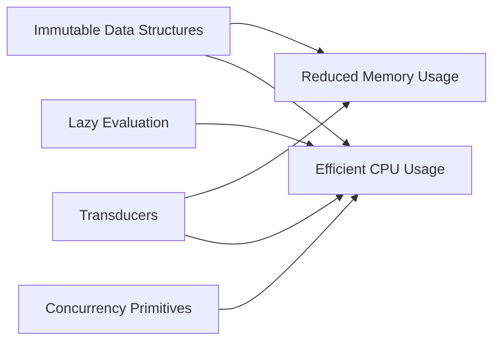
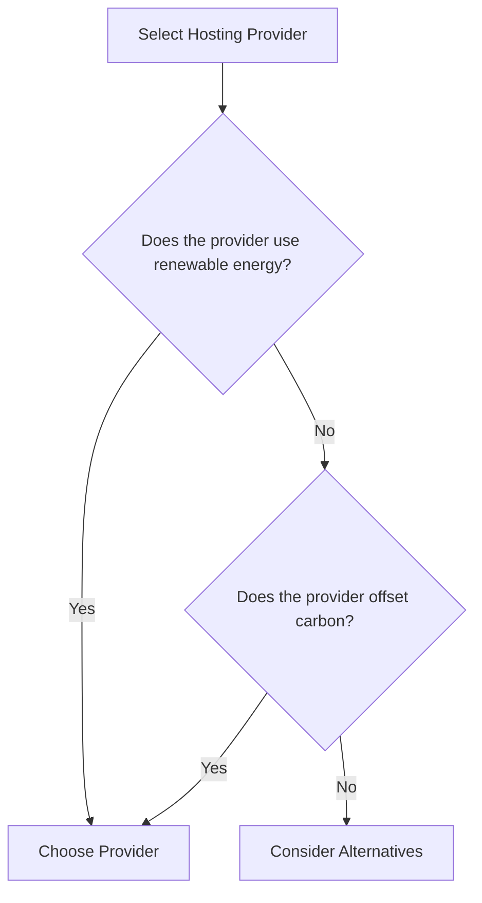

## 20.6 Environmental Awareness in Functional Applications

In today's world, where technology plays a pivotal role in shaping our environment, it becomes imperative for developers to adopt practices that not only enhance software performance but also minimize environmental impact. This section delves into how functional programming, particularly with Clojure, can be leveraged to create environmentally aware applications. We will explore optimizing resource usage, selecting green hosting options, measuring environmental impact, and promoting sustainable practices throughout the software development lifecycle.

### Optimizing Resource Usage

Functional programming inherently promotes certain principles that align well with resource optimization, such as immutability and statelessness. These principles can lead to more efficient CPU and memory usage, ultimately reducing energy consumption.

#### Efficient CPU and Memory Usage

1. **Immutability and Structural Sharing**: Clojure's persistent data structures use structural sharing to minimize memory usage. By reusing existing data structures and only creating new structures when necessary, Clojure applications can reduce memory footprint and CPU cycles. This is akin to Java's flyweight pattern but implemented at the language level.

   ```clojure
   ;; Example of structural sharing in Clojure
   (def original-vector [1 2 3 4 5])
   (def modified-vector (conj original-vector 6))

   ;; Only the new element is added, rest is shared
   ```

2. **Lazy Evaluation**: Clojure's lazy sequences allow computations to be deferred until their results are actually needed, thus saving CPU time and memory. This is similar to Java's streams but with more emphasis on immutability.

   ```clojure
   ;; Lazy sequence example
   (defn lazy-numbers []
     (lazy-seq (cons 1 (lazy-numbers))))

   (take 5 (lazy-numbers)) ;; Only computes the first 5 numbers
   ```

3. **Concurrency and Parallelism**: Clojure provides robust concurrency primitives like atoms, refs, and agents, which help in efficiently managing state changes across multiple threads without locking, thereby optimizing CPU usage.

   ```clojure
   ;; Using atoms for concurrency
   (def counter (atom 0))

   (swap! counter inc) ;; Increment counter atomically
   ```

4. **Transducers**: Transducers provide a way to compose transformations without creating intermediate collections, thus optimizing both CPU and memory usage.

   ```clojure
   ;; Transducer example
   (def xf (comp (filter even?) (map inc)))
   (transduce xf conj [] (range 10)) ;; Efficiently process data without intermediates
   ```

### Green Hosting Options

Choosing a hosting provider that prioritizes renewable energy can significantly reduce the carbon footprint of your applications. Consider the following when selecting a hosting provider:

1. **Renewable Energy Certificates (RECs)**: Look for providers that purchase RECs to offset their energy consumption. This ensures that the energy used by their data centers is matched by renewable energy production.

2. **Energy-Efficient Data Centers**: Opt for providers with data centers that use energy-efficient technologies, such as advanced cooling systems and energy-efficient hardware.

3. **Carbon Neutral or Negative**: Some providers go beyond carbon neutrality by investing in carbon offset projects that reduce more carbon than they emit.

#### Recommended Green Hosting Providers

- **Google Cloud Platform**: Committed to operating on 100% renewable energy and has been carbon neutral since 2007.
- **Microsoft Azure**: Aims to be carbon negative by 2030 and has a strong focus on sustainability.
- **Amazon Web Services (AWS)**: Offers a carbon footprint tool to help customers measure and reduce their carbon impact.

### Measuring Impact

To truly understand and mitigate the environmental impact of your applications, it's crucial to measure it. Here are some ways to do so:

1. **Carbon Footprint Estimation Tools**: Use tools like [GreenFrame](https://greenframe.io/) or [Cloud Carbon Footprint](https://www.cloudcarbonfootprint.org/) to estimate the carbon emissions of your cloud usage.

2. **Monitoring Resource Usage**: Implement monitoring solutions to track CPU, memory, and network usage. This data can help identify areas for optimization.

3. **Energy Profiling**: Use energy profiling tools to measure the energy consumption of your applications during development and testing.

### Promotion of Sustainable Practices

Promoting sustainability in software development involves considering environmental impact at every stage of the development process. Here are some practices to adopt:

1. **Sustainable Software Design**: Design software with sustainability in mind by prioritizing efficiency and scalability.

2. **Code Reviews with Sustainability Focus**: Include environmental impact as a criterion in code reviews. Encourage the use of efficient algorithms and data structures.

3. **Continuous Improvement**: Regularly assess and improve the environmental impact of your applications. Set sustainability goals and track progress.

4. **Educate and Advocate**: Educate your team about the importance of environmental awareness in software development. Advocate for sustainable practices within your organization and the broader tech community.

### Visual Aids

To illustrate the concepts discussed, let's use a few diagrams:

#### Clojure's Resource Optimization Model



*Diagram 1: Clojure's resource optimization model highlights the interplay between immutability, lazy evaluation, concurrency, and transducers in reducing resource usage.*

#### Green Hosting Decision Flow



*Diagram 2: Decision flow for selecting a green hosting provider.*

### Knowledge Check

To reinforce your understanding, consider the following questions:

1. How can immutability in Clojure lead to reduced memory usage?
2. What are the benefits of using lazy sequences in terms of resource optimization?
3. How do transducers differ from traditional collection processing methods?
4. Why is it important to choose a hosting provider that uses renewable energy?
5. What tools can be used to measure the carbon footprint of cloud usage?

### Exercises

1. **Optimize a Clojure Function**: Take a Clojure function that processes a large dataset and optimize it using lazy sequences and transducers. Measure the performance improvements.
   
2. **Evaluate Hosting Providers**: Research and compare different hosting providers based on their environmental impact. Present your findings in a report.

3. **Implement Monitoring**: Set up a monitoring solution for a Clojure application to track its resource usage. Analyze the data to identify potential optimizations.

### Encouraging Engagement

Embracing environmental awareness in functional programming is not just about writing efficient code; it's about fostering a mindset that prioritizes sustainability. As you continue your journey in functional programming with Clojure, remember that every small step towards efficiency contributes to a larger positive impact on our planet. Let's work together to build a more sustainable future through technology.

## **Test Your Knowledge: Environmental Awareness in Functional Applications Quiz**



### How does immutability contribute to resource optimization in Clojure?

- [x] By reducing memory usage through structural sharing
- [ ] By increasing CPU usage
- [ ] By creating more intermediate data structures
- [ ] By using mutable state

> **Explanation:** Immutability in Clojure reduces memory usage by reusing existing data structures through structural sharing, minimizing the need for new allocations.

### What is a key advantage of lazy sequences in Clojure?

- [x] They defer computation until results are needed
- [ ] They increase immediate computation time
- [ ] They require more memory upfront
- [ ] They eliminate the need for functions

> **Explanation:** Lazy sequences in Clojure defer computation until results are actually needed, saving CPU time and memory.

### Which Clojure feature helps manage state changes efficiently across threads?

- [x] Atoms
- [ ] Mutable variables
- [ ] Loops
- [ ] Arrays

> **Explanation:** Atoms in Clojure provide a way to manage state changes efficiently across threads without using locks, promoting efficient CPU usage.

### How do transducers improve resource usage?

- [x] By eliminating intermediate collections
- [ ] By increasing memory usage
- [ ] By requiring more CPU cycles
- [ ] By using mutable state

> **Explanation:** Transducers improve resource usage by eliminating the need for intermediate collections, thus optimizing both CPU and memory usage.

### What should be considered when selecting a green hosting provider?

- [x] Use of renewable energy
- [ ] Cost only
- [x] Carbon offset initiatives
- [ ] Location proximity

> **Explanation:** When selecting a green hosting provider, consider their use of renewable energy and carbon offset initiatives to minimize environmental impact.

### Which tool can estimate the carbon footprint of cloud usage?

- [x] GreenFrame
- [ ] GitHub
- [ ] Slack
- [ ] Docker

> **Explanation:** GreenFrame is a tool that can estimate the carbon footprint of cloud usage, helping to measure environmental impact.

### What is a benefit of using energy-efficient data centers?

- [x] Reduced carbon emissions
- [ ] Increased energy costs
- [x] Lower energy consumption
- [ ] More frequent hardware failures

> **Explanation:** Energy-efficient data centers reduce carbon emissions and lower energy consumption, contributing to environmental sustainability.

### Why is it important to monitor resource usage in applications?

- [x] To identify areas for optimization
- [ ] To increase energy consumption
- [ ] To decrease application performance
- [ ] To complicate code

> **Explanation:** Monitoring resource usage helps identify areas for optimization, enabling developers to reduce energy consumption and improve efficiency.

### What is the role of code reviews in promoting sustainability?

- [x] To include environmental impact as a criterion
- [ ] To focus solely on code style
- [ ] To increase code complexity
- [ ] To ignore performance

> **Explanation:** Code reviews can promote sustainability by including environmental impact as a criterion, encouraging efficient algorithms and data structures.

### True or False: Clojure's concurrency primitives require locking mechanisms.

- [x] False
- [ ] True

> **Explanation:** Clojure's concurrency primitives, such as atoms and refs, do not require locking mechanisms, allowing for efficient state management without locks.


