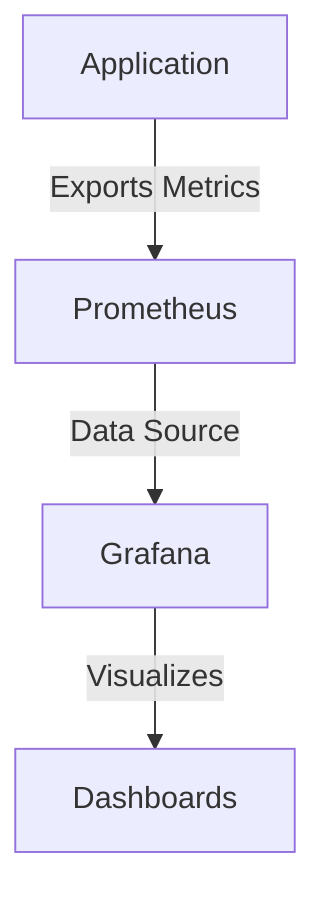

## 20.9 Monitoring and Observability in Clojure Applications

In the world of software development, especially in functional programming with Clojure, monitoring and observability are crucial for maintaining application health and ensuring that your systems are running smoothly. As applications grow in complexity and scale, the need for robust monitoring and observability practices becomes even more critical. This section will guide you through the essential practices and tools for implementing effective monitoring and observability in Clojure applications.

### Implementing Logging

Logging is the cornerstone of monitoring and observability. It provides a record of application behavior and is invaluable for debugging and understanding system performance.

#### Best Practices for Logging

1. **Log Levels**: Use log levels (e.g., DEBUG, INFO, WARN, ERROR) to categorize log messages based on their importance and urgency. This helps in filtering and analyzing logs effectively.

2. **Message Structure**: Ensure that log messages are consistent and structured. Include context such as timestamps, request IDs, and user information to make logs more informative.

3. **Avoid Sensitive Information**: Be cautious about logging sensitive information such as passwords or personal data. Use masking or redaction if necessary.

4. **Log Rotation and Retention**: Implement log rotation to manage disk space and set retention policies to keep logs for a necessary period.

#### Structured Logging

Structured logging enhances the ability to parse and analyze logs by machines. Instead of logging plain text, use a structured format such as JSON.

```clojure
(require '[clojure.tools.logging :as log])

(defn log-user-action [user-id action]
  (log/info {:event "user-action"
             :user-id user-id
             :action action
             :timestamp (java.time.Instant/now)}))
```

**Key Benefits**:
- **Machine Readability**: Structured logs can be easily consumed by log management tools.
- **Enhanced Searchability**: Tools can index structured logs, allowing for more efficient searches and analysis.

### Metrics Collection and Monitoring

Metrics provide quantitative data about your application, such as response times, error rates, and resource usage.

#### Integrating Metrics Collection Libraries

[Clojure's ecosystem](https://clojure.org/community/resources) offers several libraries for metrics collection. One popular choice is [Dropwizard Metrics](https://metrics.dropwizard.io/).

**Integrating Dropwizard Metrics**:

1. **Add Dependency**: Include the Dropwizard Metrics library in your project.

```clojure
;; project.clj
:dependencies [[io.dropwizard.metrics/metrics-core "4.1.2"]]
```

2. **Create a Metrics Registry**: Initialize a registry to hold your metrics.

```clojure
(def metrics-registry (com.codahale.metrics.MetricRegistry.))
```

3. **Define Metrics**: Create and register metrics such as counters, gauges, and histograms.

```clojure
(def requests-counter (.counter metrics-registry "requests"))

(defn record-request []
  (.inc requests-counter))
```

4. **Expose Metrics**: Use a metrics servlet or an HTTP endpoint to expose metrics for collection by monitoring tools.

#### Visualization Tools

Visualizing metrics helps in understanding trends and identifying anomalies.

**Recommended Tools**:

- **[Grafana](https://grafana.com/)**: A powerful open-source platform for visualizing metrics. Grafana supports various data sources, including Prometheus and Graphite.

- **[Prometheus](https://prometheus.io/)**: An open-source monitoring and alerting toolkit. It is particularly well-suited for time-series data and integrates seamlessly with Grafana.

**Setting Up Grafana and Prometheus**:

1. **Install Prometheus**: Download and configure Prometheus to scrape metrics from your application.

2. **Configure Grafana**: Set up Grafana to use Prometheus as a data source and create dashboards to visualize your metrics.



### Alerting Mechanisms

Alerts notify you of critical issues in your application, allowing for timely intervention.

#### Setting Up Alerts

1. **Define Alert Rules**: Use Prometheus to define alert rules based on metric thresholds.

```yaml
# prometheus.yml
alerting:
  alertmanagers:
    - static_configs:
        - targets: ['localhost:9093']
rule_files:
  - "alerts.yml"
```

2. **Configure AlertManager**: Set up AlertManager to handle alerts and route them to appropriate channels (e.g., email, Slack).

3. **Test Alerts**: Simulate conditions to test your alerting setup and ensure notifications are received as expected.

**Best Practices**:

- **Prioritize Alerts**: Categorize alerts based on severity and impact.
- **Avoid Alert Fatigue**: Ensure alerts are actionable to prevent desensitization.

### Conclusion

Implementing robust monitoring and observability practices in Clojure applications is essential for maintaining system reliability and performance. By leveraging structured logging, integrating metrics collection, using visualization tools, and setting up effective alerting mechanisms, you can gain deep insights into your application's behavior and respond promptly to issues.

### Try It Yourself

Experiment with the code examples provided. Modify the metrics collection to include additional metrics, or customize the log messages to include more contextual information. Explore the integration of Grafana and Prometheus to visualize your application's metrics.

### Further Reading

- [Clojure Official Documentation](https://clojure.org/reference)
- [Dropwizard Metrics Documentation](https://metrics.dropwizard.io/4.1.2/)
- [Grafana Documentation](https://grafana.com/docs/)
- [Prometheus Documentation](https://prometheus.io/docs/)

## **Test Your Knowledge: Monitoring and Observability in Clojure Applications Quiz**



### What is the primary benefit of structured logging in Clojure applications?

- [x] Enhanced machine readability and searchability
- [ ] Reduced log file size
- [ ] Increased human readability
- [ ] Faster log generation

> **Explanation:** Structured logging formats logs in a way that is easily parsed by machines, allowing for better searchability and analysis.

### Which library is commonly used for metrics collection in Clojure applications?

- [x] Dropwizard Metrics
- [ ] Log4j
- [ ] Apache Kafka
- [ ] React

> **Explanation:** Dropwizard Metrics is a popular library for collecting and managing metrics in Clojure applications.

### What tool can be used to visualize metrics collected from Clojure applications?

- [x] Grafana
- [ ] Eclipse
- [ ] IntelliJ IDEA
- [ ] Jenkins

> **Explanation:** Grafana is a powerful tool for visualizing metrics and creating dashboards.

### Which of the following is a best practice for logging sensitive information?

- [ ] Log everything for transparency
- [x] Mask or redact sensitive information
- [ ] Use DEBUG level for sensitive logs
- [ ] Avoid logging altogether

> **Explanation:** To protect sensitive information, it is important to mask or redact it in logs.

### What is the role of Prometheus in monitoring Clojure applications?

- [x] Collecting and storing metrics
- [ ] Compiling Clojure code
- [ ] Managing application state
- [ ] Providing cloud hosting

> **Explanation:** Prometheus is used for collecting and storing time-series metrics, which can then be visualized or used for alerting.

### How can you avoid alert fatigue in monitoring systems?

- [x] Ensure alerts are actionable
- [ ] Increase the number of alerts
- [ ] Send alerts to all team members
- [ ] Use only email for alerts

> **Explanation:** Alerts should be actionable to prevent desensitization and ensure that they are taken seriously.

### What is a key advantage of using Grafana with Prometheus?

- [x] Seamless integration for visualizing time-series data
- [ ] Automatic code generation
- [ ] Built-in database management
- [ ] Cloud storage capabilities

> **Explanation:** Grafana integrates seamlessly with Prometheus to provide rich visualizations of time-series data.

### Why is it important to categorize log messages with log levels?

- [x] To filter and analyze logs based on importance
- [ ] To increase log file size
- [ ] To reduce application performance
- [ ] To comply with legal requirements

> **Explanation:** Log levels help in filtering and analyzing logs based on their importance and urgency.

### Which of the following is NOT a visualization tool for application metrics?

- [ ] Grafana
- [ ] Prometheus
- [x] Log4j
- [ ] Kibana

> **Explanation:** Log4j is a logging library, not a visualization tool.

### True or False: AlertManager is used to handle and route alerts in a monitoring system.

- [x] True
- [ ] False

> **Explanation:** AlertManager is responsible for handling alerts generated by Prometheus and routing them to appropriate channels.


