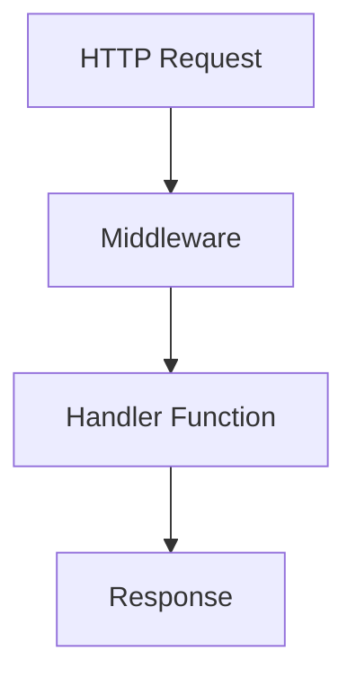

## 21.1 Building a Web Application the Functional Way

Building web applications using functional programming principles can lead to more predictable, scalable, and maintainable codebases. In this section, we'll explore how to leverage Clojure's functional programming capabilities to construct a web application. We'll focus on the principles of functional web architecture, selecting appropriate frameworks, processing HTTP requests with handler functions, using middleware for composition, and managing state functionally.

### Functional Web Architecture

Functional web architecture emphasizes the use of pure functions and immutable data structures. This approach contrasts with traditional imperative programming by reducing side effects and enhancing code predictability.

#### Principles of Functional Web Architecture

1. **Pure Functions**: Functions that always produce the same output for the same input, without side effects.
2. **Immutable Data**: Data that cannot be changed after it is created, ensuring consistency and thread safety.
3. **Function Composition**: Building complex operations by combining simpler functions.
4. **Declarative Style**: Describing what the program should accomplish rather than explicitly defining how to achieve it.

### Selecting Frameworks

Clojure offers several frameworks that align with functional programming principles. Two popular choices are [Ring](https://github.com/ring-clojure/ring) and [Compojure](https://github.com/weavejester/compojure).

#### Ring

Ring is a low-level abstraction for handling HTTP requests and responses in Clojure. It provides a simple interface for building web applications and supports middleware for extending functionality.

#### Compojure

Compojure builds on top of Ring to offer a concise syntax for defining routes and handling requests. It allows developers to define routes using a DSL (Domain-Specific Language) that integrates seamlessly with Clojure's functional paradigm.

### Handler Functions

Handler functions are the core of a web application's request processing. They take an HTTP request as input and produce a response as output, often leveraging pure functions to transform data.

#### Defining a Simple Handler

```clojure
(defn hello-world-handler [request]
  {:status 200
   :headers {"Content-Type" "text/plain"}
   :body "Hello, World!"})
```

In this example, `hello-world-handler` is a pure function that returns a map representing an HTTP response. It takes a `request` map as input, although it's not used in this simple example.

### Middleware and Composition

Middleware in Ring allows you to compose additional functionality around handler functions. This aligns with the functional programming concept of function composition, where functions are combined to build more complex operations.

#### Example of Middleware Composition

```clojure
(defn wrap-logging [handler]
  (fn [request]
    (println "Request received:" request)
    (handler request)))

(defn wrap-authentication [handler]
  (fn [request]
    (if (authenticated? request)
      (handler request)
      {:status 401 :body "Unauthorized"})))

(def app
  (-> hello-world-handler
      wrap-logging
      wrap-authentication))
```

In this example, `wrap-logging` and `wrap-authentication` are middleware functions that add logging and authentication to the handler. The `->` macro is used to compose these middleware functions around `hello-world-handler`.

### State Management

Managing state in a functional web application can be challenging, as functional programming emphasizes immutability. Clojure provides several mechanisms for handling state, such as atoms, refs, and agents.

#### Using Atoms for State Management

Atoms in Clojure provide a way to manage state changes in a thread-safe manner. They allow you to update state using pure functions.

```clojure
(def app-state (atom {:users []}))

(defn add-user [user]
  (swap! app-state update :users conj user))
```

In this example, `app-state` is an atom holding the application's state. The `add-user` function uses `swap!` to update the state by adding a new user to the list.

### Practical Example: Building a Simple Web Application

Let's walk through building a simple web application using the concepts we've discussed. We'll implement routing, request handling, and response generation.

#### Step 1: Setting Up the Project

First, create a new Clojure project using Leiningen:

```bash
lein new compojure my-web-app
```

This command creates a new project with a basic Compojure setup.

#### Step 2: Defining Routes

Edit the `src/my_web_app/core.clj` file to define your application's routes:

```clojure
(ns my-web-app.core
  (:require [compojure.core :refer :all]
            [ring.adapter.jetty :refer [run-jetty]]
            [ring.middleware.defaults :refer [wrap-defaults site-defaults]]))

(defroutes app-routes
  (GET "/" [] "Welcome to My Web App!")
  (GET "/hello/:name" [name] (str "Hello, " name "!")))

(def app
  (wrap-defaults app-routes site-defaults))
```

Here, we define two routes: a root route that returns a welcome message and a `/hello/:name` route that greets the user by name.

#### Step 3: Running the Application

Start the application by running the following command:

```bash
lein ring server
```

This will launch a local server, allowing you to access your application at `http://localhost:3000`.

#### Step 4: Adding Middleware

Enhance your application by adding logging middleware:

```clojure
(defn wrap-logging [handler]
  (fn [request]
    (println "Request received:" request)
    (handler request)))

(def app
  (-> app-routes
      wrap-logging
      (wrap-defaults site-defaults)))
```

Now, each request will be logged to the console, providing insight into the application's behavior.

### Visualizing the Architecture

Below is a simplified architecture diagram illustrating the flow of data in our functional web application:



**Diagram Description**: This diagram shows the flow of an HTTP request through middleware and a handler function, resulting in an HTTP response.

### Knowledge Check

Let's reinforce our understanding with a few questions:

1. What are the benefits of using pure functions in web applications?
2. How does middleware enhance the functionality of handler functions?
3. What is the role of atoms in managing state in a Clojure web application?

### Practical Exercises

1. Modify the `/hello/:name` route to include a personalized greeting based on the time of day.
2. Implement a new route that returns a list of users stored in the application state.
3. Add error handling middleware that catches exceptions and returns a 500 response.

### Encouraging Engagement

Building web applications the functional way can transform how we approach software development. By embracing pure functions, immutable data, and function composition, we create systems that are easier to reason about and maintain. As you continue your journey with Clojure, remember that each step forward is an opportunity to deepen your understanding and improve your codebase.

### References and Links

- [Clojure Official Documentation](https://clojure.org/reference)
- [Ring GitHub Repository](https://github.com/ring-clojure/ring)
- [Compojure GitHub Repository](https://github.com/weavejester/compojure)
- [Transitioning from OOP to Functional Programming](https://www.lispcast.com/oo-to-fp/)

## **Test Your Knowledge: Building a Web Application the Functional Way Quiz**



### What is a key benefit of using pure functions in web applications?

- [x] Predictable behavior and easier testing
- [ ] Faster execution time
- [ ] Reduced memory usage
- [ ] Increased security

> **Explanation:** Pure functions are predictable and easier to test because they always produce the same output for the same input without side effects.

### Which Clojure framework provides a low-level abstraction for HTTP handling?

- [x] Ring
- [ ] Compojure
- [ ] Reagent
- [ ] Luminus

> **Explanation:** Ring is a low-level library for handling HTTP requests and responses in Clojure.

### How does middleware enhance handler functions in Clojure?

- [x] By composing additional functionality around them
- [ ] By increasing their execution speed
- [ ] By reducing their memory footprint
- [ ] By simplifying their logic

> **Explanation:** Middleware allows developers to compose additional functionality around handler functions, enhancing their capabilities.

### What is the purpose of the `wrap-defaults` middleware in a Clojure web app?

- [x] To provide default security and session settings
- [ ] To increase application performance
- [ ] To simplify routing logic
- [ ] To handle database connections

> **Explanation:** `wrap-defaults` provides default settings for security, sessions, and other common web application needs.

### How can atoms be used in a Clojure web application?

- [x] For managing application state in a thread-safe manner
- [ ] For handling HTTP requests
- [x] For updating state using pure functions
- [ ] For defining routes

> **Explanation:** Atoms are used to manage application state safely across threads and are updated using pure functions.

### Which macro is commonly used for function composition in Clojure middleware?

- [x] `->`
- [ ] `let`
- [ ] `defn`
- [ ] `if`

> **Explanation:** The `->` macro is used to compose functions, including middleware, in a readable manner.

### What is the primary role of handler functions in a web application?

- [x] To process HTTP requests and generate responses
- [ ] To manage database connections
- [x] To transform request data into responses
- [ ] To handle user authentication

> **Explanation:** Handler functions take HTTP requests and transform them into responses, often using pure functions.

### What is a characteristic of immutable data in functional programming?

- [x] It cannot be changed after creation
- [ ] It is faster to process
- [ ] It uses less memory
- [ ] It is more secure

> **Explanation:** Immutable data cannot be altered once created, ensuring consistency and thread safety.

### Which of the following is a benefit of using Clojure for web development?

- [x] Emphasis on immutability and pure functions
- [ ] Built-in support for OOP paradigms
- [ ] Automatic code generation
- [ ] Native mobile app support

> **Explanation:** Clojure's emphasis on immutability and pure functions aligns well with building scalable and maintainable web applications.

### True or False: Compojure is a standalone web server.

- [ ] True
- [x] False

> **Explanation:** Compojure is not a standalone web server; it is a routing library that works with Ring to handle HTTP requests.


