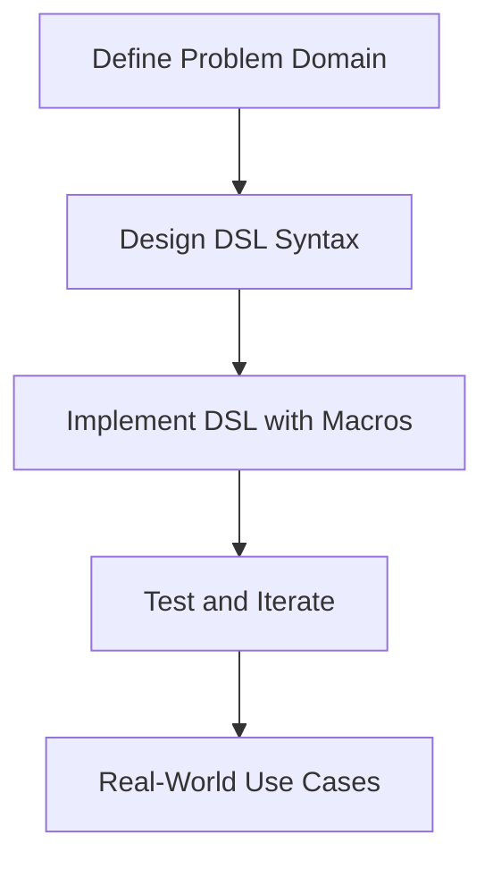

## 21.3 Implementing a Domain-Specific Language in Clojure

In this section, we delve into the world of Domain-Specific Languages (DSLs) and how Clojure's unique features, particularly its macro system, empower developers to create powerful and expressive DSLs. We will explore the fundamental concepts of DSLs, how Clojure's code-as-data philosophy facilitates their creation, and provide a step-by-step guide to building a simple DSL. We'll also examine real-world examples and best practices to ensure your DSLs are effective and maintainable.

### Understanding DSLs

**Domain-Specific Languages (DSLs)** are specialized languages designed to solve problems within a specific domain. Unlike general-purpose programming languages, DSLs provide a more concise and expressive syntax tailored to particular tasks. They can significantly simplify complex problem domains, improve productivity, and enhance code readability.

#### Types of DSLs

1. **Internal DSLs**: These are embedded within a host language, leveraging its syntax and semantics. In Clojure, internal DSLs are often implemented using macros, allowing developers to extend the language's capabilities.
2. **External DSLs**: These are standalone languages with their own syntax and parsers. While powerful, they require more effort to integrate with existing systems compared to internal DSLs.

### Macros for DSLs

Clojure's macro system is a powerful tool for creating internal DSLs. Macros allow you to manipulate code as data, transforming it during compilation to extend the language's syntax and semantics. This capability is particularly useful for DSLs, enabling the creation of custom constructs that simplify domain-specific tasks.

#### Code-as-Data Philosophy

Clojure's code-as-data philosophy, also known as homoiconicity, means that Clojure code is represented as data structures (lists, vectors, maps). This allows macros to operate on code just like any other data, providing unparalleled flexibility in language extension.

### Design Principles for DSLs

When designing a DSL, it's crucial to adhere to certain principles to ensure it is effective and maintainable:

1. **Syntactic Clarity**: The DSL should be easy to read and write, with a syntax that closely matches the domain it represents.
2. **Ease of Use**: Minimize the learning curve by designing intuitive constructs that align with the user's mental model of the domain.
3. **Integration**: Ensure the DSL integrates seamlessly with existing code, leveraging the host language's features and libraries.
4. **Maintainability**: Design the DSL to be maintainable, with clear documentation and a focus on long-term usability.

### Building a DSL in Clojure

Let's walk through the process of creating a simple DSL in Clojure. We'll build a DSL for defining and running tests, demonstrating how macros can be used to create custom language constructs.

#### Step 1: Define the Problem Domain

First, identify the specific domain and tasks the DSL will address. For our example, we'll focus on creating a DSL for a testing framework, allowing users to define tests with a concise and expressive syntax.

#### Step 2: Design the DSL Syntax

Design the syntax of the DSL, ensuring it is clear and expressive. For our testing DSL, we'll use the following syntax:

```clojure
(test-suite "Sample Suite"
  (test "Addition Test"
    (assert (= (+ 1 1) 2)))

  (test "Subtraction Test"
    (assert (= (- 5 3) 2))))
```

#### Step 3: Implement the DSL with Macros

Implement the DSL using Clojure macros, transforming the custom syntax into executable code. Here's how we can define macros for our testing DSL:

```clojure
(defmacro test-suite [name & tests]
  `(do
     (println "Running test suite:" ~name)
     ~@tests))

(defmacro test [name & body]
  `(do
     (println "Running test:" ~name)
     (try
       ~@body
       (println "Test passed!")
       (catch Exception e
         (println "Test failed:" (.getMessage e))))))
```

#### Explanation of the Code

- **`test-suite` Macro**: This macro takes a suite name and a series of tests. It prints the suite name and executes each test.
- **`test` Macro**: This macro takes a test name and a body of assertions. It runs the assertions, catching exceptions to report test failures.

#### Step 4: Test and Iterate

Test the DSL by running it with various test cases. Iterate on the design and implementation based on feedback and usage patterns.

```clojure
(test-suite "Math Tests"
  (test "Addition Test"
    (assert (= (+ 1 1) 2)))

  (test "Multiplication Test"
    (assert (= (* 2 3) 6))))
```

### Examples and Use Cases

DSLs are widely used in various domains to improve productivity and maintainability. Here are some real-world examples:

1. **Configuration Languages**: DSLs can simplify configuration management by providing a clear and concise syntax for specifying settings.
2. **Build Systems**: Tools like Leiningen use DSLs to define build configurations and dependencies in a readable format.
3. **Data Querying**: DSLs can provide a more intuitive way to query and manipulate data, as seen in libraries like Datomic.

### Visualizing DSL Design

To better understand the flow and structure of our DSL, let's visualize it using a flowchart.



**Diagram Description**: This flowchart outlines the process of creating a DSL, from defining the problem domain to real-world applications.

### Best Practices for DSLs

- **Start Simple**: Begin with a minimal viable DSL and expand as needed.
- **Focus on the User**: Design the DSL with the end-user in mind, ensuring it meets their needs and expectations.
- **Leverage Existing Tools**: Use existing libraries and tools to avoid reinventing the wheel.
- **Document Thoroughly**: Provide comprehensive documentation to help users understand and use the DSL effectively.

### References and Further Reading

- [Clojure Official Documentation](https://clojure.org/reference)
- [Clojure Macros Guide](https://clojure.org/reference/macros)
- [Transitioning from OOP to Functional Programming](https://www.lispcast.com/oo-to-fp/)

### Knowledge Check

To reinforce your understanding of implementing DSLs in Clojure, consider the following questions and exercises:

1. What are the key differences between internal and external DSLs?
2. How does Clojure's macro system facilitate the creation of DSLs?
3. Design a simple DSL for a domain of your choice, implementing it using Clojure macros.
4. Explore a real-world DSL and analyze its design and implementation.

### Encouraging Engagement

Creating DSLs in Clojure can be a rewarding experience, allowing you to tailor solutions to specific domains and improve code expressiveness. Embrace the power of macros and the flexibility of Clojure's syntax to create DSLs that simplify complex tasks and enhance productivity.

## **Test Your Knowledge: Implementing a Domain-Specific Language in Clojure Quiz**



### What is a Domain-Specific Language (DSL)?

- [x] A specialized language designed for a specific domain
- [ ] A general-purpose programming language
- [ ] A type of database query language
- [ ] A language for writing operating systems

> **Explanation:** A DSL is a specialized language tailored to a specific domain, providing concise and expressive syntax for domain-specific tasks.

### Which type of DSL is embedded within a host language?

- [x] Internal DSL
- [ ] External DSL
- [ ] Standalone DSL
- [ ] Query DSL

> **Explanation:** An internal DSL is embedded within a host language, leveraging its syntax and semantics.

### How does Clojure's macro system help in creating DSLs?

- [x] By allowing code manipulation as data
- [ ] By providing built-in DSL syntax
- [ ] By offering a graphical interface
- [ ] By generating machine code

> **Explanation:** Clojure's macro system allows code to be manipulated as data, enabling the creation of custom language constructs for DSLs.

### What is a key design principle for DSLs?

- [x] Syntactic clarity
- [ ] Complexity
- [ ] Obfuscation
- [ ] Redundancy

> **Explanation:** Syntactic clarity ensures the DSL is easy to read and write, closely matching the domain it represents.

### What is the purpose of the `test` macro in the provided DSL example?

- [x] To define and run individual tests
- [ ] To compile the DSL code
- [ ] To handle exceptions globally
- [ ] To manage memory allocation

> **Explanation:** The `test` macro defines and runs individual tests, catching exceptions to report failures.

### What is the first step in building a DSL?

- [x] Define the problem domain
- [ ] Implement macros
- [ ] Design the syntax
- [ ] Test the DSL

> **Explanation:** The first step is to define the problem domain, identifying the specific tasks the DSL will address.

### Why is documentation important for DSLs?

- [x] To help users understand and use the DSL effectively
- [ ] To increase code complexity
- [ ] To restrict access to the DSL
- [ ] To reduce code readability

> **Explanation:** Documentation provides guidance and clarity, helping users understand and effectively use the DSL.

### What advantage do DSLs offer in configuration management?

- [x] Simplified syntax for specifying settings
- [ ] Increased code obfuscation
- [ ] Reduced functionality
- [ ] Complex syntax for advanced users

> **Explanation:** DSLs offer a simplified syntax for specifying settings, making configuration management more intuitive.

### How can you test a DSL?

- [x] By running it with various test cases
- [ ] By compiling it to machine code
- [ ] By using a graphical debugger
- [ ] By writing it in assembly language

> **Explanation:** Testing a DSL involves running it with various test cases to ensure it meets its design goals.

### True or False: External DSLs are easier to integrate with existing systems than internal DSLs.

- [ ] True
- [x] False

> **Explanation:** External DSLs require more effort to integrate with existing systems compared to internal DSLs, which leverage the host language's features.


