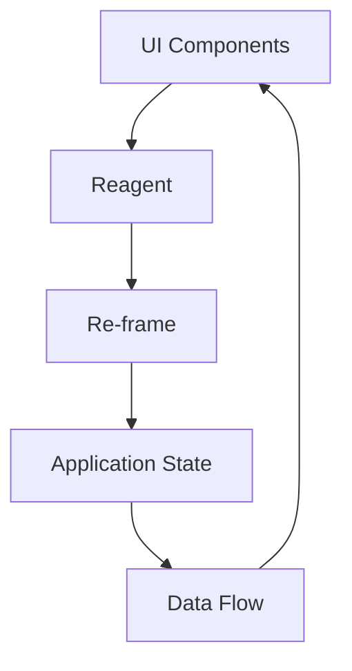

## 21.4 Developing Functional GUI Applications

In this section, we will delve into the world of functional GUI applications using ClojureScript and Reagent. We'll explore the principles of functional reactive programming (FRP) and demonstrate how to manage application state functionally with re-frame. By the end of this chapter, you'll be equipped with the knowledge to build complex user interfaces by composing pure function components.

### Functional UI Concepts

Functional reactive programming (FRP) is a paradigm for building interactive applications. It emphasizes the use of pure functions, immutability, and declarative code to manage user interfaces. In FRP, UI components are expressed as functions of their state, and changes in state automatically propagate through the system, updating the UI accordingly.

#### Key Principles of FRP

1. **Declarative Programming**: Describe what the UI should look like for a given state, rather than how to achieve it.
2. **Immutability**: Use immutable data structures to represent state, ensuring that changes are predictable and easy to reason about.
3. **Pure Functions**: Build UI components as pure functions that transform state into UI elements.
4. **State as a Stream**: Treat state changes as a stream of events, allowing the UI to react dynamically to changes.

### ClojureScript and Reagent

ClojureScript is a dialect of Clojure that compiles to JavaScript, enabling the development of web applications using Clojure's functional programming paradigm. Reagent is a minimalistic ClojureScript interface to React, a popular JavaScript library for building user interfaces.

#### Why Use ClojureScript and Reagent?

- **Functional Abstractions**: Leverage Clojure's functional programming features to build robust and maintainable UIs.
- **Reactivity**: Use Reagent's reactive atoms to manage state changes efficiently.
- **Component Composition**: Compose complex UIs from simple, reusable components.
- **Interoperability**: Seamlessly integrate with existing JavaScript libraries and frameworks.

#### Setting Up Your Environment

To get started with ClojureScript and Reagent, you'll need to set up your development environment. Follow these steps:

1. **Install Leiningen**: Leiningen is a build automation tool for Clojure. It simplifies project setup and dependency management.
   ```bash
   brew install leiningen  # On macOS
   ```

2. **Create a New Project**: Use Leiningen to create a new ClojureScript project with Reagent.
   ```bash
   lein new reagent my-app
   ```

3. **Run the Development Server**: Navigate to your project directory and start the development server.
   ```bash
   cd my-app
   lein figwheel
   ```

4. **Open Your Browser**: Open your browser and navigate to `http://localhost:3449` to see your application in action.

### State Management with re-frame

Managing state in a functional way is crucial for building scalable and maintainable applications. re-frame is a ClojureScript framework for managing state in Reagent applications. It provides a structured way to handle state changes using events and subscriptions.

#### Core Concepts of re-frame

- **Events**: Actions that describe what happened in the application. Events are dispatched by UI components and processed by event handlers.
- **Subscriptions**: Queries that derive data from the application state. Components subscribe to data they need and automatically re-render when the data changes.
- **Effects**: Side effects that occur as a result of processing events, such as making HTTP requests or updating local storage.

#### Setting Up re-frame

To use re-frame in your project, add it as a dependency in your `project.clj` file:

```clojure
(defproject my-app "0.1.0-SNAPSHOT"
  :dependencies [[org.clojure/clojure "1.10.3"]
                 [org.clojure/clojurescript "1.10.773"]
                 [reagent "1.0.0"]
                 [re-frame "1.2.0"]])
```

#### Example: Counter Application with re-frame

Let's build a simple counter application to demonstrate re-frame's capabilities.

1. **Define the Application State**: Use a Reagent atom to hold the application state.

   ```clojure
   (ns my-app.core
     (:require [re-frame.core :as re-frame]
               [reagent.core :as reagent]))

   (defonce app-state (reagent/atom {:count 0}))
   ```

2. **Create Event Handlers**: Define event handlers to update the application state.

   ```clojure
   (re-frame/reg-event-db
     :increment
     (fn [db _]
       (update db :count inc)))

   (re-frame/reg-event-db
     :decrement
     (fn [db _]
       (update db :count dec)))
   ```

3. **Define Subscriptions**: Create subscriptions to access the application state.

   ```clojure
   (re-frame/reg-sub
     :count
     (fn [db _]
       (:count db)))
   ```

4. **Build the UI Components**: Create UI components that dispatch events and subscribe to state changes.

   ```clojure
   (defn counter []
     (let [count (re-frame/subscribe [:count])]
       (fn []
         [:div
          [:h1 "Counter: " @count]
          [:button {:on-click #(re-frame/dispatch [:increment])} "Increment"]
          [:button {:on-click #(re-frame/dispatch [:decrement])} "Decrement"]])))
   ```

5. **Render the Application**: Render the application using Reagent.

   ```clojure
   (defn init []
     (reagent/render [counter]
                     (.getElementById js/document "app")))

   (init)
   ```

### Component Composition

Building complex UIs in a functional style involves composing small, reusable components. Each component is a pure function that transforms state into UI elements. This approach promotes modularity and reusability.

#### Principles of Component Composition

- **Single Responsibility**: Each component should have a single responsibility, making it easier to reason about and test.
- **Reusability**: Design components to be reusable across different parts of the application.
- **Composability**: Compose components to build more complex UIs, similar to how functions are composed in functional programming.

#### Example: Todo List Application

Let's build a simple todo list application to demonstrate component composition.

1. **Define the Application State**: Use a Reagent atom to hold the list of todos.

   ```clojure
   (defonce todos (reagent/atom []))
   ```

2. **Create UI Components**: Define components for the todo list, todo item, and input form.

   ```clojure
   (defn todo-item [todo]
     [:li todo])

   (defn todo-list []
     (let [items @todos]
       [:ul
        (for [todo items]
          ^{:key todo} [todo-item todo])]))

   (defn todo-input []
     (let [new-todo (reagent/atom "")]
       (fn []
         [:div
          [:input {:type "text"
                   :value @new-todo
                   :on-change #(reset! new-todo (-> % .-target .-value))}]
          [:button {:on-click #(swap! todos conj @new-todo)} "Add"]])))
   ```

3. **Compose the Components**: Combine the components to build the complete application.

   ```clojure
   (defn todo-app []
     [:div
      [todo-input]
      [todo-list]])
   ```

4. **Render the Application**: Render the application using Reagent.

   ```clojure
   (defn init []
     (reagent/render [todo-app]
                     (.getElementById js/document "app")))

   (init)
   ```

### Practical Example: Real-Time Dashboard

To put these concepts into practice, let's build a real-time dashboard application. This application will display live data updates, demonstrating the power of functional reactive programming.

#### Application Requirements

- Display a list of data points that update in real-time.
- Allow users to filter and sort data.
- Provide visualizations such as charts or graphs.

#### Implementing the Real-Time Dashboard

1. **Set Up the Project**: Create a new ClojureScript project and add dependencies for Reagent, re-frame, and any charting libraries you plan to use.

2. **Define the Application State**: Use a Reagent atom to hold the data points and any filters or sorting criteria.

   ```clojure
   (defonce app-state (reagent/atom {:data []
                                     :filter ""
                                     :sort :asc}))
   ```

3. **Create Event Handlers and Subscriptions**: Define event handlers to update the data and subscriptions to access the state.

   ```clojure
   (re-frame/reg-event-db
     :update-data
     (fn [db [_ new-data]]
       (assoc db :data new-data)))

   (re-frame/reg-sub
     :data
     (fn [db _]
       (:data db)))
   ```

4. **Build UI Components**: Create components for displaying data, filtering, sorting, and visualizing.

   ```clojure
   (defn data-table []
     (let [data (re-frame/subscribe [:data])]
       (fn []
         [:table
          [:thead
           [:tr
            [:th "ID"]
            [:th "Value"]]]
          [:tbody
           (for [datum @data]
             ^{:key (:id datum)} [:tr
                                  [:td (:id datum)]
                                  [:td (:value datum)]])]])))

   (defn filter-input []
     (let [filter (reagent/atom "")]
       (fn []
         [:div
          [:input {:type "text"
                   :value @filter
                   :on-change #(reset! filter (-> % .-target .-value))}]
          [:button {:on-click #(re-frame/dispatch [:set-filter @filter])} "Filter"]])))
   ```

5. **Render the Application**: Render the application using Reagent.

   ```clojure
   (defn dashboard []
     [:div
      [filter-input]
      [data-table]])

   (defn init []
     (reagent/render [dashboard]
                     (.getElementById js/document "app")))

   (init)
   ```

### Try It Yourself

Experiment with the examples provided in this chapter. Try modifying the counter application to include a reset button, or extend the todo list application with additional features such as editing or deleting items. For the real-time dashboard, consider integrating a third-party API to fetch live data.

### Visual Aids

To better understand how these components fit together, consider the following diagrams:



*Diagram 1: Data flow in a Reagent and re-frame application.*

### References and Links

- [ClojureScript Official Documentation](https://clojurescript.org/)
- [Reagent Project](https://reagent-project.github.io/)
- [re-frame GitHub Repository](https://github.com/day8/re-frame)
- [Clojure Community Resources](https://clojure.org/community/resources)
- [Transitioning from OOP to Functional Programming](https://www.lispcast.com/oo-to-fp/)

### Knowledge Check

1. **What is the primary advantage of using Reagent for building UIs in ClojureScript?**

   - [x] It allows for the creation of reactive, functional components.
   - [ ] It is a full-stack framework.
   - [ ] It is the only option for ClojureScript UI development.
   - [ ] It provides built-in database support.

   > **Explanation:** Reagent is designed to facilitate the creation of reactive, functional components by leveraging React's component model in a ClojureScript environment.

2. **How does re-frame help in managing application state?**

   - [x] By providing a structured approach using events and subscriptions.
   - [ ] By enforcing the use of global variables.
   - [ ] By automatically syncing state with a database.
   - [ ] By eliminating the need for state management.

   > **Explanation:** re-frame uses events and subscriptions to manage state changes in a structured and predictable manner, enhancing the maintainability of applications.

3. **What is a key benefit of using pure functions in UI components?**

   - [x] They are easier to test and reason about.
   - [ ] They automatically handle side effects.
   - [ ] They require less memory.
   - [ ] They can modify global state.

   > **Explanation:** Pure functions are deterministic, meaning they always produce the same output for a given input, making them easier to test and reason about.

4. **In the context of re-frame, what is an event?**

   - [x] An action that describes what happened in the application.
   - [ ] A UI component.
   - [ ] A database query.
   - [ ] A network request.

   > **Explanation:** In re-frame, an event represents an action or occurrence within the application that triggers state changes.

5. **What is a subscription in re-frame?**

   - [x] A query that derives data from the application state.
   - [ ] A method for handling side effects.
   - [ ] A way to dispatch events.
   - [ ] A UI component.

   > **Explanation:** Subscriptions in re-frame are used to derive and access specific pieces of data from the application state.

6. **Which of the following is true about Reagent components?**

   - [x] They are defined as functions that return hiccup-style markup.
   - [ ] They must be defined as JavaScript classes.
   - [ ] They automatically manage side effects.
   - [ ] They require a separate templating language.

   > **Explanation:** Reagent components are defined as functions that return hiccup-style markup, which is a Clojure data structure representing HTML.

7. **What is the purpose of using a Reagent atom?**

   - [x] To hold and manage application state in a reactive manner.
   - [ ] To perform asynchronous operations.
   - [ ] To define UI components.
   - [ ] To compile ClojureScript to JavaScript.

   > **Explanation:** Reagent atoms are used to hold and manage state reactively, allowing components to automatically re-render when the state changes.

8. **How can you compose complex UIs in Reagent?**

   - [x] By combining smaller, reusable components.
   - [ ] By using a single monolithic component.
   - [ ] By relying on global variables.
   - [ ] By using inline JavaScript.

   > **Explanation:** Complex UIs in Reagent are composed by combining smaller, reusable components, promoting modularity and maintainability.

9. **What is a common use case for using re-frame's effects?**

   - [x] To handle side effects like HTTP requests or local storage updates.
   - [ ] To define UI components.
   - [ ] To perform mathematical calculations.
   - [ ] To manage CSS styles.

   > **Explanation:** re-frame's effects are used to handle side effects, such as making HTTP requests or updating local storage, as a result of event processing.

10. **True or False: Reagent allows for the use of JavaScript libraries within ClojureScript applications.**

   - [x] True
   - [ ] False

   > **Explanation:** True. Reagent, being a ClojureScript interface to React, allows for seamless integration with existing JavaScript libraries and frameworks.



By the end of this chapter, you should have a solid understanding of how to develop functional GUI applications using ClojureScript and Reagent. Embrace the functional programming mindset, and you'll find that building scalable, maintainable UIs becomes a rewarding endeavor.
