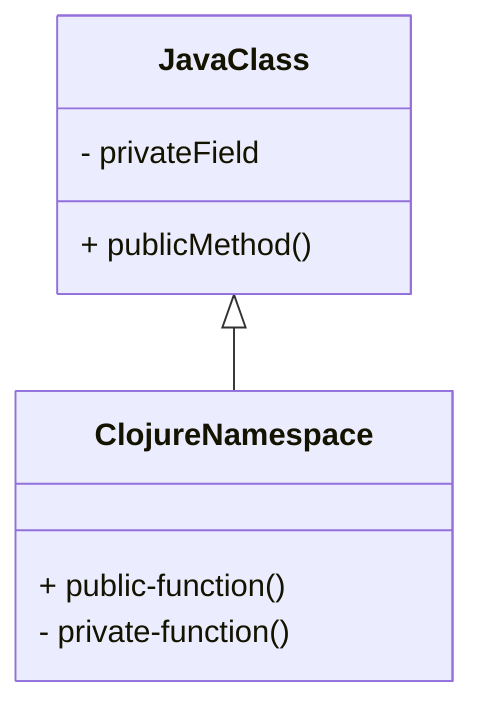
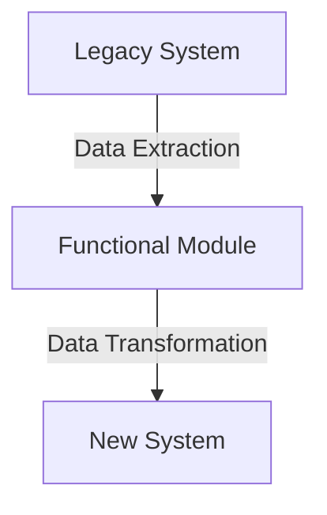
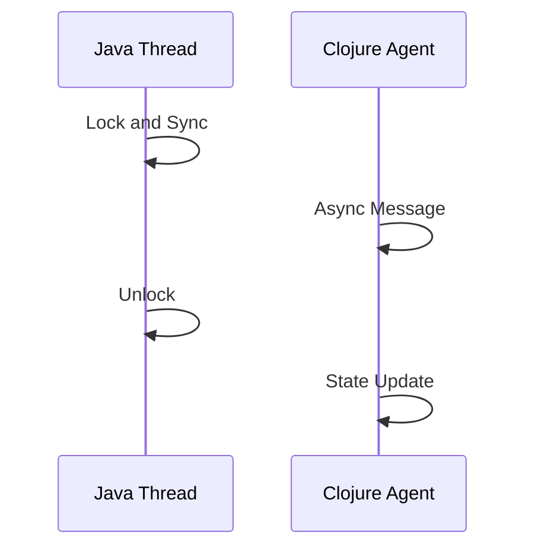

## 21.5 Real-World Examples of Functional Design

In this section, we delve into real-world examples where functional programming, particularly using Clojure, has been instrumental in solving complex problems, optimizing performance, and enhancing team collaboration. These case studies illustrate the transformative power of functional design in various domains, providing insights into the challenges faced, the solutions devised, and the outcomes achieved.

### Case Study 1: Building a Scalable Web Application

#### Project Overview

A tech startup aimed to develop a scalable web application capable of handling a high volume of concurrent users. The team chose Clojure for its powerful concurrency support and functional programming paradigms.

#### Challenges and Solutions

1. **Concurrency Management**: The application needed to manage thousands of simultaneous connections without degrading performance.
   - **Solution**: Clojure's immutable data structures and concurrency primitives, such as atoms and refs, were employed to manage state changes safely across threads. The use of `core.async` facilitated asynchronous processing, allowing the application to handle multiple requests efficiently.

2. **Data Integrity**: Ensuring data consistency in a distributed environment was crucial.
   - **Solution**: Clojure's Software Transactional Memory (STM) system was utilized to handle complex state transitions, providing a robust mechanism for maintaining data integrity without locking.

3. **Performance Optimization**: The application required low latency and high throughput.
   - **Solution**: The team leveraged Clojure's transducers for efficient data transformation, reducing the overhead of intermediate collections. Profiling tools were used to identify bottlenecks, and optimizations were applied to critical code paths.

#### Performance Considerations

- **Optimization Strategies**: The use of lazy sequences minimized memory usage, while transients were employed for performance-critical sections to enhance speed without sacrificing immutability.
- **Tools Used**: The team used the `criterium` library for benchmarking, allowing them to fine-tune performance and ensure the application met its latency targets.

#### Team Practices

- **Adopting Functional Paradigms**: The team underwent training sessions to familiarize themselves with functional concepts, emphasizing immutability and pure functions.
- **Collaboration and Code Reviews**: Regular code reviews focused on maintaining functional purity and leveraging Clojure's expressive syntax to enhance readability and maintainability.

#### Outcomes

- **Improved Scalability**: The application scaled seamlessly to accommodate growing user demand without significant refactoring.
- **Enhanced Maintainability**: The use of pure functions and immutable data structures led to cleaner, more maintainable code.
- **Positive Team Dynamics**: The functional approach fostered a collaborative environment where team members could easily understand and contribute to the codebase.

### Case Study 2: Data Processing Pipeline for Financial Analytics

#### Project Overview

A financial services company needed to process large volumes of transaction data in real-time to detect fraudulent activities. Clojure was chosen for its data processing capabilities and functional design patterns.

#### Challenges and Solutions

1. **Real-Time Data Processing**: The system had to process and analyze data streams with minimal delay.
   - **Solution**: Clojure's lazy evaluation and sequence abstractions enabled efficient handling of data streams, while `core.async` provided the necessary tools for concurrent data processing.

2. **Complex Data Transformations**: The pipeline required intricate transformations and aggregations.
   - **Solution**: The team utilized higher-order functions such as `map`, `filter`, and `reduce` to implement complex transformations concisely. Transducers were employed to compose transformations efficiently.

3. **Scalability and Fault Tolerance**: The system needed to scale horizontally and handle failures gracefully.
   - **Solution**: The application was designed with microservices architecture, leveraging Clojure's interoperability with Java to integrate with existing systems. Circuit breaker patterns were implemented to enhance fault tolerance.

#### Performance Considerations

- **Optimization Techniques**: The use of persistent data structures ensured efficient memory usage, while parallel processing was achieved through Clojure's agents and futures.
- **Tools Used**: The team employed monitoring tools like `Prometheus` and `Grafana` to track performance metrics and optimize resource allocation.

#### Team Practices

- **Functional Design Workshops**: Regular workshops were conducted to reinforce functional programming principles and share best practices.
- **Pair Programming**: This approach was adopted to facilitate knowledge sharing and improve code quality.

#### Outcomes

- **High Throughput**: The pipeline achieved the desired throughput, processing millions of transactions per second.
- **Robustness**: The system demonstrated high resilience to failures, maintaining service continuity during peak loads.
- **Streamlined Development**: The adoption of functional programming led to faster development cycles and reduced technical debt.

### Case Study 3: Migrating a Legacy System to Functional Architecture

#### Project Overview

A large enterprise sought to modernize its legacy system by migrating to a functional architecture using Clojure. The goal was to improve maintainability and scalability while reducing operational costs.

#### Challenges and Solutions

1. **Legacy Codebase Complexity**: The existing codebase was monolithic and difficult to maintain.
   - **Solution**: The team adopted a gradual migration strategy, incrementally refactoring components to functional modules. Clojure's interoperability with Java facilitated the transition, allowing for seamless integration with legacy components.

2. **Resistance to Change**: Developers accustomed to OOP paradigms were initially resistant to adopting functional programming.
   - **Solution**: Comprehensive training programs and mentorship were provided to ease the transition. The team also established a set of functional design patterns to guide development.

3. **Ensuring Business Continuity**: The migration needed to be executed without disrupting ongoing business operations.
   - **Solution**: A phased rollout approach was implemented, with extensive testing and validation at each stage to ensure stability and continuity.

#### Performance Considerations

- **Optimization Strategies**: The team focused on optimizing recursive algorithms using tail recursion and `recur` to prevent stack overflow issues.
- **Tools Used**: Profiling and monitoring tools were employed to identify performance bottlenecks and optimize resource usage.

#### Team Practices

- **Cross-Functional Teams**: Teams were reorganized to include both functional and domain experts, fostering collaboration and knowledge exchange.
- **Continuous Integration**: Automated testing and deployment pipelines were established to ensure code quality and accelerate delivery.

#### Outcomes

- **Enhanced Code Quality**: The refactored system exhibited improved readability, testability, and maintainability.
- **Scalability**: The new architecture supported horizontal scaling, accommodating increased user demand without significant rework.
- **Cost Reduction**: Operational costs were reduced due to improved resource utilization and streamlined maintenance processes.

### Visual Aids

To better understand the transition from Java OOP to Clojure's functional paradigm, let's explore some visual aids.

#### Java Classes to Clojure Namespaces

**Diagram Description**: This diagram illustrates how a Java class with fields and methods maps to a Clojure namespace with public and private functions. The encapsulation of state in Java translates to the use of immutable data structures in Clojure.

#### Data Flow in Migration

**Diagram Description**: This flowchart depicts the data flow during the migration process, highlighting the extraction, transformation, and integration of data into the new system.

#### Concurrency Models Comparison

**Diagram Description**: This sequence diagram compares Java's thread-based concurrency model with Clojure's agent-based model, emphasizing the benefits of asynchronous message passing and state management.

### References and Links

- [Clojure Official Documentation](https://clojure.org/reference)
- [Clojure Community Resources](https://clojure.org/community/resources)
- [Transitioning from OOP to Functional Programming](https://www.lispcast.com/oo-to-fp/)
- [Clojure STM Guide](https://clojure.org/reference/refs)
- [Clojure Performance Optimization](https://clojure.org/guides/performance)

### Knowledge Check

Let's test your understanding of real-world functional design with the following quiz.

## **Test Your Knowledge: Real-World Examples of Functional Design Quiz**



### Clojure's concurrency primitives such as atoms and refs help manage state changes by ensuring:
- [x] Thread safety and immutability
- [ ] High memory usage
- [ ] Complex locking mechanisms
- [ ] Synchronous processing

> **Explanation:** Clojure's concurrency primitives like atoms and refs provide thread safety and immutability, allowing for safe state changes without complex locking.

### What is a key advantage of using transducers in Clojure for data processing?
- [x] Efficient composition of data transformations
- [ ] Increased memory consumption
- [ ] Slower execution times
- [ ] Dependency on external libraries

> **Explanation:** Transducers allow for efficient composition of data transformations without creating intermediate collections, thus optimizing performance.

### In migrating a legacy system to Clojure, what practice helps ensure business continuity?
- [x] Phased rollout approach
- [ ] Immediate full migration
- [ ] Ignoring legacy components
- [ ] Manual testing only

> **Explanation:** A phased rollout approach allows for gradual migration with thorough testing, ensuring stability and continuity.

### Which tool is commonly used for benchmarking Clojure applications?
- [x] Criterium
- [ ] JUnit
- [ ] Mockito
- [ ] Maven

> **Explanation:** The `criterium` library is used for benchmarking Clojure applications to measure and optimize performance.

### What is the benefit of using lazy sequences in Clojure?
- [x] Reduced memory usage
- [ ] Immediate computation
- [ ] Increased complexity
- [ ] Synchronous processing

> **Explanation:** Lazy sequences allow for deferred computation, which reduces memory usage and improves performance.

### How does Clojure's STM system handle state transitions?
- [x] Through transactions that ensure consistency
- [ ] By locking all resources
- [ ] Using only synchronous methods
- [ ] By ignoring state changes

> **Explanation:** Clojure's STM system uses transactions to manage state transitions, ensuring data consistency without locking.

### What is a common challenge when adopting functional programming in a team?
- [x] Resistance to change from OOP paradigms
- [ ] Lack of available libraries
- [ ] Poor performance
- [ ] Incompatibility with existing systems

> **Explanation:** Teams often face resistance to change when transitioning from OOP to functional programming due to different paradigms.

### Which practice enhances collaboration in a functional programming team?
- [x] Pair programming
- [ ] Isolated development
- [ ] Avoiding code reviews
- [ ] Using only senior developers

> **Explanation:** Pair programming facilitates knowledge sharing and improves code quality, enhancing collaboration.

### What is an outcome of using pure functions in a codebase?
- [x] Improved testability and maintainability
- [ ] Increased side effects
- [ ] Higher complexity
- [ ] Reduced code readability

> **Explanation:** Pure functions lead to improved testability and maintainability due to their predictable behavior and lack of side effects.

### True or False: Functional programming in Clojure can lead to reduced operational costs.
- [x] True
- [ ] False

> **Explanation:** Functional programming can reduce operational costs by improving resource utilization and streamlining maintenance processes.



By exploring these real-world examples, we hope you gain a deeper understanding of how functional design in Clojure can address complex challenges and deliver significant benefits in software development. Embrace the functional programming mindset, and you'll find it can revolutionize your approach to building scalable, maintainable applications.
