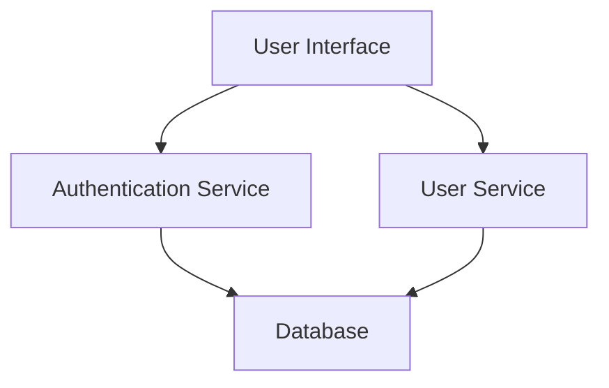
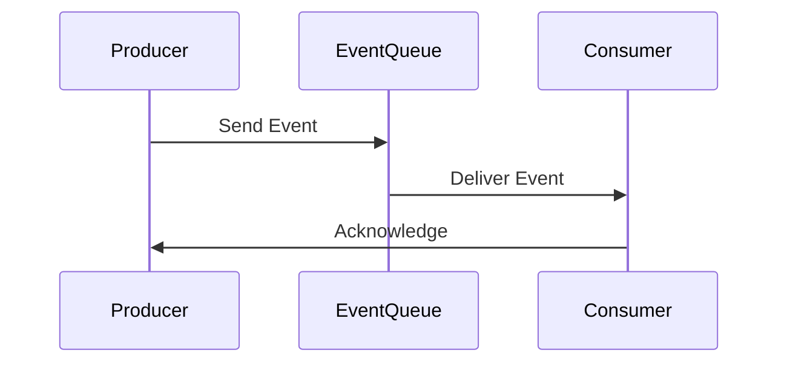

## 21.6 Architecting Large-Scale Functional Applications

In today's rapidly evolving technological landscape, building large-scale applications that are both scalable and maintainable is crucial. Functional programming, with its emphasis on immutability, pure functions, and declarative code, offers a robust paradigm for architecting such systems. In this section, we will delve into the principles and practices of designing large-scale functional applications using Clojure, a language that embodies the functional paradigm while providing powerful tools for concurrency and data management.

### Scalable Architecture Principles

When architecting large-scale applications, certain principles are paramount to ensure scalability, maintainability, and performance. Let's explore these principles in the context of functional programming.

#### Modularity and Separation of Concerns

**Explain**: Modularity is a cornerstone of scalable architecture. By breaking down a system into smaller, self-contained modules, we can manage complexity and facilitate easier maintenance and testing. In functional programming, this is achieved through the use of pure functions and immutable data structures, which naturally promote separation of concerns.

**Demonstrate**:

```clojure
;; Example of modular design in Clojure
(ns myapp.user)

(defn validate-user [user]
  ;; Pure function for user validation
  (and (not (nil? (:name user)))
       (not (nil? (:email user)))))

(ns myapp.auth)

(defn authenticate [user]
  ;; Pure function for authentication
  (if (validate-user user)
    {:status :success}
    {:status :failure}))
```

**Provide**: In the example above, we separate user validation and authentication into distinct namespaces and functions, adhering to the principle of separation of concerns.

#### Microservices and Services

**Explain**: Microservices architecture is a design pattern where applications are composed of small, independent services that communicate over a network. Functional programming aligns well with microservices due to its emphasis on statelessness and immutability, which simplifies service interactions and state management.

**Demonstrate**:

```clojure
;; Example of a microservice in Clojure using HTTP Kit
(ns myapp.service
  (:require [org.httpkit.server :as http]))

(defn handler [request]
  ;; Handle incoming requests
  {:status 200
   :headers {"Content-Type" "application/json"}
   :body "{\"message\": \"Hello, world!\"}"})

(defn start-server []
  ;; Start the HTTP server
  (http/run-server handler {:port 8080}))
```

**Include**: This example demonstrates a simple Clojure microservice using HTTP Kit. The service is stateless, handling requests independently, which is a key characteristic of microservices.

### Data Flow Management

Managing data flow efficiently is critical in large-scale applications. Functional programming offers several techniques to handle data flow, including event-driven architectures and message queues.

#### Event-Driven Architectures

**Explain**: Event-driven architectures decouple components by using events to trigger actions. This approach enhances scalability and responsiveness, as components can react to events asynchronously.

**Demonstrate**:

```clojure
;; Example of event-driven architecture using core.async
(ns myapp.events
  (:require [clojure.core.async :as async]))

(def event-chan (async/chan))

(defn process-event [event]
  ;; Process incoming events
  (println "Processing event:" event))

(defn start-event-processor []
  ;; Start the event processor
  (async/go-loop []
    (when-let [event (async/<! event-chan)]
      (process-event event)
      (recur))))
```

**Provide**: In this example, we use Clojure's `core.async` library to implement an event-driven architecture. Events are processed asynchronously, allowing the system to handle high loads efficiently.

#### Message Queues

**Explain**: Message queues facilitate communication between services by decoupling the sender and receiver. This pattern is particularly useful in distributed systems, where services may operate at different speeds.

**Demonstrate**:

```clojure
;; Example of using a message queue with RabbitMQ
(ns myapp.queue
  (:require [langohr.core :as rmq]
            [langohr.channel :as ch]
            [langohr.basic :as lb]))

(defn send-message [channel queue message]
  ;; Send a message to the queue
  (lb/publish channel "" queue message))

(defn receive-message [channel queue]
  ;; Receive messages from the queue
  (lb/consume channel queue (fn [ch metadata payload]
                              (println "Received message:" (String. payload)))))
```

**Include**: This example illustrates how to use RabbitMQ, a popular message broker, to manage communication between services in a Clojure application.

### Concurrency and Parallelism

Handling concurrency and parallelism is a common challenge in large-scale applications. Clojure provides powerful concurrency primitives that make it easier to manage these complexities.

#### Strategies for High Concurrency

**Explain**: Clojure's immutable data structures and concurrency primitives, such as atoms, refs, and agents, simplify concurrent programming by eliminating race conditions and ensuring thread safety.

**Demonstrate**:

```clojure
;; Example of using an atom for concurrency
(ns myapp.counter)

(def counter (atom 0))

(defn increment-counter []
  ;; Safely increment the counter
  (swap! counter inc))
```

**Provide**: In this example, we use an atom to manage a counter safely across multiple threads. The `swap!` function ensures that updates are atomic, preventing race conditions.

#### Parallel Processing

**Explain**: Parallel processing involves executing multiple computations simultaneously to improve performance. Clojure's `pmap` function allows for easy parallel processing of data collections.

**Demonstrate**:

```clojure
;; Example of parallel processing with pmap
(ns myapp.parallel)

(defn expensive-computation [x]
  ;; Simulate an expensive computation
  (Thread/sleep 1000)
  (* x x))

(defn process-data [data]
  ;; Process data in parallel
  (pmap expensive-computation data))
```

**Include**: This example shows how to use `pmap` to perform parallel processing of a data collection, significantly reducing processing time for computationally intensive tasks.

### Monitoring and Observability

Monitoring and observability are crucial for maintaining large-scale systems, enabling developers to detect and resolve issues quickly.

#### Importance of Monitoring

**Explain**: Monitoring involves collecting metrics and logs to track the health and performance of an application. Observability extends this by providing insights into the internal state of the system, facilitating root cause analysis.

**Demonstrate**:

```clojure
;; Example of structured logging with Timbre
(ns myapp.logging
  (:require [taoensso.timbre :as timbre]))

(defn log-event [event]
  ;; Log an event with structured data
  (timbre/info {:event event :timestamp (System/currentTimeMillis)}))
```

**Provide**: This example uses the Timbre library for structured logging, which enhances observability by providing detailed, contextual information about events.

#### Tracing and Metrics

**Explain**: Tracing involves tracking the flow of requests through a system, while metrics provide quantitative data on system performance. Together, they enable comprehensive monitoring and observability.

**Demonstrate**:

```clojure
;; Example of tracing with OpenTelemetry
(ns myapp.tracing
  (:require [opentelemetry.api.trace :as ot]))

(defn trace-operation [operation]
  ;; Trace an operation
  (ot/with-span [span (ot/start-span "operation-span")]
    (operation)))
```

**Include**: This example demonstrates how to use OpenTelemetry, a popular observability framework, to trace operations in a Clojure application.

### Visual Aids

To further illustrate these concepts, let's include some visual aids.

#### Diagram: Microservices Architecture



**Description**: This diagram represents a simple microservices architecture, where the user interface interacts with separate authentication and user services, both of which access a shared database.

#### Diagram: Event-Driven Architecture



**Description**: This sequence diagram illustrates an event-driven architecture, where a producer sends events to a queue, which are then consumed by a consumer.

### References and Links

- [Clojure Official Documentation](https://clojure.org/reference)
- [Clojure Community Resources](https://clojure.org/community/resources)
- [Transitioning from OOP to Functional Programming](https://www.lispcast.com/oo-to-fp/)
- [Clojure STM Guide](https://clojure.org/reference/refs)
- [OpenTelemetry Documentation](https://opentelemetry.io/docs/)

### Knowledge Check

To reinforce your understanding of architecting large-scale functional applications, try answering the following questions.

## **Test Your Knowledge: Architecting Large-Scale Functional Applications Quiz**



### What is a key principle of scalable architecture in functional programming?

- [x] Modularity
- [ ] Global state management
- [ ] Tight coupling
- [ ] Synchronous communication

> **Explanation:** Modularity allows for separation of concerns and easier maintenance, which is crucial for scalability.

### How does functional programming align with microservices architecture?

- [x] Emphasizes statelessness and immutability
- [ ] Relies on global mutable state
- [ ] Requires synchronous communication
- [ ] Depends on shared memory

> **Explanation:** Functional programming's emphasis on statelessness and immutability aligns well with microservices, which benefit from independent, stateless components.

### What is the purpose of event-driven architectures?

- [x] Decouple components and enhance scalability
- [ ] Increase coupling between services
- [ ] Ensure synchronous processing
- [ ] Centralize state management

> **Explanation:** Event-driven architectures decouple components, allowing for asynchronous processing and improved scalability.

### Which Clojure library is commonly used for structured logging?

- [x] Timbre
- [ ] core.async
- [ ] Ring
- [ ] Compojure

> **Explanation:** Timbre is a popular library for structured logging in Clojure.

### What is the role of tracing in observability?

- [x] Track the flow of requests through a system
- [ ] Collect static metrics
- [ ] Manage global state
- [ ] Synchronize threads

> **Explanation:** Tracing involves tracking the flow of requests, providing insights into system behavior and aiding in root cause analysis.

### Which Clojure function is used for parallel processing of collections?

- [x] pmap
- [ ] map
- [ ] filter
- [ ] reduce

> **Explanation:** `pmap` is used for parallel processing of collections in Clojure, distributing computation across multiple threads.

### What is a benefit of using message queues in distributed systems?

- [x] Decouple sender and receiver
- [ ] Enforce synchronous processing
- [ ] Centralize state management
- [ ] Increase coupling between components

> **Explanation:** Message queues decouple the sender and receiver, allowing for asynchronous communication and improved system resilience.

### Which Clojure concurrency primitive ensures atomic updates?

- [x] Atom
- [ ] Ref
- [ ] Agent
- [ ] Var

> **Explanation:** Atoms provide atomic updates, ensuring thread safety in concurrent applications.

### How does Clojure's `core.async` library support event-driven architectures?

- [x] Provides channels for asynchronous communication
- [ ] Manages global state
- [ ] Enforces synchronous processing
- [ ] Centralizes state management

> **Explanation:** `core.async` provides channels that facilitate asynchronous communication, supporting event-driven architectures.

### True or False: Functional programming inherently supports mutable state management.

- [ ] True
- [x] False

> **Explanation:** Functional programming emphasizes immutability, avoiding mutable state to ensure predictability and thread safety.



By understanding these principles and techniques, you can effectively architect large-scale functional applications that are scalable, maintainable, and performant. Embrace the functional programming paradigm with Clojure and unlock the potential for building robust, future-proof systems.
