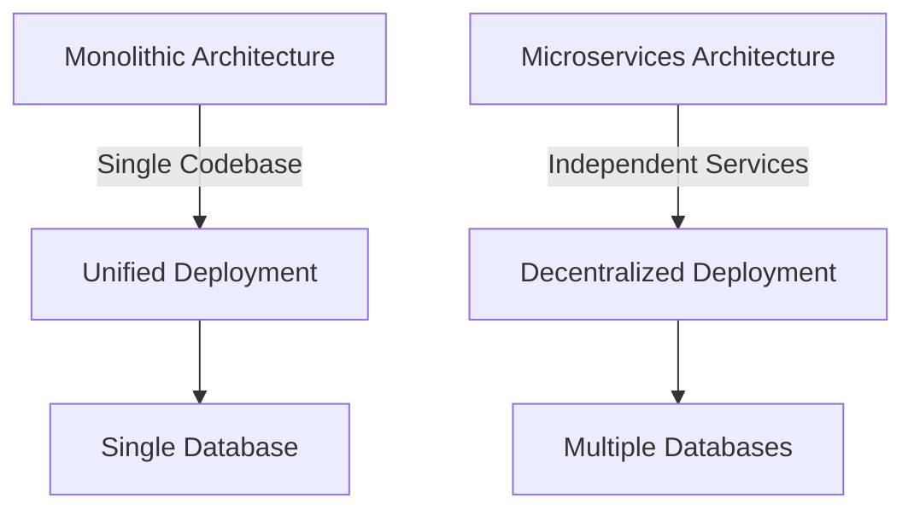

## 21.7 Microservices vs. Monoliths in Functional Design

In the realm of software architecture, the debate between microservices and monolithic architectures has been ongoing. Each approach has its own set of characteristics, benefits, and challenges. In this section, we will explore these two architectural styles, how functional programming principles apply to each, and strategies for transitioning between them. We'll also delve into real-world examples to illustrate the practical applications of these concepts.

### Definitions and Differences

#### Microservices Architecture

Microservices architecture is a design pattern where an application is composed of small, independent services that communicate over a network. Each service is a self-contained unit responsible for a specific business capability and can be developed, deployed, and scaled independently.

**Characteristics:**
- **Decentralization:** Each microservice operates independently, often with its own database.
- **Scalability:** Services can be scaled individually based on demand.
- **Flexibility:** Allows for the use of different technologies and languages for different services.
- **Resilience:** Failure in one service does not necessarily impact the entire system.

#### Monolithic Architecture

A monolithic architecture is a traditional model of software design where the entire application is built as a single unit. All components are interconnected and interdependent, sharing a single codebase and database.

**Characteristics:**
- **Unified Codebase:** All components are part of a single codebase.
- **Simplified Deployment:** Deployment is straightforward as the entire application is deployed as one unit.
- **Performance:** Typically, monoliths have lower latency due to fewer network calls.
- **Complexity in Scaling:** Scaling requires scaling the entire application, not individual components.

### Functional Approaches to Both

Functional programming, with its emphasis on immutability, pure functions, and declarative code, can be applied to both microservices and monolithic architectures to enhance their design and implementation.

#### Functional Microservices

Implementing microservices using functional programming languages like Clojure can lead to cleaner, more maintainable code. Here are some ways functional principles can be applied:

- **Immutability:** Each service can maintain its state immutably, reducing side effects and making the system more predictable.
- **Pure Functions:** Services can be designed around pure functions, ensuring that outputs are consistent and reliable.
- **Concurrency:** Clojure's concurrency primitives (e.g., atoms, refs) can manage state changes efficiently, which is crucial in distributed systems.

**Code Example: A Simple Microservice in Clojure**

```clojure
(ns user-service.core
  (:require [ring.adapter.jetty :refer [run-jetty]]
            [ring.middleware.json :refer [wrap-json-response wrap-json-body]]))

(defn get-user [id]
  ;; Simulate fetching a user from a database
  {:id id :name "John Doe" :email "john.doe@example.com"})

(defn user-handler [request]
  (let [user-id (get-in request [:params :id])]
    {:status 200
     :body (get-user user-id)}))

(def app
  (-> user-handler
      wrap-json-response
      wrap-json-body))

(defn -main []
  (run-jetty app {:port 3000}))
```

This example demonstrates a simple user service that retrieves user data. The use of pure functions and immutability ensures that the service is reliable and easy to test.

#### Functional Monoliths

Functional programming can also enhance monolithic architectures by promoting modularity and reducing complexity. Key functional principles include:

- **Modularity:** By breaking down the monolith into smaller, functional modules, we can achieve better separation of concerns.
- **Declarative Code:** Functional programming encourages writing code that describes what should be done, rather than how, leading to more readable and maintainable code.
- **State Management:** Clojure's immutable data structures can simplify state management within a monolith.

**Code Example: A Monolithic Application in Clojure**

```clojure
(ns ecommerce.core
  (:require [clojure.java.jdbc :as jdbc]
            [ring.adapter.jetty :refer [run-jetty]]
            [ring.middleware.json :refer [wrap-json-response wrap-json-body]]))

(def db-spec {:subprotocol "h2"
              :subname "mem:"})

(defn get-product [id]
  (jdbc/query db-spec ["SELECT * FROM products WHERE id = ?" id]))

(defn product-handler [request]
  (let [product-id (get-in request [:params :id])]
    {:status 200
     :body (get-product product-id)}))

(def app
  (-> product-handler
      wrap-json-response
      wrap-json-body))

(defn -main []
  (run-jetty app {:port 3000}))
```

This example shows a simple monolithic application that handles product data. By using functional programming principles, we maintain a clean separation of logic and data access.

### Pros and Cons

#### Microservices

**Pros:**
- **Scalability:** Services can be scaled independently, allowing for efficient resource use.
- **Flexibility:** Different services can use different technologies, best suited for their specific needs.
- **Resilience:** Fault isolation ensures that a failure in one service does not bring down the entire system.

**Cons:**
- **Complexity:** Managing multiple services can be complex, requiring robust orchestration and monitoring.
- **Latency:** Network communication between services can introduce latency.
- **Data Consistency:** Ensuring data consistency across services can be challenging.

#### Monoliths

**Pros:**
- **Simplicity:** A single codebase simplifies development and deployment.
- **Performance:** Lower latency due to fewer network calls and direct communication between components.
- **Ease of Testing:** Testing is straightforward as all components are in one place.

**Cons:**
- **Scalability:** Scaling requires scaling the entire application, which can be inefficient.
- **Flexibility:** Limited flexibility in using different technologies for different components.
- **Deployment:** Changes require redeploying the entire application, which can be risky.

### Transitioning Strategies

Transitioning between monolithic and microservices architectures requires careful planning and execution. Here are some strategies:

#### From Monolith to Microservices

1. **Identify Boundaries:** Start by identifying logical boundaries within the monolith that can be extracted as services.
2. **Incremental Refactoring:** Gradually refactor components into independent services, ensuring they can communicate effectively.
3. **Use APIs:** Implement APIs for communication between services, ensuring they are well-documented and versioned.
4. **Monitor and Optimize:** Continuously monitor the performance and reliability of services, optimizing as necessary.

#### From Microservices to Monolith

1. **Assess Complexity:** Evaluate whether the complexity of managing multiple services outweighs the benefits.
2. **Consolidate Services:** Identify services that can be consolidated into a single codebase without losing functionality.
3. **Simplify Communication:** Reduce the number of network calls by consolidating services that frequently communicate.
4. **Maintain Modularity:** Even within a monolith, maintain modularity to ensure code remains manageable.

### Real-World Examples

#### Netflix: Microservices Success

Netflix is a well-known example of a company that successfully transitioned from a monolithic architecture to microservices. This transition allowed Netflix to scale rapidly and improve resilience. By leveraging functional programming principles, Netflix was able to build robust, scalable services that met the demands of its growing user base.

#### Shopify: Monolith to Microservices and Back

Shopify initially transitioned from a monolithic architecture to microservices to improve scalability. However, they found that the complexity of managing numerous services was overwhelming. As a result, they consolidated some services back into a monolith, achieving a balance between scalability and manageability.

### Visual Aids

#### Architecture Comparison Diagram



**Caption:** This diagram illustrates the key differences between monolithic and microservices architectures. Monolithic architectures have a single codebase and database, while microservices consist of independent services with decentralized deployment and multiple databases.

### References and Links

- [Clojure Official Documentation](https://clojure.org/reference)
- [Transitioning from OOP to Functional Programming](https://www.lispcast.com/oo-to-fp/)
- [Microservices vs. Monoliths: A Practical Guide](https://martinfowler.com/articles/microservices.html)
- [Shopify's Journey: Monolith to Microservices and Back](https://engineering.shopify.com/blogs/engineering/deconstructing-the-monolith-how-shopify-handles-scale)

### Knowledge Check

#### Questions

1. What are the main characteristics of a microservices architecture?
2. How does functional programming enhance microservices?
3. What are the pros and cons of monolithic architectures?
4. Describe a strategy for transitioning from a monolith to microservices.
5. How can functional programming principles be applied to a monolithic architecture?

#### Exercises

1. Refactor a simple monolithic application into microservices using Clojure.
2. Implement a microservice in Clojure that uses pure functions and immutability.
3. Analyze a real-world application and identify opportunities for applying functional programming principles.

### Encouraging Engagement

Embracing functional programming in the context of microservices and monoliths can be challenging but rewarding. As you explore these architectures, remember that each has its place, and the right choice depends on your specific needs and constraints. By applying functional programming principles, you'll create more robust, maintainable, and scalable applications.

### Test Your Knowledge: Microservices vs. Monoliths in Functional Design Quiz



### What is a key characteristic of microservices architecture?

- [x] Decentralization
- [ ] Unified Codebase
- [ ] Single Database
- [ ] Simplified Deployment

> **Explanation:** Microservices architecture is characterized by decentralization, where each service operates independently.

### How does functional programming enhance microservices?

- [x] Immutability reduces side effects
- [ ] Increases network latency
- [ ] Requires a single language
- [ ] Decreases flexibility

> **Explanation:** Functional programming enhances microservices by using immutability to reduce side effects, making systems more predictable.

### What is a disadvantage of monolithic architectures?

- [x] Scalability
- [ ] Lower latency
- [ ] Unified Codebase
- [ ] Simplified Deployment

> **Explanation:** Monolithic architectures are less scalable because scaling requires scaling the entire application.

### What is a benefit of functional monoliths?

- [x] Modularity
- [ ] Increased complexity
- [ ] Higher latency
- [ ] Decentralization

> **Explanation:** Functional monoliths benefit from modularity, which improves separation of concerns and maintainability.

### Which strategy is useful for transitioning from monolith to microservices?

- [x] Incremental Refactoring
- [ ] Consolidating Services
- [ ] Reducing Modularity
- [ ] Simplifying Communication

> **Explanation:** Incremental refactoring allows for gradual transition from monolith to microservices, ensuring effective communication between components.

### What is a challenge of microservices architecture?

- [x] Complexity
- [ ] Lower latency
- [ ] Unified Codebase
- [ ] Simplified Deployment

> **Explanation:** Microservices architecture introduces complexity in managing multiple services, requiring robust orchestration and monitoring.

### How can functional programming principles be applied to monolithic architectures?

- [x] By promoting modularity
- [ ] By increasing network calls
- [ ] By reducing flexibility
- [ ] By using a single database

> **Explanation:** Functional programming promotes modularity, which reduces complexity and enhances maintainability in monolithic architectures.

### What is a real-world example of a company that transitioned to microservices?

- [x] Netflix
- [ ] Shopify
- [ ] Google
- [ ] Facebook

> **Explanation:** Netflix successfully transitioned to microservices, allowing them to scale rapidly and improve resilience.

### What is a benefit of functional microservices?

- [x] Pure Functions
- [ ] Increased complexity
- [ ] Higher latency
- [ ] Single Codebase

> **Explanation:** Functional microservices benefit from pure functions, ensuring consistent and reliable outputs.

### True or False: Monolithic architectures always use multiple databases.

- [ ] True
- [x] False

> **Explanation:** Monolithic architectures typically use a single database shared across all components.



By understanding the nuances of microservices and monolithic architectures, and how functional programming can enhance both, you'll be well-equipped to make informed architectural decisions for your applications.
