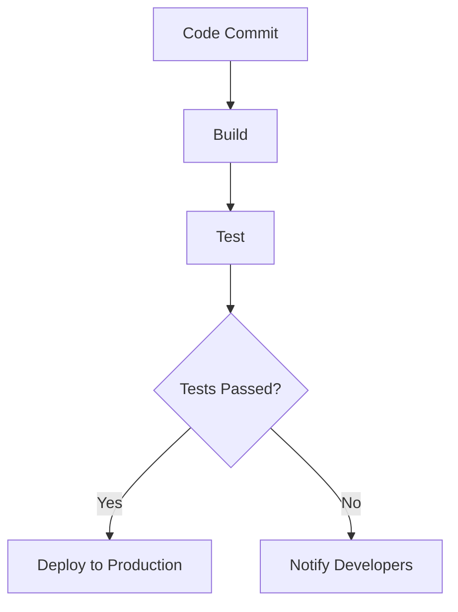

## 21.8 Automating Deployment with Clojure Tools

In today's fast-paced software development environment, automating deployment processes is not just a luxury—it's a necessity. Automation enhances reliability, reduces errors, and accelerates the delivery of software to production environments. In this section, we'll explore how Clojure's ecosystem provides robust tools for automating deployment, focusing on build tools, deployment scripts, and continuous deployment pipelines.

### Importance of Automation

**Explain why automation is crucial**: Automating deployment processes ensures consistency across environments, minimizes human error, and allows teams to focus on developing features rather than managing deployments. This is particularly important in functional programming, where the goal is to create predictable and reliable software.

### Build Tools

**Introduce build automation tools**: Clojure offers several tools to automate the build process, with [Leiningen](https://leiningen.org/) and the Clojure CLI tools being the most popular.

#### Leiningen

Leiningen is a widely-used build automation tool for Clojure projects. It simplifies project management, dependency resolution, and builds processes.

- **Project Initialization**: Use `lein new` to create a new project.
- **Dependency Management**: Define dependencies in `project.clj`.
- **Build and Run**: Use `lein run` to build and execute your application.

```clojure
;; Example project.clj
(defproject my-app "0.1.0-SNAPSHOT"
  :dependencies [[org.clojure/clojure "1.10.3"]]
  :main my-app.core)
```

#### Clojure CLI Tools and `deps.edn`

The Clojure CLI tools offer a more flexible approach to managing dependencies and build processes using the `deps.edn` file.

- **Dependency Management**: Define dependencies in `deps.edn`.
- **Aliases**: Use aliases to define different build configurations.

```clojure
;; Example deps.edn
{:deps {org.clojure/clojure {:mvn/version "1.10.3"}}
 :aliases {:run {:main-opts ["-m" "my-app.core"]}}}
```

### Deployment Scripts

**Show how to write deployment scripts in Clojure**: Deployment scripts automate the steps necessary to deploy an application. Clojure's `tools.build` library provides a programmatic way to define these scripts.

#### Using `tools.build`

`tools.build` is a library that allows you to write build scripts in Clojure, providing a high level of customization.

- **Define Tasks**: Create tasks for building, testing, and deploying your application.
- **Leverage Clojure's Power**: Use Clojure's functional capabilities to create reusable and composable tasks.

```clojure
;; Example build.clj
(ns build
  (:require [clojure.tools.build.api :as b]))

(defn build []
  (b/copy-dir {:src-dirs ["src"]
               :target-dir "target/classes"}))

(defn deploy []
  (println "Deploying application...")
  ;; Add deployment logic here
)
```

### Continuous Deployment

**Discuss setting up continuous deployment pipelines**: Continuous deployment (CD) ensures that every change to the codebase is automatically deployed to production, provided it passes all stages of the pipeline.

#### Using Jenkins

[Jenkins](https://www.jenkins.io/) is a popular open-source automation server that supports building, deploying, and automating any project.

- **Pipeline as Code**: Define Jenkins pipelines using a `Jenkinsfile`.
- **Integration with Clojure**: Use Jenkins to automate Clojure builds and deployments.

```groovy
// Example Jenkinsfile
pipeline {
    agent any
    stages {
        stage('Build') {
            steps {
                sh 'lein build'
            }
        }
        stage('Test') {
            steps {
                sh 'lein test'
            }
        }
        stage('Deploy') {
            steps {
                sh 'lein deploy'
            }
        }
    }
}
```

#### Using GitHub Actions

[GitHub Actions](https://github.com/features/actions) provides a way to automate workflows directly in your GitHub repository.

- **YAML Configuration**: Define workflows using YAML files.
- **Clojure Integration**: Use GitHub Actions to run Clojure scripts and automate deployments.

```yaml
# Example .github/workflows/ci.yml
name: CI

on: [push]

jobs:
  build:
    runs-on: ubuntu-latest
    steps:
    - uses: actions/checkout@v2
    - name: Set up JDK 11
      uses: actions/setup-java@v2
      with:
        java-version: '11'
    - name: Build with Leiningen
      run: lein build
    - name: Test with Leiningen
      run: lein test
    - name: Deploy
      run: lein deploy
```

### Example Pipeline

**Provide an example of a deployment pipeline**: Let's walk through a typical deployment pipeline, from code commit to production deployment.

#### Pipeline Overview

1. **Code Commit**: Developers commit code to the repository.
2. **Build**: The build server compiles the code and packages it.
3. **Test**: Automated tests are run to ensure code quality.
4. **Deploy**: If tests pass, the code is deployed to production.



**Description**: This diagram illustrates a typical continuous deployment pipeline. It begins with a code commit, followed by build and test stages. If tests pass, the application is deployed to production; otherwise, developers are notified of the failure.

### Conclusion

Automating deployment with Clojure tools streamlines the process of delivering applications to production, ensuring consistency and reliability. By leveraging tools like Leiningen, Clojure CLI, and continuous deployment services like Jenkins and GitHub Actions, developers can focus on building features while the automation handles the deployment intricacies.

### References and Further Reading

- [Clojure Official Documentation](https://clojure.org/reference)
- [Leiningen](https://leiningen.org/)
- [Jenkins](https://www.jenkins.io/)
- [GitHub Actions](https://github.com/features/actions)
- [Clojure Community Resources](https://clojure.org/community/resources)

### Knowledge Check

Let's solidify your understanding of automating deployment with Clojure tools.

## **Test Your Knowledge: Automating Deployment with Clojure Tools Quiz**



### What is the primary benefit of automating deployment processes?

- [x] Reduces human error and accelerates delivery
- [ ] Increases manual intervention
- [ ] Slows down the deployment process
- [ ] Requires more resources

> **Explanation:** Automation reduces human error and accelerates the deployment process, making it more efficient.

### Which tool is commonly used for build automation in Clojure projects?

- [x] Leiningen
- [ ] Maven
- [ ] Gradle
- [ ] Ant

> **Explanation:** Leiningen is a popular build automation tool specifically designed for Clojure projects.

### What file is used to define dependencies in Clojure CLI tools?

- [x] deps.edn
- [ ] project.clj
- [ ] pom.xml
- [ ] build.gradle

> **Explanation:** `deps.edn` is used to define dependencies in Clojure CLI tools.

### Which library is used for writing deployment scripts in Clojure?

- [x] tools.build
- [ ] tools.cli
- [ ] tools.logging
- [ ] tools.nrepl

> **Explanation:** The `tools.build` library is used for writing deployment scripts in Clojure.

### What is the purpose of a Jenkinsfile?

- [x] Define Jenkins pipelines
- [ ] Store application logs
- [ ] Manage user permissions
- [ ] Configure network settings

> **Explanation:** A Jenkinsfile is used to define Jenkins pipelines, specifying the steps of the build and deployment process.

### Which service allows you to automate workflows directly in your GitHub repository?

- [x] GitHub Actions
- [ ] GitLab CI
- [ ] Travis CI
- [ ] CircleCI

> **Explanation:** GitHub Actions allows you to automate workflows directly within your GitHub repository.

### What is the first step in a typical deployment pipeline?

- [x] Code Commit
- [ ] Build
- [ ] Test
- [ ] Deploy

> **Explanation:** The first step in a typical deployment pipeline is a code commit by developers.

### Which of the following is NOT a stage in a deployment pipeline?

- [ ] Build
- [ ] Test
- [ ] Deploy
- [x] Design

> **Explanation:** Design is not a stage in a deployment pipeline; it is part of the development process.

### What happens if tests fail in a deployment pipeline?

- [x] Developers are notified
- [ ] Code is deployed to production
- [ ] The build is skipped
- [ ] The pipeline restarts

> **Explanation:** If tests fail, developers are notified to address the issues before deployment.

### True or False: Automating deployment processes is only beneficial for large teams.

- [ ] True
- [x] False

> **Explanation:** Automating deployment processes is beneficial for teams of all sizes, as it ensures consistency and reliability.


