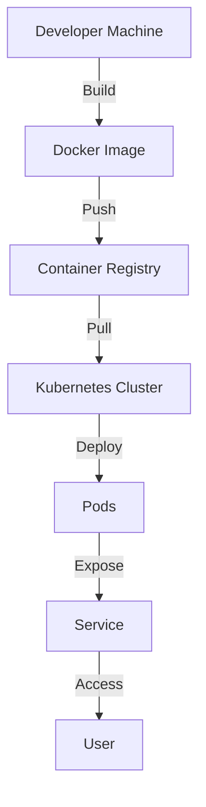

## 21.9 Containerization with Docker and Kubernetes

In today's fast-paced development environments, deploying applications consistently across different platforms is crucial. Containerization provides a solution by encapsulating applications and their dependencies into a single, portable unit known as a container. This section explores how we can leverage Docker and Kubernetes to deploy and manage Clojure applications efficiently, ensuring consistency and scalability.

### Benefits of Containerization

Containerization offers several advantages that are particularly beneficial for deploying Clojure applications:

- **Consistency Across Environments**: Containers ensure that applications run the same way regardless of where they are deployed, eliminating the "it works on my machine" problem.
- **Simplified Deployment**: Containers package all necessary dependencies, making deployment straightforward and reducing compatibility issues.
- **Scalability**: Containers can be easily scaled up or down to meet demand, allowing for efficient resource utilization.
- **Isolation**: Applications run in isolated environments, which enhances security and reduces conflicts between different applications.

### Docker Basics

Docker is an open-source platform that automates the deployment of applications inside lightweight containers. It provides a consistent environment for application development, testing, and deployment.

#### What is Docker?

Docker allows developers to package applications and their dependencies into a standardized unit called a container. Containers are lightweight, portable, and can run on any system that supports Docker.

#### Containerizing Clojure Applications

To containerize a Clojure application, we need to create a Docker image. This image includes the Clojure runtime, application code, and any dependencies required to run the application.

```dockerfile
# Use the official Clojure image as the base
FROM clojure:openjdk-11-lein

# Set the working directory
WORKDIR /app

# Copy the project files into the container
COPY . .

# Install dependencies and build the application
RUN lein deps && lein uberjar

# Expose the application's port
EXPOSE 3000

# Command to run the application
CMD ["java", "-jar", "target/myapp.jar"]
```

**Explanation:**

- **Base Image**: We start with the official Clojure image, which includes the OpenJDK and Leiningen.
- **Working Directory**: Set to `/app`, where the application files will reside.
- **Copy Files**: The `COPY` command transfers the application files into the container.
- **Build Application**: The `RUN` command installs dependencies and builds the application using Leiningen.
- **Expose Port**: This makes the application accessible on port 3000.
- **Command**: Specifies the command to run the application.

### Writing Dockerfiles

Writing efficient and secure Dockerfiles is crucial for creating optimized Docker images. Here are some best practices:

- **Minimize Layers**: Each command in a Dockerfile creates a new layer. Combine commands where possible to reduce the number of layers.
- **Use Official Images**: Start with official base images to ensure security and compatibility.
- **Leverage Caching**: Order commands to take advantage of Docker's caching mechanism. Place commands that change frequently (e.g., `COPY`) towards the end.
- **Keep Images Small**: Remove unnecessary files and use multi-stage builds to keep images lightweight.
- **Security**: Regularly update base images and use non-root users to run applications within containers.

### Orchestrating with Kubernetes

While Docker is excellent for creating and running containers on a single host, Kubernetes is a powerful platform for managing containerized applications across a cluster of machines.

#### What is Kubernetes?

Kubernetes is an open-source container orchestration platform that automates the deployment, scaling, and management of containerized applications. It provides a robust framework for running distributed systems resiliently.

#### Deploying Clojure Applications on Kubernetes

Deploying a Clojure application on Kubernetes involves creating several configuration files that define the application's desired state.

**Deployment Configuration:**

```yaml
apiVersion: apps/v1
kind: Deployment
metadata:
  name: clojure-app
spec:
  replicas: 3
  selector:
    matchLabels:
      app: clojure-app
  template:
    metadata:
      labels:
        app: clojure-app
    spec:
      containers:
      - name: clojure-app
        image: myregistry/clojure-app:latest
        ports:
        - containerPort: 3000
```

**Explanation:**

- **Replicas**: Specifies the number of instances of the application to run.
- **Selector**: Identifies the pods that belong to this deployment.
- **Template**: Defines the pod template, including the container image and ports.

**Service Configuration:**

```yaml
apiVersion: v1
kind: Service
metadata:
  name: clojure-service
spec:
  selector:
    app: clojure-app
  ports:
    - protocol: TCP
      port: 80
      targetPort: 3000
  type: LoadBalancer
```

**Explanation:**

- **Selector**: Matches the service to the pods created by the deployment.
- **Ports**: Maps the service port to the container port.
- **Type**: Specifies the service type, such as `LoadBalancer` for external access.

### Deployment Examples

Let's walk through deploying a Clojure application on Kubernetes, including configuration of services, deployments, and scaling.

#### Step 1: Build and Push Docker Image

First, build the Docker image and push it to a container registry.

```bash
docker build -t myregistry/clojure-app:latest .
docker push myregistry/clojure-app:latest
```

#### Step 2: Apply Kubernetes Configurations

Apply the deployment and service configurations using `kubectl`.

```bash
kubectl apply -f deployment.yaml
kubectl apply -f service.yaml
```

#### Step 3: Verify Deployment

Check the status of the deployment and service.

```bash
kubectl get deployments
kubectl get services
```

#### Step 4: Scaling the Application

Scale the application by updating the number of replicas.

```bash
kubectl scale deployment clojure-app --replicas=5
```

### Try It Yourself

Experiment with the examples by modifying the Dockerfile to use a different base image or change the Kubernetes deployment to use a different number of replicas. Test how these changes affect the deployment process and application performance.

### Visual Aids

To better understand the architecture of deploying Clojure applications with Docker and Kubernetes, let's look at a diagram:



**Diagram Description:**

- **Developer Machine**: Where the Docker image is built.
- **Docker Image**: The containerized application.
- **Container Registry**: Stores Docker images.
- **Kubernetes Cluster**: Manages the deployment of containers.
- **Pods**: Run the containerized application instances.
- **Service**: Exposes the application to users.

### References and Links

- [Clojure Official Documentation](https://clojure.org/reference)
- [Docker Official Website](https://www.docker.com/)
- [Kubernetes Official Website](https://kubernetes.io/)
- [Transitioning from OOP to Functional Programming](https://www.lispcast.com/oo-to-fp/)

### Knowledge Check

Reflect on the concepts covered in this section. Consider how containerization can improve the deployment and scalability of your Clojure applications. Experiment with the examples provided and explore additional resources to deepen your understanding.

## **Test Your Knowledge: Containerization with Docker and Kubernetes Quiz**



### What is a primary benefit of containerization?

- [x] Consistent environments across different platforms
- [ ] Increased memory usage
- [ ] Limited scalability
- [ ] Complex deployment processes

> **Explanation:** Containerization ensures consistent environments, making deployment across different platforms seamless.

### Which command is used to build a Docker image?

- [x] `docker build`
- [ ] `docker create`
- [ ] `docker compile`
- [ ] `docker run`

> **Explanation:** The `docker build` command is used to create a Docker image from a Dockerfile.

### What is the purpose of the `EXPOSE` command in a Dockerfile?

- [x] To specify the port on which the container listens
- [ ] To create a new network
- [ ] To delete unnecessary files
- [ ] To build the application

> **Explanation:** The `EXPOSE` command indicates the ports on which the container listens for connections.

### What is the role of Kubernetes in container orchestration?

- [x] Automating deployment, scaling, and management of containerized applications
- [ ] Building Docker images
- [ ] Creating virtual machines
- [ ] Compiling Clojure code

> **Explanation:** Kubernetes automates the deployment, scaling, and management of containerized applications.

### How do you scale a deployment in Kubernetes?

- [x] `kubectl scale deployment <name> --replicas=<number>`
- [ ] `kubectl resize deployment <name> --size=<number>`
- [x] `kubectl scale --replicas=<number> deployment <name>`
- [ ] `kubectl expand deployment <name> --count=<number>`

> **Explanation:** The `kubectl scale` command is used to adjust the number of replicas for a deployment.

### What is the function of a Kubernetes service?

- [x] To expose an application running on a set of pods
- [ ] To build Docker images
- [ ] To create new pods
- [ ] To compile Clojure applications

> **Explanation:** A Kubernetes service exposes an application running on a set of pods to external traffic.

### Which Kubernetes object defines the desired state for an application?

- [x] Deployment
- [ ] Pod
- [x] Service
- [ ] Ingress

> **Explanation:** A deployment defines the desired state, including the number of replicas and the container image.

### What is the purpose of a container registry?

- [x] To store and distribute Docker images
- [ ] To compile application code
- [ ] To manage Kubernetes clusters
- [ ] To build Docker images

> **Explanation:** A container registry stores and distributes Docker images.

### How does Docker ensure application isolation?

- [x] By running applications in isolated containers
- [ ] By creating virtual machines
- [ ] By using shared libraries
- [ ] By compiling code into a single binary

> **Explanation:** Docker runs applications in isolated containers, ensuring they do not interfere with each other.

### True or False: Kubernetes can only be used with Docker containers.

- [x] True
- [ ] False

> **Explanation:** Kubernetes can orchestrate containers from various runtimes, not just Docker.



By integrating Docker and Kubernetes into your Clojure development workflow, you can achieve consistent, scalable, and efficient deployments. Embrace these tools to enhance your application's reliability and performance in production environments.
