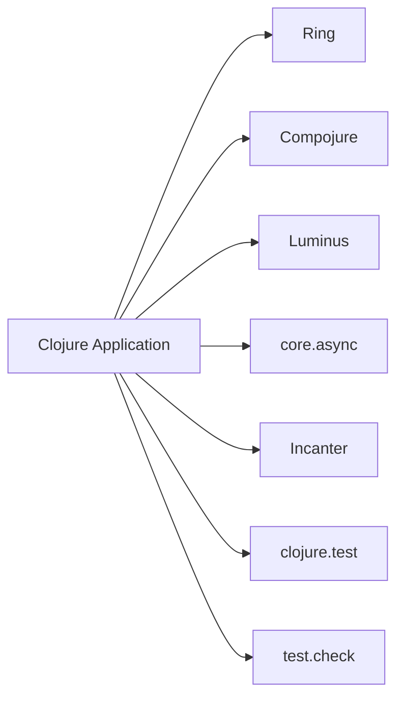

## 22.1 Overview of Essential Clojure Libraries

As we delve into the world of Clojure, one of the most compelling aspects of the language is its vibrant ecosystem of libraries. These libraries provide powerful tools and frameworks that enable developers to build robust, scalable applications. In this section, we will explore the landscape of essential Clojure libraries, how to find and manage them, and highlight some key libraries across various domains.

### Library Landscape

Clojure's ecosystem is rich and diverse, catering to a wide range of application needs. Whether you're developing web applications, processing large datasets, or writing tests, there's likely a Clojure library that can help you achieve your goals more efficiently. The community-driven nature of Clojure means that many libraries are open-source and actively maintained by passionate developers.

#### Finding Libraries

To discover the wealth of libraries available in Clojure, developers often turn to platforms like [Clojars](https://clojars.org/) and [Stasis](https://stasis.clojureverse.org/). These platforms serve as repositories and catalogues for Clojure libraries, making it easy to search for and integrate libraries into your projects.

- **Clojars**: A community repository for open-source Clojure libraries, Clojars is akin to Maven Central for Java developers. It provides a straightforward way to search for libraries, view their documentation, and see usage statistics.

- **Stasis**: This platform offers a curated list of Clojure libraries, organized by category. It’s an excellent resource for discovering popular and well-maintained libraries in the Clojure ecosystem.

#### Dependency Management

Managing dependencies in Clojure projects is streamlined through tools like Leiningen and the Clojure CLI tools. These tools not only help in specifying and resolving dependencies but also in building and running Clojure projects.

- **Leiningen**: A popular build automation tool for Clojure, Leiningen simplifies project setup, dependency management, and task automation. With a `project.clj` file, you can easily declare dependencies and manage project configurations.

    ```clojure
    ;; Example of a project.clj file
    (defproject my-clojure-app "0.1.0-SNAPSHOT"
      :dependencies [[org.clojure/clojure "1.10.3"]
                     [ring/ring-core "1.9.0"]])
    ```

- **Clojure CLI Tools**: These tools provide a lightweight alternative to Leiningen, using a `deps.edn` file for dependency management. They are particularly useful for scripting and small projects.

    ```clojure
    ;; Example of a deps.edn file
    {:deps {org.clojure/clojure {:mvn/version "1.10.3"}
            ring/ring-core {:mvn/version "1.9.0"}}}
    ```

#### Community and Support

When selecting libraries, it's crucial to consider the level of community support and activity. Libraries with active maintainers and a large user base are more likely to be reliable and receive timely updates. Engaging with the community through forums like [ClojureVerse](https://clojureverse.org/) and [Slack channels](https://clojurians.slack.com/) can provide insights into library usage and best practices.

### Highlighted Libraries

Let's explore some of the essential libraries across different domains that are widely used in the Clojure community.

#### Web Development

- **Ring**: A foundational library for building web applications in Clojure. It provides a simple interface for handling HTTP requests and responses, akin to Java's Servlet API but with a functional twist.

    ```clojure
    ;; Simple Ring handler example
    (defn handler [request]
      {:status 200
       :headers {"Content-Type" "text/plain"}
       :body "Hello, World!"})
    ```

- **Compojure**: A routing library that works seamlessly with Ring, Compojure allows you to define routes in a concise and expressive manner.

    ```clojure
    ;; Compojure routing example
    (use 'compojure.core)

    (defroutes app-routes
      (GET "/" [] "Welcome to my Clojure app!")
      (GET "/hello/:name" [name] (str "Hello, " name "!")))
    ```

- **Luminus**: A framework that provides a comprehensive setup for web applications, integrating Ring, Compojure, and other libraries to offer a full-stack development experience.

#### Data Processing

- **core.async**: A library for asynchronous programming, core.async introduces channels and go blocks, enabling concurrent data processing in a functional style.

    ```clojure
    ;; core.async example with channels
    (require '[clojure.core.async :refer [chan go >! <!!]])

    (def ch (chan))

    (go (>! ch "Hello from core.async!"))
    (println (<!! ch)) ; Output: Hello from core.async!
    ```

- **Incanter**: A Clojure library for statistical computing and data visualization, Incanter provides functions for data manipulation, statistical analysis, and charting.

    ```clojure
    ;; Incanter example for data visualization
    (use '(incanter core stats charts))

    (view (histogram (sample-normal 1000)))
    ```

#### Testing

- **clojure.test**: The standard testing library included with Clojure, clojure.test provides a simple framework for writing unit tests.

    ```clojure
    ;; clojure.test example
    (use 'clojure.test)

    (deftest addition-test
      (is (= (+ 1 2) 3)))

    (run-tests)
    ```

- **test.check**: A library for property-based testing, test.check allows you to define properties that should hold true for a wide range of inputs, automatically generating test cases.

    ```clojure
    ;; test.check example
    (require '[clojure.test.check :as tc]
             '[clojure.test.check.properties :as prop])

    (def prop-addition
      (prop/for-all [a tc/gen/int
                     b tc/gen/int]
        (= (+ a b) (+ b a))))

    (tc/quick-check 100 prop-addition)
    ```

### Visual Aids

To better understand how these libraries fit into the Clojure ecosystem, let's visualize the relationship between some of the key libraries and their roles in a typical Clojure application.



**Figure 1**: Diagram illustrating the integration of essential Clojure libraries within a typical application.

### Knowledge Check

To reinforce your understanding of the essential Clojure libraries, consider the following questions:

1. What platforms can you use to discover Clojure libraries?
2. How does Leiningen help in managing dependencies?
3. Why is community support important when choosing a library?
4. What is the role of Ring in web development?
5. How does core.async facilitate asynchronous programming?

### Try It Yourself

Now that we've covered the basics, try experimenting with some of the libraries we've discussed. For instance, modify the Compojure routing example to add a new route that returns JSON data. Explore the core.async library by creating a channel that processes a series of numbers asynchronously.

### References and Links

- [Clojure Official Documentation](https://clojure.org/reference)
- [Clojars Repository](https://clojars.org/)
- [Clojure Community Resources](https://clojure.org/community/resources)
- [Transitioning from OOP to Functional Programming](https://www.lispcast.com/oo-to-fp/)
- [ClojureVerse Community](https://clojureverse.org/)

## **Test Your Knowledge: Overview of Essential Clojure Libraries Quiz**



### What platform is commonly used to discover Clojure libraries?

- [x] Clojars
- [ ] Maven Central
- [ ] GitHub
- [ ] Bitbucket

> **Explanation:** Clojars is a community repository specifically for Clojure libraries, making it a primary resource for discovering libraries.

### Which tool is used for dependency management in Clojure?

- [x] Leiningen
- [ ] Maven
- [ ] Gradle
- [ ] Ant

> **Explanation:** Leiningen is a build automation tool for Clojure that simplifies dependency management and project setup.

### Why is it important to choose libraries with active community support?

- [x] They are more likely to be reliable and receive timely updates.
- [ ] They are free to use.
- [ ] They have more features.
- [ ] They are easier to install.

> **Explanation:** Libraries with active community support are maintained regularly, ensuring reliability and timely updates.

### What is the primary function of the Ring library?

- [x] Handling HTTP requests and responses
- [ ] Data visualization
- [ ] Statistical computing
- [ ] Unit testing

> **Explanation:** Ring provides an interface for handling HTTP requests and responses, similar to Java's Servlet API.

### How does core.async facilitate concurrent programming?

- [x] By introducing channels and go blocks
- [ ] By providing a GUI framework
- [ ] By offering a routing library
- [ ] By enabling data visualization

> **Explanation:** core.async uses channels and go blocks to handle concurrent data processing in a functional style.

### Which library is used for property-based testing in Clojure?

- [x] test.check
- [ ] clojure.test
- [ ] JUnit
- [ ] Mockito

> **Explanation:** test.check is a library for property-based testing, allowing for automatic test case generation.

### What is the role of Compojure in web development?

- [x] Defining routes for web applications
- [ ] Managing dependencies
- [ ] Statistical analysis
- [ ] Writing unit tests

> **Explanation:** Compojure is a routing library that works with Ring to define routes in a web application.

### Which tool provides a lightweight alternative to Leiningen for dependency management?

- [x] Clojure CLI Tools
- [ ] Maven
- [ ] Gradle
- [ ] Ant

> **Explanation:** The Clojure CLI Tools use a `deps.edn` file for dependency management and are suitable for scripting and small projects.

### What is the primary use of the Incanter library?

- [x] Statistical computing and data visualization
- [ ] Web development
- [ ] Dependency management
- [ ] Concurrent programming

> **Explanation:** Incanter is used for statistical computing and data visualization in Clojure.

### True or False: Stasis is a platform for discovering Clojure libraries.

- [x] True
- [ ] False

> **Explanation:** Stasis offers a curated list of Clojure libraries, making it a valuable resource for discovering popular and well-maintained libraries.



By exploring these libraries and engaging with the Clojure community, you'll be well-equipped to leverage the full power of Clojure's functional programming paradigm in your projects.
