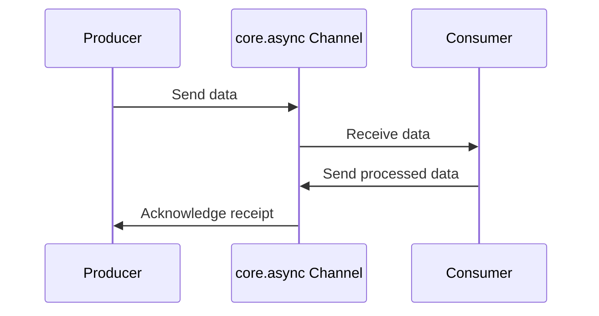

## 22.2 Data Processing with `core.async` and `manifold`

Asynchronous programming is a cornerstone of modern software development, enabling applications to handle concurrent tasks efficiently without blocking the main execution thread. This is particularly crucial in data processing, where tasks such as I/O operations, network requests, and real-time data streaming can benefit significantly from non-blocking execution. In this section, we will delve into two powerful libraries in the Clojure ecosystem that facilitate asynchronous programming: `core.async` and `manifold`.

### Asynchronous Programming

Asynchronous programming allows applications to perform tasks concurrently, improving responsiveness and throughput. In traditional synchronous programming, tasks are executed sequentially, which can lead to inefficiencies, especially when dealing with I/O-bound operations. Asynchronous programming, on the other hand, enables tasks to run independently, allowing the application to continue processing other tasks while waiting for I/O operations to complete.

In Clojure, asynchronous programming is elegantly handled through libraries like `core.async` and `manifold`, which provide abstractions for managing concurrency and data flow.

### `core.async`

`core.async` is a Clojure library inspired by the Communicating Sequential Processes (CSP) model, which provides a set of primitives for managing asynchronous workflows. At its core, `core.async` introduces channels and go blocks, which facilitate communication and coordination between concurrent tasks.

#### Channels

Channels in `core.async` are similar to queues that allow data to be passed between different parts of an application. They are used to decouple producers and consumers, enabling them to operate independently.

```clojure
(require '[clojure.core.async :as async])

(defn example-channel []
  (let [ch (async/chan)]
    (async/go
      (async/>! ch "Hello, World!")) ; Send a message to the channel
    (async/go
      (println (async/<! ch))))) ; Receive a message from the channel

(example-channel)
```

In this example, we create a channel `ch` and use go blocks to send and receive messages. The `async/>!` function is used to put a message onto the channel, and `async/<!` is used to take a message from the channel.

#### Go Blocks

Go blocks are lightweight threads that allow asynchronous operations to be expressed in a synchronous style. They enable non-blocking execution by yielding control to other go blocks when performing I/O operations.

```clojure
(defn fetch-data [url]
  (async/go
    (let [response (<! (http/get url))]
      (println "Fetched data:" response))))
```

In this example, `fetch-data` is a function that asynchronously fetches data from a URL. The `<!` operator is used to wait for the HTTP request to complete without blocking the thread.

#### Benefits of `core.async`

- **Concurrency**: Enables concurrent execution of tasks without the complexity of managing threads.
- **Decoupling**: Channels decouple producers and consumers, promoting modular code.
- **Simplicity**: Go blocks provide a simple syntax for asynchronous operations.

### `manifold`

Manifold is another library in the Clojure ecosystem that provides abstractions for asynchronous programming. It introduces deferreds and streams, which facilitate asynchronous data flow and coordination.

#### Deferreds

Deferreds in Manifold are similar to promises or futures in other languages. They represent a value that will be available at some point in the future.

```clojure
(require '[manifold.deferred :as d])

(defn async-operation []
  (let [result (d/deferred)]
    (future
      (Thread/sleep 1000)
      (d/success! result "Operation Complete"))
    result))

(defn example-deferred []
  (d/chain (async-operation)
           (fn [result] (println "Result:" result))))

(example-deferred)
```

In this example, `async-operation` returns a deferred that will be completed after a delay. The `d/chain` function is used to specify a callback that will be executed when the deferred is completed.

#### Streams

Streams in Manifold are analogous to channels in `core.async`, providing a way to represent a sequence of asynchronous values.

```clojure
(require '[manifold.stream :as s])

(defn example-stream []
  (let [stream (s/stream)]
    (s/put! stream "Hello, Stream!")
    (s/take! stream #(println "Received:" %))))

(example-stream)
```

In this example, we create a stream and use `s/put!` to add a value to the stream. The `s/take!` function is used to receive values from the stream asynchronously.

#### Benefits of Manifold

- **Deferreds**: Provide a straightforward way to handle asynchronous results.
- **Streams**: Facilitate asynchronous data flow with backpressure support.
- **Integration**: Works seamlessly with existing Clojure libraries and Java interop.

### Comparative Analysis

Both `core.async` and Manifold provide powerful tools for asynchronous programming in Clojure, but they differ in their approach and features.

- **Model**: `core.async` is based on CSP, while Manifold uses deferreds and streams.
- **Ease of Use**: `core.async` provides a more straightforward syntax for simple use cases, while Manifold offers more flexibility and integration capabilities.
- **Performance**: Both libraries are performant, but Manifold's integration with Java's CompletableFuture can offer advantages in certain scenarios.

### Use Cases and Examples

#### Example 1: Data Processing with `core.async`

Let's consider a scenario where we need to process a stream of data asynchronously. We can use `core.async` channels to manage the data flow.

```clojure
(defn process-data [data]
  (async/go
    (let [result (map inc data)]
      (async/>! result-chan result))))

(defn start-processing []
  (let [data-chan (async/chan)
        result-chan (async/chan)]
    (async/go
      (async/>! data-chan [1 2 3 4 5]))
    (process-data (async/<! data-chan))
    (async/go
      (println "Processed data:" (async/<! result-chan)))))

(start-processing)
```

In this example, we create a data channel and a result channel. The `process-data` function processes the data asynchronously and sends the result to the result channel.

#### Example 2: Data Processing with Manifold

Now, let's achieve the same functionality using Manifold.

```clojure
(defn process-data-manifold [data]
  (d/chain (d/success-deferred (map inc data))
           (fn [result] (println "Processed data:" result))))

(defn start-processing-manifold []
  (process-data-manifold [1 2 3 4 5]))

(start-processing-manifold)
```

In this example, we use a deferred to process the data and print the result once the processing is complete.

### Try It Yourself

Experiment with the examples provided by modifying the data being processed or introducing additional asynchronous tasks. Try creating a pipeline that processes data from multiple sources concurrently.

### Visual Aids

To better understand the flow of data and control in asynchronous programming with `core.async` and Manifold, let's look at a sequence diagram illustrating the process.



This diagram illustrates how data flows between a producer and consumer using a `core.async` channel.

### References and Links

- [Clojure Official Documentation](https://clojure.org/reference)
- [core.async GitHub Repository](https://github.com/clojure/core.async)
- [Manifold GitHub Repository](https://github.com/ztellman/manifold)
- [Transitioning from OOP to Functional Programming](https://www.lispcast.com/oo-to-fp/)

### Knowledge Check

To reinforce your understanding of asynchronous programming with `core.async` and Manifold, consider the following questions:

1. What are the primary differences between `core.async` channels and Manifold streams?
2. How do deferreds in Manifold compare to futures in Java?
3. What are the benefits of using go blocks in `core.async`?
4. How can you handle backpressure in Manifold streams?

### Exercises

1. Modify the `core.async` example to process data from two different channels concurrently.
2. Implement a simple data processing pipeline using Manifold streams that includes error handling.

### Key Takeaways

- Asynchronous programming in Clojure is facilitated by libraries like `core.async` and Manifold.
- `core.async` provides channels and go blocks for managing asynchronous workflows.
- Manifold offers deferreds and streams for handling asynchronous data flow.
- Both libraries have unique features and benefits, making them suitable for different use cases.

### Encouraging Engagement

Embracing asynchronous programming can be challenging, but with each step, you'll gain a deeper understanding and see tangible benefits in your codebase. Experiment with the examples, explore the libraries, and apply these concepts to your projects.

## **Test Your Knowledge: Data Processing with `core.async` and `manifold` Quiz**



### What is the primary purpose of `core.async` in Clojure?

- [x] To manage asynchronous workflows using channels and go blocks
- [ ] To provide a database interaction layer
- [ ] To handle HTTP requests
- [ ] To create graphical user interfaces

> **Explanation:** `core.async` is designed to facilitate asynchronous programming by providing channels and go blocks for managing workflows.

### How do deferreds in Manifold differ from Java's futures?

- [x] Deferreds can be chained with callbacks
- [ ] Deferreds are blocking
- [ ] Deferreds are used for synchronous programming
- [x] Deferreds support error handling

> **Explanation:** Deferreds in Manifold allow chaining with callbacks and provide error handling capabilities, unlike Java's futures.

### Which of the following is a benefit of using go blocks in `core.async`?

- [x] They provide a simple syntax for asynchronous operations
- [ ] They are used for creating user interfaces
- [ ] They block the main thread
- [ ] They are only used for error handling

> **Explanation:** Go blocks provide a simple syntax for expressing asynchronous operations without blocking the main thread.

### What is a key feature of Manifold streams?

- [x] They support asynchronous data flow with backpressure
- [ ] They are used for synchronous data processing
- [ ] They are only for file I/O operations
- [ ] They do not support error handling

> **Explanation:** Manifold streams support asynchronous data flow and backpressure, making them suitable for handling large data sets.

### In `core.async`, what is the role of channels?

- [x] To decouple producers and consumers
- [ ] To block the execution of go blocks
- [x] To facilitate communication between tasks
- [ ] To store data permanently

> **Explanation:** Channels in `core.async` decouple producers and consumers, facilitating communication between tasks.

### How can you handle errors in Manifold deferreds?

- [x] By using error callbacks in the chain
- [ ] By blocking the deferred
- [ ] By using try-catch blocks
- [ ] By ignoring them

> **Explanation:** Manifold deferreds allow error handling through error callbacks in the chain.

### What is the advantage of using streams in Manifold?

- [x] They provide a way to represent asynchronous sequences of values
- [ ] They are used for synchronous data processing
- [x] They support backpressure
- [ ] They are only for network operations

> **Explanation:** Streams in Manifold represent asynchronous sequences of values and support backpressure, making them versatile for various applications.

### Which library is based on the Communicating Sequential Processes model?

- [x] core.async
- [ ] Manifold
- [ ] clojure.java.jdbc
- [ ] Reagent

> **Explanation:** `core.async` is based on the Communicating Sequential Processes (CSP) model, which facilitates concurrent programming.

### What is the purpose of using `async/<!` in a go block?

- [x] To wait for a value from a channel without blocking the thread
- [ ] To send a value to a channel
- [ ] To create a new channel
- [ ] To terminate a go block

> **Explanation:** The `async/<!` operator is used within go blocks to wait for a value from a channel without blocking the thread.

### True or False: Manifold streams can be used to handle infinite sequences of data.

- [x] True
- [ ] False

> **Explanation:** Manifold streams can handle infinite sequences of data, supporting asynchronous processing and backpressure.


