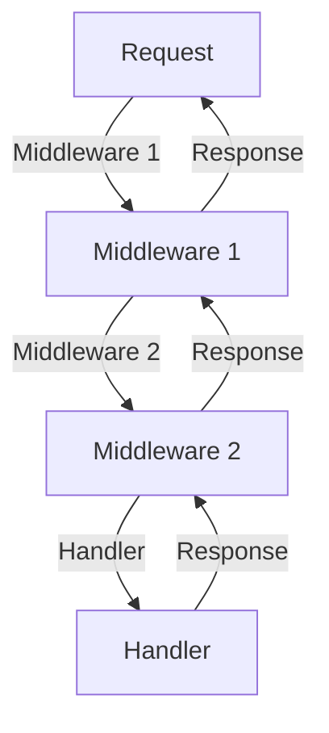
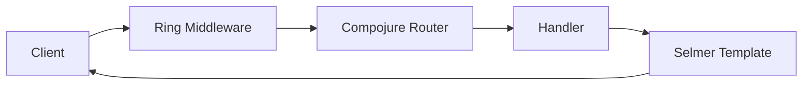

## 22.3 Web Development with `Ring` and `Compojure`

In the realm of Clojure web development, `Ring` and `Compojure` stand out as pivotal tools that allow developers to build robust, scalable web applications. This section will guide you through understanding these tools, their concepts, and how to effectively use them to create web applications. We'll also touch on templating engines like `Selmer` to generate dynamic HTML content. Let's dive in and explore the world of Clojure web development.

### Understanding `Ring`

`Ring` is the cornerstone of web application development in Clojure. It provides a simple yet powerful abstraction for handling HTTP requests and responses. At its core, `Ring` is influenced by the Rack interface from Ruby, which focuses on a simple, unified way of handling web requests.

#### The `Ring` Abstraction

In `Ring`, a web application is essentially a function that takes a request map and returns a response map. This simplicity allows for great flexibility and composability.

Here's a basic example of a `Ring` handler:

```clojure
(defn handler [request]
  {:status 200
   :headers {"Content-Type" "text/html"}
   :body "Hello, World!"})
```

- **Request Map**: Contains information about the HTTP request, such as `:uri`, `:method`, and `:headers`.
- **Response Map**: Defines the HTTP response, including `:status`, `:headers`, and `:body`.

#### Middleware Concept

Middleware in `Ring` is a function that takes a handler and returns a new handler. Middleware can be used to add common functionality like logging, session management, or authentication.

Here's an example of a simple logging middleware:

```clojure
(defn wrap-logger [handler]
  (fn [request]
    (println "Request received:" request)
    (handler request)))
```

This middleware logs each request before passing it to the original handler. Middleware functions can be composed to build a stack of processing layers around your handler.

**Visualizing Middleware Flow**



*Figure 1: Middleware flow in a `Ring` application*

### Routing with `Compojure`

While `Ring` provides the foundation, `Compojure` adds a layer of elegance with its routing capabilities. `Compojure` allows you to define routes and handle HTTP requests in a declarative and concise manner.

#### Defining Routes

In `Compojure`, routes are defined using macros that match HTTP methods and URIs to handler functions.

Here's a simple example:

```clojure
(require '[compojure.core :refer :all])

(defroutes app-routes
  (GET "/" [] "Welcome to my website!")
  (GET "/about" [] "About Us")
  (POST "/submit" req (str "Submitted: " (:body req))))
```

- **GET, POST, etc.**: Macros that define routes for different HTTP methods.
- **Handler Functions**: Functions that process the request and generate a response.

#### Composing Routes

Routes can be composed using the `routes` macro, allowing you to build complex routing structures.

```clojure
(defroutes main-routes
  (GET "/" [] "Home Page")
  (context "/api" []
    (GET "/users" [] "User List")
    (POST "/users" [] "Create User")))
```

### Templates and Templating

For generating dynamic HTML content, integrating a templating engine is essential. `Selmer` is a popular choice in the Clojure ecosystem for this purpose.

#### Integrating `Selmer`

`Selmer` is a templating engine inspired by Django's templating system. It allows you to separate HTML structure from your Clojure code.

Here's how you can use `Selmer`:

1. **Add Dependency**: First, add `Selmer` to your `project.clj`.

```clojure
:dependencies [[selmer "1.12.31"]]
```

2. **Create a Template**: Create an HTML file with placeholders.

```html
<!-- resources/templates/welcome.html -->
<html>
  <body>
    <h1>Welcome, {{name}}!</h1>
  </body>
</html>
```

3. **Render the Template**: Use `Selmer` to render the template with data.

```clojure
(require '[selmer.parser :as parser])

(defn welcome-page [name]
  (parser/render-file "templates/welcome.html" {:name name}))
```

### Sample Web Application

Let's build a simple web application using `Ring`, `Compojure`, and `Selmer`.

#### Project Setup

Start by creating a new Clojure project:

```bash
lein new app my-web-app
```

Add the necessary dependencies to your `project.clj`:

```clojure
:dependencies [[org.clojure/clojure "1.10.3"]
               [ring/ring-core "1.9.0"]
               [ring/ring-jetty-adapter "1.9.0"]
               [compojure "1.6.2"]
               [selmer "1.12.31"]]
```

#### Creating the Handler

Create a handler that uses `Compojure` for routing and `Selmer` for templating:

```clojure
(ns my-web-app.core
  (:require [compojure.core :refer :all]
            [compojure.route :as route]
            [ring.adapter.jetty :refer [run-jetty]]
            [selmer.parser :as parser]))

(defn home-page [request]
  (parser/render-file "templates/home.html" {:title "Home"}))

(defroutes app-routes
  (GET "/" [] home-page)
  (route/not-found "Page not found"))

(def app
  (wrap-logger app-routes))
```

#### Running the Application

Start the Jetty server to run your application:

```clojure
(defn -main []
  (run-jetty app {:port 3000 :join? false}))
```

Now, navigate to `http://localhost:3000` to see your web application in action.

### Try It Yourself

To enhance your understanding, try the following modifications:

- Add a new route that displays a list of items.
- Implement a form submission using a POST route.
- Integrate session management using Ring middleware.

### Visual Aids

**Architecture Diagram**



*Figure 2: Architecture of a Clojure web application using `Ring` and `Compojure`*

### References and Links

- [Ring GitHub Repository](https://github.com/ring-clojure/ring)
- [Compojure GitHub Repository](https://github.com/weavejester/compojure)
- [Selmer GitHub Repository](https://github.com/yogthos/Selmer)
- [Clojure Official Documentation](https://clojure.org/reference)
- [Clojure Community Resources](https://clojure.org/community/resources)

### Knowledge Check

1. What is the primary abstraction that `Ring` provides for web applications in Clojure?
2. How does middleware enhance the functionality of a `Ring` application?
3. Describe how `Compojure` simplifies routing in Clojure web applications.
4. What role does `Selmer` play in a Clojure web application?
5. How can you integrate session management into a `Ring` application?

### Summary

In this section, we've explored the foundational tools for web development in Clojure: `Ring` and `Compojure`. We've seen how `Ring` provides a simple abstraction for handling HTTP requests and responses, and how `Compojure` adds elegant routing capabilities. We've also integrated `Selmer` for templating, enabling us to generate dynamic HTML content. By building a simple web application, we've demonstrated how these tools work together to create scalable web applications. As you continue your journey in Clojure web development, remember to experiment with these tools and explore their extensive capabilities.

## **Test Your Knowledge: Web Development with `Ring` and `Compojure` Quiz**



### What is the primary abstraction that `Ring` provides for web applications in Clojure?

- [x] A function that takes a request map and returns a response map.
- [ ] A class that handles HTTP requests.
- [ ] An object-oriented interface for web applications.
- [ ] A database connection pool.

> **Explanation:** `Ring` abstracts web applications as functions that process request maps and return response maps, promoting functional programming principles.

### How does middleware enhance the functionality of a `Ring` application?

- [x] By wrapping handlers to add additional processing layers.
- [ ] By directly modifying the core handler code.
- [ ] By providing a graphical user interface.
- [ ] By managing database connections.

> **Explanation:** Middleware functions wrap handlers, allowing developers to add functionality such as logging or authentication without altering the core handler logic.

### Describe how `Compojure` simplifies routing in Clojure web applications.

- [x] By using macros to define routes for HTTP methods and URIs.
- [ ] By using XML configuration files for routes.
- [ ] By automatically generating routes from database schemas.
- [ ] By using Java annotations for route definitions.

> **Explanation:** `Compojure` uses macros to declaratively define routes, making it easier to manage HTTP request handling in a concise manner.

### What role does `Selmer` play in a Clojure web application?

- [x] It is a templating engine for generating dynamic HTML content.
- [ ] It is a database ORM for Clojure.
- [ ] It is a concurrency library for managing threads.
- [ ] It is a logging framework for Clojure applications.

> **Explanation:** `Selmer` is a templating engine that allows developers to separate HTML structure from Clojure code, facilitating dynamic content generation.

### How can you integrate session management into a `Ring` application?

- [x] By using middleware that handles session data.
- [ ] By creating a custom session handler class.
- [ ] By embedding session data in HTML templates.
- [ ] By using Java's built-in session management.

> **Explanation:** Session management in `Ring` is typically handled through middleware, which manages session data transparently.

### Which of the following best describes the `Ring` middleware flow?

- [x] Middleware wraps handlers to process requests and responses in a layered manner.
- [ ] Middleware is a separate application that handles all HTTP requests.
- [ ] Middleware is only used for error handling.
- [ ] Middleware directly modifies the HTTP request object.

> **Explanation:** Middleware wraps handlers, allowing requests and responses to be processed through a series of layers, each adding or modifying functionality.

### What is the purpose of the `GET` macro in `Compojure`?

- [x] To define a route that handles HTTP GET requests.
- [ ] To retrieve data from a database.
- [ ] To generate HTML templates.
- [ ] To manage user sessions.

> **Explanation:** The `GET` macro in `Compojure` is used to define routes that handle HTTP GET requests, simplifying route management.

### How does `Selmer` handle data insertion into HTML templates?

- [x] By using placeholders that are replaced with data at runtime.
- [ ] By embedding data directly in HTML files.
- [ ] By using JavaScript to manipulate the DOM.
- [ ] By storing data in cookies.

> **Explanation:** `Selmer` uses placeholders in HTML templates, which are replaced with actual data at runtime, allowing for dynamic content rendering.

### What is a key benefit of using `Compojure` for routing?

- [x] It allows for declarative and concise route definitions.
- [ ] It automatically scales applications across multiple servers.
- [ ] It provides a graphical interface for route management.
- [ ] It integrates directly with SQL databases.

> **Explanation:** `Compojure` allows developers to define routes declaratively, making the code more concise and easier to manage.

### True or False: `Ring` and `Compojure` are only suitable for small-scale applications.

- [ ] True
- [x] False

> **Explanation:** `Ring` and `Compojure` are highly scalable and can be used to build both small and large-scale applications, thanks to their flexibility and composability.




