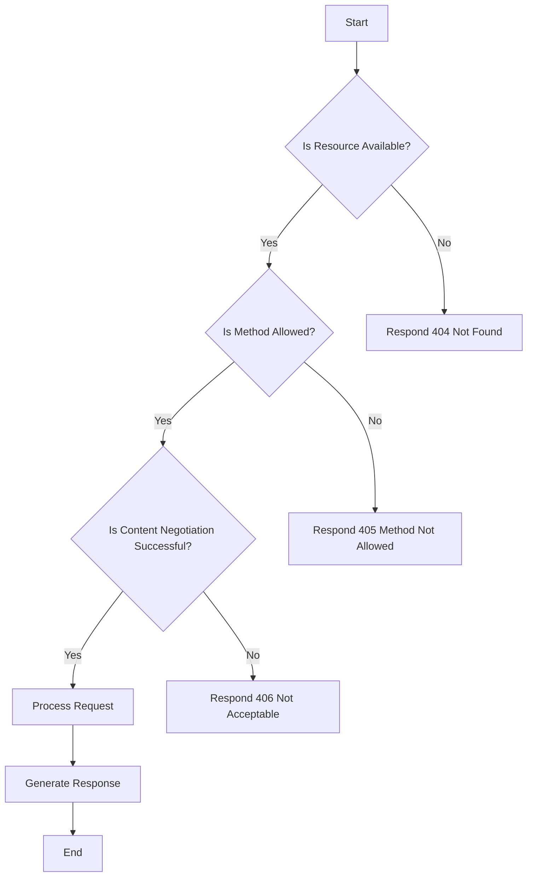

## 22.5 Building RESTful APIs with `Liberator`

In this section, we will explore how to build RESTful APIs using the `Liberator` library in Clojure. We'll review the fundamental principles of REST, introduce the `Liberator` library, and demonstrate how to create declarative resources, handle content negotiation, manage errors, and implement a sample API endpoint.

### REST Fundamentals

Before diving into `Liberator`, it's essential to understand the core principles that define RESTful services. REST, or Representational State Transfer, is an architectural style that uses a stateless, client-server communication model. Here are some key constraints of REST:

- **Client-Server Architecture**: The client and server are separate entities, allowing them to evolve independently.
- **Statelessness**: Each request from a client must contain all the information needed to understand and process the request.
- **Cacheability**: Responses must be defined as cacheable or non-cacheable to improve performance.
- **Layered System**: The architecture can be composed of multiple layers, each with specific responsibilities.
- **Uniform Interface**: This constraint defines a standardized way for the client and server to communicate, including resource identification, manipulation through representations, self-descriptive messages, and hypermedia as the engine of application state (HATEOAS).

### `Liberator` Overview

[Liberator](https://clojure-liberator.github.io/liberator/) is a Clojure library designed to simplify the creation of RESTful APIs by focusing on resource semantics rather than request handling. It allows developers to define resources declaratively, using a decision graph to manage the lifecycle of HTTP requests and responses.

Liberator is built on top of [Ring](https://github.com/ring-clojure/ring), a Clojure web application library, and provides a higher-level abstraction for building RESTful services. By leveraging Liberator, developers can focus on the business logic of their resources, while the library handles the complexities of HTTP compliance.

### Declarative Resources

One of the key features of Liberator is its use of a decision graph to process requests. This graph represents the various states and transitions that a resource can go through, based on the HTTP method and request parameters. By defining resources declaratively, developers can specify the behavior of their APIs in a clear and concise manner.

#### Example: Defining a Resource

Let's define a simple resource using Liberator. We'll create a resource that handles GET requests to retrieve information about a specific item.

```clojure
(ns my-api.core
  (:require [liberator.core :refer [resource defresource]]
            [ring.adapter.jetty :refer [run-jetty]]))

(defresource item-resource
  :available-media-types ["application/json"]
  :handle-ok (fn [ctx]
               {:id 1
                :name "Sample Item"
                :description "This is a sample item."}))

(defn start-server []
  (run-jetty (resource item-resource) {:port 8080}))
```

In this example, we define a resource called `item-resource` that responds to GET requests with a JSON representation of an item. The `:handle-ok` function specifies the response content when the request is successful.

### Content Negotiation

Content negotiation is a crucial aspect of RESTful services, allowing clients to specify the desired format of the response. Liberator provides built-in support for content negotiation, enabling developers to handle different media types seamlessly.

#### Example: Handling Multiple Media Types

Let's extend our previous example to support both JSON and XML responses.

```clojure
(defresource item-resource
  :available-media-types ["application/json" "application/xml"]
  :handle-ok (fn [ctx]
               (let [item {:id 1
                           :name "Sample Item"
                           :description "This is a sample item."}]
                 (case (get-in ctx [:representation :media-type])
                   "application/json" item
                   "application/xml" (str "<item><id>1</id><name>Sample Item</name><description>This is a sample item.</description></item>")))))
```

In this example, we use the `:available-media-types` key to specify the supported formats. The `:handle-ok` function checks the requested media type and returns the appropriate representation.

### Error Handling and Responses

Liberator simplifies error handling by providing a structured way to define responses for various error conditions. Developers can specify custom responses for different HTTP status codes, ensuring that clients receive meaningful feedback.

#### Example: Handling Not Found Errors

Let's modify our resource to handle cases where the requested item is not found.

```clojure
(defresource item-resource
  :available-media-types ["application/json"]
  :exists? (fn [ctx]
             (let [item (get-item-by-id (get-in ctx [:request :params :id]))]
               [item {:item item}]))
  :handle-ok (fn [ctx]
               (:item ctx))
  :handle-not-found (fn [ctx]
                      {:error "Item not found"}))
```

In this example, we use the `:exists?` key to check if the item exists. If the item is found, it is added to the context. Otherwise, the `:handle-not-found` function returns an error message.

### API Implementation Example

Let's build a complete RESTful API endpoint using Liberator, demonstrating key features such as declarative resources, content negotiation, and error handling.

#### Example: A Simple API for Managing Items

We'll create a simple API that allows clients to create, retrieve, update, and delete items.

```clojure
(def items (atom {}))

(defresource item-resource
  :available-media-types ["application/json"]
  :allowed-methods [:get :post :put :delete]
  :exists? (fn [ctx]
             (let [id (get-in ctx [:request :params :id])
                   item (get @items id)]
               [item {:item item}]))
  :handle-ok (fn [ctx]
               (:item ctx))
  :post! (fn [ctx]
           (let [id (str (count @items))
                 item (assoc (get-in ctx [:request :json-params]) :id id)]
             (swap! items assoc id item)
             {:status 201 :item item}))
  :put! (fn [ctx]
          (let [id (get-in ctx [:request :params :id])
                item (assoc (get-in ctx [:request :json-params]) :id id)]
            (swap! items assoc id item)
            {:status 200 :item item}))
  :delete! (fn [ctx]
             (let [id (get-in ctx [:request :params :id])]
               (swap! items dissoc id)
               {:status 204}))
  :handle-not-found (fn [ctx]
                      {:error "Item not found"}))

(defn start-server []
  (run-jetty (resource item-resource) {:port 8080}))
```

In this example, we define a resource that supports CRUD operations. We use an atom to store items in memory and define handlers for each HTTP method. The `:post!`, `:put!`, and `:delete!` keys specify the actions to take for POST, PUT, and DELETE requests, respectively.

### Visualizing the Decision Graph

To better understand how Liberator processes requests, let's visualize the decision graph used to manage resource states.



**Figure 1:** Decision graph for processing requests in Liberator.

This diagram illustrates the decision-making process in Liberator, from checking resource availability to generating the final response.

### Try It Yourself

To deepen your understanding of Liberator, try modifying the example code:

- Add support for additional media types, such as YAML.
- Implement pagination for retrieving items.
- Enhance error handling to cover more HTTP status codes.

### References and Further Reading

- [Liberator Documentation](https://clojure-liberator.github.io/liberator/)
- [Ring Documentation](https://github.com/ring-clojure/ring)
- [Clojure Official Documentation](https://clojure.org/reference)
- [RESTful Web Services: The Basics](https://restfulapi.net/)

### Knowledge Check

To reinforce your understanding of building RESTful APIs with Liberator, let's review some key concepts:

- REST principles and constraints
- Declarative resource definitions
- Content negotiation and media types
- Error handling and HTTP responses

## **Test Your Knowledge: Building RESTful APIs with `Liberator` Quiz**



### What is the primary focus of the Liberator library in Clojure?

- [x] Resource semantics
- [ ] Request handling
- [ ] Database interactions
- [ ] UI rendering

> **Explanation:** Liberator focuses on resource semantics, allowing developers to define resources declaratively and manage HTTP requests and responses.

### Which of the following is a key constraint of RESTful services?

- [x] Statelessness
- [ ] Stateful interactions
- [ ] Tight coupling
- [ ] Monolithic architecture

> **Explanation:** RESTful services are stateless, meaning each request must contain all the information needed for processing.

### How does Liberator handle content negotiation?

- [x] By specifying available media types
- [ ] By using Java interfaces
- [ ] By hardcoding response formats
- [ ] By ignoring client preferences

> **Explanation:** Liberator handles content negotiation by allowing developers to specify available media types for resources.

### What is the purpose of the `:exists?` key in Liberator?

- [x] To check if a resource exists
- [ ] To define the HTTP method
- [ ] To specify the response format
- [ ] To handle database connections

> **Explanation:** The `:exists?` key is used to determine if a resource exists and should be included in the response.

### Which HTTP methods are supported by the example API for managing items?

- [x] GET
- [x] POST
- [x] PUT
- [x] DELETE

> **Explanation:** The example API supports GET, POST, PUT, and DELETE methods for managing items.

### How does Liberator simplify error handling?

- [x] By providing structured response definitions
- [ ] By using Java exceptions
- [ ] By ignoring errors
- [ ] By logging errors only

> **Explanation:** Liberator simplifies error handling by allowing developers to define structured responses for various error conditions.

### What is the role of the decision graph in Liberator?

- [x] To manage resource states and transitions
- [ ] To define database schemas
- [ ] To render UI components
- [ ] To handle user authentication

> **Explanation:** The decision graph in Liberator manages resource states and transitions based on HTTP methods and request parameters.

### What is the purpose of the `:handle-ok` function in a Liberator resource?

- [x] To specify the response content for successful requests
- [ ] To handle errors
- [ ] To define the HTTP method
- [ ] To manage database transactions

> **Explanation:** The `:handle-ok` function specifies the response content when a request is successful.

### Which library does Liberator build on top of?

- [x] Ring
- [ ] Compojure
- [ ] Reagent
- [ ] Leiningen

> **Explanation:** Liberator is built on top of the Ring library, which provides a foundation for web applications in Clojure.

### True or False: Liberator requires developers to manually handle HTTP compliance.

- [ ] True
- [x] False

> **Explanation:** False. Liberator handles HTTP compliance, allowing developers to focus on resource semantics and business logic.



By mastering Liberator, you can build robust, compliant RESTful APIs in Clojure, leveraging the power of functional programming and resource-oriented design. As you continue your journey, explore more advanced features and integrate Liberator with other Clojure libraries to create scalable, maintainable applications.
