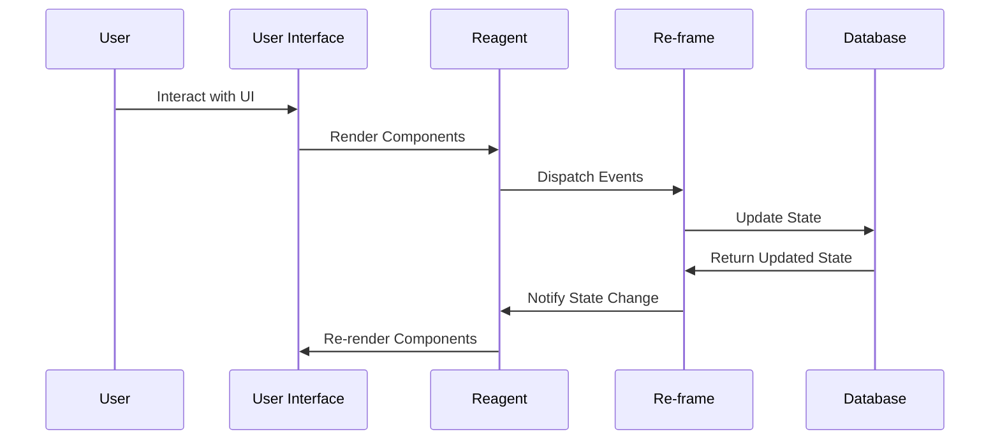

## 22.6 Frontend Development with `Reagent` and `Re-frame`

### Single-Page Applications (SPAs)

In recent years, Single-Page Applications (SPAs) have revolutionized the way we build web applications. Unlike traditional multi-page applications, SPAs load a single HTML page and dynamically update the content as the user interacts with the app. This approach provides a more fluid user experience, resembling that of desktop applications. 

ClojureScript, a variant of Clojure that compiles to JavaScript, offers a compelling approach to building SPAs. By leveraging functional programming principles, ClojureScript enables developers to create robust, maintainable, and scalable frontend applications. Two key libraries in the ClojureScript ecosystem that facilitate SPA development are `Reagent` and `Re-frame`.

### `Reagent` Basics

`Reagent` is a minimalistic interface to React, designed to take advantage of ClojureScript's functional programming capabilities. It allows developers to create React components using ClojureScript data structures and functions, providing a seamless bridge between the two paradigms.

#### Getting Started with Reagent

To begin using `Reagent`, you need to set up a ClojureScript project. Here's a simple example to get you started:

```clojure
(ns my-app.core
  (:require [reagent.core :as reagent]))

(defn hello-world []
  [:div
   [:h1 "Hello, World!"]])

(defn mount-root []
  (reagent/render [hello-world]
                  (.getElementById js/document "app")))

(defn init []
  (mount-root))
```

In this example, we define a simple component `hello-world` that renders a "Hello, World!" message. The `mount-root` function renders this component into a DOM element with the ID "app". The `init` function is called to kickstart the application.

#### Component Lifecycle

`Reagent` components are defined as functions returning hiccup-style data structures, which are then converted to React elements. This approach allows for a functional and declarative style of programming. Components can manage their local state using `reagent/atom`, a reactive atom that triggers re-renders when its state changes.

```clojure
(defn counter []
  (let [count (reagent/atom 0)]
    (fn []
      [:div
       [:p "Current count: " @count]
       [:button {:on-click #(swap! count inc)} "Increment"]])))
```

In this counter component, we use a `reagent/atom` to hold the state of the count. The `swap!` function updates the atom's value, automatically re-rendering the component.

### State Management with `Re-frame`

While `Reagent` provides a straightforward way to create components, managing state in complex applications can become challenging. This is where `Re-frame` comes into play. `Re-frame` is a pattern for managing state and side effects in ClojureScript applications, inspired by the Flux architecture. It emphasizes unidirectional data flow, making it easier to reason about state changes.

#### Core Concepts of `Re-frame`

- **Event**: A description of something that has happened, typically a vector where the first element is a keyword identifying the event.
- **Event Handler**: A function that processes events and updates the application state.
- **Subscription**: A way to query the application state, providing a reactive view of the data.
- **Effect**: A description of an action that should be taken as a result of an event, such as an HTTP request or a database update.

#### Setting Up `Re-frame`

To use `Re-frame`, you'll need to set up a project with the necessary dependencies. Here's a simple example:

```clojure
(ns my-app.core
  (:require [re-frame.core :as re-frame]))

;; Define an event handler
(re-frame/reg-event-db
 :initialize
 (fn [_ _]
   {:count 0}))

;; Define a subscription
(re-frame/reg-sub
 :count
 (fn [db _]
   (:count db)))

;; Define an event to increment the count
(re-frame/reg-event-db
 :increment
 (fn [db _]
   (update db :count inc)))

;; Define a view component
(defn counter []
  (let [count (re-frame/subscribe [:count])]
    (fn []
      [:div
       [:p "Current count: " @count]
       [:button {:on-click #(re-frame/dispatch [:increment])} "Increment"]])))

;; Initialize the app
(defn init []
  (re-frame/dispatch-sync [:initialize]))
```

In this example, we define an event handler `:initialize` to set the initial state, a subscription `:count` to access the count value, and an event `:increment` to update the count. The `counter` component subscribes to the count and dispatches the `:increment` event when the button is clicked.

### Side Effects Handling

Managing side effects is a critical aspect of building robust applications. `Re-frame` provides a structured way to handle side effects through events and effects handlers. This separation of concerns makes it easier to test and maintain your code.

#### Effects and Co-effects

- **Effect**: Represents an action that should be performed as a result of an event, such as an HTTP request or a DOM update.
- **Co-effect**: Represents the state of the world at the time an event handler is invoked, such as the current application state or the current time.

Here's an example of handling a side effect with `Re-frame`:

```clojure
(re-frame/reg-fx
 :http-get
 (fn [{:keys [url on-success]}]
   (js/fetch url
             (clj->js {:method "GET"})
             (.then (fn [response]
                      (-> response
                          (.json)
                          (.then #(re-frame/dispatch [on-success %]))))))))

(re-frame/reg-event-fx
 :fetch-data
 (fn [_ _]
   {:http-get {:url "/api/data"
               :on-success :data-received}}))

(re-frame/reg-event-db
 :data-received
 (fn [db [_ data]]
   (assoc db :data data)))
```

In this example, we define an effect handler `:http-get` to perform an HTTP GET request. The `:fetch-data` event triggers this effect, and the `:data-received` event updates the application state with the fetched data.

### Developing a SPA

To illustrate the power of `Reagent` and `Re-frame`, let's build a simple task manager application. This example will demonstrate how to structure a SPA using these libraries.

#### Project Setup

First, create a new ClojureScript project and add the necessary dependencies for `Reagent` and `Re-frame`. You can use tools like Leiningen or deps.edn to manage your project.

#### Defining the Application State

Define the initial state of the application, which includes a list of tasks:

```clojure
(re-frame/reg-event-db
 :initialize
 (fn [_ _]
   {:tasks []}))
```

#### Creating Components

Define components for displaying tasks and adding new tasks:

```clojure
(defn task-list []
  (let [tasks (re-frame/subscribe [:tasks])]
    (fn []
      [:ul
       (for [task @tasks]
         ^{:key task} [:li task])])))

(defn add-task []
  (let [new-task (reagent/atom "")]
    (fn []
      [:div
       [:input {:type "text"
                :value @new-task
                :on-change #(reset! new-task (-> % .-target .-value))}]
       [:button {:on-click #(do
                              (re-frame/dispatch [:add-task @new-task])
                              (reset! new-task ""))} "Add Task"]])))
```

#### Managing State with Events

Define events to manage the application state:

```clojure
(re-frame/reg-event-db
 :add-task
 (fn [db [_ task]]
   (update db :tasks conj task)))

(re-frame/reg-sub
 :tasks
 (fn [db _]
   (:tasks db)))
```

#### Building the Application

Combine the components to build the application:

```clojure
(defn app []
  [:div
   [task-list]
   [add-task]])

(defn init []
  (re-frame/dispatch-sync [:initialize])
  (reagent/render [app]
                  (.getElementById js/document "app")))
```

### Try It Yourself

To experiment with this example, try adding additional features such as task removal or task completion. You can also explore integrating third-party libraries for additional functionality.

### Visual Aids



**Diagram Description**: This sequence diagram illustrates the flow of data and interactions in a Reagent and Re-frame application. It shows how user interactions trigger events, update the application state, and cause components to re-render.

### References and Links

- [Clojure Official Documentation](https://clojure.org/reference)
- [Reagent Project](https://reagent-project.github.io/)
- [Re-frame GitHub Repository](https://github.com/day8/re-frame)
- [Transitioning from OOP to Functional Programming](https://www.lispcast.com/oo-to-fp/)

### Knowledge Check

To reinforce your understanding of `Reagent` and `Re-frame`, consider the following questions:

1. What are the key differences between `Reagent` and `Re-frame`?
2. How does `Re-frame` manage side effects in a ClojureScript application?
3. What is the role of subscriptions in `Re-frame`?
4. How can you handle asynchronous operations in a `Re-frame` application?

### Encouraging Engagement

Embracing functional programming in frontend development can be challenging, but with each step, you'll gain a deeper understanding and see tangible benefits in your codebase. Experiment with the examples provided, and don't hesitate to explore the extensive documentation and community resources available.

### Best Practices for Tags

- Use specific and relevant tags such as "Clojure", "Reagent", "Re-frame", "ClojureScript", "Frontend Development", "Single-Page Applications", "Functional Programming", "State Management".

### Test Your Knowledge: Frontend Development with `Reagent` and `Re-frame` Quiz



### Which library provides a minimalistic interface to React in ClojureScript?

- [x] Reagent
- [ ] Re-frame
- [ ] Redux
- [ ] Angular

> **Explanation:** Reagent is a minimalistic interface to React, designed to leverage ClojureScript's functional programming capabilities.

### What is the primary purpose of `Re-frame`?

- [x] State management
- [ ] UI rendering
- [ ] Data storage
- [ ] Network communication

> **Explanation:** Re-frame is primarily used for managing state and side effects in ClojureScript applications.

### How does `Re-frame` handle side effects?

- [x] Through events and effects handlers
- [ ] Directly in components
- [ ] Using global variables
- [ ] With inline JavaScript

> **Explanation:** Re-frame manages side effects through a structured approach using events and effects handlers.

### What is a subscription in `Re-frame`?

- [x] A way to query the application state
- [ ] A method to dispatch events
- [ ] A component lifecycle hook
- [ ] A data storage mechanism

> **Explanation:** Subscriptions in Re-frame provide a reactive way to query the application state.

### Which of the following is a key feature of `Reagent` components?

- [x] Functional and declarative style
- [ ] Object-oriented hierarchy
- [x] Hiccup-style data structures
- [ ] Direct DOM manipulation

> **Explanation:** Reagent components are defined using a functional and declarative style with hiccup-style data structures.

### What is the role of `reagent/atom` in `Reagent`?

- [x] Manage local component state
- [ ] Store global application state
- [ ] Handle side effects
- [ ] Perform network requests

> **Explanation:** Reagent/atom is used to manage local component state in Reagent.

### How can you initialize the application state in `Re-frame`?

- [x] Using an event handler
- [ ] Directly in the component
- [x] With a subscription
- [ ] Through a global variable

> **Explanation:** Application state in Re-frame is typically initialized using an event handler and accessed via subscriptions.

### What is the benefit of unidirectional data flow in `Re-frame`?

- [x] Easier to reason about state changes
- [ ] Faster UI rendering
- [ ] Simplified component structure
- [ ] Direct DOM updates

> **Explanation:** Unidirectional data flow makes it easier to reason about state changes and maintain the application.

### True or False: `Re-frame` is inspired by the Flux architecture.

- [x] True
- [ ] False

> **Explanation:** Re-frame is inspired by the Flux architecture, emphasizing unidirectional data flow.

### Which function is used to render a `Reagent` component into the DOM?

- [x] reagent/render
- [ ] re-frame/render
- [ ] react/render
- [ ] dom/render

> **Explanation:** The reagent/render function is used to render Reagent components into the DOM.


