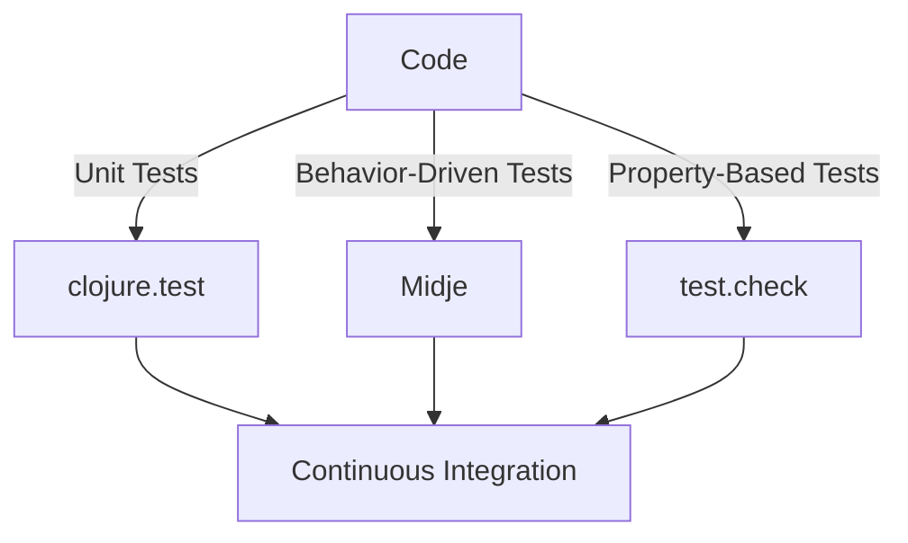

## 22.7 Testing Tools and Libraries

Testing is a cornerstone of software development, ensuring that code is reliable, maintainable, and performs as expected. In the realm of functional programming with Clojure, testing takes on a unique flavor, leveraging the language's strengths in immutability and pure functions. This section delves into the essential testing tools and libraries available in the Clojure ecosystem, guiding you through writing effective tests and integrating them into your development workflow.

### Testing Overview

Before we dive into specific tools, let's emphasize the role of testing in software development. Testing not only verifies the correctness of your code but also serves as documentation and a safety net for future changes. In Clojure, the emphasis on immutability and pure functions simplifies testing, as functions can be tested in isolation without worrying about hidden state changes.

### `clojure.test`: The Built-in Testing Framework

Clojure comes with a built-in testing framework, `clojure.test`, which provides a straightforward way to write and run unit tests. It is part of the core library and is the go-to choice for many Clojure developers.

#### Writing Unit Tests with `clojure.test`

To get started with `clojure.test`, you need to require it in your namespace:

```clojure
(ns myapp.core-test
  (:require [clojure.test :refer :all]
            [myapp.core :refer :all])) ; Assume myapp.core is the namespace containing the code to test

(deftest addition-test
  (testing "Addition of two numbers"
    (is (= 4 (add 2 2)))
    (is (= 0 (add -2 2)))))
```

In this example, we define a namespace for our tests and use `deftest` to create a test function. Inside `deftest`, we use `testing` to describe the purpose of the test and `is` to assert that the expected and actual values are equal.

#### Running Tests

You can run your tests using the REPL or command line. In the REPL, simply load your test namespace and call `(run-tests)`. From the command line, you can use Leiningen with the command `lein test`.

```shell
lein test
```

This command will execute all tests defined in your project and report the results.

### Behavior-Driven Development with Midje

While `clojure.test` is powerful, some developers prefer a more behavior-driven approach to testing. [Midje](https://github.com/marick/Midje) is a popular library that supports this style, allowing you to write tests that resemble specifications.

#### Writing Tests with Midje

Midje uses facts to define tests, which are more descriptive and readable:

```clojure
(ns myapp.core-test
  (:require [midje.sweet :refer :all]
            [myapp.core :refer :all]))

(fact "Adding two numbers should return their sum"
  (add 2 2) => 4
  (add -2 2) => 0)
```

In this example, `fact` is used to specify the expected behavior of the `add` function. The `=>` operator is used to assert that the expression on the left evaluates to the value on the right.

#### Running Midje Tests

To run Midje tests, you can use Leiningen with the Midje plugin:

```shell
lein midje
```

This command will execute your Midje tests and provide feedback on their success or failure.

### Property-Based Testing with `test.check`

Property-based testing is a powerful technique that focuses on the properties of your code rather than specific inputs and outputs. [test.check](https://github.com/clojure/test.check) is a library that facilitates this type of testing in Clojure.

#### Implementing Property-Based Tests

With `test.check`, you define properties that your code should satisfy and let the library generate random test cases to verify these properties.

```clojure
(ns myapp.core-test
  (:require [clojure.test :refer :all]
            [clojure.test.check :as tc]
            [clojure.test.check.generators :as gen]
            [clojure.test.check.properties :as prop]))

(def add-commutative
  (prop/for-all [a gen/int
                 b gen/int]
    (= (add a b) (add b a))))

(tc/quick-check 100 add-commutative)
```

In this example, we define a property `add-commutative` that asserts the commutative property of addition. `prop/for-all` is used to specify the property, and `gen/int` generates random integers for testing.

#### Running Property-Based Tests

You can run property-based tests using the `quick-check` function, which executes the property with a specified number of random inputs.

### Mocking and Stubbing

In some cases, you need to isolate the code under test from its dependencies. Mocking and stubbing are techniques used to replace real dependencies with controlled substitutes.

#### Techniques for Mocking

Clojure's dynamic nature allows for easy mocking using functions or libraries like `with-redefs`:

```clojure
(ns myapp.core-test
  (:require [clojure.test :refer :all]
            [myapp.core :refer :all]))

(deftest fetch-data-test
  (with-redefs [fetch-data (fn [_] {:status 200 :body "Mocked response"})]
    (is (= {:status 200 :body "Mocked response"} (fetch-data "http://example.com")))))
```

In this example, `with-redefs` temporarily redefines `fetch-data` to return a mock response, allowing us to test the behavior of code that depends on this function.

### Continuous Testing

Integrating testing into your continuous integration (CI) pipeline ensures that tests are run automatically whenever code changes are made. This practice helps catch errors early and maintain high code quality.

#### Setting Up Continuous Testing

To set up continuous testing, configure your CI tool (e.g., Jenkins, Travis CI, GitHub Actions) to run your test suite as part of the build process. Here's a basic example using GitHub Actions:

```yaml
name: Clojure CI

on: [push, pull_request]

jobs:
  test:
    runs-on: ubuntu-latest
    steps:
    - uses: actions/checkout@v2
    - name: Set up JDK 11
      uses: actions/setup-java@v1
      with:
        java-version: '11'
    - name: Run tests
      run: lein test
```

This configuration runs your tests on every push and pull request, providing immediate feedback on code changes.

### Try It Yourself

To solidify your understanding, try modifying the code examples provided:

- Add new test cases to the `clojure.test` and Midje examples.
- Create a new property-based test with `test.check` for a different function.
- Experiment with `with-redefs` to mock other dependencies in your code.

### Visual Aids

To better understand the relationship between testing tools and their roles, consider the following diagram:



**Diagram Description:** This diagram illustrates how different testing tools interact with your code and integrate into a continuous integration pipeline.

### References and Links

- [Clojure Official Documentation](https://clojure.org/reference)
- [Midje GitHub Repository](https://github.com/marick/Midje)
- [test.check GitHub Repository](https://github.com/clojure/test.check)
- [Transitioning from OOP to Functional Programming](https://www.lispcast.com/oo-to-fp/)

### Knowledge Check

1. What are the benefits of using `clojure.test` for unit testing?
2. How does Midje differ from `clojure.test` in terms of test style?
3. What is the primary advantage of property-based testing?
4. How can you mock a function in Clojure during testing?
5. Why is continuous testing important in a CI/CD pipeline?

### Key Takeaways

- **Testing is crucial** for maintaining code quality and reliability in functional programming.
- **`clojure.test`** provides a simple yet powerful framework for unit testing.
- **Midje** offers a behavior-driven approach, making tests more readable and specification-like.
- **Property-based testing** with `test.check` helps uncover edge cases by testing properties rather than specific inputs.
- **Mocking and stubbing** are essential for isolating dependencies during testing.
- **Continuous testing** ensures that tests are run automatically, providing immediate feedback on code changes.

## **Test Your Knowledge: Testing Tools and Libraries Quiz**



### What is the primary purpose of `clojure.test` in Clojure?

- [x] To provide a built-in framework for writing and running unit tests.
- [ ] To enable property-based testing.
- [ ] To offer behavior-driven development features.
- [ ] To facilitate mocking and stubbing.

> **Explanation:** `clojure.test` is the built-in framework in Clojure for writing and running unit tests, ensuring code correctness.

### How does Midje enhance test readability compared to `clojure.test`?

- [x] By using facts and a more descriptive syntax.
- [ ] By generating random test cases automatically.
- [ ] By integrating directly with CI/CD pipelines.
- [ ] By providing built-in mocking capabilities.

> **Explanation:** Midje uses facts and a descriptive syntax that makes tests look like specifications, enhancing readability.

### What is a key benefit of property-based testing with `test.check`?

- [x] It helps uncover edge cases by testing properties rather than specific inputs.
- [ ] It simplifies the process of mocking dependencies.
- [ ] It integrates seamlessly with Midje.
- [ ] It provides a graphical interface for test results.

> **Explanation:** Property-based testing focuses on properties, allowing the discovery of edge cases through random input generation.

### Which function in Clojure allows you to temporarily redefine a function for testing purposes?

- [x] `with-redefs`
- [ ] `defmock`
- [ ] `mock-fn`
- [ ] `temp-redef`

> **Explanation:** `with-redefs` is used to temporarily redefine functions during testing to isolate dependencies.

### Why is continuous testing important in a CI/CD pipeline?

- [x] It ensures tests are run automatically, providing immediate feedback on code changes.
- [ ] It allows manual testing of code changes.
- [ ] It replaces the need for unit tests.
- [ ] It focuses solely on integration tests.

> **Explanation:** Continuous testing automates the testing process, ensuring immediate feedback and maintaining code quality.

### What is the role of `lein test` in a Clojure project?

- [x] To execute all tests defined in the project and report results.
- [ ] To compile the project for production.
- [ ] To generate random test cases.
- [ ] To deploy the application to the cloud.

> **Explanation:** `lein test` is used to run all tests in a Clojure project, providing feedback on their success or failure.

### How can you run Midje tests using Leiningen?

- [x] By using the command `lein midje`.
- [ ] By using the command `lein test`.
- [ ] By using the command `lein run`.
- [ ] By using the command `lein mock`.

> **Explanation:** `lein midje` is the command used to run Midje tests with Leiningen.

### What advantage does Midje offer over `clojure.test`?

- [x] It provides a behavior-driven development approach with more readable tests.
- [ ] It automatically generates test cases.
- [ ] It integrates with Java libraries.
- [ ] It offers built-in mocking capabilities.

> **Explanation:** Midje's behavior-driven development approach makes tests more readable and specification-like.

### What is the purpose of `quick-check` in `test.check`?

- [x] To execute property-based tests with random inputs.
- [ ] To define properties for testing.
- [ ] To mock dependencies.
- [ ] To run unit tests.

> **Explanation:** `quick-check` is used to execute property-based tests, generating random inputs to verify properties.

### True or False: Mocking is unnecessary in functional programming because functions are pure.

- [ ] True
- [x] False

> **Explanation:** While functions in functional programming are pure, mocking is still necessary to isolate dependencies, especially when dealing with external systems or side effects.


