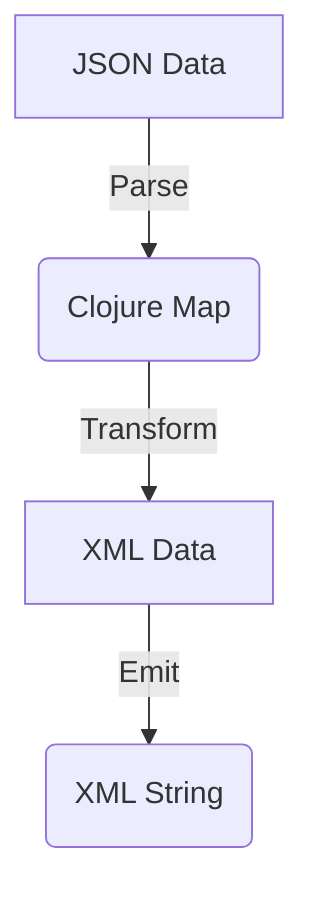

## 22.8 Leveraging JSON and XML Libraries

In today's interconnected world, JSON and XML are ubiquitous data interchange formats. As developers, we often need to parse, generate, and transform data in these formats. In this section, we will explore how to leverage Clojure's powerful libraries to handle JSON and XML data efficiently. We'll cover libraries like [Cheshire](https://github.com/dakrone/cheshire), [jsonista](https://github.com/metosin/jsonista), and [clojure.data.xml](https://github.com/clojure/data.xml), and demonstrate how to integrate these with APIs and manipulate nested data structures.

### Working with JSON

JSON (JavaScript Object Notation) is a lightweight data interchange format that's easy for humans to read and write, and easy for machines to parse and generate. In Clojure, we have several libraries to work with JSON, with Cheshire and jsonista being among the most popular.

#### Parsing JSON with Cheshire

Cheshire is a fast JSON library for Clojure that is built on top of the Jackson library. It provides a simple API for encoding and decoding JSON data.

**Installation**

To use Cheshire, add the following dependency to your `project.clj` or `deps.edn` file:

```clojure
;; Leiningen
[cheshire "5.10.0"]

;; deps.edn
{:deps {cheshire {:mvn/version "5.10.0"}}}
```

**Parsing JSON Strings**

Let's start by parsing a JSON string into a Clojure data structure:

```clojure
(require '[cheshire.core :as json])

(def json-str "{\"name\":\"Alice\",\"age\":30,\"city\":\"Wonderland\"}")

;; Parse JSON string into a Clojure map
(def parsed-data (json/parse-string json-str true))

;; Output the parsed data
(println parsed-data)
;; => {:name "Alice", :age 30, :city "Wonderland"}
```

In this example, `parse-string` is used to convert a JSON string into a Clojure map. The `true` argument specifies that keys should be converted to keywords.

#### Generating JSON with Cheshire

Generating JSON from Clojure data structures is equally straightforward:

```clojure
(def data {:name "Bob", :age 25, :city "Atlantis"})

;; Convert Clojure map to JSON string
(def json-output (json/generate-string data))

(println json-output)
;; => "{\"name\":\"Bob\",\"age\":25,\"city\":\"Atlantis\"}"
```

Cheshire provides a `generate-string` function to convert Clojure data structures into JSON strings.

#### Advanced JSON Parsing with jsonista

For more advanced JSON parsing and performance optimizations, you might consider using jsonista, which also builds on Jackson.

**Installation**

Add jsonista to your dependencies:

```clojure
;; Leiningen
[metosin/jsonista "0.3.5"]

;; deps.edn
{:deps {metosin/jsonista {:mvn/version "0.3.5"}}}
```

**Custom Deserialization**

jsonista allows for custom deserialization using Jackson's ObjectMapper:

```clojure
(require '[jsonista.core :as j])

(def mapper (j/object-mapper {:decode-key-fn keyword}))

(def json-str "{\"name\":\"Charlie\",\"age\":28,\"city\":\"Metropolis\"}")

;; Parse JSON with custom mapper
(def parsed-data (j/read-value json-str mapper))

(println parsed-data)
;; => {:name "Charlie", :age 28, :city "Metropolis"}
```

Here, we use `object-mapper` to create a custom mapper that automatically converts JSON keys to keywords.

### Handling XML

XML (eXtensible Markup Language) is another common format for data interchange. Clojure provides the `clojure.data.xml` library for parsing and emitting XML data.

#### Parsing XML with clojure.data.xml

**Installation**

Add `clojure.data.xml` to your dependencies:

```clojure
;; Leiningen
[org.clojure/data.xml "0.2.0-alpha6"]

;; deps.edn
{:deps {org.clojure/data.xml {:mvn/version "0.2.0-alpha6"}}}
```

**Parsing XML Strings**

Let's parse an XML string into a Clojure data structure:

```clojure
(require '[clojure.data.xml :as xml])

(def xml-str "<person><name>Alice</name><age>30</age><city>Wonderland</city></person>")

;; Parse XML string into a Clojure data structure
(def parsed-xml (xml/parse-str xml-str))

(println parsed-xml)
;; => #clojure.data.xml.Element{:tag :person, :attrs {}, :content ...}
```

The `parse-str` function converts an XML string into a nested Clojure data structure representing the XML elements.

#### Emitting XML

Generating XML from Clojure data structures is also supported:

```clojure
(def person-data (xml/element :person {}
                              [(xml/element :name {} "Bob")
                               (xml/element :age {} "25")
                               (xml/element :city {} "Atlantis")]))

;; Convert Clojure data structure to XML string
(def xml-output (xml/emit-str person-data))

(println xml-output)
;; => "<person><name>Bob</name><age>25</age><city>Atlantis</city></person>"
```

The `emit-str` function generates an XML string from a Clojure data structure.

### Data Transformation

Transforming data between JSON and XML, or manipulating nested data structures, is a common requirement in many applications. Clojure's functional programming paradigm makes these tasks straightforward.

#### Transforming JSON to XML

Let's transform a JSON data structure into XML:

```clojure
(def json-data {:name "Diana", :age 29, :city "Themyscira"})

;; Convert JSON data to XML
(def xml-data (xml/element :person {}
                           (map (fn [[k v]] (xml/element k {} (str v))) json-data)))

(def xml-output (xml/emit-str xml-data))

(println xml-output)
;; => "<person><name>Diana</name><age>29</age><city>Themyscira</city></person>"
```

In this example, we map over the JSON data and create XML elements for each key-value pair.

#### Manipulating Nested Data Structures

Clojure's immutable data structures and functional approach make it easy to manipulate nested data:

```clojure
(def nested-data {:person {:name "Eve", :details {:age 35, :city "Eden"}}})

;; Update nested data
(def updated-data (assoc-in nested-data [:person :details :age] 36))

(println updated-data)
;; => {:person {:name "Eve", :details {:age 36, :city "Eden"}}}
```

Here, `assoc-in` is used to update a nested value within a Clojure map.

### API Integration

When working with external APIs, JSON and XML are often the formats of choice for data exchange. Let's explore how to consume and produce JSON/XML when interacting with APIs.

#### Consuming JSON from an API

Suppose we have a web service that returns JSON data. We can use Clojure's `clj-http` library to fetch and parse this data.

**Installation**

Add `clj-http` to your dependencies:

```clojure
;; Leiningen
[clj-http "3.12.3"]

;; deps.edn
{:deps {clj-http {:mvn/version "3.12.3"}}}
```

**Fetching JSON Data**

```clojure
(require '[clj-http.client :as client])

(def response (client/get "https://api.example.com/data" {:as :json}))

(def data (:body response))

(println data)
;; => {:name "Frank", :age 40, :city "Gotham"}
```

In this example, `clj-http` is used to make a GET request, and the response is automatically parsed as JSON.

#### Producing JSON for an API

To send JSON data to an API, we can use `clj-http` to make a POST request:

```clojure
(def post-data {:name "Grace", :age 32, :city "Zion"})

(def response (client/post "https://api.example.com/submit"
                           {:body (json/generate-string post-data)
                            :headers {"Content-Type" "application/json"}}))

(println (:status response))
;; => 200
```

Here, we generate a JSON string from a Clojure map and send it as the body of a POST request.

#### Consuming XML from an API

Similarly, we can consume XML data from an API:

```clojure
(def response (client/get "https://api.example.com/xml-data" {:as :text}))

(def xml-data (xml/parse-str (:body response)))

(println xml-data)
;; => #clojure.data.xml.Element{:tag :data, :attrs {}, :content ...}
```

In this case, we fetch XML data as text and then parse it using `clojure.data.xml`.

### Examples

Let's consolidate our understanding with some practical examples.

#### Example: Reading JSON from a Web Service

```clojure
(require '[clj-http.client :as client]
         '[cheshire.core :as json])

(defn fetch-user-data [user-id]
  (let [url (str "https://api.example.com/users/" user-id)
        response (client/get url {:as :json})]
    (:body response)))

(def user-data (fetch-user-data 123))

(println user-data)
;; => {:id 123, :name "Hank", :email "hank@example.com"}
```

This function fetches user data from a web service and returns it as a Clojure map.

#### Example: Converting JSON to XML

```clojure
(defn json-to-xml [json-data]
  (xml/element :root {}
               (map (fn [[k v]] (xml/element k {} (str v))) json-data)))

(def json-data {:title "Functional Programming", :author "Ivy", :year 2024})

(def xml-output (xml/emit-str (json-to-xml json-data)))

(println xml-output)
;; => "<root><title>Functional Programming</title><author>Ivy</author><year>2024</year></root>"
```

This function converts a JSON map to an XML string.

### Try It Yourself

Experiment with the code examples by modifying the JSON and XML data structures. Try adding new fields, changing values, or nesting additional elements. Observe how the changes affect the output.

### Visual Aids

To illustrate the data transformation process, consider the following flowchart showing JSON to XML conversion:



**Caption:** This flowchart illustrates the process of converting JSON data into an XML string using Clojure.

### References and Links

For further reading and exploration, consider the following resources:

- [Clojure Official Documentation](https://clojure.org/reference)
- [Cheshire GitHub Repository](https://github.com/dakrone/cheshire)
- [jsonista GitHub Repository](https://github.com/metosin/jsonista)
- [clojure.data.xml GitHub Repository](https://github.com/clojure/data.xml)
- [Transitioning from OOP to Functional Programming](https://www.lispcast.com/oo-to-fp/)

### Knowledge Check

To reinforce your understanding, consider the following questions:

1. How does Clojure's immutability benefit the manipulation of JSON and XML data?
2. What are the advantages of using Cheshire over jsonista, or vice versa?
3. How can you handle nested data structures when converting JSON to XML?
4. What are the best practices for integrating APIs that use JSON/XML?

### Exercises

1. Write a function to fetch XML data from an API and convert it to a Clojure map.
2. Create a Clojure program that reads a JSON file, modifies its contents, and writes it back to a new file.
3. Implement a data transformation pipeline that reads JSON data, converts it to XML, and writes the XML to a file.

### Encouraging Engagement

Embracing functional programming can be challenging, but with each step, you'll gain a deeper understanding and see tangible benefits in your codebase. Experiment with the examples, explore the libraries, and integrate these techniques into your projects.

## **Test Your Knowledge: Leveraging JSON and XML Libraries Quiz**



### What library is commonly used for JSON parsing in Clojure?

- [x] Cheshire
- [ ] clojure.data.json
- [ ] clojure.xml
- [ ] jsonista

> **Explanation:** Cheshire is a popular library for JSON parsing in Clojure, offering a simple API for encoding and decoding JSON data.

### Which function is used to convert a JSON string to a Clojure map in Cheshire?

- [x] parse-string
- [ ] generate-string
- [ ] read-json
- [ ] json-to-map

> **Explanation:** The `parse-string` function in Cheshire is used to convert a JSON string into a Clojure map.

### How do you specify that JSON keys should be converted to keywords in Cheshire?

- [x] Pass `true` as the second argument to `parse-string`
- [ ] Use the `:keywordize-keys` option
- [ ] Set the `:keys-as-keywords` flag
- [ ] It's not possible to convert keys to keywords

> **Explanation:** Passing `true` as the second argument to `parse-string` ensures that JSON keys are converted to keywords.

### What is the primary advantage of using jsonista over Cheshire?

- [x] Performance optimizations
- [ ] Simplicity
- [ ] Larger community
- [ ] More features

> **Explanation:** jsonista offers performance optimizations, making it suitable for scenarios requiring high efficiency.

### Which library is used for XML parsing in Clojure?

- [x] clojure.data.xml
- [ ] Cheshire
- [ ] jsonista
- [ ] clojure.xml

> **Explanation:** `clojure.data.xml` is the library used for XML parsing and emitting in Clojure.

### How can you update a nested value in a Clojure map?

- [x] Use `assoc-in`
- [ ] Use `update`
- [ ] Use `merge`
- [ ] Use `replace`

> **Explanation:** `assoc-in` is used to update a nested value within a Clojure map.

### What function in clojure.data.xml converts a Clojure data structure to an XML string?

- [x] emit-str
- [ ] parse-str
- [ ] generate-xml
- [ ] xml-to-string

> **Explanation:** The `emit-str` function is used to convert a Clojure data structure into an XML string.

### Which library can be used to make HTTP requests in Clojure?

- [x] clj-http
- [ ] Cheshire
- [ ] jsonista
- [ ] clojure.data.xml

> **Explanation:** `clj-http` is a library for making HTTP requests in Clojure, useful for API integration.

### What is a common use case for transforming JSON to XML?

- [x] Data interchange between systems with different format requirements
- [ ] Simplifying data structures
- [ ] Enhancing data security
- [ ] Reducing data size

> **Explanation:** Transforming JSON to XML is often required for data interchange between systems using different formats.

### True or False: Clojure's immutable data structures simplify handling JSON and XML data.

- [x] True
- [ ] False

> **Explanation:** Clojure's immutable data structures provide a stable and predictable way to manipulate JSON and XML data, reducing side effects and improving reliability.


