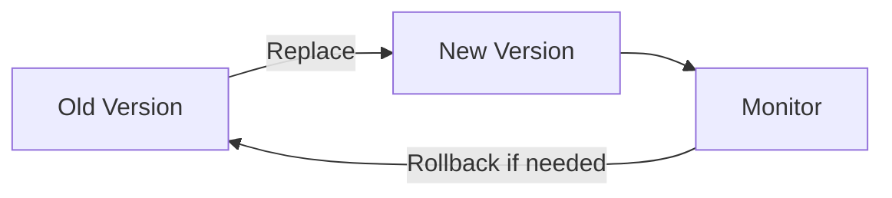
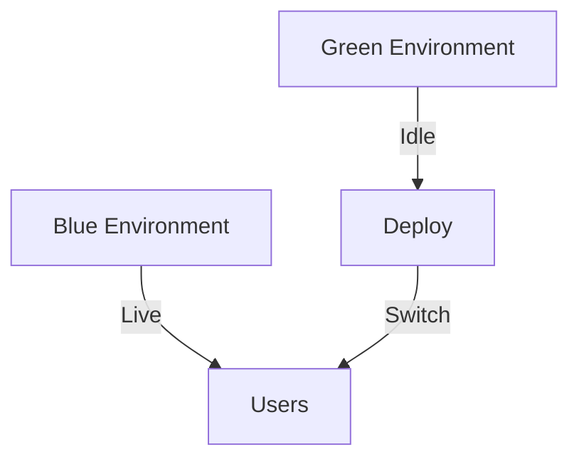

## 23.1 Continuous Integration and Deployment Pipelines

In the rapidly evolving world of software development, Continuous Integration (CI) and Continuous Deployment (CD) have become essential practices for delivering high-quality applications efficiently. This section delves into the intricacies of CI/CD pipelines, particularly in the context of Clojure development, and provides a comprehensive guide to setting up and optimizing these pipelines for scalable applications.

### CI/CD Overview

**Continuous Integration (CI)** is a development practice where developers integrate code into a shared repository frequently, ideally several times a day. Each integration is verified by an automated build, allowing teams to detect problems early. CI aims to provide rapid feedback to developers, ensuring that new code changes do not break existing functionality.

**Continuous Deployment (CD)** extends CI by automating the deployment of applications to production environments. This practice ensures that software can be released to users quickly and reliably, with minimal manual intervention.

The combination of CI/CD helps teams deliver software faster and with higher quality, making it a cornerstone of modern DevOps practices.

### Setting Up CI/CD

To set up a CI/CD pipeline for a Clojure application, we can use tools like GitHub Actions, Travis CI, or CircleCI. These platforms provide robust support for automating the build, test, and deployment processes.

#### GitHub Actions

GitHub Actions is a powerful platform for automating workflows directly from your GitHub repository. Here's a basic setup for a Clojure project:

```yaml
# .github/workflows/ci.yml
name: CI

on:
  push:
    branches: [ main ]
  pull_request:
    branches: [ main ]

jobs:
  build:
    runs-on: ubuntu-latest

    steps:
    - name: Checkout code
      uses: actions/checkout@v2

    - name: Set up JDK 11
      uses: actions/setup-java@v2
      with:
        java-version: '11'

    - name: Install Clojure
      run: |
        sudo apt-get update
        sudo apt-get install -y clojure

    - name: Build and test
      run: |
        clojure -T:build clean
        clojure -T:build test
```

This workflow triggers on pushes and pull requests to the `main` branch. It checks out the code, sets up JDK 11, installs Clojure, and runs the build and test tasks.

#### Travis CI

Travis CI is another popular CI tool that integrates well with GitHub repositories. Here's how you can configure Travis CI for a Clojure project:

```yaml
# .travis.yml
language: clojure
jdk:
  - openjdk11

script:
  - lein test
  - lein uberjar
```

This configuration specifies the use of Clojure and JDK 11, running tests and building an uberjar as part of the CI process.

#### CircleCI

CircleCI offers a flexible configuration system and integrates easily with GitHub. Below is a sample configuration for a Clojure project:

```yaml
# .circleci/config.yml
version: 2.1

executors:
  clojure-executor:
    docker:
      - image: circleci/clojure:lein-2.9.1

jobs:
  build:
    executor: clojure-executor
    steps:
      - checkout
      - run: lein test
      - run: lein uberjar

workflows:
  version: 2
  build_and_test:
    jobs:
      - build
```

This setup uses a Docker image with Leiningen, a popular build tool for Clojure, to run tests and build the project.

### Build and Test Automation

Automating builds and tests is crucial for maintaining code quality and ensuring that new changes do not introduce regressions. In Clojure, we can leverage tools like Leiningen or deps.edn for build automation.

#### Automating Builds

Clojure projects often use Leiningen for build automation. Here's a sample `project.clj` configuration:

```clojure
(defproject my-clojure-app "0.1.0-SNAPSHOT"
  :dependencies [[org.clojure/clojure "1.10.3"]]
  :main ^:skip-aot my-clojure-app.core
  :target-path "target/%s"
  :profiles {:uberjar {:aot :all}})
```

With this configuration, you can run `lein uberjar` to build an executable JAR file.

Alternatively, you can use deps.edn for a more lightweight setup:

```clojure
{:deps {org.clojure/clojure {:mvn/version "1.10.3"}}}
```

To build the project, you can use tools.build:

```shell
clojure -T:build uber
```

#### Automating Tests

Testing is an integral part of CI/CD pipelines. Clojure's testing libraries, such as `clojure.test`, provide a robust framework for writing and running tests.

Here's a simple test example:

```clojure
(ns my-clojure-app.core-test
  (:require [clojure.test :refer :all]
            [my-clojure-app.core :refer :all]))

(deftest test-addition
  (testing "Addition of two numbers"
    (is (= 4 (add 2 2)))))
```

You can run tests using `lein test` or `clojure -M:test` depending on your build tool.

### Deployment Strategies

Choosing the right deployment strategy is crucial for minimizing downtime and ensuring a smooth user experience. Here are some common strategies:

#### Rolling Updates

Rolling updates involve gradually replacing instances of the application with new versions. This approach minimizes downtime and allows for easy rollback if issues arise.



#### Blue-Green Deployments

Blue-green deployments maintain two identical environments. At any time, one environment (blue) is live, while the other (green) is idle. Deployments are made to the idle environment, and once tested, traffic is switched over.



### Security and Compliance

Securing CI/CD pipelines is critical for protecting sensitive information and ensuring compliance with industry standards.

#### Best Practices for Security

- **Use Secrets Management**: Store sensitive information such as API keys and passwords securely using the CI/CD tool's secrets management features.
- **Limit Access**: Restrict access to CI/CD configurations and environments to authorized personnel only.
- **Regular Audits**: Conduct regular security audits and vulnerability assessments to identify and mitigate risks.

#### Compliance

Ensure that your CI/CD processes comply with relevant industry standards and regulations, such as GDPR or HIPAA, by implementing appropriate data protection measures and maintaining audit trails.

### Conclusion

Implementing effective CI/CD pipelines is essential for delivering high-quality Clojure applications efficiently. By automating builds, tests, and deployments, and adopting secure practices, teams can enhance their development workflows and ensure reliable software delivery.

## **Test Your Knowledge: Continuous Integration and Deployment Pipelines Quiz**



### What is the primary goal of Continuous Integration (CI)?

- [x] To integrate code into a shared repository frequently and detect problems early
- [ ] To automate the deployment of applications to production environments
- [ ] To ensure that software can be released to users quickly
- [ ] To manage infrastructure as code

> **Explanation:** Continuous Integration focuses on integrating code changes frequently and detecting issues early through automated builds and tests.


### Which tool is not typically used for setting up CI/CD pipelines?

- [ ] GitHub Actions
- [ ] Travis CI
- [x] Microsoft Word
- [ ] CircleCI

> **Explanation:** Microsoft Word is not a CI/CD tool. GitHub Actions, Travis CI, and CircleCI are commonly used for CI/CD.


### What is the benefit of using rolling updates as a deployment strategy?

- [x] It minimizes downtime and allows for easy rollback
- [ ] It requires two identical environments
- [ ] It switches traffic between environments
- [ ] It is the fastest deployment method

> **Explanation:** Rolling updates gradually replace instances, minimizing downtime and allowing for rollbacks if issues occur.


### In a blue-green deployment, what is the purpose of the idle environment?

- [x] To deploy and test new versions before switching traffic
- [ ] To serve as a backup in case of failure
- [ ] To reduce costs by minimizing resource usage
- [ ] To handle increased traffic during peak times

> **Explanation:** The idle environment is used to deploy and test new versions, ensuring they are ready before switching traffic.


### What is a key security practice for CI/CD pipelines?

- [x] Use secrets management to store sensitive information
- [ ] Allow all team members access to configurations
- [ ] Disable logging for security reasons
- [ ] Conduct monthly performance reviews

> **Explanation:** Using secrets management ensures that sensitive information is stored securely and accessed only by authorized processes.


### Which command is used to run tests in a Clojure project using Leiningen?

- [x] lein test
- [ ] lein build
- [ ] lein uberjar
- [ ] lein deploy

> **Explanation:** `lein test` is the command used to run tests in a Clojure project configured with Leiningen.


### How does Continuous Deployment (CD) extend Continuous Integration (CI)?

- [x] By automating the deployment of applications to production environments
- [ ] By integrating code into a shared repository frequently
- [ ] By providing rapid feedback to developers
- [ ] By managing infrastructure as code

> **Explanation:** Continuous Deployment automates the deployment process, extending the principles of Continuous Integration to production environments.


### What is the role of `lein uberjar` in a Clojure project?

- [x] To build an executable JAR file
- [ ] To run tests
- [ ] To install dependencies
- [ ] To clean the project

> **Explanation:** `lein uberjar` is used to build an executable JAR file in a Clojure project.


### What is a common tool for managing dependencies in Clojure projects?

- [x] Leiningen
- [ ] Maven
- [ ] Gradle
- [ ] Ant

> **Explanation:** Leiningen is a popular tool for managing dependencies and automating builds in Clojure projects.


### True or False: Blue-green deployments require only one environment.

- [ ] True
- [x] False

> **Explanation:** Blue-green deployments require two identical environments to ensure seamless transitions during deployments.


