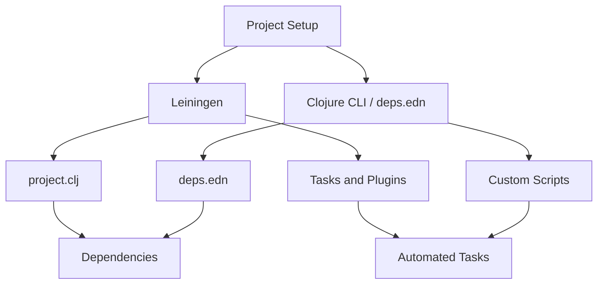

## 23.2 Automating Builds with `Leiningen` and `deps.edn`

In the world of software development, automating builds is crucial for maintaining efficiency and consistency across projects. Clojure offers two primary tools for build automation: [Leiningen](https://leiningen.org/) and the Clojure CLI tools with `deps.edn`. Each has its strengths and use cases, and understanding how to leverage them can significantly enhance your development workflow.

### Build Tooling Choices

Before diving into the specifics of each tool, let's compare Leiningen and `deps.edn` to understand their roles in Clojure development.

- **Leiningen**: A comprehensive build tool that has been a staple in the Clojure community for years. It provides a wide range of features, including dependency management, task automation, and plugin support. Leiningen is known for its ease of use and extensive ecosystem of plugins.

- **Clojure CLI and `deps.edn`**: A more recent addition to the Clojure ecosystem, the Clojure CLI tools and `deps.edn` offer a lightweight and flexible approach to dependency management and build automation. They emphasize simplicity and composability, making them a great choice for projects that require custom tooling or integration with other systems.

Both tools are powerful in their own right, and the choice between them often depends on the specific needs of your project and team preferences.

### Using Leiningen

Leiningen simplifies the process of managing Clojure projects through its `project.clj` file. This file serves as the central configuration point for defining project details, dependencies, and tasks.

#### Defining Project Configurations

To start a new project with Leiningen, use the following command:

```bash
lein new app my-clojure-app
```

This command creates a new Clojure application with a basic directory structure and a `project.clj` file. Here's a breakdown of a typical `project.clj` file:

```clojure
(defproject my-clojure-app "0.1.0-SNAPSHOT"
  :description "A sample Clojure application"
  :url "http://example.com/my-clojure-app"
  :license {:name "Eclipse Public License"
            :url "http://www.eclipse.org/legal/epl-v10.html"}
  :dependencies [[org.clojure/clojure "1.10.3"]
                 [ring/ring-core "1.9.0"]]
  :main ^:skip-aot my-clojure-app.core
  :target-path "target/%s"
  :profiles {:uberjar {:aot :all}})
```

- **Project Metadata**: Includes the project's name, version, description, and license.
- **Dependencies**: Specifies the libraries your project depends on, with their respective versions.
- **Main Namespace**: Defines the entry point of the application, typically pointing to the `-main` function.
- **Profiles**: Allows for different configurations based on the build context, such as development or production.

#### Managing Dependencies

Leiningen handles dependencies through the `:dependencies` vector in `project.clj`. It automatically downloads and manages these dependencies, ensuring that your project has everything it needs to run.

To add a new dependency, simply include it in the `:dependencies` vector and run:

```bash
lein deps
```

This command fetches the specified libraries and updates your project's classpath.

#### Automating Tasks

Leiningen excels at task automation. It comes with several built-in tasks, such as `lein run`, `lein test`, and `lein uberjar`. You can also define custom tasks using the `:aliases` key in `project.clj`.

Here's an example of adding a custom alias to run a specific namespace function:

```clojure
:aliases {"start-server" ["run" "-m" "my-clojure-app.server/start"]}
```

With this alias, you can start your server with the command:

```bash
lein start-server
```

#### Custom Tasks and Plugins

Leiningen's plugin system allows you to extend its functionality with additional tasks. Plugins are defined in the `:plugins` vector of `project.clj`.

For example, to add the `lein-ancient` plugin for checking outdated dependencies, include it as follows:

```clojure
:plugins [[lein-ancient "0.6.15"]]
```

Then, run the plugin with:

```bash
lein ancient
```

This command lists all outdated dependencies, helping you keep your project up-to-date.

### Clojure CLI and `deps.edn`

The Clojure CLI tools and `deps.edn` provide a streamlined approach to managing dependencies and build tasks. Unlike Leiningen, `deps.edn` focuses on dependency management and does not include a built-in task system. However, its simplicity and flexibility make it ideal for projects that require custom tooling.

#### Managing Dependencies

Dependencies in `deps.edn` are defined under the `:deps` key. Here's an example `deps.edn` file:

```clojure
{:deps {org.clojure/clojure {:mvn/version "1.10.3"}
        ring/ring-core {:mvn/version "1.9.0"}}}
```

To download and manage these dependencies, use the Clojure CLI:

```bash
clj -A:deps
```

This command resolves and fetches the specified libraries.

#### Executing Build Tasks

While `deps.edn` does not have a built-in task system like Leiningen, you can execute tasks using the `clj` command with aliases. Define aliases in `deps.edn` under the `:aliases` key:

```clojure
{:aliases
 {:dev {:extra-paths ["src/dev"]
        :extra-deps {cider/cider-nrepl {:mvn/version "0.26.0"}}}
  :run-server {:main-opts ["-m" "my-clojure-app.server/start"]}}}
```

To run the server, use the alias:

```bash
clj -A:run-server
```

This flexibility allows you to tailor your build process to fit your project's needs.

#### Custom Tasks and Plugins

While `deps.edn` does not natively support plugins, you can achieve similar functionality by integrating external tools or scripts. For example, you can use shell scripts or Makefiles to automate complex build processes.

Here's a simple shell script to automate testing and packaging:

```bash
#!/bin/bash
set -e

# Run tests
clj -A:test

# Create an uberjar
clj -A:uberjar
```

### Automation Examples

To illustrate the power of build automation in Clojure, let's explore some practical examples using both Leiningen and `deps.edn`.

#### Code Linting

Automate code linting with the `eastwood` linter in Leiningen:

```clojure
:plugins [[jonase/eastwood "0.3.15"]]
```

Run the linter with:

```bash
lein eastwood
```

For `deps.edn`, use the `clj-kondo` linter:

```bash
{:aliases
 {:lint {:extra-deps {clj-kondo/clj-kondo {:mvn/version "2021.06.18"}}
         :main-opts ["-m" "clj-kondo.main" "--lint" "src"]}}}
```

Execute linting with:

```bash
clj -A:lint
```

#### Testing

Leiningen provides a straightforward way to run tests:

```bash
lein test
```

For `deps.edn`, define a test alias:

```clojure
{:aliases
 {:test {:extra-paths ["test"]
         :extra-deps {org.clojure/test.check {:mvn/version "1.1.0"}}
         :main-opts ["-m" "clojure.test-runner"]}}}
```

Run tests with:

```bash
clj -A:test
```

#### Packaging

Create an uberjar with Leiningen:

```bash
lein uberjar
```

For `deps.edn`, use the `depstar` library:

```clojure
{:aliases
 {:uberjar {:extra-deps {seancorfield/depstar {:mvn/version "2.0.211"}}
            :main-opts ["-m" "hf.depstar.uberjar" "target/my-clojure-app.jar"]}}}
```

Build the jar with:

```bash
clj -A:uberjar
```

#### Deployment

Automate deployment with Leiningen's `lein-deploy` plugin:

```clojure
:plugins [[lein-deploy "0.3.0"]]
```

Deploy with:

```bash
lein deploy
```

For `deps.edn`, use a shell script or CI/CD pipeline to handle deployment tasks.

### Visual Aids

To better understand the relationship between Leiningen and `deps.edn`, let's visualize their roles in a typical Clojure project setup.



**Diagram Description**: This flowchart illustrates how both Leiningen and `deps.edn` fit into a Clojure project setup. While Leiningen uses `project.clj` for configuration and supports tasks and plugins, `deps.edn` relies on custom scripts for task automation.

### References and Links

- [Leiningen Official Website](https://leiningen.org/)
- [Clojure CLI and Deps Guide](https://clojure.org/guides/deps_and_cli)
- [Clojure Community Resources](https://clojure.org/community/resources)
- [Transitioning from OOP to Functional Programming](https://www.lispcast.com/oo-to-fp/)

### Knowledge Check

To reinforce your understanding of build automation in Clojure, consider the following questions:

1. What are the primary differences between Leiningen and `deps.edn`?
2. How do you define dependencies in a `project.clj` file?
3. What command would you use to run a custom task in Leiningen?
4. How can you execute a build task using `deps.edn`?
5. What are some benefits of automating build tasks in software development?

### Encouraging Engagement

Embracing build automation in Clojure can transform your development workflow, making it more efficient and reliable. As you explore these tools, remember that each step you take brings you closer to mastering functional programming and building scalable applications.

### Best Practices for Tags

When tagging your projects or articles, consider using specific and relevant tags such as "Clojure", "Leiningen", "deps.edn", "Build Automation", "Functional Programming", "Continuous Integration", "Project Configuration", and "Dependency Management".

### Test Your Knowledge: Automating Builds with `Leiningen` and `deps.edn` Quiz



### What is the primary purpose of Leiningen in Clojure projects?

- [x] To manage project configurations and automate tasks
- [ ] To compile Java code
- [ ] To replace the Clojure REPL
- [ ] To handle HTTP requests

> **Explanation:** Leiningen is primarily used to manage project configurations, dependencies, and automate tasks in Clojure projects.

### How are dependencies specified in a `project.clj` file?

- [x] Using the `:dependencies` vector
- [ ] Using the `:plugins` vector
- [ ] Using the `:main` key
- [ ] Using the `:profiles` map

> **Explanation:** Dependencies in a `project.clj` file are specified using the `:dependencies` vector, which lists the required libraries and their versions.

### Which command is used to create a new Clojure application with Leiningen?

- [x] `lein new app my-clojure-app`
- [ ] `clj new app my-clojure-app`
- [ ] `lein create my-clojure-app`
- [ ] `clj create my-clojure-app`

> **Explanation:** The `lein new app my-clojure-app` command is used to create a new Clojure application with Leiningen.

### How can you execute a build task using `deps.edn`?

- [x] By defining an alias and using the `clj` command
- [ ] By writing a custom plugin
- [ ] By modifying the `project.clj` file
- [ ] By using the `lein` command

> **Explanation:** In `deps.edn`, build tasks can be executed by defining an alias and using the `clj` command with the appropriate alias.

### What is the role of the `:main-opts` key in a `deps.edn` alias?

- [x] To specify the main function to run
- [ ] To list dependencies
- [ ] To define environment variables
- [ ] To configure plugins

> **Explanation:** The `:main-opts` key in a `deps.edn` alias is used to specify the main function to run, allowing you to execute specific tasks.

### Which tool provides a plugin system for extending build functionality?

- [x] Leiningen
- [ ] Clojure CLI tools
- [ ] Both Leiningen and Clojure CLI tools
- [ ] Neither Leiningen nor Clojure CLI tools

> **Explanation:** Leiningen provides a plugin system that allows developers to extend its build functionality with additional tasks.

### How do you run tests in a Clojure project using Leiningen?

- [x] `lein test`
- [ ] `clj -A:test`
- [ ] `lein run-tests`
- [ ] `clj test`

> **Explanation:** The `lein test` command is used to run tests in a Clojure project using Leiningen.

### What is a common use case for the `lein-ancient` plugin?

- [x] Checking for outdated dependencies
- [ ] Running a web server
- [ ] Compiling Java code
- [ ] Managing environment variables

> **Explanation:** The `lein-ancient` plugin is commonly used to check for outdated dependencies in a Leiningen project.

### How can you automate code linting in a Clojure project using `deps.edn`?

- [x] By defining a lint alias and using `clj-kondo`
- [ ] By installing a Leiningen plugin
- [ ] By writing a custom shell script
- [ ] By modifying the `project.clj` file

> **Explanation:** Code linting can be automated in a `deps.edn` project by defining a lint alias and using the `clj-kondo` linter.

### True or False: `deps.edn` natively supports plugins like Leiningen.

- [ ] True
- [x] False

> **Explanation:** False. `deps.edn` does not natively support plugins like Leiningen; instead, it relies on external tools or scripts for extended functionality.



By mastering Leiningen and `deps.edn`, you'll be well-equipped to automate and streamline your Clojure build processes, paving the way for more efficient and scalable application development. As you continue to explore these tools, remember that embracing functional programming principles can lead to cleaner, more maintainable code.
