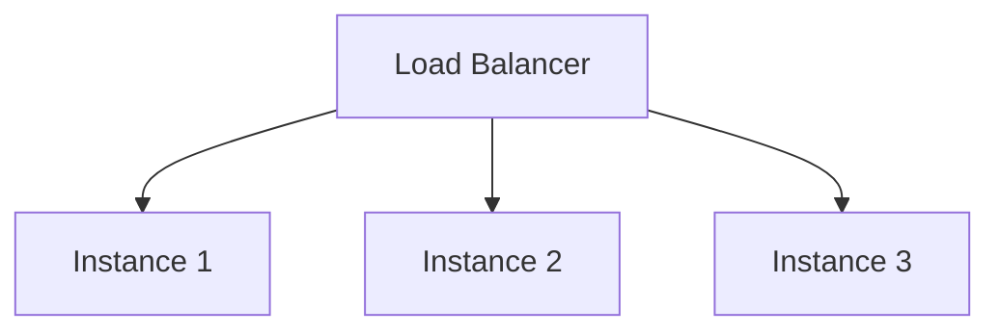

## 23.4 Monitoring and Scaling Clojure Services

In the realm of functional programming with Clojure, monitoring and scaling services are crucial to maintaining application health and ensuring performance. As we delve into this topic, we'll explore best practices for logging, metrics collection, alerting, and scaling strategies. These practices will help you build resilient and scalable applications.

### Importance of Monitoring

Monitoring is the backbone of maintaining application health. It allows us to detect issues proactively and respond before they impact users. In Clojure applications, monitoring involves tracking system performance, application behavior, and resource utilization.

#### Proactive Monitoring

Proactive monitoring involves setting up systems to detect potential issues before they become critical. This includes:

- **Real-time Metrics**: Continuously collecting data on application performance.
- **Health Checks**: Regularly verifying that services are running as expected.
- **Anomaly Detection**: Identifying unusual patterns that may indicate problems.

By implementing these practices, we can ensure that our Clojure services remain healthy and performant.

### Logging Practices

Logging is an essential part of monitoring. It provides insights into application behavior and helps diagnose issues. In Clojure, structured logging is a best practice, as it allows logs to be easily parsed and analyzed.

#### Structured Logging with `tools.logging`

Clojure's `tools.logging` library facilitates structured logging. Here's how to set it up:

```clojure
(require '[clojure.tools.logging :as log])

(log/info "Application started")
(log/warn "Potential issue detected")
(log/error "An error occurred" {:error-code 500})
```

**Key Practices:**

- **Use Contextual Information**: Include relevant data in log messages to provide context.
- **Log Levels**: Use appropriate log levels (`info`, `warn`, `error`) to categorize messages.
- **Log Aggregation**: Configure log aggregation tools like ELK Stack or Splunk for centralized log management.

### Metrics Collection

Collecting metrics is vital for understanding application performance. Metrics provide quantitative data that can be used to make informed decisions.

#### Using Metrics-Clojure

The [Metrics-Clojure](https://github.com/metrics-clojure/metrics-clojure) library integrates with the Clojure ecosystem to collect metrics. Here's a simple example:

```clojure
(require '[metrics.timers :as timers])

(def request-timer (timers/timer ["requests" "processing-time"]))

(timers/time! request-timer
  (process-request))
```

#### Integrating with Prometheus

Prometheus is a popular tool for monitoring and alerting. It can be integrated with Clojure applications for metrics collection. Here's a basic setup:

1. **Export Metrics**: Use a library like [io.prometheus.client](https://github.com/prometheus/client_java) to expose metrics.
2. **Configure Prometheus**: Set up Prometheus to scrape metrics from your application.

```clojure
(require '[io.prometheus.client.exporter :as exporter])

(exporter/start-http-server 8080)
```

**Benefits:**

- **Real-time Monitoring**: Prometheus provides real-time insights into application performance.
- **Alerting**: Set up alerts based on specific metrics.

### Alerting and Notifications

Alerting is crucial for responding to issues promptly. By setting up alerts, you can be notified of critical events and take action before they escalate.

#### Setting Up Alerts

Alerts can be configured based on specific metrics or log patterns. For example, you might set up an alert for high CPU usage or a specific error code.

- **Threshold Alerts**: Trigger alerts when metrics exceed predefined thresholds.
- **Pattern Alerts**: Use log patterns to detect anomalies.

#### Integrating with Notification Services

Integrate alerts with notification services like Slack or PagerDuty to ensure timely responses.

```clojure
(defn send-alert [message]
  ;; Code to send alert via a notification service
  )
```

### Scaling Techniques

Scaling ensures that your application can handle increased load. There are two primary scaling strategies: horizontal and vertical scaling.

#### Horizontal Scaling

Horizontal scaling involves adding more instances of your application to distribute the load. This approach is often preferred for its flexibility and cost-effectiveness.

- **Load Balancing**: Use a load balancer to distribute traffic across instances.
- **Auto-scaling**: Automatically adjust the number of instances based on demand.



#### Vertical Scaling

Vertical scaling involves increasing the resources (CPU, RAM) of a single instance. While simpler, it has limitations and is less flexible than horizontal scaling.

### Capacity Planning

Capacity planning involves anticipating future growth and ensuring that your infrastructure can handle it. This includes:

- **Performance Testing**: Simulate load to identify bottlenecks.
- **Resource Allocation**: Ensure sufficient resources are available to meet demand.
- **Scalability Testing**: Test the application's ability to scale.

### Knowledge Check

To reinforce your understanding, consider the following questions:

- What are the benefits of structured logging in Clojure applications?
- How can Prometheus be used to monitor Clojure services?
- What are the differences between horizontal and vertical scaling?

### Conclusion

Monitoring and scaling are critical components of maintaining robust Clojure services. By implementing structured logging, collecting metrics, setting up alerts, and planning for capacity, you can ensure that your applications remain healthy and scalable.

For further reading, explore the [Clojure Official Documentation](https://clojure.org/reference) and [Prometheus Monitoring Guide](https://prometheus.io/docs/introduction/overview/).

---

## **Test Your Knowledge: Monitoring and Scaling Clojure Services Quiz**



### Which library is used for structured logging in Clojure?

- [x] tools.logging
- [ ] log4j
- [ ] slf4j
- [ ] logback

> **Explanation:** Clojure's `tools.logging` library is commonly used for structured logging.


### What is the advantage of using Prometheus for monitoring?

- [x] Real-time insights
- [ ] Manual data collection
- [ ] Limited alerting capabilities
- [ ] High resource usage

> **Explanation:** Prometheus provides real-time insights into application performance and supports alerting.


### How does horizontal scaling differ from vertical scaling?

- [x] Adds more instances
- [ ] Increases resources of a single instance
- [ ] Reduces resource usage
- [ ] Decreases the number of instances

> **Explanation:** Horizontal scaling involves adding more instances to handle increased load.


### What is a key benefit of structured logging?

- [x] Easier parsing and analysis
- [ ] Requires more storage
- [ ] Increases application complexity
- [ ] Reduces log clarity

> **Explanation:** Structured logging allows logs to be easily parsed and analyzed.


### Which tool can be used for centralized log management?

- [x] ELK Stack
- [ ] Prometheus
- [ ] Grafana
- [ ] Kubernetes

> **Explanation:** ELK Stack is commonly used for centralized log management.


### What is the purpose of capacity planning?

- [x] Anticipating future growth
- [ ] Reducing application features
- [ ] Limiting resource usage
- [ ] Decreasing application performance

> **Explanation:** Capacity planning involves anticipating future growth and ensuring sufficient resources.


### Which metric collection library integrates with Clojure?

- [x] Metrics-Clojure
- [ ] Prometheus
- [ ] Grafana
- [ ] ELK Stack

> **Explanation:** Metrics-Clojure is a library for collecting metrics in Clojure applications.


### What is a common use case for load balancing?

- [x] Distributing traffic across instances
- [ ] Reducing server resources
- [ ] Limiting application access
- [ ] Decreasing application load

> **Explanation:** Load balancing distributes traffic across multiple instances to handle increased load.


### Which of the following is a notification service for alerts?

- [x] PagerDuty
- [ ] Prometheus
- [ ] Grafana
- [ ] Kubernetes

> **Explanation:** PagerDuty is a notification service used for alerts.


### True or False: Vertical scaling is more flexible than horizontal scaling.

- [ ] True
- [x] False

> **Explanation:** Horizontal scaling is generally more flexible than vertical scaling, as it involves adding more instances rather than increasing resources of a single instance.


