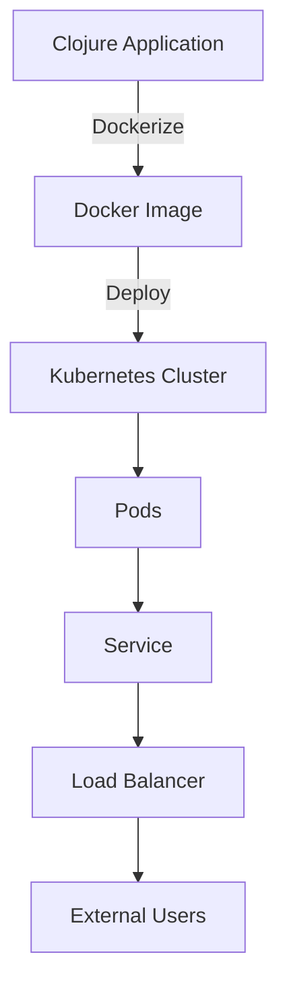

## 23.6 Using Docker and Kubernetes with Clojure Applications

In this section, we will explore the powerful combination of Docker and Kubernetes for deploying Clojure applications. By the end of this guide, you will understand how to containerize your Clojure applications with Docker, deploy them to a Kubernetes cluster, and leverage Kubernetes' features for service discovery, load balancing, scaling, and self-healing.

### Dockerizing Applications

Docker is a platform that allows you to package applications and their dependencies into a single container, ensuring consistency across different environments. Here's how you can Dockerize a Clojure application:

#### Step 1: Create a Dockerfile

A Dockerfile is a script containing a series of instructions on how to build a Docker image. Below is a sample Dockerfile for a Clojure application:

```dockerfile
# Use the official Clojure image as a base
FROM clojure:openjdk-11-lein

# Set the working directory inside the container
WORKDIR /app

# Copy the project files into the container
COPY . /app

# Install dependencies and build the application
RUN lein deps && lein uberjar

# Command to run the application
CMD ["java", "-jar", "target/myapp-standalone.jar"]
```

**Explanation:**
- **FROM**: Specifies the base image, which includes Clojure and OpenJDK 11.
- **WORKDIR**: Sets the working directory inside the container.
- **COPY**: Copies the application files into the container.
- **RUN**: Installs dependencies and builds the application.
- **CMD**: Specifies the command to run the application.

#### Step 2: Build the Docker Image

Run the following command in the terminal to build the Docker image:

```bash
docker build -t my-clojure-app .
```

This command creates a Docker image named `my-clojure-app` based on the instructions in the Dockerfile.

#### Step 3: Run the Docker Container

To run the container, use the following command:

```bash
docker run -p 8080:8080 my-clojure-app
```

This command maps port 8080 of the container to port 8080 of the host machine, allowing you to access the application via `http://localhost:8080`.

### Kubernetes Fundamentals

Kubernetes is an open-source platform designed to automate deploying, scaling, and operating application containers. Let's introduce some core concepts:

- **Pods**: The smallest deployable units in Kubernetes, which can contain one or more containers.
- **Deployments**: Define the desired state for your application, including the number of replicas and the container image to use.
- **Services**: Provide a stable endpoint for accessing a set of pods and handle load balancing.
- **ConfigMaps**: Store configuration data that can be used by your applications.

### Deploying to Kubernetes

To deploy a Dockerized Clojure application to Kubernetes, follow these steps:

#### Step 1: Create a Kubernetes Deployment

Create a file named `deployment.yaml` with the following content:

```yaml
apiVersion: apps/v1
kind: Deployment
metadata:
  name: my-clojure-app
spec:
  replicas: 3
  selector:
    matchLabels:
      app: my-clojure-app
  template:
    metadata:
      labels:
        app: my-clojure-app
    spec:
      containers:
      - name: my-clojure-app
        image: my-clojure-app:latest
        ports:
        - containerPort: 8080
```

**Explanation:**
- **replicas**: Specifies the number of pod replicas to run.
- **selector**: Identifies the pods managed by this deployment.
- **template**: Defines the pod configuration, including the container image and ports.

#### Step 2: Create a Kubernetes Service

Create a file named `service.yaml` with the following content:

```yaml
apiVersion: v1
kind: Service
metadata:
  name: my-clojure-app
spec:
  selector:
    app: my-clojure-app
  ports:
    - protocol: TCP
      port: 80
      targetPort: 8080
  type: LoadBalancer
```

**Explanation:**
- **selector**: Matches the pods to expose through the service.
- **ports**: Maps port 80 of the service to port 8080 of the pods.
- **type**: Specifies the service type, with `LoadBalancer` providing an external IP.

#### Step 3: Deploy to Kubernetes

Use the following commands to deploy your application:

```bash
kubectl apply -f deployment.yaml
kubectl apply -f service.yaml
```

These commands create the deployment and service, starting your application in the Kubernetes cluster.

### Service Discovery and Load Balancing

Kubernetes handles service discovery and load balancing automatically. When a service is created, it gets a stable IP address and DNS name, allowing other services to discover it. Traffic is distributed across the pods using a round-robin algorithm, ensuring efficient load balancing.

### Scaling and Self-Healing

Kubernetes provides powerful features for scaling and self-healing:

- **Scaling**: Adjust the number of replicas in your deployment to handle varying loads. Use the following command to scale your application:

  ```bash
  kubectl scale deployment my-clojure-app --replicas=5
  ```

- **Self-Healing**: Kubernetes automatically restarts failed pods and replaces them with new ones, maintaining the desired state.

### Real-World Example

Let's walk through a practical example of deploying a Clojure application to Kubernetes.

#### Step 1: Prepare the Application

Ensure your Clojure application is packaged as a Docker image using the steps outlined in the Dockerizing Applications section.

#### Step 2: Define Kubernetes Manifests

Create `deployment.yaml` and `service.yaml` files as described earlier.

#### Step 3: Deploy to a Kubernetes Cluster

1. **Set up a Kubernetes Cluster**: Use a cloud provider like Google Kubernetes Engine (GKE) or Amazon EKS, or set up a local cluster with Minikube.
2. **Apply Manifests**: Use `kubectl apply -f deployment.yaml` and `kubectl apply -f service.yaml` to deploy your application.
3. **Access the Application**: Once the service is running, access it using the external IP address provided by the LoadBalancer.

### Visual Aids

Below is a diagram illustrating the deployment architecture of a Clojure application in Kubernetes:



**Diagram Description:** The diagram shows the process of Dockerizing a Clojure application, deploying it to a Kubernetes cluster, and exposing it to external users via a load balancer.

### References and Links

- [Clojure Official Documentation](https://clojure.org/reference)
- [Docker Documentation](https://docs.docker.com/)
- [Kubernetes Documentation](https://kubernetes.io/docs/home/)
- [Transitioning from OOP to Functional Programming](https://www.lispcast.com/oo-to-fp/)

### Knowledge Check

1. **What is the purpose of a Dockerfile in containerizing a Clojure application?**
2. **How does Kubernetes handle load balancing between application instances?**
3. **Explain the role of ConfigMaps in Kubernetes.**
4. **What command is used to scale a Kubernetes deployment?**
5. **Describe the process of deploying a Dockerized application to a Kubernetes cluster.**

### Encouraging Engagement

Embracing Docker and Kubernetes can significantly enhance your ability to deploy and manage Clojure applications at scale. While the learning curve may seem steep, each step you take will bring you closer to mastering these powerful tools and realizing their benefits in your projects.

### Test Your Knowledge: Using Docker and Kubernetes with Clojure Applications Quiz



### What is the primary purpose of Docker in application deployment?

- [x] To package applications and their dependencies into a single container
- [ ] To provide a user interface for application management
- [ ] To replace the need for a cloud service provider
- [ ] To serve as a version control system

> **Explanation:** Docker is used to package applications and their dependencies into containers, ensuring consistency across environments.


### Which Kubernetes object is responsible for managing a group of identical pods?

- [ ] Service
- [ ] Pod
- [x] Deployment
- [ ] ConfigMap

> **Explanation:** A Deployment manages a group of identical pods, ensuring the desired number of replicas are running.


### How does Kubernetes achieve load balancing between pods?

- [ ] By using a round-robin DNS
- [x] By distributing traffic through Services
- [ ] By using a hardware load balancer
- [ ] By deploying more nodes

> **Explanation:** Kubernetes uses Services to distribute traffic among pods, achieving load balancing.


### What is the function of a ConfigMap in Kubernetes?

- [x] To store configuration data for applications
- [ ] To manage pod replicas
- [ ] To provide network routing
- [ ] To handle persistent storage

> **Explanation:** ConfigMaps store configuration data that can be used by applications in Kubernetes.


### Which command is used to deploy a Kubernetes manifest file?

- [ ] kubectl create -f
- [x] kubectl apply -f
- [ ] kubectl deploy -f
- [ ] kubectl start -f

> **Explanation:** `kubectl apply -f` is used to deploy resources defined in a Kubernetes manifest file.


### What is the role of a Kubernetes Service?

- [ ] To manage application scaling
- [x] To provide a stable endpoint for accessing pods
- [ ] To store application logs
- [ ] To configure network policies

> **Explanation:** A Service provides a stable endpoint for accessing a set of pods, handling network routing and load balancing.


### How can you scale a Kubernetes deployment?

- [ ] By editing the pod configuration
- [x] By using the kubectl scale command
- [ ] By adding more nodes to the cluster
- [ ] By increasing the CPU allocation

> **Explanation:** The `kubectl scale` command is used to adjust the number of replicas in a deployment.


### What does a Kubernetes Pod represent?

- [ ] A single container
- [x] One or more containers that share resources
- [ ] A network endpoint
- [ ] A storage volume

> **Explanation:** A Pod represents one or more containers that share resources such as networking and storage.


### What is the benefit of using Docker in development?

- [x] Consistency across different environments
- [ ] Reduced application size
- [ ] Elimination of the need for testing
- [ ] Automatic code generation

> **Explanation:** Docker ensures consistency across different environments by packaging applications and their dependencies into containers.


### True or False: Kubernetes automatically restarts failed pods.

- [x] True
- [ ] False

> **Explanation:** Kubernetes has self-healing capabilities and automatically restarts failed pods to maintain the desired state.



By following this guide, you are well on your way to mastering the deployment of Clojure applications using Docker and Kubernetes. Keep experimenting and exploring the vast possibilities these technologies offer to enhance your development and deployment processes.
