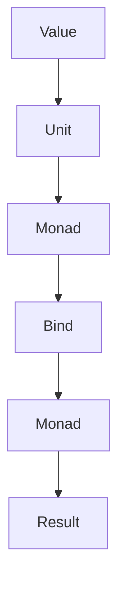
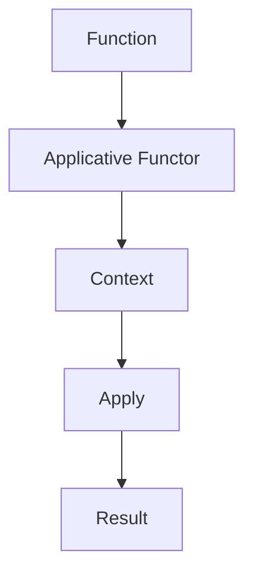

## 24.1 Exploring Monads and Applicative Functors

In the realm of functional programming, monads and applicative functors stand out as powerful abstractions that handle computations with context, such as side effects or asynchronous operations. These concepts, although abstract, provide a structured way to manage complexity in functional code, especially when dealing with operations that involve additional contexts like optional values or error handling.

### Understanding Monads

Monads are a type of abstract data type used to represent computations instead of data in the domain model. They are a powerful tool for managing side effects in functional programming, allowing you to chain operations while maintaining functional purity. In essence, a monad is a design pattern that defines how functions, actions, or computations can be combined together.

#### Monads in Functional Programming

Monads provide a way to encapsulate behavior such as handling null values, exceptions, or state, and they enable the composition of functions that produce these effects. The essence of a monad can be captured in three fundamental operations:

1. **Unit (or Return)**: This operation takes a value and puts it into a default context. In Clojure, this is often represented by a function that wraps a value in a monadic context.

2. **Bind (or FlatMap)**: This operation takes a monadic value and a function that returns a monadic value, and chains them together, allowing for the sequencing of operations.

3. **Monad Laws**: Monads must satisfy three laws: left identity, right identity, and associativity. These laws ensure that the monadic operations behave consistently and predictably.

##### Example: The Maybe Monad

The `Maybe` monad is a common example used to handle computations that may fail. It encapsulates an optional value, providing a way to chain operations that may produce a value or nothing at all.

```clojure
(ns example.maybe
  (:require [cats.monad.maybe :as maybe]))

(defn safe-divide [numerator denominator]
  (if (zero? denominator)
    (maybe/nothing)
    (maybe/just (/ numerator denominator))))

(defn example-usage []
  (-> (maybe/just 10)
      (maybe/bind #(safe-divide % 2))
      (maybe/bind #(safe-divide % 0))
      (maybe/bind #(safe-divide % 1))))
```

In this example, `safe-divide` returns a `Maybe` monad, and operations are chained using `maybe/bind`. The computation gracefully handles division by zero, avoiding exceptions and maintaining purity.

### Implementing Monads in Clojure

Clojure does not have built-in support for monads, but libraries such as [cats](https://funcool.github.io/cats/latest/) provide a robust framework for working with monads and other functional abstractions.

#### Using the Cats Library

The Cats library offers a comprehensive set of tools for working with monads in Clojure. It includes implementations for common monads like `Maybe`, `Either`, and `State`, as well as utilities for creating custom monads.

```clojure
(ns example.either
  (:require [cats.monad.either :as either]))

(defn parse-int [s]
  (try
    (either/right (Integer/parseInt s))
    (catch NumberFormatException e
      (either/left "Invalid number format"))))

(defn example-either []
  (-> (either/right "123")
      (either/bind parse-int)
      (either/bind #(either/right (* % 2)))))
```

In this example, `parse-int` returns an `Either` monad, encapsulating either a successful integer parse or an error message. The use of `either/bind` allows for seamless chaining of operations.

#### Leveraging Konduit's Albumentations

Konduit's Albumentations is another library that provides abstractions for data transformations, including monadic operations. Although primarily focused on data augmentation, its principles can be applied to monadic computations.

### Applicative Functors

Applicative functors are a generalization of monads that allow for function application lifted over a context. They provide a way to apply functions to arguments that are wrapped in a context, such as a list, option, or result.

#### Understanding Applicative Functors

Applicative functors extend the concept of functors by allowing functions that are themselves wrapped in a context to be applied to values in a context. This is particularly useful for operations that require multiple independent computations to be combined.

##### Example: The Applicative Functor Pattern

Consider a scenario where we want to apply a function to two optional values. Using applicative functors, we can lift the function into the context of the `Maybe` monad and apply it.

```clojure
(ns example.applicative
  (:require [cats.core :as m]
            [cats.monad.maybe :as maybe]))

(defn add [x y]
  (+ x y))

(defn example-applicative []
  (m/fmap add (maybe/just 3) (maybe/just 5)))
```

In this example, `m/fmap` is used to lift the `add` function into the context of the `Maybe` monad, allowing it to be applied to two `Maybe` values.

### Practical Examples

Monads and applicative functors simplify complex operations by providing a structured way to handle computations with context. Here are some practical examples:

#### Handling Optional Values with the Maybe Monad

The `Maybe` monad is ideal for computations that may or may not return a value. It provides a way to chain operations without worrying about null values or exceptions.

```clojure
(defn safe-root [x]
  (if (neg? x)
    (maybe/nothing)
    (maybe/just (Math/sqrt x))))

(defn example-maybe []
  (-> (maybe/just 16)
      (maybe/bind safe-root)
      (maybe/bind safe-root)))
```

#### Error Handling with the Either Monad

The `Either` monad is used for computations that may result in an error. It encapsulates either a successful result or an error message, allowing for graceful error handling.

```clojure
(defn safe-divide-either [numerator denominator]
  (if (zero? denominator)
    (either/left "Division by zero")
    (either/right (/ numerator denominator))))

(defn example-either-usage []
  (-> (either/right 10)
      (either/bind #(safe-divide-either % 2))
      (either/bind #(safe-divide-either % 0))
      (either/bind #(safe-divide-either % 1))))
```

### Try It Yourself

Experiment with the code examples provided. Try modifying the functions to handle different cases or add new operations. For instance, extend the `safe-divide` function to handle additional edge cases or create a new monad for handling logging.

### Visual Aids

To better understand how monads and applicative functors work, consider the following diagrams:



**Figure 1**: Monad Workflow - This diagram illustrates the process of wrapping a value in a monadic context and chaining operations using bind.



**Figure 2**: Applicative Functor Workflow - This diagram shows how a function is lifted into a context and applied to values within the same context.

### References and Links

- [Clojure Official Documentation](https://clojure.org/reference)
- [Cats Library Documentation](https://funcool.github.io/cats/latest/)
- [Konduit's Albumentations](https://github.com/kodaliarunesh/albumentations)
- [Transitioning from OOP to Functional Programming](https://www.lispcast.com/oo-to-fp/)

### Knowledge Check

To reinforce your understanding of monads and applicative functors, consider the following questions:

1. What is the primary purpose of a monad in functional programming?
2. How do applicative functors differ from monads?
3. What are the three fundamental operations of a monad?
4. How does the `Either` monad help in error handling?
5. What is the role of the `bind` operation in a monad?

### Encouraging Engagement

Embracing functional programming can be challenging, but with each step, you'll gain a deeper understanding and see tangible benefits in your codebase. Experiment with the examples, explore the libraries, and apply these concepts to your own projects.

### Conclusion

Monads and applicative functors are essential tools in the functional programmer's toolkit. By understanding and leveraging these abstractions, you can write more robust, scalable, and maintainable code. Continue exploring and experimenting with these concepts to unlock the full potential of functional programming in Clojure.

## **Test Your Knowledge: Exploring Monads and Applicative Functors Quiz**



### What is the primary purpose of a monad in functional programming?

- [x] To handle computations with context, such as side effects or asynchronous operations
- [ ] To perform object-oriented inheritance
- [ ] To manage stateful computations
- [ ] To create graphical user interfaces

> **Explanation:** Monads provide a way to handle computations with context, such as side effects or asynchronous operations, while maintaining functional purity.

### How do applicative functors differ from monads?

- [x] Applicative functors allow for function application lifted over a context
- [ ] Applicative functors are a subset of monads
- [ ] Applicative functors are used only for error handling
- [ ] Applicative functors cannot be used with optional values

> **Explanation:** Applicative functors are a generalization of monads that allow for function application lifted over a context, enabling operations on multiple independent computations.

### What are the three fundamental operations of a monad?

- [x] Unit (or Return), Bind (or FlatMap), Monad Laws
- [ ] Map, Filter, Reduce
- [ ] Inheritance, Polymorphism, Encapsulation
- [ ] Create, Read, Update

> **Explanation:** The three fundamental operations of a monad are Unit (or Return), Bind (or FlatMap), and Monad Laws, which ensure consistent behavior.

### How does the `Either` monad help in error handling?

- [x] It encapsulates either a successful result or an error message
- [ ] It logs errors to a file
- [ ] It automatically retries failed operations
- [ ] It converts errors into exceptions

> **Explanation:** The `Either` monad encapsulates either a successful result or an error message, allowing for graceful error handling in functional code.

### What is the role of the `bind` operation in a monad?

- [x] To chain operations while maintaining the monadic context
- [ ] To initialize a new monad
- [ ] To convert a monad into a functor
- [ ] To handle exceptions

> **Explanation:** The `bind` operation chains operations while maintaining the monadic context, enabling the sequencing of computations.

### Which library provides a framework for working with monads in Clojure?

- [x] Cats
- [ ] Reagent
- [ ] Ring
- [ ] Compojure

> **Explanation:** The Cats library provides a comprehensive set of tools for working with monads and other functional abstractions in Clojure.

### What is the purpose of the `Maybe` monad?

- [x] To handle computations that may or may not return a value
- [ ] To manage concurrent operations
- [ ] To perform database transactions
- [ ] To create user interfaces

> **Explanation:** The `Maybe` monad handles computations that may or may not return a value, providing a way to chain operations without worrying about null values or exceptions.

### How can you apply a function to two optional values using applicative functors?

- [x] By lifting the function into the context of the `Maybe` monad
- [ ] By using inheritance
- [ ] By converting the values into a list
- [ ] By creating a new monad

> **Explanation:** You can apply a function to two optional values by lifting the function into the context of the `Maybe` monad using applicative functors.

### What are the Monad Laws?

- [x] Left identity, right identity, and associativity
- [ ] Inheritance, encapsulation, and polymorphism
- [ ] Create, read, update, and delete
- [ ] Map, filter, and reduce

> **Explanation:** Monad Laws include left identity, right identity, and associativity, ensuring that monadic operations behave consistently and predictably.

### True or False: Monads can only be used for error handling.

- [ ] True
- [x] False

> **Explanation:** False. Monads can be used for a variety of purposes, including handling computations with context, managing state, and sequencing operations, not just error handling.


