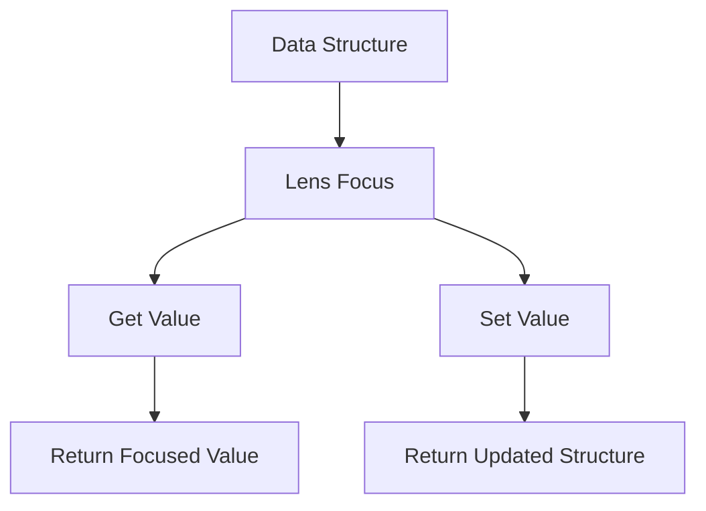

## 24.2 Functional Lenses and Data Access

In the realm of functional programming, dealing with immutable data structures is a fundamental practice. However, accessing and modifying deeply nested data can become cumbersome. This is where **functional lenses** come into play, offering a powerful abstraction for focusing on and updating parts of immutable data structures. In this section, we will explore what lenses are, their benefits, how to use them in Clojure, and practical use cases to demonstrate their utility.

### What Are Lenses?

Lenses are composable tools that allow you to focus on specific parts of a data structure, facilitating both access and modification without mutating the original structure. They provide a way to "zoom in" on a part of your data, perform operations, and then "zoom out," ensuring that immutability is preserved.

#### Key Concepts of Lenses

- **Focus**: Lenses focus on a specific part of a data structure, allowing you to perform operations on that part.
- **Composability**: Lenses can be composed to navigate complex data structures.
- **Bidirectional**: Lenses support both getting and setting values within data structures.

In Clojure, lenses are not built into the language but are provided by libraries that offer functional abstractions for manipulating data.

### Benefits of Using Lenses

Lenses provide several benefits in the context of functional programming and immutable data structures:

- **Elegant Data Access**: Lenses enable concise and readable code for accessing nested data.
- **Immutable Updates**: They allow for updates to data structures without mutating the original, preserving immutability.
- **Composability**: Lenses can be composed to handle complex data structures, making code modular and reusable.
- **Separation of Concerns**: Lenses separate the logic of data access from the business logic, leading to cleaner code.

### Clojure Libraries for Lenses

Clojure offers several libraries that implement the concept of lenses, making it easier to work with complex data structures.

#### Specter

[Specter](https://github.com/nathanmarz/specter) is a powerful library for navigating and transforming Clojure data structures. It provides a set of navigators and operations that can be composed to perform complex data manipulations.

```clojure
(require '[com.rpl.specter :refer :all])

(def data {:a {:b {:c 1}}})

; Using Specter to update a nested value
(setval [:a :b :c] 42 data)
; => {:a {:b {:c 42}}}
```

Specter allows you to define paths through your data and apply transformations in a concise manner.

#### Lens

[Lens](https://github.com/StudioLe/RadMapper.ClojureLens) is another library that provides lens-like functionality in Clojure. It offers a more traditional lens approach, similar to what you might find in Haskell.

```clojure
(require '[rad-mapper.lens :as lens])

(def data {:a {:b {:c 1}}})

; Creating a lens for a nested path
(def c-lens (lens/lens [:a :b :c]))

; Using the lens to get a value
(lens/view c-lens data)
; => 1

; Using the lens to set a value
(lens/set c-lens 42 data)
; => {:a {:b {:c 42}}}
```

### Creating Custom Lenses

While libraries like Specter and Lens provide powerful tools, there may be cases where you need to create custom lenses to suit specific data access patterns. Creating a custom lens involves defining how to focus on a part of a data structure and how to update it.

#### Defining a Custom Lens

A lens is typically defined by two functions: one for getting a value and another for setting a value.

```clojure
(defn make-lens [getter setter]
  {:get getter
   :set setter})

(defn view [lens data]
  ((:get lens) data))

(defn set [lens value data]
  ((:set lens) value data))

; Example custom lens for accessing the :c key in a nested map
(def c-lens
  (make-lens
    (fn [data] (get-in data [:a :b :c]))
    (fn [value data] (assoc-in data [:a :b :c] value))))

; Using the custom lens
(view c-lens data)
; => 1

(set c-lens 42 data)
; => {:a {:b {:c 42}}}
```

#### Composing Lenses

Lenses can be composed to navigate more complex data structures. Composition allows you to build lenses for larger structures by combining lenses for smaller parts.

```clojure
(defn compose-lenses [outer inner]
  (make-lens
    (fn [data] (view inner (view outer data)))
    (fn [value data] (set outer (set inner value (view outer data)) data))))

; Composing lenses for nested access
(def ab-lens (make-lens (fn [data] (:a data)) (fn [value data] (assoc data :a value))))
(def abc-lens (compose-lenses ab-lens c-lens))

(view abc-lens data)
; => 1

(set abc-lens 42 data)
; => {:a {:b {:c 42}}}
```

### Practical Use Cases

Lenses are particularly useful in scenarios where you need to manipulate complex data structures, such as in state management or data transformation pipelines.

#### State Management

In applications with complex state, lenses can simplify state updates by focusing on specific parts of the state.

```clojure
(def app-state {:user {:profile {:name "Alice" :age 30}}})

; Lens for accessing the user's name
(def name-lens (make-lens (fn [state] (get-in state [:user :profile :name]))
                          (fn [value state] (assoc-in state [:user :profile :name] value))))

; Update the user's name
(set name-lens "Bob" app-state)
; => {:user {:profile {:name "Bob" :age 30}}}
```

#### Data Transformation Pipelines

Lenses can be used to build data transformation pipelines, where data is processed in stages, with each stage focusing on a specific part of the data.

```clojure
(defn transform-pipeline [data]
  (-> data
      (set name-lens "Charlie")
      (set c-lens 100)))

(transform-pipeline app-state)
; => {:user {:profile {:name "Charlie" :age 30}}, :a {:b {:c 100}}}
```

### Try It Yourself

Experiment with the provided examples by modifying the data structures and lenses. Try creating lenses for different parts of the data and composing them to see how they interact. Consider how lenses can simplify your code in real-world applications.

### Visual Aids

To better understand how lenses work, consider the following diagram that illustrates the concept of focusing on a part of a data structure and updating it:



**Diagram Description**: This diagram shows how a lens focuses on a part of a data structure, allowing for both getting and setting values.

### References and Links

For further reading and exploration of lenses in Clojure, consider the following resources:

- [Clojure Official Documentation](https://clojure.org/reference)
- [Specter Library](https://github.com/nathanmarz/specter)
- [RadMapper.ClojureLens](https://github.com/StudioLe/RadMapper.ClojureLens)
- [Transitioning from OOP to Functional Programming](https://www.lispcast.com/oo-to-fp/)

### Knowledge Check

- What are the main benefits of using lenses in functional programming?
- How do lenses help maintain immutability in data structures?
- Describe how you would create a custom lens for a specific data access pattern.
- How can lenses be composed to handle complex data structures?
- Provide an example of a practical use case for lenses in state management.

### Test Your Knowledge: Functional Lenses and Data Access Quiz



### What is a primary benefit of using lenses in Clojure?

- [x] They allow for elegant and concise access to nested data.
- [ ] They enable mutability in data structures.
- [ ] They are built into the core language.
- [ ] They only work with lists.

> **Explanation:** Lenses provide a way to access and modify nested data elegantly without mutating the original structure.

### Which library is known for providing lens-like functionality in Clojure?

- [x] Specter
- [ ] Ring
- [ ] Compojure
- [ ] Re-frame

> **Explanation:** Specter is a library that offers powerful tools for navigating and transforming Clojure data structures.

### What are the two main functions a lens must define?

- [x] Getter and Setter
- [ ] Constructor and Destructor
- [ ] Reader and Writer
- [ ] Encoder and Decoder

> **Explanation:** A lens is defined by a getter function for accessing data and a setter function for updating it.

### How do lenses maintain immutability?

- [x] By creating a new structure with the updated value.
- [ ] By directly modifying the original structure.
- [ ] By using mutable variables.
- [ ] By copying the entire data structure.

> **Explanation:** Lenses create a new structure with the updated value, preserving the immutability of the original data.

### Can lenses be composed to handle complex data structures?

- [x] Yes
- [ ] No

> **Explanation:** Lenses can be composed to navigate and manipulate complex data structures efficiently.

### What is a practical use case for lenses?

- [x] State management in applications
- [ ] Directly modifying global variables
- [ ] Creating mutable collections
- [ ] Writing imperative loops

> **Explanation:** Lenses are useful for managing state in applications by focusing on specific parts of the state.

### Which of the following is NOT a feature of lenses?

- [ ] Composability
- [x] Mutability
- [ ] Bidirectionality
- [ ] Focus

> **Explanation:** Lenses are designed to work with immutable data structures, not mutable ones.

### What does the `set` function in a lens do?

- [x] Updates a value in the data structure
- [ ] Deletes a value from the data structure
- [ ] Retrieves a value from the data structure
- [ ] Copies the entire data structure

> **Explanation:** The `set` function updates a value in the data structure while maintaining immutability.

### What is the role of the `view` function in a lens?

- [x] Retrieves a value from the data structure
- [ ] Updates a value in the data structure
- [ ] Deletes a value from the data structure
- [ ] Copies the entire data structure

> **Explanation:** The `view` function retrieves a value from the data structure, focusing on a specific part.

### True or False: Lenses are built into the Clojure language.

- [ ] True
- [x] False

> **Explanation:** Lenses are not built into Clojure but are provided by libraries such as Specter and Lens.



By mastering lenses, you'll gain the ability to elegantly and efficiently manipulate complex data structures in Clojure, enhancing your functional programming skills and enabling you to build scalable applications.
