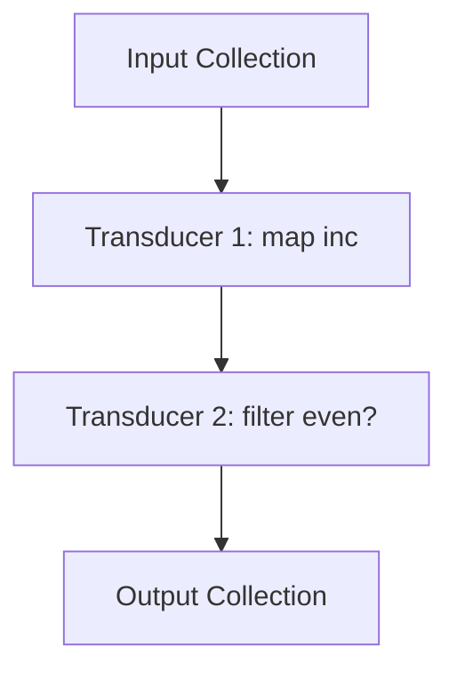

## 24.3 Transducers for Composable Data Processing

In the world of functional programming, transducers stand out as a powerful abstraction for composing data transformations. They offer a way to build reusable and efficient data processing pipelines that are independent of the context of their input and output sources. Let's delve into the concept of transducers, explore advanced uses, and understand how they can be integrated with Clojure's `core.async` library for asynchronous data processing.

### Recap of Transducers

Transducers are composable algorithmic transformations. Unlike traditional functions like `map`, `filter`, and `reduce`, which are tied to specific collection types, transducers decouple the transformation logic from the input and output contexts. This allows them to be applied to various data structures, including sequences, streams, and channels.

#### Key Characteristics of Transducers

- **Composability**: Transducers can be composed together to form complex transformations. This composability is akin to function composition, where smaller functions are combined to perform more sophisticated operations.
- **Context Independence**: Transducers operate independently of the data source. This means you can apply the same transducer to a list, a vector, or even a stream of data without modification.
- **Efficiency**: By eliminating intermediate collections, transducers reduce memory overhead and improve performance. They process data in a single pass, which is particularly beneficial for large datasets.

#### Basic Example of Transducers

Let's revisit a simple example of using transducers in Clojure:

```clojure
;; Define a transducer that increments each element and filters even numbers
(def my-transducer
  (comp (map inc) (filter even?)))

;; Apply the transducer to a collection
(transduce my-transducer conj [] [1 2 3 4 5])
;; => [2 4 6]
```

In this example, `my-transducer` is composed of two transformations: incrementing each element and filtering for even numbers. The `transduce` function applies this transducer to a vector, producing the result `[2 4 6]`.

### Advanced Uses of Transducers

Transducers are not limited to simple transformations. They can be extended to handle more complex scenarios, such as stateful transformations, early termination, and error handling.

#### Stateful Transducers

Stateful transducers maintain internal state across elements. This can be useful for operations like calculating running totals or detecting changes between consecutive elements.

```clojure
;; Define a stateful transducer to calculate running totals
(def running-total
  (fn [rf]
    (let [total (atom 0)]
      (fn
        ([] (rf))
        ([result] (rf result))
        ([result input]
         (swap! total + input)
         (rf result @total))))))

;; Apply the stateful transducer
(transduce running-total conj [] [1 2 3 4 5])
;; => [1 3 6 10 15]
```

In this example, `running-total` is a stateful transducer that keeps track of a running total using an atom. The transducer updates the total with each input element and passes the accumulated total to the reduction function.

#### Early Termination

Transducers can also be designed to terminate early based on certain conditions. This is useful for scenarios where processing should stop once a specific criterion is met.

```clojure
;; Define a transducer that stops processing after encountering a negative number
(def stop-on-negative
  (fn [rf]
    (fn
      ([] (rf))
      ([result] (rf result))
      ([result input]
       (if (neg? input)
         (reduced result)
         (rf result input))))))

;; Apply the transducer with early termination
(transduce stop-on-negative conj [] [1 2 3 -1 4 5])
;; => [1 2 3]
```

Here, `stop-on-negative` is a transducer that stops processing when a negative number is encountered. The `reduced` function is used to signal early termination.

#### Error Handling in Transducer Pipelines

Handling errors within transducer pipelines can be achieved by wrapping the transformation logic with error-catching mechanisms.

```clojure
;; Define a transducer that catches exceptions and logs errors
(def safe-transducer
  (fn [rf]
    (fn
      ([] (rf))
      ([result] (rf result))
      ([result input]
       (try
         (rf result (/ input 2))
         (catch Exception e
           (println "Error processing input:" input)
           result)))))

;; Apply the safe transducer
(transduce safe-transducer conj [] [4 2 0 8])
;; => [2 1]
;; Logs: Error processing input: 0
```

In this example, `safe-transducer` attempts to divide each input by 2. If an exception occurs (such as division by zero), it logs an error and continues processing the remaining elements.

### Performance Considerations

Transducers offer significant performance advantages by eliminating intermediate collections and reducing memory usage. This is particularly beneficial when processing large datasets or streams of data.

#### Efficiency Gains

- **Single Pass Processing**: Transducers process data in a single pass, reducing the number of iterations over the data. This minimizes computational overhead and improves performance.
- **Reduced Memory Footprint**: By avoiding intermediate collections, transducers lower memory consumption, which is crucial for handling large datasets efficiently.
- **Parallelism**: Transducers can be combined with parallel processing techniques to further enhance performance, especially on multi-core systems.

### Custom Transducers

Creating custom transducers allows you to tailor data processing to specific needs. This involves defining a transformation function that adheres to the transducer protocol.

#### Example of a Custom Transducer

Let's create a custom transducer that filters out duplicate elements from a collection:

```clojure
;; Define a custom transducer to remove duplicates
(defn dedupe-transducer [rf]
  (let [seen (atom #{})]
    (fn
      ([] (rf))
      ([result] (rf result))
      ([result input]
       (if (contains? @seen input)
         result
         (do
           (swap! seen conj input)
           (rf result input)))))))

;; Apply the custom transducer
(transduce (dedupe-transducer conj) conj [] [1 2 2 3 4 3 5])
;; => [1 2 3 4 5]
```

In this example, `dedupe-transducer` uses an atom to track seen elements and filters out duplicates.

### Integration with Core.async

Transducers can be seamlessly integrated with Clojure's `core.async` library to process streams of data asynchronously. This combination allows for efficient and concurrent data processing.

#### Using Transducers with Core.async Channels

Transducers can be applied to `core.async` channels, enabling transformations on data streams without blocking the main thread.

```clojure
(require '[clojure.core.async :as async])

;; Create a channel with a transducer
(def ch (async/chan 10 (map inc)))

;; Put data into the channel
(async/go
  (doseq [i (range 5)]
    (async/>! ch i)))

;; Take data from the channel
(async/go-loop []
  (when-let [val (async/<! ch)]
    (println "Received:" val)
    (recur)))

;; Output:
;; Received: 1
;; Received: 2
;; Received: 3
;; Received: 4
;; Received: 5
```

In this example, a channel is created with a transducer that increments each element. The `async/go` block puts data into the channel, and another `async/go-loop` block consumes and prints the transformed data.

### Visualizing Transducer Pipelines

To better understand how transducers work, let's visualize a simple transducer pipeline using a Mermaid.js diagram:



**Diagram Description**: This flowchart represents a transducer pipeline where the input collection is first transformed by incrementing each element (`map inc`), followed by filtering for even numbers (`filter even?`), resulting in the output collection.

### References and Links

- [Clojure Official Documentation](https://clojure.org/reference)
- [Clojure Community Resources](https://clojure.org/community/resources)
- [core.async on GitHub](https://github.com/clojure/core.async)
- [Transitioning from OOP to Functional Programming](https://www.lispcast.com/oo-to-fp/)

### Knowledge Check

To reinforce your understanding of transducers, consider the following questions:

1. What are the key advantages of using transducers over traditional collection processing functions?
2. How can stateful transducers be useful in data processing?
3. Describe a scenario where early termination in a transducer pipeline might be beneficial.
4. What are the performance benefits of using transducers in data processing?
5. How can transducers be integrated with `core.async` for asynchronous data processing?

### Practice Problems

1. Create a transducer that calculates the cumulative product of a sequence of numbers.
2. Implement a transducer that filters out elements based on a custom predicate function.
3. Design a transducer pipeline that processes a stream of data and logs each transformation step.

### Encouraging Engagement

Embracing functional programming can be challenging, but with each step, you'll gain a deeper understanding and see tangible benefits in your codebase. Transducers offer a powerful way to compose efficient data processing pipelines, and by experimenting with custom transducers and integrating them with `core.async`, you can unlock new possibilities for concurrent and scalable applications.

### Test Your Knowledge: Transducers for Composable Data Processing Quiz



### What is a key advantage of transducers?

- [x] They eliminate intermediate collections.
- [ ] They are only applicable to lists.
- [ ] They require more memory than traditional methods.
- [ ] They are slower than traditional methods.

> **Explanation:** Transducers eliminate intermediate collections, which reduces memory overhead and improves performance.

### How do stateful transducers maintain state?

- [x] By using atoms or other mutable references.
- [ ] By using immutable data structures.
- [ ] By creating new collections.
- [ ] By using global variables.

> **Explanation:** Stateful transducers maintain state using atoms or other mutable references to track changes across elements.

### What function is used for early termination in transducer pipelines?

- [x] `reduced`
- [ ] `terminate`
- [ ] `halt`
- [ ] `stop`

> **Explanation:** The `reduced` function is used to signal early termination in transducer pipelines.

### How can transducers be integrated with `core.async`?

- [x] By applying them to channels.
- [ ] By using them with lists only.
- [ ] By creating new threads.
- [ ] By using global variables.

> **Explanation:** Transducers can be applied to `core.async` channels to transform data streams asynchronously.

### What is a benefit of using transducers with `core.async`?

- [x] Asynchronous data processing.
- [ ] Increased memory usage.
- [ ] Slower data processing.
- [ ] Limited to single-threaded execution.

> **Explanation:** Transducers with `core.async` enable asynchronous data processing, allowing for efficient concurrent operations.

### How do transducers improve performance?

- [x] By processing data in a single pass.
- [ ] By creating multiple intermediate collections.
- [ ] By using more memory.
- [ ] By slowing down execution.

> **Explanation:** Transducers process data in a single pass, reducing computational overhead and improving performance.

### Can transducers be used with sequences?

- [x] Yes
- [ ] No

> **Explanation:** Transducers can be used with sequences, as well as other data structures like channels and streams.

### What is a custom transducer?

- [x] A transducer tailored to specific needs.
- [ ] A built-in Clojure function.
- [ ] A method for creating new collections.
- [ ] A global variable.

> **Explanation:** A custom transducer is a user-defined transformation tailored to specific data processing needs.

### What is the role of the `comp` function in transducers?

- [x] To compose multiple transducers.
- [ ] To create new collections.
- [ ] To terminate processing.
- [ ] To increase memory usage.

> **Explanation:** The `comp` function is used to compose multiple transducers into a single transformation pipeline.

### Transducers are only applicable to sequences.

- [ ] True
- [x] False

> **Explanation:** Transducers are not limited to sequences; they can be applied to various data structures, including channels and streams.



By understanding and leveraging transducers, you can create efficient, composable data processing pipelines that are both flexible and powerful. Continue exploring and experimenting with transducers to unlock their full potential in your Clojure applications.
