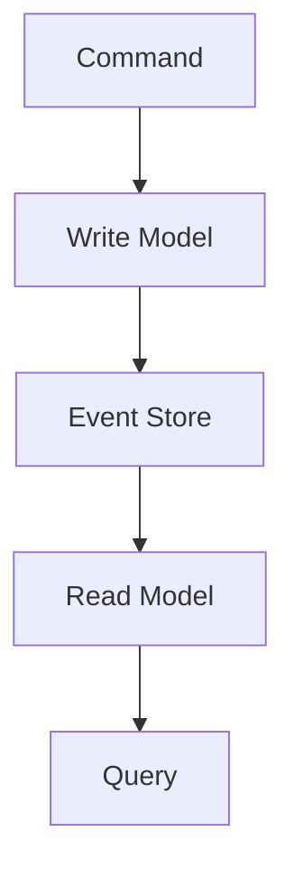

## 24.6 Functional Design in Distributed Systems

As we delve into the world of distributed systems, the principles of functional programming offer a robust foundation for designing scalable, resilient, and maintainable applications. In this section, we will explore how Clojure's functional paradigms, such as immutability and statelessness, provide distinct advantages in the context of distributed systems. We'll also examine key concepts like data serialization, event sourcing, CQRS, consistency models, and resilience strategies.

### Functional Principles in Distribution

#### Immutability and Statelessness

In distributed systems, immutability and statelessness are powerful allies. Immutability ensures that data cannot be altered once created, which simplifies reasoning about system behavior across distributed nodes. Statelessness, on the other hand, allows systems to scale horizontally by treating each request independently.

**Benefits of Immutability:**

- **Predictability**: Immutable data structures guarantee that data remains consistent across distributed nodes, eliminating the risk of concurrent modifications.
- **Simplified Caching**: Since immutable data does not change, caching strategies become straightforward and effective.
- **Easier Debugging**: With immutable data, the state of the system at any point in time can be easily reconstructed, aiding in debugging and auditing.

**Benefits of Statelessness:**

- **Scalability**: Stateless components can be replicated across multiple nodes without concern for shared state, facilitating horizontal scaling.
- **Resilience**: Stateless systems can recover from failures more gracefully, as they do not rely on local state.

### Data Serialization

Efficient data serialization is crucial for network communication in distributed systems. Clojure's immutable data structures can be serialized using various formats, such as JSON, Avro, or Protocol Buffers, each offering different trade-offs in terms of performance, schema evolution, and interoperability.

#### JSON Serialization

JSON is a widely used format due to its simplicity and human-readability. Clojure provides libraries like `cheshire` for efficient JSON serialization and deserialization.

```clojure
(require '[cheshire.core :as json])

(def data {:name "Alice" :age 30 :languages ["Clojure" "Java"]})

;; Serialize to JSON
(def json-data (json/generate-string data))
;; Deserialize from JSON
(def parsed-data (json/parse-string json-data true))
```

#### Avro and Protocol Buffers

For systems requiring schema evolution and compact binary formats, Avro and Protocol Buffers are excellent choices. They provide efficient serialization and deserialization, making them suitable for high-performance distributed systems.

- **Avro**: Supports schema evolution and is often used with Hadoop ecosystems.
- **Protocol Buffers**: Developed by Google, offers a language-neutral, platform-neutral, extensible mechanism for serializing structured data.

### Event Sourcing and CQRS

Event Sourcing and Command Query Responsibility Segregation (CQRS) are architectural patterns that align well with functional programming principles.

#### Event Sourcing

Event Sourcing involves storing the state of a system as a sequence of events. Each event represents a change to the system, allowing the current state to be reconstructed by replaying events.

**Advantages of Event Sourcing:**

- **Auditability**: Every change is recorded, providing a complete history of state changes.
- **Flexibility**: Enables easy implementation of features like time travel and event replay for debugging.

```clojure
(defn apply-event [state event]
  (case (:type event)
    :user-created (assoc state :user (:user event))
    :user-updated (merge state (:user event))
    state))

(def events [{:type :user-created :user {:name "Alice" :age 30}}
             {:type :user-updated :user {:age 31}}])

(def current-state (reduce apply-event {} events))
```

#### CQRS

CQRS separates the read and write models of a system, allowing each to be optimized independently. The write model handles commands that change state, while the read model provides query capabilities.

**Benefits of CQRS:**

- **Scalability**: Read and write workloads can be scaled independently.
- **Performance**: Optimized read models can improve query performance.

```clojure
(defn handle-command [state command]
  (case (:type command)
    :create-user {:type :user-created :user (:user command)}
    :update-user {:type :user-updated :user (:user command)}))

(defn query-user [state user-id]
  (get state user-id))
```

### Consistency Models

In distributed systems, achieving consistency is a challenge. Functional programming models, with their focus on immutability, can accommodate eventual consistency, a common consistency model in distributed systems.

#### Eventual Consistency

Eventual consistency allows for temporary inconsistencies, with the guarantee that all nodes will eventually converge to the same state. This model is suitable for systems where availability is prioritized over immediate consistency.

**Functional Programming and Eventual Consistency:**

- **Immutability**: Immutable data structures ensure that once data is consistent, it remains so.
- **Functional Updates**: Functional updates can be applied to achieve consistency without side effects.

```clojure
(defn update-state [state updates]
  (reduce (fn [s u] (assoc s (:key u) (:value u))) state updates))
```

### Resilience and Fault Tolerance

Building resilient distributed systems requires strategies to handle failures gracefully. Functional programming offers concepts like supervision trees and retry mechanisms to enhance fault tolerance.

#### Supervision Trees

Supervision trees, inspired by Erlang's fault-tolerant design, organize processes hierarchically, allowing failures to be contained and managed.

**Implementing Supervision Trees in Clojure:**

- **Process Isolation**: Each process runs independently, with failures isolated to the specific process.
- **Automatic Restart**: Failed processes can be automatically restarted by their supervisors.

#### Retry Mechanisms

Retry mechanisms attempt to recover from transient failures by retrying operations. Functional programming enables clean implementation of retry logic using higher-order functions.

```clojure
(defn retry [n f]
  (loop [attempts n]
    (try
      (f)
      (catch Exception e
        (when (pos? attempts)
          (recur (dec attempts)))))))

(retry 3 #(println "Attempting operation"))
```

### Visual Aids

To better understand the concepts discussed, let's visualize some of the key ideas using diagrams.

#### Immutability and Statelessness


*Diagram 1: Stateless components process requests independently, using immutable data.*

#### Event Sourcing and CQRS


*Diagram 2: Event Sourcing and CQRS architecture, separating write and read models.*

### References and Links

For further reading and resources, consider exploring the following:

- [Clojure Official Documentation](https://clojure.org/reference)
- [Event Sourcing](https://martinfowler.com/eaaDev/EventSourcing.html)
- [CQRS](https://martinfowler.com/bliki/CQRS.html)
- [Transitioning from OOP to Functional Programming](https://www.lispcast.com/oo-to-fp/)

### Knowledge Check

To reinforce your understanding of functional design in distributed systems, consider the following questions:

1. How does immutability simplify distributed system design?
2. What are the benefits of using JSON for data serialization in Clojure?
3. Describe the role of event sourcing in maintaining system state.
4. How does CQRS improve system scalability and performance?
5. What is eventual consistency and how does it relate to functional programming?

### Exercises

1. Implement a simple event-sourced system in Clojure that tracks user account changes.
2. Experiment with different data serialization formats and measure their performance in a distributed setup.
3. Design a CQRS-based application using Clojure, separating the command and query models.

### Encouraging Engagement

Embracing functional programming in distributed systems can be challenging, but with each step, you'll gain a deeper understanding and see tangible benefits in your codebase. Keep experimenting, learning, and applying these concepts to build robust and scalable applications.

## **Test Your Knowledge: Functional Design in Distributed Systems Quiz**



### How does immutability benefit distributed systems?

- [x] It ensures data consistency across nodes.
- [ ] It allows data to be modified concurrently.
- [ ] It complicates caching strategies.
- [ ] It makes debugging more difficult.

> **Explanation:** Immutability ensures that data cannot be altered, providing consistency across distributed nodes and simplifying caching and debugging.

### What is a key advantage of statelessness in distributed systems?

- [x] Scalability
- [ ] Increased complexity
- [ ] Dependency on local state
- [ ] Reduced resilience

> **Explanation:** Statelessness allows systems to scale horizontally by treating each request independently, enhancing scalability and resilience.

### Which serialization format is known for its human-readability?

- [x] JSON
- [ ] Avro
- [ ] Protocol Buffers
- [ ] XML

> **Explanation:** JSON is widely used for its simplicity and human-readability, making it a popular choice for data serialization.

### What does Event Sourcing store?

- [x] A sequence of events representing state changes
- [ ] Only the current state of the system
- [ ] User sessions
- [ ] Application logs

> **Explanation:** Event Sourcing stores a sequence of events that represent changes to the system, allowing the current state to be reconstructed by replaying events.

### How does CQRS separate system concerns?

- [x] By separating read and write models
- [ ] By combining read and write models
- [ ] By focusing only on write operations
- [ ] By focusing only on read operations

> **Explanation:** CQRS separates the read and write models of a system, allowing each to be optimized independently for improved scalability and performance.

### What is eventual consistency?

- [x] A model where all nodes eventually converge to the same state
- [ ] A model ensuring immediate consistency across nodes
- [ ] A model requiring manual synchronization
- [ ] A model that avoids consistency altogether

> **Explanation:** Eventual consistency allows for temporary inconsistencies, with the guarantee that all nodes will eventually converge to the same state.

### How can retry mechanisms be implemented in functional programming?

- [x] Using higher-order functions
- [ ] Using mutable state
- [ ] Using global variables
- [ ] Using imperative loops

> **Explanation:** Retry mechanisms can be cleanly implemented using higher-order functions, which encapsulate the retry logic in a functional manner.

### What is the role of supervision trees?

- [x] Organizing processes hierarchically for fault tolerance
- [ ] Increasing system complexity
- [ ] Reducing system performance
- [ ] Eliminating process isolation

> **Explanation:** Supervision trees organize processes hierarchically, allowing failures to be contained and managed, enhancing fault tolerance.

### Which concept aligns well with functional programming principles?

- [x] Event Sourcing
- [ ] Global state management
- [ ] Imperative loops
- [ ] Mutable data structures

> **Explanation:** Event Sourcing aligns well with functional programming principles, as it involves storing state changes as immutable events.

### True or False: Functional programming simplifies debugging in distributed systems.

- [x] True
- [ ] False

> **Explanation:** True. Functional programming, with its emphasis on immutability and statelessness, simplifies reasoning about system behavior, aiding in debugging.


