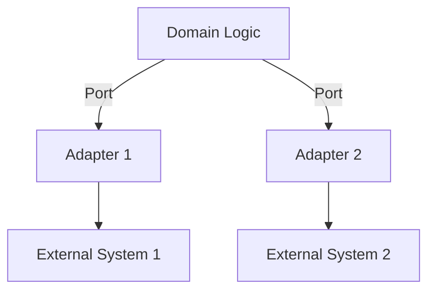
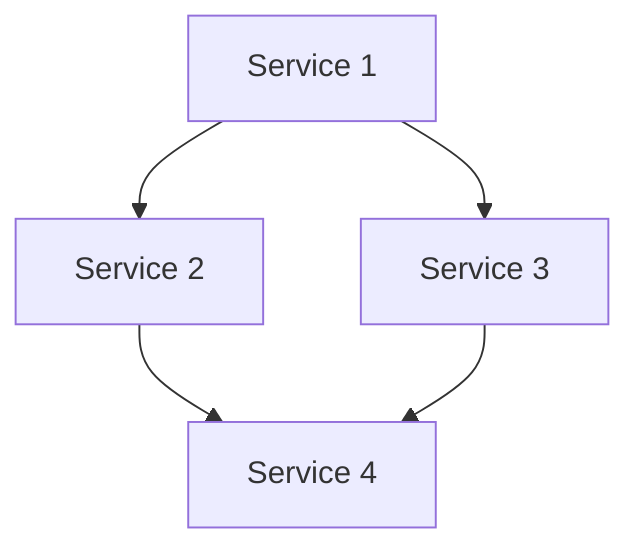
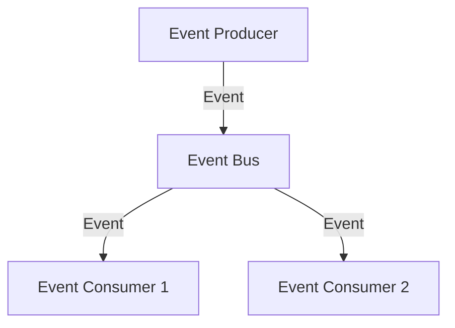

## 24.7 Software Architecture Patterns in Functional Programming

In the world of software development, architecture patterns play a crucial role in shaping how applications are structured, maintained, and scaled. Functional programming, with its emphasis on immutability, pure functions, and declarative code, offers unique perspectives on these patterns. In this section, we will delve into several key architecture patterns that align well with functional programming principles, particularly in the context of Clojure.

### Functional Core, Imperative Shell

The **Functional Core, Imperative Shell** is an architectural pattern that leverages the strengths of functional programming by separating the pure, functional logic of an application from its side-effect-laden operations. This pattern is particularly beneficial in environments where predictability and testability are paramount.

**Functional Core**: At the heart of this pattern is the functional core, which consists of pure functions that operate on immutable data. These functions are deterministic, meaning they always produce the same output given the same input, which makes them easy to test and reason about.

**Imperative Shell**: Surrounding the functional core is the imperative shell, which handles side effects such as I/O operations, state changes, and interactions with external systems. By isolating side effects to the shell, we can keep the core logic clean and maintainable.

#### Code Example

```clojure
;; Functional Core: Pure function for processing orders
(defn process-order [order]
  ;; Pure logic to calculate total
  (let [subtotal (reduce + (map :price (:items order)))]
    {:order-id (:id order)
     :total subtotal}))

;; Imperative Shell: Function to handle order processing
(defn handle-order [order]
  ;; Side-effect: Logging
  (println "Processing order:" (:id order))
  ;; Call to functional core
  (let [processed-order (process-order order)]
    ;; Side-effect: Saving to database
    (save-to-db processed-order)
    ;; Side-effect: Sending confirmation email
    (send-confirmation-email processed-order)))
```

In this example, `process-order` is a pure function that calculates the total price of an order, while `handle-order` manages side effects like logging, database interactions, and email notifications.

### Hexagonal Architecture

**Hexagonal Architecture**, also known as Ports and Adapters, is a pattern that promotes decoupling between an application and its external dependencies. This architecture is particularly well-suited for functional programming, as it aligns with the principles of modularity and separation of concerns.

**Core Components**:
- **Domain Logic**: The central part of the architecture, implemented using pure functions and immutable data structures.
- **Ports**: Interfaces that define how the application interacts with the outside world.
- **Adapters**: Implementations of the ports, responsible for handling specific external interactions.

#### Diagram



*Diagram: Hexagonal Architecture illustrating the separation between domain logic and external systems via ports and adapters.*

#### Code Example

```clojure
;; Domain Logic: Pure function for business rule
(defn calculate-discount [customer order]
  (if (= (:membership customer) :premium)
    (* 0.9 (:total order))
    (:total order)))

;; Port: Interface for discount calculation
(defprotocol DiscountCalculator
  (apply-discount [this customer order]))

;; Adapter: Implementation of the port
(defrecord PremiumDiscountCalculator []
  DiscountCalculator
  (apply-discount [this customer order]
    (calculate-discount customer order)))
```

In this example, the `calculate-discount` function represents the domain logic, while `DiscountCalculator` and `PremiumDiscountCalculator` illustrate the port and adapter concept.

### Microservices and Distributed Systems

Functional programming's emphasis on immutability and statelessness makes it an excellent fit for **Microservices Architecture**. Microservices are small, independently deployable services that work together to form a larger application. This architecture promotes scalability, maintainability, and resilience.

**Key Concepts**:
- **Service Independence**: Each microservice encapsulates a specific business capability and can be developed, deployed, and scaled independently.
- **Statelessness**: Functional programming encourages statelessness, which simplifies scaling and fault tolerance in distributed systems.
- **Data Consistency**: Immutability ensures data consistency across services, reducing the risk of concurrency issues.

#### Diagram



*Diagram: Microservices architecture with independent services communicating with each other.*

#### Code Example

```clojure
;; Service 1: User service
(defn get-user [user-id]
  ;; Simulate fetching user data
  {:id user-id :name "Alice"})

;; Service 2: Order service
(defn create-order [user-id items]
  (let [user (get-user user-id)]
    {:order-id (java.util.UUID/randomUUID)
     :user user
     :items items}))

;; Service 3: Notification service
(defn send-notification [order]
  (println "Sending notification for order:" (:order-id order)))
```

In this example, each service performs a distinct function, such as retrieving user data, creating orders, or sending notifications, demonstrating the independence and collaboration of microservices.

### Event-Driven Architectures

**Event-Driven Architecture** is a design paradigm where components communicate through events. This approach promotes loose coupling and scalability, making it a natural fit for functional programming.

**Core Concepts**:
- **Event Producers**: Components that generate events based on actions or changes in state.
- **Event Consumers**: Components that listen for and respond to events.
- **Event Bus**: A mechanism for transmitting events between producers and consumers.

#### Diagram



*Diagram: Event-driven architecture with an event bus facilitating communication between producers and consumers.*

#### Code Example

```clojure
;; Event Producer: Function to create an order
(defn create-order [order]
  ;; Simulate order creation
  (println "Order created:" order)
  ;; Produce event
  (publish-event :order-created order))

;; Event Consumer: Function to handle order creation event
(defn on-order-created [order]
  (println "Handling order created event for order:" order))

;; Event Bus: Simple event bus implementation
(defn publish-event [event-type data]
  (case event-type
    :order-created (on-order-created data)
    (println "Unknown event type")))

;; Example usage
(create-order {:id 1 :items ["item1" "item2"]})
```

In this example, `create-order` acts as an event producer, while `on-order-created` is an event consumer. The `publish-event` function simulates an event bus, routing events to appropriate handlers.

### Combining Patterns

In complex applications, it is often beneficial to combine multiple architectural patterns to address diverse requirements. For example, a system might use a microservices architecture for scalability, with each service following the hexagonal architecture pattern to ensure modularity and testability.

#### Guidelines for Combining Patterns

1. **Identify Core Requirements**: Understand the key requirements of your application, such as scalability, maintainability, and resilience.
2. **Select Appropriate Patterns**: Choose architectural patterns that align with your requirements and leverage the strengths of functional programming.
3. **Ensure Compatibility**: Verify that the selected patterns can be integrated seamlessly, avoiding conflicts or redundancies.
4. **Iterate and Refine**: Continuously evaluate and refine your architecture as your application evolves, incorporating feedback and lessons learned.

### Conclusion

By adopting these software architecture patterns, developers can harness the power of functional programming to build scalable, maintainable, and resilient applications. Whether you are working with a functional core and imperative shell, implementing hexagonal architecture, designing microservices, or embracing event-driven systems, these patterns provide a solid foundation for success.

### Further Reading

- [Clojure Official Documentation](https://clojure.org/reference)
- [Hexagonal Architecture](https://alistair.cockburn.us/hexagonal-architecture/)
- [Transitioning from OOP to Functional Programming](https://www.lispcast.com/oo-to-fp/)
- [Microservices Architecture](https://martinfowler.com/articles/microservices.html)
- [Event-Driven Architecture](https://martinfowler.com/articles/201701-event-driven.html)

## **Test Your Knowledge: Software Architecture Patterns in Functional Programming Quiz**



### What is the main benefit of the Functional Core, Imperative Shell pattern?

- [x] Separation of pure logic from side effects
- [ ] Simplification of database interactions
- [ ] Enhanced user interface design
- [ ] Increased complexity of the codebase

> **Explanation:** The Functional Core, Imperative Shell pattern separates pure logic from side effects, promoting testability and maintainability.


### How does Hexagonal Architecture promote decoupling?

- [x] By using ports and adapters
- [ ] By increasing the number of classes
- [ ] By centralizing all logic in one module
- [ ] By eliminating interfaces

> **Explanation:** Hexagonal Architecture uses ports and adapters to decouple the application from external systems.


### What is a key advantage of microservices architecture?

- [x] Independent deployment of services
- [ ] Centralized data storage
- [ ] Single point of failure
- [ ] Tightly coupled components

> **Explanation:** Microservices architecture allows for independent deployment of services, enhancing scalability and maintainability.


### In event-driven architectures, what role does the event bus play?

- [x] It transmits events between producers and consumers
- [ ] It stores all application data
- [ ] It manages user authentication
- [ ] It handles UI rendering

> **Explanation:** The event bus transmits events between producers and consumers, facilitating communication in an event-driven architecture.


### Which pattern is best suited for handling side effects in functional programming?

- [x] Imperative Shell
- [ ] Functional Core
- [ ] Event Bus
- [ ] Microservices

> **Explanation:** The Imperative Shell is responsible for handling side effects, while the Functional Core contains pure logic.


### What is a common challenge when combining multiple architecture patterns?

- [x] Ensuring compatibility and avoiding redundancies
- [ ] Increasing the number of services
- [ ] Simplifying the user interface
- [ ] Reducing the number of developers

> **Explanation:** When combining multiple architecture patterns, it's important to ensure compatibility and avoid redundancies.


### How does functional programming facilitate microservices architecture?

- [x] By promoting immutability and statelessness
- [ ] By increasing the use of global variables
- [ ] By centralizing all logic
- [ ] By eliminating function calls

> **Explanation:** Functional programming promotes immutability and statelessness, which are beneficial for microservices architecture.


### What is the primary focus of event-driven architectures?

- [x] Communication through events
- [ ] Centralized data processing
- [ ] User interface design
- [ ] Database normalization

> **Explanation:** Event-driven architectures focus on communication through events, promoting loose coupling and scalability.


### Which component in Hexagonal Architecture defines how the application interacts with the outside world?

- [x] Ports
- [ ] Adapters
- [ ] Domain Logic
- [ ] Event Bus

> **Explanation:** Ports define how the application interacts with the outside world in Hexagonal Architecture.


### True or False: In the Functional Core, Imperative Shell pattern, the core logic is responsible for handling I/O operations.

- [ ] True
- [x] False

> **Explanation:** False. In the Functional Core, Imperative Shell pattern, the core logic is pure and does not handle I/O operations; the shell manages side effects.


