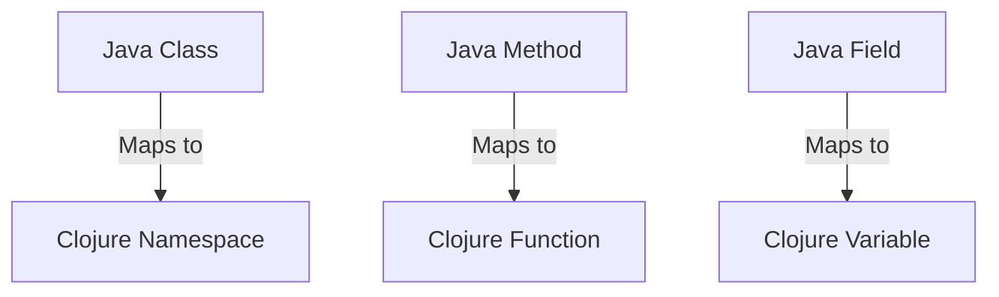
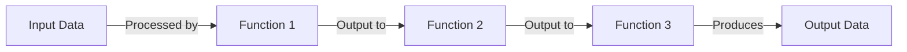

## 25.2 Recommended Resources for Further Learning

As we conclude our journey through mastering functional programming with Clojure, it's essential to keep the momentum going by exploring additional resources. This section provides a curated list of books, online courses, communities, and multimedia content that will help you deepen your understanding and expertise in Clojure and functional programming. Whether you're a seasoned developer or new to the functional paradigm, these resources will offer valuable insights and learning opportunities.

### Books

Books are a timeless resource for in-depth learning and understanding. Here are some highly recommended books to enhance your Clojure skills:

- **"Clojure for the Brave and True" by Daniel Higginbotham**  
  This book is an excellent starting point for those new to Clojure. It takes a humorous and engaging approach to teaching Clojure, making complex concepts accessible and enjoyable. Higginbotham's style is both informative and entertaining, providing practical examples and exercises to reinforce learning.

- **"Functional Programming in Clojure" by Rafal Dittwald**  
  Dive deeper into the functional programming aspects of Clojure with this comprehensive guide. Dittwald covers advanced topics such as concurrency, state management, and functional design patterns, making it ideal for developers looking to enhance their functional programming skills.

### Online Courses

Online courses offer structured learning paths and the flexibility to learn at your own pace. Here are some top courses to consider:

- **[Clojure Programming on Coursera](https://www.coursera.org/course/progfun)**  
  This course provides a solid foundation in Clojure programming, covering essential topics such as data structures, functions, and concurrency. With video lectures, quizzes, and hands-on projects, it's an excellent resource for both beginners and intermediate learners.

- **[Clojure Track on Exercism](https://exercism.org/tracks/clojure)**  
  Exercism offers a unique approach to learning through practice and mentorship. The Clojure track includes a series of exercises designed to challenge your problem-solving skills and deepen your understanding of the language. With community support and feedback, it's a great way to learn by doing.

### Communities

Engaging with communities is a fantastic way to connect with other Clojure enthusiasts, share knowledge, and stay updated on the latest developments:

- **[ClojureVerse](https://clojureverse.org/)**  
  ClojureVerse is a friendly and inclusive community where you can discuss Clojure-related topics, ask questions, and share your projects. It's a great place to connect with like-minded individuals and learn from the experiences of others.

- **[r/Clojure on Reddit](https://www.reddit.com/r/Clojure/)**  
  The Clojure subreddit is an active community where you can find discussions on a wide range of topics, from beginner questions to advanced concepts. It's a valuable resource for staying informed about the latest news, libraries, and tools in the Clojure ecosystem.

### Podcasts and Videos

Podcasts and videos are excellent for learning on the go and gaining insights from experts in the field:

- **[The REPL Podcast](https://therepl.net/)**  
  This podcast features interviews with Clojure developers and discussions on various topics related to functional programming and software development. It's a great way to gain insights from industry experts and stay updated on the latest trends.

- **[Clojure TV on YouTube](https://www.youtube.com/channel/UCaCxkaK0bNDiuzG5a9K2WQg)**  
  Clojure TV offers a collection of video tutorials, talks, and presentations on Clojure and functional programming. Whether you're looking for beginner tutorials or advanced conference talks, this channel has something for everyone.

### Additional Resources

In addition to the resources mentioned above, here are a few more to consider:

- **[Clojure Official Documentation](https://clojure.org/reference)**  
  The official Clojure documentation is a comprehensive resource for understanding the language's syntax, features, and standard library. It's an essential reference for any Clojure developer.

- **[Clojure Community Resources](https://clojure.org/community/resources)**  
  This page on the Clojure website provides links to various community resources, including mailing lists, forums, and user groups. It's a great starting point for finding additional learning materials and connecting with the Clojure community.

- **[Transitioning from OOP to Functional Programming](https://www.lispcast.com/oo-to-fp/)**  
  For Java developers transitioning to Clojure, this resource offers insights into the differences between object-oriented and functional programming paradigms. It provides practical tips and examples to help ease the transition.

### Code Examples and Exercises

To reinforce your learning, let's explore some practical code examples and exercises. These examples will help you apply the concepts you've learned and experiment with Clojure's features.

#### Example 1: Implementing a Simple Function

```clojure
;; Define a function that calculates the factorial of a number
(defn factorial [n]
  (if (<= n 1)
    1
    (* n (factorial (dec n)))))

;; Test the function
(println (factorial 5)) ; Output: 120
```

> **Try It Yourself:** Modify the `factorial` function to use tail recursion for improved performance.

#### Example 2: Using Higher-Order Functions

```clojure
;; Define a function that applies a given function to each element in a list
(defn apply-to-list [f lst]
  (map f lst))

;; Test the function with a lambda that doubles each number
(println (apply-to-list #(* 2 %) [1 2 3 4])) ; Output: (2 4 6 8)
```

> **Try It Yourself:** Experiment with different functions to apply to the list, such as incrementing each number or converting numbers to strings.

### Visual Aids

To better understand the transition from Java OOP to Clojure's functional paradigm, let's explore some visual aids.

#### Diagram: Mapping Java Classes to Clojure Namespaces and Functions



> **Description:** This diagram illustrates how Java classes, methods, and fields map to Clojure namespaces, functions, and variables.

#### Diagram: Data Flow in Clojure Functional Programs



> **Description:** This diagram shows the flow of data through a series of functions in a Clojure program, highlighting the functional composition and data transformation process.

### Knowledge Check

To test your understanding of the recommended resources and concepts covered in this section, try answering the following questions:

#### Question 1

- What book is recommended for beginners to learn Clojure in an engaging and humorous way?
  - [x] "Clojure for the Brave and True" by Daniel Higginbotham
  - [ ] "Functional Programming in Clojure" by Rafal Dittwald
  - [ ] "Programming Clojure" by Alex Miller
  - [ ] "The Joy of Clojure" by Michael Fogus

> **Explanation:** "Clojure for the Brave and True" is known for its engaging and humorous approach to teaching Clojure, making it ideal for beginners.

#### Question 2

- Which online course offers a hands-on approach to learning Clojure through exercises and mentorship?
  - [ ] Clojure Programming on Coursera
  - [x] Clojure Track on Exercism
  - [ ] Clojure for Beginners on Udemy
  - [ ] Clojure Mastery on Pluralsight

> **Explanation:** The Clojure Track on Exercism provides a hands-on learning experience with exercises and community mentorship.

#### Question 3

- Which community platform is known for its friendly and inclusive environment for discussing Clojure-related topics?
  - [ ] Stack Overflow
  - [ ] GitHub
  - [x] ClojureVerse
  - [ ] Hacker News

> **Explanation:** ClojureVerse is recognized for its welcoming and inclusive community, making it a great place for Clojure discussions.

#### Question 4

- What is the focus of the REPL Podcast in relation to Clojure?
  - [ ] Interviewing Java developers
  - [x] Discussing Clojure and functional programming topics
  - [ ] Exploring web development frameworks
  - [ ] Analyzing software architecture patterns

> **Explanation:** The REPL Podcast focuses on Clojure and functional programming topics, featuring interviews and discussions with experts.

#### Question 5

- Which visual aid illustrates the mapping of Java classes to Clojure namespaces?
  - [ ] Data Flow Diagram
  - [x] Mapping Diagram
  - [ ] Sequence Diagram
  - [ ] Class Diagram

> **Explanation:** The Mapping Diagram shows how Java classes, methods, and fields map to Clojure namespaces, functions, and variables.

### Exercises

To further solidify your understanding, try solving these exercises:

1. **Exercise 1:** Refactor the `factorial` function to use tail recursion and compare its performance with the original implementation.

2. **Exercise 2:** Create a new higher-order function that filters a list based on a given predicate function and test it with various conditions.

3. **Exercise 3:** Design a simple Clojure program that simulates a data processing pipeline using function composition and threading macros.

4. **Exercise 4:** Explore the Clojure community resources and participate in a discussion or contribute to an open-source project.

5. **Exercise 5:** Listen to an episode of the REPL Podcast and summarize the key takeaways related to Clojure or functional programming.

### Conclusion

Embracing functional programming with Clojure is a rewarding journey that opens up new possibilities for building scalable and maintainable applications. By leveraging the recommended resources, engaging with the community, and continuously practicing, you'll deepen your understanding and become proficient in this powerful paradigm. Remember, the key to mastery is persistence and curiosity, so keep exploring and experimenting with Clojure's rich ecosystem.

## **Test Your Knowledge: Recommended Resources for Further Learning Quiz**



### What book is recommended for beginners to learn Clojure in an engaging and humorous way?

- [x] "Clojure for the Brave and True" by Daniel Higginbotham
- [ ] "Functional Programming in Clojure" by Rafal Dittwald
- [ ] "Programming Clojure" by Alex Miller
- [ ] "The Joy of Clojure" by Michael Fogus

> **Explanation:** "Clojure for the Brave and True" is known for its engaging and humorous approach to teaching Clojure, making it ideal for beginners.


### Which online course offers a hands-on approach to learning Clojure through exercises and mentorship?

- [ ] Clojure Programming on Coursera
- [x] Clojure Track on Exercism
- [ ] Clojure for Beginners on Udemy
- [ ] Clojure Mastery on Pluralsight

> **Explanation:** The Clojure Track on Exercism provides a hands-on learning experience with exercises and community mentorship.


### Which community platform is known for its friendly and inclusive environment for discussing Clojure-related topics?

- [ ] Stack Overflow
- [ ] GitHub
- [x] ClojureVerse
- [ ] Hacker News

> **Explanation:** ClojureVerse is recognized for its welcoming and inclusive community, making it a great place for Clojure discussions.


### What is the focus of the REPL Podcast in relation to Clojure?

- [ ] Interviewing Java developers
- [x] Discussing Clojure and functional programming topics
- [ ] Exploring web development frameworks
- [ ] Analyzing software architecture patterns

> **Explanation:** The REPL Podcast focuses on Clojure and functional programming topics, featuring interviews and discussions with experts.


### Which visual aid illustrates the mapping of Java classes to Clojure namespaces?

- [ ] Data Flow Diagram
- [x] Mapping Diagram
- [ ] Sequence Diagram
- [ ] Class Diagram

> **Explanation:** The Mapping Diagram shows how Java classes, methods, and fields map to Clojure namespaces, functions, and variables.


### What is the primary benefit of using higher-order functions in Clojure?

- [x] They allow functions to be passed as arguments and returned as values
- [ ] They improve the readability of code
- [ ] They reduce the need for recursion
- [ ] They simplify error handling

> **Explanation:** Higher-order functions enable functions to be passed as arguments and returned as values, enhancing flexibility and composability.


### How does the Clojure community benefit from platforms like Reddit and ClojureVerse?

- [x] By fostering collaboration and knowledge sharing
- [ ] By providing official documentation
- [ ] By offering paid courses
- [ ] By restricting access to experienced developers

> **Explanation:** Platforms like Reddit and ClojureVerse foster collaboration and knowledge sharing, benefiting the Clojure community.


### What is a key feature of Clojure's functional programming paradigm?

- [x] Immutability and pure functions
- [ ] Object-oriented inheritance
- [ ] Dynamic typing
- [ ] Manual memory management

> **Explanation:** Immutability and pure functions are key features of Clojure's functional programming paradigm, promoting reliability and simplicity.


### Why is it important to engage with the Clojure community?

- [x] To stay updated on the latest developments and best practices
- [ ] To obtain free software licenses
- [ ] To receive official certifications
- [ ] To avoid learning from other languages

> **Explanation:** Engaging with the Clojure community helps developers stay updated on the latest developments and best practices.


### True or False: Clojure's functional programming approach can enhance code scalability and maintainability.

- [x] True
- [ ] False

> **Explanation:** True. Clojure's functional programming approach, with its emphasis on immutability and pure functions, can enhance code scalability and maintainability.


