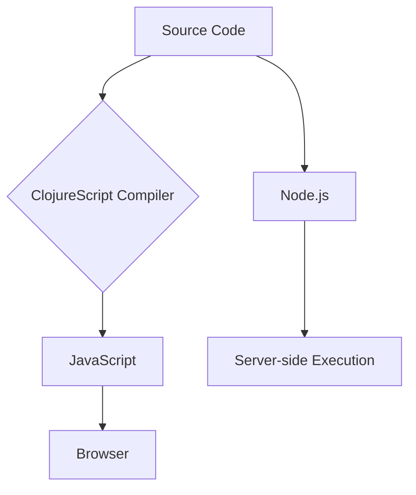
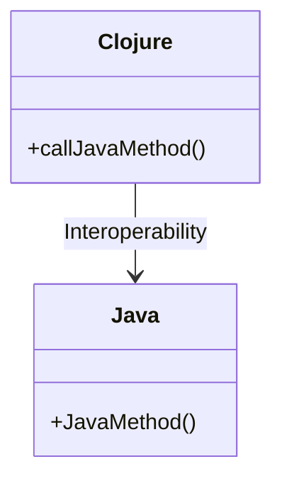

## 25.5 Leveraging Functional Programming Across Platforms

As we conclude our journey through mastering functional programming with Clojure, it's essential to recognize the broader landscape where functional programming can be applied. The principles we've explored are not confined to Clojure alone; they can be leveraged across various platforms and languages, enhancing software development in numerous domains. In this section, we'll delve into how you can extend functional programming paradigms beyond Clojure, exploring opportunities with ClojureScript for front-end development, Clojure's interoperability with Java, and the application of functional concepts in other languages like JavaScript, Python, and Swift. We'll also touch upon emerging technologies where functional programming is making significant inroads.

### ClojureScript and Front-End Development

ClojureScript, a variant of Clojure that compiles to JavaScript, opens up exciting possibilities for front-end development. It allows developers to bring the power of functional programming to web and mobile applications, providing a seamless experience across the stack.

#### **Benefits of ClojureScript**

- **Immutable Data Structures**: Just like Clojure, ClojureScript uses immutable data structures, which leads to more predictable and reliable code.
- **Interactive Development**: With tools like Figwheel, developers can enjoy a live coding experience, where changes are reflected instantly in the browser.
- **Rich Ecosystem**: Leverage libraries like Reagent and Re-frame to build reactive user interfaces efficiently.

#### **Code Example: Building a Simple ClojureScript Application**

```clojure
(ns my-app.core
  (:require [reagent.core :as r]))

(defn hello-world []
  [:div "Hello, World!"])

(defn init []
  (r/render [hello-world]
            (.getElementById js/document "app")))

;; Call the init function to render the component
(init)
```

In this example, we define a simple React component using Reagent, a ClojureScript interface to React. The `init` function renders the component to the DOM.

#### **Try It Yourself**

- Modify the `hello-world` function to accept a name as a parameter and display a personalized greeting.
- Explore how state management works in Re-frame and try integrating a simple counter component.

#### **Visual Aid: ClojureScript Architecture**



*This diagram illustrates the ClojureScript compilation process, where source code is compiled into JavaScript, which can then be executed in a browser or on a Node.js server.*

### Clojure on the JVM

Clojure's interoperability with Java makes it an excellent choice for enterprise applications. By running on the Java Virtual Machine (JVM), Clojure can seamlessly integrate with existing Java libraries and frameworks, allowing developers to leverage the vast Java ecosystem.

#### **Interoperability with Java**

- **Calling Java Code**: Clojure can directly call Java methods, making it easy to use Java libraries.
- **Java Interop Syntax**: Use the `.` operator to access Java methods and fields.

#### **Code Example: Using a Java Library in Clojure**

```clojure
(ns my-app.core
  (:import [java.util Date]))

(defn current-date []
  (let [date (Date.)]
    (.toString date)))

(println (current-date))
```

In this example, we import the `java.util.Date` class and use it to print the current date. The `.` operator is used to call the `toString` method on the `Date` object.

#### **Visual Aid: Clojure and Java Interoperability**



*This diagram illustrates how Clojure can interact with Java classes, leveraging existing Java methods within Clojure code.*

#### **Try It Yourself**

- Experiment with calling different Java libraries from Clojure, such as Apache Commons or Google Guava.
- Create a simple Clojure application that uses a Java-based database driver to connect to a database.

### Functional Programming in Other Ecosystems

Functional programming principles can be applied in other languages, offering similar benefits of simplicity, modularity, and ease of reasoning.

#### **JavaScript**

JavaScript, with its first-class functions and closures, is well-suited for functional programming. Libraries like Ramda and Lodash provide functional utilities that make it easier to apply these paradigms.

#### **Python**

Python's functional programming features include list comprehensions, generator expressions, and functions like `map`, `filter`, and `reduce`. Libraries like `toolz` and `funcy` extend these capabilities.

#### **Swift**

Swift supports functional programming with features like closures, higher-order functions, and value types. Swift's standard library includes many functional constructs, making it a powerful language for functional programming on Apple platforms.

#### **Code Example: Functional Programming in JavaScript**

```javascript
const numbers = [1, 2, 3, 4, 5];
const doubled = numbers.map(n => n * 2);
console.log(doubled); // [2, 4, 6, 8, 10]
```

In this JavaScript example, we use the `map` function to double each number in an array, demonstrating the use of higher-order functions.

#### **Try It Yourself**

- Implement a filter function in Python that removes all negative numbers from a list.
- Use Swift's `map` and `filter` functions to process an array of integers.

### Emerging Technologies

Functional programming is increasingly intersecting with emerging technologies, offering new opportunities for innovation.

#### **Data Science and Machine Learning**

Functional programming's emphasis on immutability and pure functions makes it well-suited for data science, where reproducibility and reliability are crucial.

- **Libraries**: Libraries like `Clojure Data Science` and `Neanderthal` provide tools for data analysis and machine learning in Clojure.

#### **Blockchain**

Blockchain technology benefits from functional programming's immutability and deterministic behavior, which are essential for creating secure and reliable systems.

- **Smart Contracts**: Functional languages like Haskell and Clojure are used to write smart contracts, ensuring correctness and security.

#### **Code Example: Data Processing with Clojure**

```clojure
(ns data-processing.core)

(def data [1 2 3 4 5])

(defn process-data [data]
  (->> data
       (filter even?)
       (map #(* % 2))))

(println (process-data data)) ; [4 8]
```

In this example, we use Clojure's `filter` and `map` functions to process a collection of data, demonstrating a typical data transformation pipeline.

#### **Try It Yourself**

- Explore how functional programming can be applied to a blockchain use case, such as implementing a simple cryptocurrency wallet.
- Experiment with using Clojure for a data science project, analyzing a dataset with functional transformations.

### Knowledge Check

Before we wrap up, let's reinforce what we've learned with a few questions:

- **What are the benefits of using ClojureScript for front-end development?**
- **How does Clojure's interoperability with Java benefit enterprise applications?**
- **What functional programming features are available in JavaScript, Python, and Swift?**
- **How can functional programming be applied in data science and blockchain technologies?**

### Encouraging Engagement

Embracing functional programming across platforms can be challenging, but with each step, you'll gain a deeper understanding and see tangible benefits in your codebase. We encourage you to experiment with the examples provided, explore additional resources, and engage with the Clojure community to continue your learning journey.

### References and Links

- [ClojureScript Official Site](https://clojurescript.org/)
- [Clojure and Java Interoperability](https://clojure.org/reference/java_interop)
- [Functional Programming in JavaScript](https://eloquentjavascript.net/1st_edition/chapter6.html)
- [Functional Programming in Python](https://realpython.com/python-functional-programming/)
- [Swift Programming Language Guide](https://docs.swift.org/swift-book/LanguageGuide/TheBasics.html)
- [Clojure Data Science](https://clojure.org/guides/data_science)
- [Blockchain and Functional Programming](https://www.lispcast.com/blockchain-functional-programming/)

## **Test Your Knowledge: Leveraging Functional Programming Across Platforms Quiz**



### What is a key benefit of using ClojureScript for front-end development?

- [x] It allows for immutable data structures and live coding.
- [ ] It is only compatible with server-side applications.
- [ ] It requires no compilation step.
- [ ] It is a variant of Java.

> **Explanation:** ClojureScript provides immutable data structures and tools like Figwheel for live coding, enhancing front-end development.

### How does Clojure's interoperability with Java benefit developers?

- [x] It allows seamless integration with Java libraries.
- [ ] It restricts the use of Java classes.
- [ ] It eliminates the need for the JVM.
- [ ] It requires rewriting Java code in Clojure.

> **Explanation:** Clojure's interoperability enables developers to use Java libraries directly, leveraging the extensive Java ecosystem.

### Which of the following languages supports functional programming features?

- [x] JavaScript
- [x] Python
- [ ] C
- [ ] Assembly

> **Explanation:** JavaScript and Python both support functional programming features like first-class functions and higher-order functions.

### What is a common use of functional programming in data science?

- [x] Ensuring reproducibility and reliability in data analysis.
- [ ] Creating mutable data structures.
- [ ] Writing imperative scripts.
- [ ] Using global variables extensively.

> **Explanation:** Functional programming's immutability and pure functions ensure reproducibility and reliability, which are crucial in data science.

### How can functional programming benefit blockchain technology?

- [x] By providing immutability and deterministic behavior.
- [ ] By allowing mutable state changes.
- [ ] By using side effects extensively.
- [ ] By requiring imperative programming.

> **Explanation:** Immutability and deterministic behavior are essential for secure and reliable blockchain systems.

### What is a benefit of using Reagent in ClojureScript?

- [x] It provides a simple interface to React for building UIs.
- [ ] It eliminates the need for HTML.
- [ ] It is a server-side framework.
- [ ] It requires no JavaScript knowledge.

> **Explanation:** Reagent offers a straightforward way to build user interfaces using React in ClojureScript.

### Which of the following is a functional programming feature in Swift?

- [x] Closures
- [ ] Pointers
- [ ] Global variables
- [ ] Goto statements

> **Explanation:** Swift supports closures, which are a key feature of functional programming.

### What is a common tool used for live coding in ClojureScript?

- [x] Figwheel
- [ ] Maven
- [ ] Gradle
- [ ] Ant

> **Explanation:** Figwheel is a tool that provides live coding capabilities for ClojureScript development.

### How can functional programming be applied to machine learning?

- [x] By using pure functions and immutability for reliable computations.
- [ ] By relying on mutable global state.
- [ ] By using imperative loops extensively.
- [ ] By avoiding data transformations.

> **Explanation:** Pure functions and immutability ensure reliability and reproducibility in machine learning computations.

### True or False: Functional programming concepts are only applicable to Clojure.

- [x] False
- [ ] True

> **Explanation:** Functional programming concepts can be applied across various languages and platforms, not just Clojure.


