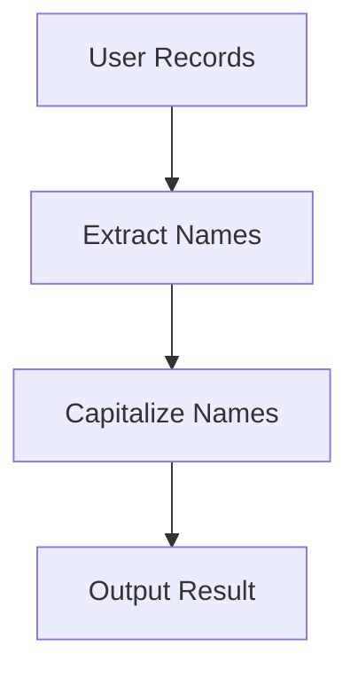

## 25.6 Embracing the Functional Programming Mindset

As we conclude our journey through mastering functional programming with Clojure, it's essential to discuss how to fully embrace the functional programming mindset. This mindset is not just about learning a new language or syntax; it's about fundamentally altering how we approach problem-solving, software design, and development. Let's explore how continuous practice, adopting new problem-solving approaches, and committing to lifelong learning can empower you to innovate and contribute to the evolution of software development.

### Continuous Practice

#### Integrating Functional Programming into Daily Practice

To truly master functional programming, it is crucial to integrate it into your daily practice. This means consistently applying functional principles in your work, even in small projects or tasks. By doing so, you'll internalize the concepts and make them second nature.

- **Start Small**: Begin by refactoring small pieces of existing code into a functional style. This can be as simple as replacing loops with higher-order functions like `map` or `reduce`.
  
- **Daily Exercises**: Dedicate time each day to solve small problems using Clojure. Websites like [Exercism](https://exercism.io/tracks/clojure) and [LeetCode](https://leetcode.com/) offer practice problems that can be solved using functional programming techniques.

- **Code Reviews**: Engage in code reviews with peers to get feedback on your functional programming style. This can provide new insights and help refine your approach.

- **Pair Programming**: Collaborate with other developers who are experienced in functional programming. This can accelerate your learning and expose you to different perspectives.

#### Example: Refactoring Imperative Code

Consider the following Java code that calculates the sum of even numbers in a list:

```java
List<Integer> numbers = Arrays.asList(1, 2, 3, 4, 5, 6);
int sum = 0;
for (int number : numbers) {
    if (number % 2 == 0) {
        sum += number;
    }
}
System.out.println(sum);
```

Now, let's refactor this into a functional style using Clojure:

```clojure
(def numbers [1 2 3 4 5 6])

(def sum (->> numbers
              (filter even?)
              (reduce +)))

(println sum)
```

In this Clojure example, we use `filter` to select even numbers and `reduce` to sum them. This approach is more declarative and concise, highlighting the power of functional programming.

#### Try It Yourself

Experiment with the above Clojure code by modifying the list of numbers or adding additional transformations. Consider what happens if you replace `even?` with `odd?` or introduce a new transformation function.

### Problem-Solving Approaches

#### Tackling Problems with a Functional Mindset

Embracing a functional mindset involves shifting from imperative to declarative problem-solving. Instead of focusing on how to perform tasks step-by-step, focus on what you want to achieve.

- **Declarative Thinking**: Describe the problem in terms of transformations and data flow rather than explicit control flow. This often leads to simpler and more maintainable code.

- **Immutability**: Leverage immutable data structures to avoid side effects and ensure thread safety. This is particularly important in concurrent applications.

- **Pure Functions**: Strive to write pure functions that do not rely on or alter external state. This makes your code more predictable and easier to test.

#### Example: Data Transformation

Let's transform a list of user records to extract and capitalize their names:

```clojure
(def users [{:name "alice"} {:name "bob"} {:name "charlie"}])

(def capitalized-names
  (map (comp clojure.string/upper-case :name) users))

(println capitalized-names)
```

Here, we use `map` with a composed function to transform the data. This approach is both concise and expressive, showcasing the power of functional composition.

#### Visualizing Data Flow



*Figure 1: Data flow in a functional transformation pipeline.*

### Lifelong Learning

#### Staying Updated with Advancements

The field of functional programming is continuously evolving, with new techniques, libraries, and best practices emerging regularly. To remain effective and innovative, it's vital to commit to lifelong learning.

- **Read Books and Articles**: Regularly read books and articles on functional programming. Some recommended reads include "Clojure for the Brave and True" and "Functional Programming in Scala."

- **Attend Conferences and Meetups**: Participate in conferences and meetups to learn from experts and network with other developers. Events like [Clojure/conj](https://clojure.org/community/conferences) are excellent opportunities to deepen your knowledge.

- **Contribute to Open Source**: Engage with the open-source community by contributing to Clojure libraries or projects. This not only enhances your skills but also gives back to the community.

- **Online Courses and Tutorials**: Enroll in online courses or follow tutorials to learn at your own pace. Websites like [Coursera](https://www.coursera.org/) and [Udemy](https://www.udemy.com/) offer courses on functional programming and Clojure.

#### Example: Exploring New Libraries

Stay curious and explore new libraries in the Clojure ecosystem. For instance, [Re-frame](https://github.com/day8/re-frame) is a popular library for building web applications in ClojureScript. Experimenting with such tools can expand your understanding and open new possibilities.

### Final Encouragement

#### Empowering Innovation and Contribution

Embracing the functional programming mindset is a journey that requires dedication and practice. As you continue to develop your skills, remember that you are part of a vibrant and supportive community. Your contributions can drive innovation and influence the future of software development.

- **Stay Curious**: Keep exploring new ideas and technologies. Curiosity is the engine of innovation.

- **Collaborate and Share**: Work with others and share your knowledge. Collaboration leads to better solutions and fosters a sense of community.

- **Be Resilient**: Challenges are a natural part of learning. Embrace them as opportunities to grow and improve.

- **Make an Impact**: Use your skills to build scalable, efficient applications that solve real-world problems. Your work can make a difference.

### Conclusion

Embracing the functional programming mindset with Clojure is not just about mastering a language; it's about transforming how you think about and approach software development. By integrating functional programming into your daily practice, adopting new problem-solving approaches, and committing to lifelong learning, you can unlock new levels of creativity and innovation. Remember, the journey is ongoing, and the possibilities are endless.

## **Test Your Knowledge: Embracing the Functional Programming Mindset Quiz**



### Which of the following is a key characteristic of functional programming?

- [x] Immutability
- [ ] Mutable state
- [ ] Object inheritance
- [ ] Procedural loops

> **Explanation:** Immutability is a core principle of functional programming, ensuring that data structures cannot be altered after they are created.

### What is the primary benefit of using pure functions in functional programming?

- [x] Predictability and ease of testing
- [ ] Increased complexity
- [ ] Dependence on external state
- [ ] Slower performance

> **Explanation:** Pure functions are predictable and easy to test because they do not rely on or modify external state.

### How can you integrate functional programming into your daily practice?

- [x] Refactor small pieces of code into a functional style
- [ ] Avoid using functional concepts in small projects
- [ ] Focus solely on learning syntax
- [ ] Ignore feedback from code reviews

> **Explanation:** Refactoring code into a functional style helps internalize functional programming concepts.

### What is a common approach to problem-solving in functional programming?

- [x] Declarative thinking
- [ ] Imperative instructions
- [ ] Object-oriented design
- [ ] State mutation

> **Explanation:** Declarative thinking focuses on describing what you want to achieve rather than how to achieve it, which is central to functional programming.

### Which of the following is a recommended resource for learning Clojure?

- [x] Clojure for the Brave and True
- [ ] Java: The Complete Reference
- [x] Functional Programming in Scala
- [ ] Head First Design Patterns

> **Explanation:** "Clojure for the Brave and True" and "Functional Programming in Scala" are excellent resources for learning functional programming concepts.

### How can you stay updated with advancements in functional programming?

- [x] Attend conferences and meetups
- [ ] Avoid reading new articles
- [ ] Only focus on legacy technologies
- [ ] Ignore community contributions

> **Explanation:** Attending conferences and meetups is a great way to learn from experts and stay updated with the latest advancements.

### Why is immutability important in functional programming?

- [x] It ensures thread safety and avoids side effects
- [ ] It allows for mutable state changes
- [x] It simplifies reasoning about code
- [ ] It increases the need for locks

> **Explanation:** Immutability ensures thread safety and avoids side effects, making code easier to reason about.

### What is the benefit of contributing to open-source projects?

- [x] Enhances your skills and gives back to the community
- [ ] Limits learning opportunities
- [ ] Isolates you from other developers
- [ ] Decreases collaboration

> **Explanation:** Contributing to open-source projects enhances your skills and allows you to give back to the community.

### What is the role of curiosity in embracing the functional programming mindset?

- [x] It drives innovation and exploration
- [ ] It limits your understanding
- [ ] It discourages learning
- [ ] It creates resistance to change

> **Explanation:** Curiosity drives innovation and exploration, essential for embracing new programming paradigms.

### True or False: Embracing the functional programming mindset is a one-time effort.

- [ ] True
- [x] False

> **Explanation:** Embracing the functional programming mindset is an ongoing journey that requires continuous learning and practice.



By embracing the functional programming mindset, you are not only enhancing your skills but also contributing to the evolution of software development. Keep practicing, stay curious, and continue to innovate. The journey is rewarding, and the impact you can make is significant.
