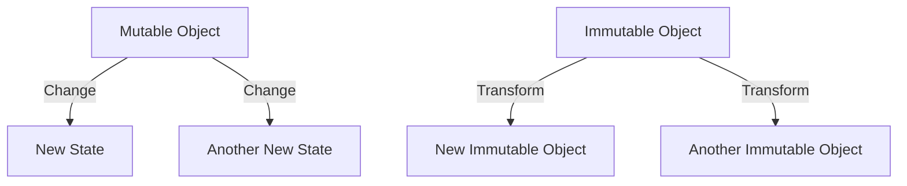

## 3.1 Understanding Immutability in Functional Programming

In this section, we delve into the concept of immutability, a cornerstone of functional programming, and explore its significance in building robust applications with Clojure. Immutability is not just a theoretical construct; it is a practical tool that enhances code reliability, simplifies reasoning, and supports concurrency.

### Concept of Immutability

**Immutability** refers to the idea that once a data structure is created, it cannot be altered. In functional programming, this means any operation that appears to modify a data structure instead returns a new version of the structure with the modification applied, leaving the original unchanged.

#### Why is Immutability Essential?

1. **Thread Safety**: Immutability inherently supports thread safety since immutable objects can be shared freely between threads without the risk of concurrent modifications.
2. **Simplified Reasoning**: With immutable data, you can reason about your program's behavior more easily because you don't have to track changes over time.
3. **Functional Purity**: Immutability aligns with functional programming's emphasis on pure functions, which do not have side effects and always produce the same output for the same input.

### Benefits of Immutability

#### Thread Safety and Concurrency

In multi-threaded environments, managing shared mutable state can lead to complex synchronization issues. Immutability eliminates these concerns because the state cannot change unexpectedly. Consider the following Clojure example:

```clojure
(def my-list [1 2 3])

;; Attempting to 'change' the list
(def new-list (conj my-list 4))

;; my-list remains unchanged
(println my-list)  ; Output: [1 2 3]
(println new-list) ; Output: [1 2 3 4]
```

In this example, `my-list` remains unchanged, while `new-list` is a new list with the additional element. This behavior ensures that `my-list` can be safely shared across threads without locks or synchronization.

#### Easier Reasoning and Debugging

Immutability simplifies reasoning about code. Since data does not change, you can trace the flow of data through your program without worrying about hidden state changes. This predictability is crucial for debugging and testing.

#### Value vs. Reference Types

In traditional Object-Oriented Programming (OOP) languages like Java, the distinction between value types (immutable) and reference types (mutable) is significant. In Clojure, all data structures are immutable by default, which helps avoid the pitfalls of mutable references.

##### Java Example: Mutable vs. Immutable

In Java, a `String` is immutable, while a `StringBuilder` is mutable:

```java
// Immutable String
String str = "Hello";
String newStr = str.concat(" World");
// str remains "Hello"

// Mutable StringBuilder
StringBuilder sb = new StringBuilder("Hello");
sb.append(" World");
// sb is now "Hello World"
```

In Clojure, all collections are immutable, similar to Java's `String`, but unlike `StringBuilder`.

### Immutable Patterns

#### Persistent Data Structures

Clojure employs **persistent data structures**, which are immutable and efficiently share structure between versions. This concept allows for operations that seem to modify data but actually create new versions with shared parts, minimizing memory usage.

##### Example: Persistent Vectors

```clojure
(def my-vector [1 2 3])
(def new-vector (conj my-vector 4))

;; my-vector remains unchanged
(println my-vector)  ; Output: [1 2 3]
(println new-vector) ; Output: [1 2 3 4]
```

Here, `new-vector` shares most of its structure with `my-vector`, making the operation efficient.

#### Functional Updates

Functional programming promotes the use of functions to create new data from existing data. This approach is central to Clojure's idiomatic style.

##### Example: Updating Maps

```clojure
(def person {:name "Alice" :age 30})
(def updated-person (assoc person :age 31))

;; person remains unchanged
(println person)          ; Output: {:name "Alice", :age 30}
(println updated-person)  ; Output: {:name "Alice", :age 31}
```

The `assoc` function creates a new map with the updated value, leaving the original map intact.

### Immutability in Practice

#### Real-World Applications

Immutability is not just a theoretical benefit; it has practical applications in building scalable systems. Consider a web application where multiple users interact with shared data. Immutability ensures that each user's actions do not interfere with others, reducing bugs and improving reliability.

#### Migration from Java to Clojure

For developers transitioning from Java to Clojure, embracing immutability requires a shift in mindset. Instead of thinking about changing objects, focus on transforming data through functions. This shift can lead to cleaner, more maintainable code.

### Visual Aids

To better understand how immutability works, let's look at a diagram comparing mutable and immutable data handling:



**Diagram Explanation**: In the mutable model, changes directly alter the object's state, leading to potential side effects. In the immutable model, transformations create new objects, preserving the original state.

### References and Further Reading

- [Clojure Official Documentation](https://clojure.org/reference)
- [Transitioning from OOP to Functional Programming](https://www.lispcast.com/oo-to-fp/)
- [Clojure Community Resources](https://clojure.org/community/resources)

### Knowledge Check

To reinforce your understanding of immutability, consider the following questions:

1. How does immutability contribute to thread safety?
2. What are persistent data structures, and why are they important in Clojure?
3. How does immutability simplify debugging and reasoning about code?

### Exercises

1. **Experiment with Immutability**: Modify the provided Clojure examples to add additional elements or update maps. Observe how the original data structures remain unchanged.
2. **Java to Clojure Migration**: Take a simple Java class with mutable fields and refactor it into a Clojure namespace using immutable data structures.

### Conclusion

Understanding and embracing immutability is crucial for mastering functional programming in Clojure. By leveraging immutable data structures, you can write more reliable, concurrent, and maintainable code. As you continue your journey, remember that immutability is not just a constraint but a powerful tool that can transform how you approach software development.

## **Test Your Knowledge: Understanding Immutability in Functional Programming Quiz**



### How does immutability enhance thread safety?

- [x] By preventing data from being modified concurrently
- [ ] By allowing data to be changed by multiple threads
- [ ] By requiring locks for data access
- [ ] By using mutable data structures

> **Explanation:** Immutability ensures that data cannot be changed, eliminating the risk of concurrent modifications and thus enhancing thread safety.

### What is a persistent data structure?

- [x] An immutable data structure that shares structure between versions
- [ ] A data structure that is stored permanently on disk
- [ ] A mutable data structure that retains changes
- [ ] A data structure that is constantly updated

> **Explanation:** Persistent data structures are immutable and share parts of their structure between different versions, making them efficient.

### Which function is used to update a map in Clojure?

- [x] `assoc`
- [ ] `append`
- [ ] `update`
- [ ] `modify`

> **Explanation:** The `assoc` function is used to create a new map with updated key-value pairs in Clojure.

### How does immutability simplify debugging?

- [x] By ensuring data does not change unexpectedly
- [ ] By allowing direct modification of data
- [ ] By requiring complex synchronization
- [ ] By using mutable state

> **Explanation:** Immutability ensures that data remains constant, making it easier to trace and debug program behavior.

### What is a key benefit of immutable data structures?

- [x] They allow for safe sharing across threads
- [ ] They require frequent locking
- [x] They simplify reasoning about code
- [ ] They are always stored in memory

> **Explanation:** Immutable data structures can be safely shared across threads and simplify reasoning about code due to their unchanging nature.

### In Java, which type is immutable?

- [x] `String`
- [ ] `StringBuilder`
- [ ] `ArrayList`
- [ ] `HashMap`

> **Explanation:** In Java, `String` is an immutable type, whereas `StringBuilder` is mutable.

### What does the `conj` function do in Clojure?

- [x] Adds an element to a collection, returning a new collection
- [ ] Removes an element from a collection
- [x] Creates a new collection with added elements
- [ ] Modifies the original collection

> **Explanation:** The `conj` function adds elements to a collection and returns a new collection, leaving the original unchanged.

### Why is immutability crucial in functional programming?

- [x] It aligns with the principle of pure functions
- [ ] It allows for mutable state
- [ ] It complicates code reasoning
- [ ] It requires additional synchronization

> **Explanation:** Immutability supports pure functions, which are central to functional programming, by ensuring no side effects.

### How can immutability be beneficial in web applications?

- [x] It prevents user actions from interfering with each other
- [ ] It allows for direct data modification
- [ ] It increases the complexity of state management
- [ ] It requires frequent database updates

> **Explanation:** Immutability ensures that user actions do not interfere with each other, improving reliability and reducing bugs.

### True or False: Immutability requires complex synchronization mechanisms.

- [x] False
- [ ] True

> **Explanation:** Immutability eliminates the need for complex synchronization because data cannot be modified concurrently.


