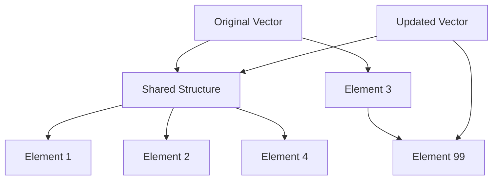
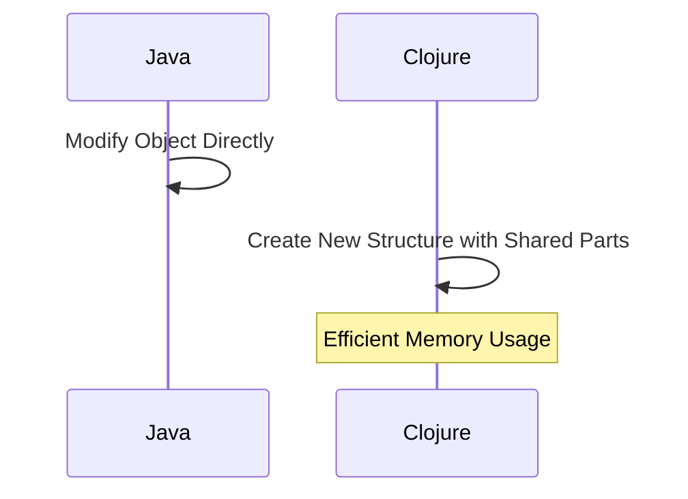

## 3.2 Working with Immutable Data Structures

In this section, we delve into the fascinating world of immutable data structures in Clojure, a cornerstone of functional programming. Clojure's approach to data immutability offers a robust framework for building scalable applications, providing both efficiency and simplicity. We will explore persistent data structures, the concept of structural sharing, and how these principles translate into practical use with Clojure's built-in data structures like lists, vectors, maps, and sets. Additionally, we'll address performance considerations, dispelling common myths about the overhead associated with immutability.

### Persistent Data Structures

Persistent data structures are a key feature of Clojure, enabling the creation of immutable collections that efficiently share structure between versions. Unlike traditional data structures that require copying entire collections to make changes, Clojure's persistent data structures allow for modifications without altering the original, thanks to a technique known as *structural sharing*.

#### Understanding Persistence

In the context of data structures, persistence refers to the ability to maintain previous versions of a data structure after modifications. This is crucial in functional programming, where immutability is a core principle. In Clojure, persistent data structures are implemented using trees and graphs, which allow for efficient updates and access.

#### Structural Sharing

Structural sharing is the mechanism that makes persistent data structures both efficient and practical. By sharing parts of the data structure that remain unchanged, Clojure minimizes the memory footprint and computational cost of creating new versions of a data structure. This is achieved through a combination of path copying and lazy evaluation.

**Example of Structural Sharing:**

Consider a simple vector update:

```clojure
(def original-vector [1 2 3 4])
(def updated-vector (assoc original-vector 2 99))

;; original-vector remains [1 2 3 4]
;; updated-vector is [1 2 99 4]
```

In this example, `updated-vector` shares most of its structure with `original-vector`, only the path to the modified element is copied. This sharing is what allows Clojure to handle large datasets efficiently.



*Diagram 1: Structural Sharing in Clojure Vectors*

### Using Built-in Data Structures

Clojure provides a rich set of built-in data structures that are inherently immutable and persistent. Let's explore how to use and manipulate these data structures effectively.

#### Lists

Lists in Clojure are linked lists, optimized for sequential access. They are ideal for scenarios where you frequently add or remove elements from the front.

**Creating and Manipulating Lists:**

```clojure
(def my-list '(1 2 3 4 5))

;; Adding an element to the front
(def new-list (cons 0 my-list)) ;; (0 1 2 3 4 5)

;; Removing the first element
(def rest-list (rest my-list)) ;; (2 3 4 5)

;; Accessing elements
(first my-list) ;; 1
(nth my-list 2) ;; 3
```

#### Vectors

Vectors are dynamic arrays providing efficient random access and updates. They are the go-to choice for most collection needs in Clojure.

**Creating and Manipulating Vectors:**

```clojure
(def my-vector [1 2 3 4 5])

;; Adding an element
(def extended-vector (conj my-vector 6)) ;; [1 2 3 4 5 6]

;; Updating an element
(def updated-vector (assoc my-vector 2 99)) ;; [1 2 99 4 5]

;; Accessing elements
(nth my-vector 3) ;; 4
```

#### Maps

Maps are key-value pairs, akin to dictionaries in other languages. They are highly efficient for lookups and updates.

**Creating and Manipulating Maps:**

```clojure
(def my-map {:a 1 :b 2 :c 3})

;; Adding a key-value pair
(def updated-map (assoc my-map :d 4)) ;; {:a 1, :b 2, :c 3, :d 4}

;; Removing a key
(def reduced-map (dissoc my-map :b)) ;; {:a 1, :c 3}

;; Accessing values
(get my-map :a) ;; 1
```

#### Sets

Sets are collections of unique elements, useful for membership tests and deduplication.

**Creating and Manipulating Sets:**

```clojure
(def my-set #{1 2 3 4})

;; Adding an element
(def extended-set (conj my-set 5)) ;; #{1 2 3 4 5}

;; Removing an element
(def reduced-set (disj my-set 2)) ;; #{1 3 4}

;; Checking membership
(contains? my-set 3) ;; true
```

### Performance Considerations

A common concern with immutable data structures is performance overhead. However, Clojure's persistent data structures are designed to mitigate these concerns through structural sharing and efficient algorithms.

#### Memory Efficiency

By sharing unchanged parts of data structures, Clojure reduces memory usage significantly. This makes it feasible to work with large datasets without the need for excessive copying.

#### Computational Efficiency

Operations on persistent data structures are often logarithmic in complexity, making them suitable for real-time applications. For instance, adding or updating elements in a vector or map is typically O(log32 N), thanks to the tree-based implementation.

#### Dispelling Myths

It's a myth that immutable data structures are inherently slower than mutable ones. In many cases, the benefits of immutability, such as easier reasoning about code and reduced risk of bugs, outweigh any minor performance trade-offs.

### Try It Yourself

To deepen your understanding, try modifying the code examples above. Experiment with different operations and observe how Clojure handles immutability:

- Add elements to the middle of a vector and observe the structural sharing.
- Create a map with nested maps and perform updates.
- Use sets to filter duplicates from a list of numbers.

### Visualizing Data Flow and Structural Sharing

To better understand how data flows and structural sharing work in Clojure, consider the following diagram that compares Java's mutable approach with Clojure's immutable approach.



*Diagram 2: Data Flow in Java vs. Clojure*

### References and Further Reading

- [Clojure Official Documentation](https://clojure.org/reference)
- [Clojure Community Resources](https://clojure.org/community/resources)
- [Understanding Persistent Data Structures](https://hypirion.com/musings/understanding-persistent-vector-pt-1)
- [Transitioning from OOP to Functional Programming](https://www.lispcast.com/oo-to-fp/)

### Knowledge Check

Before moving on, let's reinforce what we've learned with a few questions:

- What is structural sharing, and how does it benefit immutable data structures?
- How do Clojure's persistent data structures compare to Java's mutable collections in terms of efficiency?
- Experiment with the provided code examples and observe the effects of structural sharing.

### Conclusion

Embracing immutable data structures in Clojure can transform how we think about data manipulation, leading to more robust and maintainable code. By understanding the principles of persistence and structural sharing, we can harness the full potential of Clojure's functional paradigm. As you continue your journey in functional programming, remember that the power of immutability lies not just in performance, but in the clarity and simplicity it brings to your codebase.

## **Test Your Knowledge: Working with Immutable Data Structures Quiz**



### What is the primary benefit of structural sharing in Clojure's data structures?

- [x] It reduces memory usage by sharing unchanged parts of data structures.
- [ ] It allows for faster computation by using mutable data.
- [ ] It simplifies syntax for data manipulation.
- [ ] It enables parallel processing of data.

> **Explanation:** Structural sharing reduces memory usage by sharing parts of data structures that remain unchanged, making operations more efficient.

### Which Clojure data structure is optimized for random access and updates?

- [ ] List
- [x] Vector
- [ ] Map
- [ ] Set

> **Explanation:** Vectors in Clojure are dynamic arrays optimized for random access and updates, making them suitable for most collection needs.

### How does Clojure handle updates to immutable data structures?

- [x] By creating a new version of the data structure with shared parts.
- [ ] By copying the entire data structure.
- [ ] By modifying the original data structure directly.
- [ ] By using mutable data structures.

> **Explanation:** Clojure creates a new version of the data structure that shares unchanged parts with the original, thanks to structural sharing.

### What is the complexity of adding an element to a Clojure vector?

- [ ] O(1)
- [x] O(log32 N)
- [ ] O(N)
- [ ] O(N^2)

> **Explanation:** Adding an element to a Clojure vector is typically O(log32 N) due to its tree-based implementation.

### Why are persistent data structures important in functional programming?

- [x] They maintain previous versions of data structures after modifications.
- [ ] They allow for mutable state management.
- [ ] They simplify syntax for data manipulation.
- [ ] They enable direct modification of data.

> **Explanation:** Persistent data structures are crucial in functional programming as they maintain previous versions, supporting immutability and ease of reasoning.

### Which operation is NOT efficient in Clojure's list data structure?

- [x] Random access
- [ ] Sequential access
- [ ] Adding elements to the front
- [ ] Removing elements from the front

> **Explanation:** Lists in Clojure are linked lists optimized for sequential access, making random access inefficient.

### What is a common misconception about immutable data structures?

- [x] That they are inherently slower than mutable ones.
- [ ] That they simplify reasoning about code.
- [ ] That they reduce the risk of bugs.
- [ ] That they are memory efficient.

> **Explanation:** A common misconception is that immutable data structures are slower, but their benefits often outweigh any performance trade-offs.

### How does Clojure's map data structure differ from Java's HashMap?

- [x] Clojure's map is immutable and persistent.
- [ ] Clojure's map allows for mutable updates.
- [ ] Java's HashMap is more memory efficient.
- [ ] Java's HashMap supports structural sharing.

> **Explanation:** Clojure's map is immutable and persistent, unlike Java's mutable HashMap, allowing for safe concurrent access and updates.

### What is the result of the following Clojure code: `(conj #{1 2 3} 3)`?

- [x] #{1 2 3}
- [ ] #{1 2 3 3}
- [ ] #{1 2}
- [ ] #{3}

> **Explanation:** Sets in Clojure contain unique elements, so adding an existing element does not change the set.

### True or False: Clojure's persistent data structures require copying the entire collection for each modification.

- [ ] True
- [x] False

> **Explanation:** False. Clojure's persistent data structures use structural sharing to avoid copying the entire collection for each modification.


