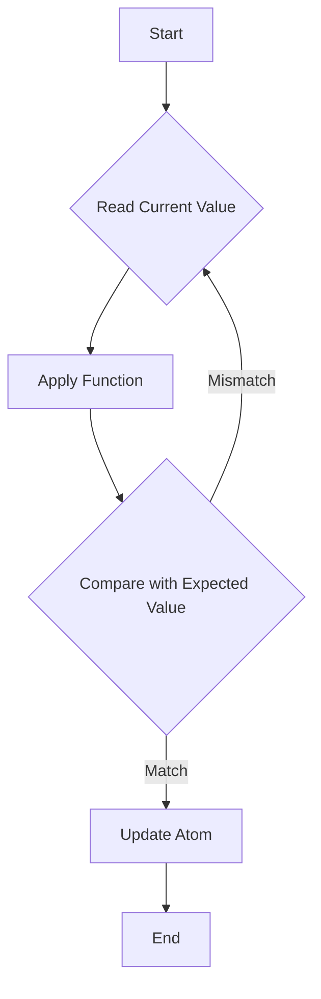

## 3.3 Managing State with Atoms

In the world of functional programming, immutability is a core principle that brings about many benefits, including easier reasoning about code, fewer bugs, and safer concurrent programming. However, there are times when we need to manage mutable state, especially in applications that require user interaction or real-time data processing. Clojure offers a unique solution to this challenge through the use of **atoms**. In this section, we will explore what atoms are, how they can be used to manage state, and why they are particularly well-suited for concurrent applications.

### Introduction to Atoms

Atoms in Clojure are a type of reference that allows you to manage shared, synchronous, and independent state. Unlike traditional mutable variables found in imperative programming languages like Java, atoms provide a way to encapsulate state changes in a controlled manner. They are designed to be updated atomically, ensuring that state changes are consistent and thread-safe.

Atoms are ideal for situations where you have a single, independent piece of state that needs to be updated based on the current value. They are particularly useful in scenarios where multiple threads might attempt to update the state concurrently.

#### Key Features of Atoms

- **Atomic Updates**: Changes to the state held by an atom are atomic, meaning they are applied in a single, indivisible operation.
- **Consistency**: Atoms ensure that state updates are consistent, even when multiple threads are involved.
- **Immutability**: The state within an atom is immutable, but the atom itself can be used to manage changes to this immutable state.
- **Simplicity**: Atoms provide a simple API for managing state, making them easy to use and understand.

### Atom Operations

To effectively use atoms, it's essential to understand how to create and manipulate them. Let's explore the basic operations you can perform with atoms.

#### Creating Atoms

Creating an atom in Clojure is straightforward. You use the `atom` function, passing the initial value as an argument.

```clojure
(def my-atom (atom 0))
```

In this example, `my-atom` is an atom initialized with the value `0`. The value inside the atom can be any Clojure data structure, including numbers, strings, lists, maps, or even other atoms.

#### Reading Atom Values

To read the current value of an atom, you use the `deref` function or the shorthand `@` syntax.

```clojure
;; Using deref
(println (deref my-atom))

;; Using @
(println @my-atom)
```

Both of these expressions will output the current value of `my-atom`, which is `0`.

#### Updating Atoms

Atoms can be updated using two primary functions: `swap!` and `reset!`.

- **`swap!`**: This function takes an atom and a function, applies the function to the current value of the atom, and updates the atom with the result.

```clojure
(swap! my-atom inc)
(println @my-atom) ;; Output: 1
```

In this example, `swap!` increments the value of `my-atom` by applying the `inc` function to it.

- **`reset!`**: This function sets the atom to a new value, disregarding the current value.

```clojure
(reset! my-atom 42)
(println @my-atom) ;; Output: 42
```

Here, `reset!` sets `my-atom` to `42`, regardless of its previous value.

#### Key Points to Remember

- Use `swap!` when the new value depends on the current value.
- Use `reset!` when you want to set a new value directly.

### Concurrency with Atoms

One of the most compelling reasons to use atoms is their ability to handle concurrency safely. In a multi-threaded environment, concurrent updates to shared state can lead to race conditions and inconsistent data. Atoms mitigate these issues by ensuring that updates are atomic and consistent.

#### How Atoms Handle Concurrency

Atoms use a compare-and-swap (CAS) mechanism to update their state. When you call `swap!`, Clojure:

1. Reads the current value of the atom.
2. Applies the provided function to compute a new value.
3. Compares the current value to the expected value.
4. If they match, it updates the atom with the new value; otherwise, it retries the operation.

This process ensures that updates are applied only if the atom's state has not changed since the read operation, making it safe for concurrent updates.

#### Example: Concurrent Updates with Atoms

Let's consider a scenario where multiple threads increment a shared counter:

```clojure
(def counter (atom 0))

(defn increment-counter []
  (dotimes [_ 1000]
    (swap! counter inc)))

(defn run-concurrent-updates []
  (let [threads (repeatedly 10 #(Thread. increment-counter))]
    (doseq [t threads] (.start t))
    (doseq [t threads] (.join t))
    (println "Final counter value:" @counter)))

(run-concurrent-updates)
```

In this example, we create 10 threads, each incrementing the `counter` atom 1000 times. Thanks to `swap!` and the CAS mechanism, the final value of `counter` is consistent and reflects all increments.

### Use Cases for Atoms

Atoms are not a one-size-fits-all solution for state management. They are best suited for specific scenarios where their characteristics shine.

#### When to Use Atoms

- **Single, Independent State**: Use atoms when you have a single piece of state that is independent of other state changes.
- **Frequent Updates**: Atoms are ideal for state that needs frequent updates, such as counters or flags.
- **Concurrency**: If your application involves concurrent updates to state, atoms provide a safe and efficient way to manage these updates.

#### Example Use Cases

1. **Counters and Accumulators**: Atoms are perfect for managing counters or accumulators that need to be updated frequently and concurrently.

2. **Flags and Toggles**: Use atoms for simple flags or toggles that are accessed and modified by multiple threads.

3. **Configuration Settings**: Atoms can be used to manage configuration settings that might change at runtime.

4. **Real-Time Data Processing**: In applications that process data in real-time, atoms can be used to manage state changes efficiently.

### Comparing Atoms to Java OOP Concepts

For developers transitioning from Java's object-oriented programming (OOP) paradigm, understanding how atoms relate to Java concepts can be helpful.

#### Java's Mutable Variables vs. Clojure's Atoms

In Java, mutable variables are often used to manage state. However, these variables can lead to concurrency issues if not handled correctly. Atoms in Clojure provide a safer alternative by ensuring that state changes are atomic and consistent.

#### Synchronization in Java vs. Atomic Updates in Clojure

Java uses synchronization mechanisms, such as `synchronized` blocks or `java.util.concurrent` classes, to manage concurrent updates. In contrast, Clojure's atoms use a CAS mechanism, which is simpler and often more efficient for managing independent state changes.

### Visualizing Atom Operations

To better understand how atoms work, let's visualize the process of updating an atom using a flowchart.



**Figure 1**: Flowchart illustrating the compare-and-swap mechanism used by atoms.

### Try It Yourself

To deepen your understanding of atoms, try modifying the code examples provided. Experiment with different functions in `swap!`, or create your own scenarios where atoms manage state. Consider what happens if you increase the number of threads or the number of increments in the `run-concurrent-updates` function.

### References and Further Reading

- [Clojure Official Documentation](https://clojure.org/reference/atoms)
- [Clojure Community Resources](https://clojure.org/community/resources)
- [Transitioning from OOP to Functional Programming](https://www.lispcast.com/oo-to-fp/)

### Knowledge Check

To reinforce your understanding of managing state with atoms, try answering the following questions and exercises.

## **Test Your Knowledge: Managing State with Atoms Quiz**



### Atoms in Clojure are used for managing what type of state?

- [x] Independent, synchronous state
- [ ] Dependent, asynchronous state
- [ ] Static, immutable state
- [ ] Dynamic, mutable state

> **Explanation:** Atoms are designed for managing independent, synchronous state that can be updated atomically.


### What function would you use to atomically update the value of an atom based on its current value?

- [x] `swap!`
- [ ] `reset!`
- [ ] `deref`
- [ ] `compare-and-swap`

> **Explanation:** `swap!` is used to update the value of an atom atomically based on its current value.


### How does Clojure ensure that atom updates are thread-safe?

- [x] Using a compare-and-swap mechanism
- [ ] By locking the atom during updates
- [ ] By using synchronized blocks
- [ ] By using a global mutex

> **Explanation:** Clojure uses a compare-and-swap (CAS) mechanism to ensure thread-safe updates to atoms.


### Which of the following is NOT a valid use case for atoms?

- [ ] Managing counters
- [ ] Handling configuration settings
- [x] Coordinating complex state changes across multiple atoms
- [ ] Implementing flags or toggles

> **Explanation:** Atoms are not suitable for coordinating complex state changes across multiple atoms, as they are designed for independent state management.


### What does the `reset!` function do?

- [x] Sets the atom to a new value, disregarding the current value
- [ ] Atomically updates the atom based on its current value
- [ ] Reads the current value of the atom
- [ ] Compares the current and expected values

> **Explanation:** `reset!` sets the atom to a new value, disregarding the current value.


### In a multi-threaded environment, what ensures the consistency of atom updates?

- [x] The compare-and-swap mechanism
- [ ] The use of locks
- [ ] The use of semaphores
- [ ] The use of a global state manager

> **Explanation:** The compare-and-swap mechanism ensures the consistency of atom updates in a multi-threaded environment.


### What is the primary advantage of using atoms over Java's synchronized blocks for state management?

- [x] Simplicity and efficiency
- [ ] Greater control over thread scheduling
- [ ] Better integration with Java libraries
- [ ] Ability to manage complex state dependencies

> **Explanation:** Atoms provide simplicity and efficiency in managing independent state changes compared to Java's synchronized blocks.


### Which syntax is used to read the current value of an atom?

- [x] `@atom`
- [ ] `get atom`
- [ ] `atom.value`
- [ ] `atom.get()`

> **Explanation:** The `@` syntax is used to read the current value of an atom in Clojure.


### What is the initial value of an atom created with `(atom 100)`?

- [x] 100
- [ ] 0
- [ ] nil
- [ ] Undefined

> **Explanation:** The initial value of an atom created with `(atom 100)` is 100.


### True or False: Atoms can be used to manage state that is dependent on other atoms.

- [ ] True
- [x] False

> **Explanation:** Atoms are designed for managing independent state, not state that is dependent on other atoms.



By mastering the use of atoms in Clojure, you'll be well-equipped to handle state management in a functional programming paradigm, leveraging the power of atomic updates and immutability to build robust and scalable applications.
