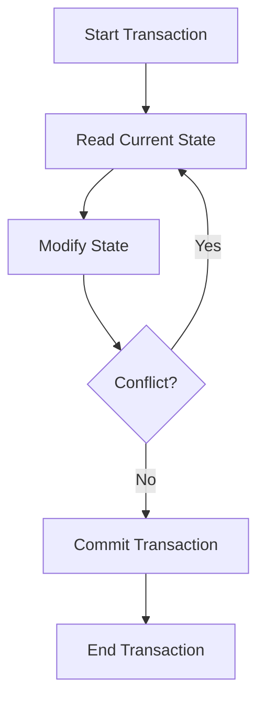

## 3.4 Coordinated State Change with Refs

In this section, we delve into the concept of coordinated state changes using refs in Clojure. As we explore this topic, we will introduce refs and their role in managing state changes, explain the workings of Software Transactional Memory (STM), and demonstrate how to use `dosync` blocks for transactional changes. We will also compare refs with atoms to help you decide when to use each.

### Understanding Refs

Refs in Clojure are a powerful concurrency primitive designed to manage shared, mutable state in a way that ensures consistency and avoids conflicts. They are particularly useful when you need to coordinate changes across multiple pieces of state. Unlike atoms, which are used for independent state updates, refs allow for coordinated updates, making them ideal for scenarios where multiple related states must change together.

#### Key Characteristics of Refs

- **Consistency**: Refs ensure that all changes are consistent and visible to other threads only when they are complete.
- **Isolation**: Changes to refs are isolated from each other, preventing intermediate states from being visible.
- **Atomicity**: All changes within a transaction are applied atomically, meaning either all changes are applied, or none are.

### Software Transactional Memory (STM)

Clojure's STM is a concurrency control mechanism that simplifies managing state changes by allowing multiple refs to be updated in a coordinated manner. STM ensures that transactions are executed in isolation and that changes are consistent across multiple refs.

#### How STM Works

STM in Clojure operates by using transactions to manage state changes. A transaction is a sequence of operations that are executed atomically. If any part of the transaction fails, the entire transaction is retried until it succeeds. This approach ensures that changes are consistent and prevents race conditions.

- **Optimistic Concurrency**: STM uses optimistic concurrency control, allowing transactions to execute without locking resources. If a conflict is detected, the transaction is retried.
- **Automatic Retry**: Transactions are automatically retried if a conflict occurs, ensuring eventual success without manual intervention.

#### Using `dosync`

The `dosync` macro is used to define a transactional context in which refs can be safely modified. Within a `dosync` block, you can perform multiple updates to refs, and these updates will be applied atomically.

```clojure
(def account1 (ref 100))
(def account2 (ref 200))

(dosync
  (alter account1 - 50)
  (alter account2 + 50))

;; Both account1 and account2 are updated atomically
```

In this example, we transfer 50 units from `account1` to `account2`. The `dosync` block ensures that both updates are applied atomically, maintaining consistency.

### Refs vs. Atoms

While both refs and atoms are used for managing state, they serve different purposes and are suited to different scenarios.

#### Atoms

- **Independent State Changes**: Atoms are ideal for managing independent state changes where coordination is not required.
- **Compare-and-Swap**: Atoms use a compare-and-swap mechanism to update state, which is efficient for single, independent updates.

#### Refs

- **Coordinated State Changes**: Refs are designed for scenarios where multiple state changes need to be coordinated.
- **Transactional Updates**: Refs use STM to ensure atomicity and consistency across multiple updates.

### Practical Example: Bank Account Transfers

Let's consider a practical example where we need to manage bank account transfers. In this scenario, we have multiple accounts, and we need to ensure that transfers between accounts are consistent and atomic.

```clojure
(def accounts (ref {:account1 1000 :account2 1500}))

(defn transfer [from to amount]
  (dosync
    (let [from-balance (get @accounts from)
          to-balance (get @accounts to)]
      (when (>= from-balance amount)
        (alter accounts assoc from (- from-balance amount))
        (alter accounts assoc to (+ to-balance amount))))))

(transfer :account1 :account2 200)

;; The balances are updated atomically
@accounts
;; => {:account1 800, :account2 1700}
```

In this example, we define a `transfer` function that uses `dosync` to ensure that the transfer operation is atomic. The balances of both accounts are updated within the same transaction, ensuring consistency.

### Try It Yourself

Experiment with the code examples provided by modifying the transfer amounts or adding additional accounts. Observe how the `dosync` block ensures consistency even when multiple transactions are executed concurrently.

### Visualizing STM with Refs

Below is a diagram illustrating how STM coordinates state changes across multiple refs:



**Diagram Description**: This flowchart illustrates the STM process in Clojure, where a transaction starts by reading the current state, modifying it, checking for conflicts, and either retrying or committing the transaction.

### References and Further Reading

- [Clojure Official Documentation](https://clojure.org/reference)
- [Clojure STM Guide](https://clojure.org/reference/refs)
- [Transitioning from OOP to Functional Programming](https://www.lispcast.com/oo-to-fp/)

### Knowledge Check

- What are the key characteristics of refs in Clojure?
- How does STM ensure consistency across multiple state changes?
- What is the purpose of the `dosync` macro?
- When should you use refs instead of atoms?

### Exercises

1. Modify the bank account transfer example to include a third account and perform multiple transfers within a single transaction.
2. Implement a simple inventory management system using refs to coordinate stock levels across multiple products.

### Conclusion

Understanding and utilizing refs in Clojure allows us to manage complex state changes with ease and confidence. By leveraging STM, we can ensure that our applications remain consistent and free from race conditions, even in the most demanding environments.

## **Test Your Knowledge: Coordinated State Change with Refs Quiz**



### What is the primary purpose of refs in Clojure?

- [x] To coordinate multiple state changes atomically
- [ ] To manage independent state changes
- [ ] To replace all uses of atoms
- [ ] To handle asynchronous operations

> **Explanation:** Refs are designed to coordinate multiple state changes atomically, ensuring consistency across related states.

### How does Clojure's STM ensure consistency?

- [x] By using transactions to apply changes atomically
- [ ] By locking all resources involved
- [ ] By using pessimistic concurrency control
- [ ] By retrying failed transactions manually

> **Explanation:** Clojure's STM uses transactions to apply changes atomically, automatically retrying if conflicts occur to ensure consistency.

### What is the role of the `dosync` macro in Clojure?

- [x] To define a transactional context for refs
- [ ] To synchronize threads
- [ ] To manage asynchronous tasks
- [ ] To replace `sync` blocks in Java

> **Explanation:** The `dosync` macro defines a transactional context in which refs can be safely modified, ensuring atomicity and consistency.

### When should you choose refs over atoms?

- [x] When multiple state changes need to be coordinated
- [ ] When state changes are independent
- [ ] When performance is not a concern
- [ ] When using single-threaded applications

> **Explanation:** Refs are ideal for coordinating multiple state changes, whereas atoms are suited for independent updates.

### What happens if a conflict is detected during a transaction?

- [x] The transaction is retried automatically
- [ ] The transaction is aborted
- [ ] The transaction is committed with partial changes
- [ ] The transaction is logged for manual review

> **Explanation:** If a conflict is detected, the transaction is automatically retried until it succeeds, ensuring consistency.

### Which concurrency control mechanism does Clojure's STM use?

- [x] Optimistic concurrency control
- [ ] Pessimistic concurrency control
- [ ] Lock-based concurrency control
- [ ] Time-based concurrency control

> **Explanation:** Clojure's STM uses optimistic concurrency control, allowing transactions to execute without locking resources.

### How do refs ensure atomicity?

- [x] By using STM to manage transactions
- [ ] By locking resources during updates
- [ ] By using a compare-and-swap mechanism
- [ ] By executing updates sequentially

> **Explanation:** Refs ensure atomicity by using STM to manage transactions, applying all changes together or not at all.

### What is a key advantage of using STM in Clojure?

- [x] It simplifies state management in concurrent applications
- [ ] It increases the speed of state changes
- [ ] It eliminates the need for synchronization
- [ ] It allows for manual conflict resolution

> **Explanation:** STM simplifies state management in concurrent applications by ensuring atomicity and consistency without manual synchronization.

### What is the difference between refs and atoms in terms of state changes?

- [x] Refs coordinate multiple state changes, while atoms manage independent changes
- [ ] Atoms coordinate multiple state changes, while refs manage independent changes
- [ ] Both manage independent changes
- [ ] Both coordinate multiple state changes

> **Explanation:** Refs are used for coordinating multiple state changes, whereas atoms are used for managing independent changes.

### True or False: Refs can be used to handle asynchronous operations in Clojure.

- [ ] True
- [x] False

> **Explanation:** Refs are not used for handling asynchronous operations; they are used for coordinating state changes in a transactional context.


