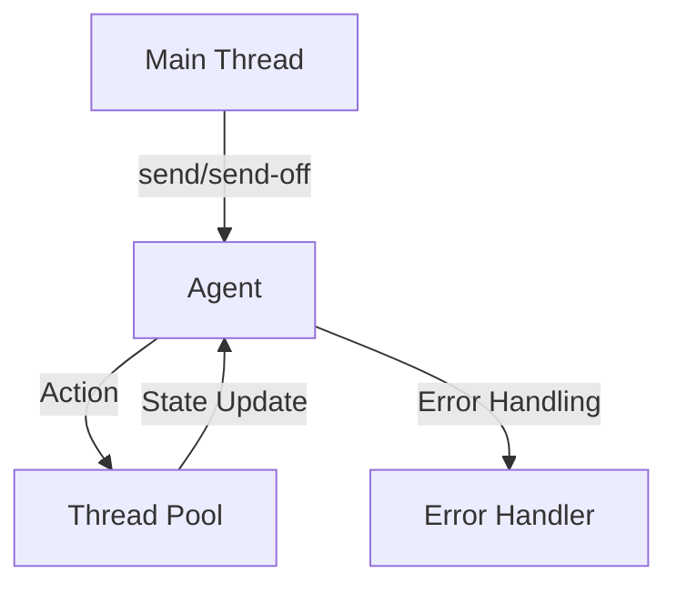

## 3.5 Agents for Asynchronous State Changes

In the realm of functional programming with Clojure, managing state changes asynchronously is a crucial aspect of building scalable and efficient applications. Clojure provides several concurrency primitives, and agents are one of the key tools for handling asynchronous state changes. In this section, we will explore what agents are, how they work, and how you can leverage them to manage state changes in your applications.

### What are Agents?

Agents in Clojure are a concurrency primitive designed to manage independent, asynchronous state changes. They are ideal for scenarios where you need to perform state updates that don't require immediate feedback or coordination with other state changes. Agents allow you to dispatch functions that transform their state, and these transformations occur asynchronously in separate threads.

#### Key Characteristics of Agents:

- **Asynchronous Execution**: Agents process actions asynchronously, freeing up the main thread to continue executing other tasks.
- **Immutable State**: Like other Clojure constructs, agents work with immutable data. The state of an agent is updated by applying pure functions that return the new state.
- **Error Handling**: Agents provide mechanisms to handle errors that may occur during state transformations, ensuring robustness in concurrent applications.

### Sending Actions to Agents

To interact with agents, you send actions to them using the `send` and `send-off` functions. These functions dispatch a function to be applied to the agent's state.

#### Using `send`

The `send` function is used to dispatch actions that are CPU-bound and do not involve blocking operations. It queues the action for execution in a thread pool dedicated to handling such tasks.

```clojure
(def my-agent (agent 0))

;; Define a function to increment the agent's state
(defn increment [state]
  (inc state))

;; Send the increment function to the agent
(send my-agent increment)

;; Check the agent's state
@my-agent  ; => 1
```

In this example, we create an agent with an initial state of `0`. We then define a function `increment` that increments the state and send this function to the agent using `send`. The agent's state is asynchronously updated to `1`.

#### Using `send-off`

The `send-off` function is used for actions that may involve blocking operations, such as I/O tasks. It dispatches the action to a separate thread pool designed for handling blocking operations.

```clojure
(def my-agent (agent 0))

;; Define a function to simulate a blocking operation
(defn blocking-operation [state]
  (Thread/sleep 1000)  ; Simulate a delay
  (inc state))

;; Send the blocking operation to the agent
(send-off my-agent blocking-operation)

;; Check the agent's state after some time
@my-agent  ; => 1 (after a delay)
```

Here, `blocking-operation` simulates a blocking task by sleeping for one second. We use `send-off` to dispatch this task to the agent, allowing other tasks to proceed without waiting for the operation to complete.

### Error Handling

Agents have built-in mechanisms for handling errors that occur during state transformations. By default, if an error occurs, the agent's state is not updated, and the error is stored in the agent's error handler. You can inspect and clear errors using the `agent-error` and `clear-agent-errors` functions.

```clojure
(def my-agent (agent 0))

;; Define a function that causes an error
(defn cause-error [state]
  (/ state 0))  ; Division by zero

;; Send the error-causing function to the agent
(send my-agent cause-error)

;; Check for errors
(agent-error my-agent)  ; => #error {...}

;; Clear the agent's errors
(clear-agent-errors my-agent)
```

In this example, the `cause-error` function attempts to divide by zero, resulting in an error. We can retrieve this error using `agent-error` and clear it with `clear-agent-errors`.

### Practical Applications

Agents are particularly useful in scenarios where you need to manage state changes that are independent of each other and can be processed asynchronously. Here are some practical applications where agents can simplify asynchronous programming tasks:

#### Example 1: Logging System

Imagine a logging system where log messages are collected and written to a file asynchronously. Using an agent, you can queue log messages for writing without blocking the main application flow.

```clojure
(def log-agent (agent []))

(defn log-message [messages new-message]
  (conj messages new-message))

(defn write-log [messages]
  ;; Simulate writing to a file
  (doseq [message messages]
    (println "Writing log:" message))
  [])

;; Send log messages to the agent
(send log-agent log-message "Starting application")
(send log-agent log-message "Performing task")

;; Periodically write logs to a file
(send-off log-agent write-log)
```

In this logging system, log messages are collected in a vector managed by an agent. The `write-log` function writes these messages to a file (simulated with `println`) and clears the log buffer.

#### Example 2: Background Data Processing

Suppose you have a system that processes data in the background, such as aggregating metrics from various sources. Agents can be used to manage these background tasks without interfering with the main application logic.

```clojure
(def data-agent (agent {}))

(defn update-metrics [metrics new-data]
  (merge-with + metrics new-data))

;; Send new data to the agent
(send data-agent update-metrics {:requests 10 :errors 2})
(send data-agent update-metrics {:requests 5 :errors 1})

;; Check the aggregated metrics
@data-agent  ; => {:requests 15, :errors 3}
```

In this example, the `update-metrics` function aggregates new data into the agent's state. The agent processes these updates asynchronously, allowing the main application to continue running smoothly.

### Visual Aids

To better understand how agents fit into Clojure's concurrency model, let's look at a simple diagram that illustrates the flow of data and actions in an agent-based system.



**Diagram Description**: This diagram shows how actions are sent from the main thread to an agent, processed in a thread pool, and then update the agent's state. Errors are handled separately by the agent's error handler.

### References and Links

For more information on Clojure agents and concurrency, you can refer to the following resources:

- [Clojure Official Documentation](https://clojure.org/reference/agents)
- [Clojure Concurrency Primitives](https://clojure.org/reference/refs)
- [Functional Programming with Clojure](https://www.lispcast.com/oo-to-fp/)

### Knowledge Check

To reinforce your understanding of agents and their role in managing asynchronous state changes, consider the following questions and exercises:

1. **What is the primary difference between `send` and `send-off`?**
   - Explain the scenarios where each function is appropriate.

2. **How does Clojure handle errors in agents?**
   - Describe the process of retrieving and clearing errors.

3. **Implement a simple task queue using agents.**
   - Demonstrate how to enqueue tasks and process them asynchronously.

### Encouraging Engagement

Embracing functional programming with Clojure agents can initially seem daunting, but with practice, you'll find that it simplifies the management of asynchronous tasks. As you experiment with agents, consider how they can be applied to your current projects to improve scalability and efficiency.

### Best Practices

- **Use `send` for non-blocking operations**: Reserve `send-off` for tasks that involve blocking operations to optimize resource usage.
- **Monitor agent errors**: Regularly check and handle errors to ensure your application remains robust.
- **Design for immutability**: Ensure that the functions you dispatch to agents are pure and return new states.

### Test Your Knowledge: Agents for Asynchronous State Changes Quiz



### What function would you use for a CPU-bound task with an agent?

- [x] `send`
- [ ] `send-off`
- [ ] `async`
- [ ] `dispatch`

> **Explanation:** `send` is used for CPU-bound tasks that do not involve blocking operations.

### How do you handle errors in an agent?

- [x] Use `agent-error` to retrieve errors
- [ ] Use `try-catch` blocks within the agent function
- [ ] Errors are automatically logged
- [ ] Errors are ignored

> **Explanation:** `agent-error` is used to retrieve errors that occur during an agent's state transformation.

### Which function is suitable for blocking operations?

- [ ] `send`
- [x] `send-off`
- [ ] `dispatch`
- [ ] `await`

> **Explanation:** `send-off` is designed for tasks that may involve blocking operations.

### What is the purpose of `clear-agent-errors`?

- [x] To remove stored errors from an agent
- [ ] To reset the agent's state
- [ ] To stop the agent
- [ ] To log the agent's errors

> **Explanation:** `clear-agent-errors` is used to clear any errors stored in an agent.

### How can you ensure that an agent's state is updated correctly?

- [x] Use pure functions for state transformations
- [ ] Use mutable data structures
- [ ] Use `try-catch` blocks
- [ ] Use global variables

> **Explanation:** Pure functions ensure that state transformations are predictable and consistent.

### What is a practical application of agents?

- [x] Logging system
- [ ] Real-time video processing
- [ ] Compiling code
- [ ] Database migrations

> **Explanation:** Agents are useful for tasks like logging, where asynchronous state changes are beneficial.

### How do you check an agent's current state?

- [x] Use the `@` operator
- [ ] Use `get-state`
- [ ] Use `current-state`
- [ ] Use `state-of`

> **Explanation:** The `@` operator is used to dereference an agent and obtain its current state.

### What happens if an error occurs in an agent's action?

- [x] The error is stored, and the state is not updated
- [ ] The application crashes
- [ ] The error is ignored
- [ ] The state is updated with the error message

> **Explanation:** If an error occurs, it is stored in the agent's error handler, and the state remains unchanged.

### How do agents differ from refs in Clojure?

- [x] Agents handle asynchronous updates, while refs handle coordinated synchronous updates
- [ ] Agents are faster than refs
- [ ] Agents require manual locking
- [ ] Agents are immutable

> **Explanation:** Agents are designed for asynchronous updates, whereas refs are used for coordinated synchronous updates.

### True or False: Agents can be used for tasks that require immediate feedback.

- [ ] True
- [x] False

> **Explanation:** Agents are not suitable for tasks requiring immediate feedback, as they process actions asynchronously.



By mastering agents for asynchronous state changes, you can build more responsive and scalable applications in Clojure. Continue exploring the possibilities of functional programming and concurrency to enhance your development skills.
