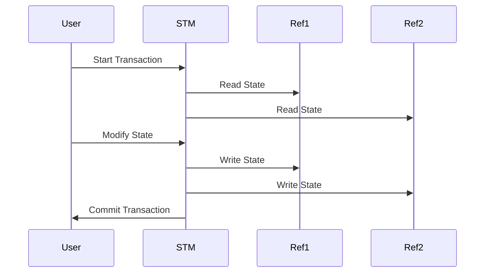

## 3.6 Software Transactional Memory in Clojure

As we delve deeper into Clojure's approach to state management, it's essential to understand the concept of Software Transactional Memory (STM). STM is a concurrency control mechanism that simplifies the management of shared state in a multithreaded environment. In this section, we will explore the principles behind STM, how Clojure implements it, and the scenarios where it shines.

### Understanding Software Transactional Memory

Software Transactional Memory (STM) is a paradigm for managing concurrent access to shared memory without the need for traditional locking mechanisms. It draws inspiration from database transactions, providing a way to ensure that complex operations on shared data are atomic, consistent, isolated, and durable (ACID).

#### Key Concepts of STM

- **Atomicity**: Transactions are atomic, meaning they either complete entirely or have no effect at all.
- **Consistency**: Transactions transform the system from one valid state to another.
- **Isolation**: Transactions appear to execute independently from other transactions.
- **Durability**: Once a transaction is committed, its effects persist.

In Clojure, STM is implemented using **Refs**, **Atoms**, **Agents**, and **Vars**. However, Refs are the primary construct for STM, allowing coordinated changes across multiple references.

### Coordinated Transactions with Refs

Refs in Clojure provide a way to manage shared, mutable state in a safe and consistent manner. They are used within transactions to ensure that changes to multiple Refs are coordinated.

#### Creating and Using Refs

To create a Ref, use the `ref` function:

```clojure
(def account-balance (ref 1000))
```

To modify a Ref, use the `dosync` macro to create a transaction:

```clojure
(dosync
  (ref-set account-balance 1200))
```

The `dosync` macro ensures that all operations within its block are executed as a single transaction. If any part of the transaction fails, the entire transaction is retried.

#### Example: Coordinated Transactions

Let's consider a scenario where we need to transfer money between two accounts. This operation involves updating two Refs atomically:

```clojure
(def account-a (ref 1000))
(def account-b (ref 2000))

(defn transfer [amount from-account to-account]
  (dosync
    (alter from-account - amount)
    (alter to-account + amount)))

;; Transfer $100 from account-a to account-b
(transfer 100 account-a account-b)

;; Check balances
@account-a  ;; => 900
@account-b  ;; => 2100
```

In this example, the `transfer` function uses `alter` to update the Refs within a transaction, ensuring that both accounts are updated consistently.

### Conflict Resolution in STM

One of the challenges in concurrent programming is handling conflicts when multiple transactions attempt to modify the same data simultaneously. Clojure's STM handles conflicts through a mechanism called **optimistic concurrency control**.

#### How STM Handles Conflicts

When a transaction is executed, it operates on a snapshot of the current state. If another transaction modifies the same Refs before the first transaction commits, the STM system detects a conflict. The first transaction is then retried with the updated state.

#### Retry Mechanism

The retry mechanism ensures that transactions are retried until they succeed. This approach eliminates the need for explicit locking and reduces the risk of deadlocks.

```clojure
(defn safe-transfer [amount from-account to-account]
  (dosync
    (when (>= @from-account amount)
      (alter from-account - amount)
      (alter to-account + amount))))

;; Simulate concurrent transfers
(future (safe-transfer 100 account-a account-b))
(future (safe-transfer 150 account-a account-b))
```

In this example, the `safe-transfer` function checks the balance before performing the transfer. If a conflict occurs, the transaction is retried automatically.

### Performance Considerations

While STM provides a powerful mechanism for managing shared state, it comes with some performance overhead. It's crucial to understand when and how to use STM effectively.

#### Overhead of STM

The primary overhead of STM comes from maintaining transactional logs and managing retries. In scenarios with high contention, the cost of retries can become significant.

#### When to Use STM

STM is best suited for scenarios where:

- **Complex Transactions**: Multiple Refs need to be updated atomically.
- **Low Contention**: The likelihood of conflicts is low.
- **Consistency is Critical**: Ensuring data integrity is more important than raw performance.

For simpler state updates or high-contention scenarios, consider using Atoms or Agents, which provide more straightforward concurrency models.

### Comparing STM with Java Concurrency

For developers familiar with Java's concurrency model, transitioning to Clojure's STM can be enlightening. Java typically uses locks and synchronized blocks to manage concurrency, which can lead to complex and error-prone code.

#### Java Locks vs. Clojure STM

| Java Locks | Clojure STM |
|------------|-------------|
| Requires explicit locking | Automatic conflict resolution |
| Prone to deadlocks | Deadlock-free |
| Complex error handling | Simplified transaction model |

Clojure's STM abstracts away the complexity of locks, providing a more declarative and functional approach to concurrency.

### Visualizing STM in Clojure

To better understand how Clojure's STM works, let's visualize the process of a transaction involving multiple Refs.



**Diagram Description**: This sequence diagram illustrates the flow of a transaction in Clojure's STM. The transaction reads the state of multiple Refs, modifies them, and then commits the changes atomically.

### Practical Applications of STM

STM is particularly useful in scenarios where data consistency is paramount. Some practical applications include:

- **Financial Systems**: Ensuring accurate transactions across multiple accounts.
- **Inventory Management**: Coordinating updates to stock levels across warehouses.
- **Collaborative Editing**: Managing concurrent edits to shared documents.

### Try It Yourself

To deepen your understanding of STM, try modifying the code examples above. Experiment with different transaction scenarios, such as transferring funds between more than two accounts or introducing random delays to simulate network latency.

### Knowledge Check

Before moving on, let's solidify our understanding of Clojure's STM with a few questions:

1. What is the primary benefit of using STM over traditional locking mechanisms?
2. How does Clojure's STM handle conflicts between transactions?
3. In what scenarios is it more appropriate to use Atoms or Agents instead of Refs?

### Conclusion

Software Transactional Memory in Clojure offers a robust and elegant solution for managing shared state in concurrent applications. By abstracting away the complexities of locks and providing automatic conflict resolution, STM allows developers to focus on building scalable and reliable applications.

As you continue your journey in mastering Clojure, consider exploring related topics such as [Clojure's concurrency primitives](https://clojure.org/reference/refs) and [Functional Reactive Programming](#chapter-14-functional-reactive-programming) to further enhance your understanding of functional programming in concurrent environments.

## **Test Your Knowledge: Software Transactional Memory in Clojure Quiz**



### What is the primary benefit of using STM over traditional locking mechanisms?

- [x] Automatic conflict resolution
- [ ] Faster execution
- [ ] Easier debugging
- [ ] Greater memory efficiency

> **Explanation:** STM provides automatic conflict resolution, eliminating the need for explicit locks and reducing the risk of deadlocks.

### How does Clojure's STM handle conflicts between transactions?

- [x] By retrying transactions
- [ ] By locking resources
- [ ] By aborting transactions
- [ ] By using a queue

> **Explanation:** Clojure's STM uses optimistic concurrency control, retrying transactions that encounter conflicts.

### In what scenarios is it more appropriate to use Atoms or Agents instead of Refs?

- [x] For simpler state updates
- [x] In high-contention scenarios
- [ ] For complex transactions
- [ ] When consistency is critical

> **Explanation:** Atoms and Agents are suitable for simpler state updates and high-contention scenarios, where the overhead of STM is unnecessary.

### Which of the following is a key concept of STM?

- [x] Atomicity
- [ ] Synchronization
- [ ] Thread safety
- [ ] Serialization

> **Explanation:** Atomicity is a fundamental concept of STM, ensuring that transactions are completed entirely or not at all.

### What mechanism does Clojure's STM use to manage concurrency?

- [x] Optimistic concurrency control
- [ ] Pessimistic locking
- [ ] Thread pooling
- [ ] Synchronized blocks

> **Explanation:** Clojure's STM uses optimistic concurrency control, allowing transactions to proceed without locking and resolving conflicts through retries.

### What is the role of the `dosync` macro in Clojure's STM?

- [x] To create a transaction
- [ ] To lock resources
- [ ] To synchronize threads
- [ ] To manage memory

> **Explanation:** The `dosync` macro is used to create a transaction, ensuring that all operations within its block are executed atomically.

### Which of the following is NOT a feature of Clojure's STM?

- [ ] Atomicity
- [ ] Consistency
- [ ] Isolation
- [x] Locking

> **Explanation:** Clojure's STM does not use locking mechanisms; instead, it relies on optimistic concurrency control.

### What is the primary overhead associated with STM?

- [x] Maintaining transactional logs
- [ ] Increased memory usage
- [ ] Slower execution
- [ ] Complex error handling

> **Explanation:** The primary overhead of STM comes from maintaining transactional logs and managing retries.

### How does Clojure's STM ensure data integrity?

- [x] By retrying transactions until they succeed
- [ ] By locking resources
- [ ] By using synchronized blocks
- [ ] By aborting conflicting transactions

> **Explanation:** Clojure's STM ensures data integrity by retrying transactions that encounter conflicts, maintaining consistency.

### True or False: Clojure's STM is suitable for all types of concurrent applications.

- [ ] True
- [x] False

> **Explanation:** While STM is powerful, it is not suitable for all types of concurrent applications, especially those with high contention or simpler state updates.


