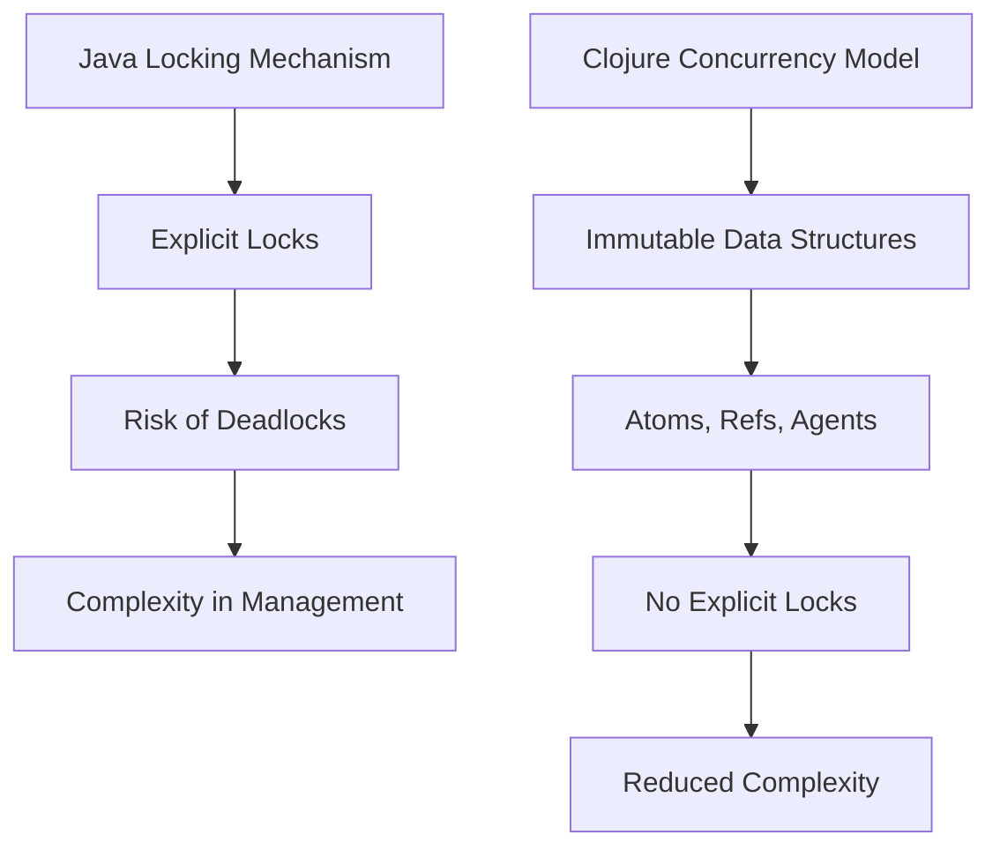

## 3.7 Handling State in Multithreaded Environments

In the realm of software development, handling state in multithreaded environments is a significant challenge. As systems scale, the complexity of managing concurrent processes increases, often leading to issues such as race conditions, deadlocks, and inconsistent data states. In this section, we will explore how Clojure, with its functional programming paradigm and unique concurrency model, addresses these challenges effectively.

### **Concurrency Challenges**

Concurrency introduces several problems that developers must address to ensure the integrity and performance of their applications. Let's outline some common issues faced in multithreaded programming:

- **Race Conditions**: Occur when two or more threads access shared data and try to change it simultaneously. Without proper synchronization, this can lead to unpredictable results.

- **Deadlocks**: Happen when two or more threads are waiting indefinitely for resources held by each other, causing the program to halt.

- **Starvation**: Occurs when a thread is perpetually denied access to resources, preventing it from making progress.

- **Inconsistent Data States**: Arise when multiple threads read and write shared data without proper coordination, leading to data corruption.

Understanding these challenges is crucial for developing robust multithreaded applications. Let's delve into how Clojure's concurrency model simplifies these complexities.

### **Clojure's Concurrency Model**

Clojure leverages immutability and a set of concurrency primitives to simplify state management in multithreaded environments. Here's how Clojure's model addresses the challenges of concurrency:

#### **Immutability**

In Clojure, data structures are immutable by default. This means once a data structure is created, it cannot be changed. Instead, any modification results in a new data structure. Immutability eliminates race conditions, as no thread can alter the state of a shared data structure. This fundamental property simplifies reasoning about concurrent code and ensures thread safety.

#### **State Management Constructs**

Clojure provides several constructs for managing state in a controlled manner:

- **Atoms**: Allow for synchronous, uncoordinated state changes. They are ideal for managing independent state changes without coordination.

- **Refs**: Facilitate coordinated, synchronous state changes across multiple references. They use Software Transactional Memory (STM) to ensure atomicity and consistency.

- **Agents**: Enable asynchronous, uncoordinated state changes. They are suitable for managing state changes that do not require immediate consistency.

By using these constructs, developers can manage state changes effectively without resorting to traditional locking mechanisms.

### **Synchronization Mechanisms**

Traditional synchronization mechanisms, such as locks and semaphores, are prone to errors and complexities. Clojure's approach to synchronization is more intuitive and less error-prone. Let's compare these approaches:

#### **Traditional Locking Mechanisms**

In Java and other imperative languages, synchronization is often achieved using locks. While effective, locks can lead to deadlocks and require careful management to avoid performance bottlenecks.

```java
// Java example of synchronized block
public class Counter {
    private int count = 0;

    public synchronized void increment() {
        count++;
    }

    public synchronized int getCount() {
        return count;
    }
}
```

In this Java example, the `synchronized` keyword ensures that only one thread can execute the `increment` method at a time. However, this approach can lead to deadlocks if not managed carefully.

#### **Clojure's Approach**

Clojure's concurrency model eliminates the need for explicit locks by using immutable data structures and state management constructs.

```clojure
;; Clojure example using an Atom
(def counter (atom 0))

(defn increment []
  (swap! counter inc))

(defn get-count []
  @counter)
```

In this Clojure example, the `atom` function creates an atomic reference to a value. The `swap!` function safely updates the value without the need for explicit locks. This approach is not only simpler but also eliminates the risk of deadlocks.

### **Best Practices for Multithreaded Code in Clojure**

To write safe and efficient multithreaded code in Clojure, consider the following best practices:

1. **Leverage Immutability**: Use immutable data structures to avoid race conditions and simplify reasoning about state changes.

2. **Choose the Right State Management Construct**: Use Atoms for independent state changes, Refs for coordinated changes, and Agents for asynchronous updates.

3. **Minimize Shared State**: Reduce the amount of shared state to minimize the potential for concurrency issues.

4. **Use Software Transactional Memory (STM)**: For coordinated state changes, use Refs and STM to ensure atomicity and consistency.

5. **Avoid Blocking Operations**: Design your system to avoid blocking operations, which can lead to performance bottlenecks.

6. **Test Concurrent Code Thoroughly**: Use testing frameworks to simulate concurrent scenarios and ensure your code behaves correctly under load.

7. **Profile and Monitor Performance**: Continuously profile and monitor your application's performance to identify and address concurrency-related issues.

### **Try It Yourself**

Let's experiment with Clojure's concurrency constructs. Modify the following code to explore different state management scenarios:

```clojure
;; Define an atom for a shared counter
(def counter (atom 0))

;; Increment the counter using swap!
(defn increment-counter []
  (swap! counter inc))

;; Print the current value of the counter
(defn print-counter []
  (println "Counter value:" @counter))

;; Simulate concurrent updates
(dotimes [_ 100]
  (future (increment-counter)))

;; Wait for futures to complete and print the final counter value
(Thread/sleep 1000)
(print-counter)
```

**Suggestions for Modification:**

- Experiment with different state management constructs (Atoms, Refs, Agents) to see how they affect the behavior.
- Introduce delays in the `increment-counter` function to simulate longer-running operations.
- Increase the number of concurrent updates and observe the impact on performance.

### **Visual Aids**

To further illustrate the concepts, let's compare Java's locking mechanism with Clojure's concurrency model using a diagram.



**Diagram Description**: This diagram compares Java's locking mechanism with Clojure's concurrency model. Java relies on explicit locks, which can lead to deadlocks and complexity. In contrast, Clojure uses immutable data structures and state management constructs, reducing complexity and eliminating the need for explicit locks.

### **References and Links**

For further reading, consider exploring the following resources:

- [Clojure Official Documentation](https://clojure.org/reference)
- [Clojure Community Resources](https://clojure.org/community/resources)
- [Clojure STM Guide](https://clojure.org/reference/refs)
- [Transitioning from OOP to Functional Programming](https://www.lispcast.com/oo-to-fp/)

### **Knowledge Check**

To reinforce your understanding, consider the following questions:

1. What are the main challenges of handling state in multithreaded environments?
2. How does immutability help in managing concurrency in Clojure?
3. What are the differences between Atoms, Refs, and Agents in Clojure?
4. How does Clojure's concurrency model compare to traditional locking mechanisms?
5. What are some best practices for writing multithreaded code in Clojure?

### **Test Your Knowledge: Handling State in Multithreaded Environments Quiz**



### What is a race condition?

- [x] A situation where two or more threads access shared data and try to change it simultaneously.
- [ ] A situation where a thread is perpetually denied access to resources.
- [ ] A situation where two or more threads are waiting indefinitely for resources held by each other.
- [ ] A situation where a program runs slower than expected.

> **Explanation:** A race condition occurs when multiple threads access shared data and try to change it simultaneously, leading to unpredictable results.

### How does Clojure's immutability help in managing concurrency?

- [x] It eliminates race conditions by ensuring data cannot be changed.
- [ ] It allows for faster execution of concurrent code.
- [ ] It simplifies the use of traditional locking mechanisms.
- [ ] It increases the complexity of state management.

> **Explanation:** Clojure's immutability ensures that data cannot be changed, eliminating race conditions and simplifying concurrency management.

### Which Clojure construct is suitable for asynchronous, uncoordinated state changes?

- [ ] Atoms
- [ ] Refs
- [x] Agents
- [ ] Futures

> **Explanation:** Agents in Clojure are suitable for managing asynchronous, uncoordinated state changes.

### What is the purpose of Software Transactional Memory (STM) in Clojure?

- [x] To ensure atomicity and consistency in coordinated state changes.
- [ ] To speed up the execution of concurrent code.
- [ ] To replace traditional locking mechanisms.
- [ ] To manage asynchronous state changes.

> **Explanation:** STM in Clojure ensures atomicity and consistency in coordinated state changes across multiple references.

### What is a deadlock?

- [ ] A situation where two or more threads access shared data and try to change it simultaneously.
- [ ] A situation where a thread is perpetually denied access to resources.
- [x] A situation where two or more threads are waiting indefinitely for resources held by each other.
- [ ] A situation where a program runs slower than expected.

> **Explanation:** A deadlock occurs when two or more threads are waiting indefinitely for resources held by each other, causing the program to halt.

### Which Clojure construct should you use for independent state changes?

- [x] Atoms
- [ ] Refs
- [ ] Agents
- [ ] Futures

> **Explanation:** Atoms in Clojure are ideal for managing independent state changes without coordination.

### What is the main advantage of using immutable data structures in Clojure?

- [x] They simplify reasoning about concurrent code and ensure thread safety.
- [ ] They allow for faster execution of concurrent code.
- [ ] They increase the complexity of state management.
- [ ] They require traditional locking mechanisms.

> **Explanation:** Immutable data structures simplify reasoning about concurrent code and ensure thread safety by eliminating race conditions.

### How can you avoid blocking operations in a multithreaded Clojure application?

- [x] Design your system to avoid blocking operations, which can lead to performance bottlenecks.
- [ ] Use traditional locking mechanisms.
- [ ] Increase the number of concurrent threads.
- [ ] Use synchronous state management constructs.

> **Explanation:** Avoiding blocking operations helps prevent performance bottlenecks in multithreaded applications.

### What is the role of Refs in Clojure's concurrency model?

- [ ] To manage asynchronous state changes.
- [x] To facilitate coordinated, synchronous state changes.
- [ ] To replace traditional locking mechanisms.
- [ ] To speed up the execution of concurrent code.

> **Explanation:** Refs in Clojure facilitate coordinated, synchronous state changes using STM to ensure atomicity and consistency.

### True or False: Clojure's concurrency model eliminates the need for explicit locks.

- [x] True
- [ ] False

> **Explanation:** Clojure's concurrency model, with its immutable data structures and state management constructs, eliminates the need for explicit locks.



By understanding and applying these concepts, you'll be well-equipped to handle state in multithreaded environments using Clojure. Embrace the functional programming paradigm, and you'll find that managing concurrency becomes more intuitive and less error-prone.
