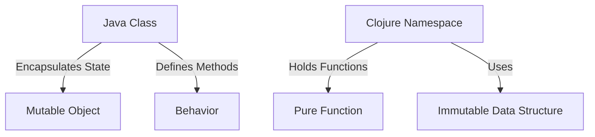

## 4.1 Defining Pure Functions

In the realm of functional programming, pure functions are the cornerstone of writing clean, maintainable, and scalable code. Understanding pure functions is essential for any developer transitioning from an object-oriented paradigm, such as Java, to a functional one like Clojure. This section will delve into what makes a function pure, the benefits of using pure functions, and how to identify impurities in your code.

### Characteristics of Pure Functions

**Pure functions** are defined by two main characteristics:

1. **No Side Effects**: A pure function does not alter any external state or interact with the outside world. This means it does not modify variables outside its scope, perform I/O operations, or rely on mutable data.

2. **Deterministic Output**: For a given set of inputs, a pure function will always produce the same output. This predictability is crucial for reasoning about code behavior.

#### No Side Effects

To understand side effects, let's consider a typical Java method that updates a global variable:

```java
// Java Example
int counter = 0;

public void incrementCounter() {
    counter++;
}
```

In this example, `incrementCounter` changes the state of the `counter` variable, which is a side effect. In contrast, a pure function in Clojure would avoid such state changes:

```clojure
;; Clojure Example
(defn increment [n]
  (+ n 1))
```

Here, `increment` takes an input `n` and returns a new value without altering any external state.

#### Deterministic Output

A function that produces different outputs for the same inputs is not pure. Consider this Java method that uses a random number generator:

```java
// Java Example
public int randomIncrement(int n) {
    return n + new Random().nextInt(10);
}
```

This method is not pure because it yields different results each time it's called with the same input. In Clojure, a pure function would avoid such randomness:

```clojure
;; Clojure Example
(defn add-fixed-value [n]
  (+ n 5))
```

In this case, `add-fixed-value` consistently returns `n + 5` for any given `n`.

### Benefits of Pure Functions

Pure functions offer several advantages that enhance the development process:

- **Easier to Test**: Since pure functions are deterministic, writing tests becomes straightforward. You can assert that for a given input, the output is always the same.
  
- **Simpler Reasoning**: With no side effects, understanding and reasoning about the behavior of pure functions is simpler. You can focus solely on the input-output relationship.

- **Enhanced Composability**: Pure functions can be composed together to form more complex operations. This modularity leads to cleaner and more maintainable code.

- **Concurrency Friendly**: Since pure functions do not modify shared state, they are inherently safe to run in parallel, facilitating concurrent programming.

### Examples of Pure Functions

Let's explore some simple examples of pure functions in Clojure to solidify our understanding.

#### Example 1: Basic Arithmetic Function

```clojure
(defn square [x]
  (* x x))
```

The `square` function takes a number `x` and returns its square. It does not modify any external state or rely on any external input, making it pure.

#### Example 2: List Transformation

```clojure
(defn double-list [lst]
  (map #(* 2 %) lst))
```

`double-list` doubles each element in a list. It uses `map`, a higher-order function, to apply a pure function to each element. The original list remains unchanged, demonstrating immutability.

#### Example 3: String Manipulation

```clojure
(defn reverse-string [s]
  (apply str (reverse s)))
```

`reverse-string` takes a string and returns its reverse. It operates solely on the input string, ensuring no side effects.

### Identifying Impurities

Recognizing when a function is not pure is crucial for maintaining functional integrity. Here are some common signs of impurity:

- **State Modification**: If a function changes a variable outside its scope, it is impure.
- **I/O Operations**: Functions that perform input/output operations, such as reading from a file or printing to the console, are impure.
- **Randomness**: Utilizing random number generators or other non-deterministic processes introduces impurity.
- **Time Dependency**: Functions that depend on the current time or date for their output are not pure.

#### Example of an Impure Function

Consider the following Clojure function that reads from a file:

```clojure
(defn read-file [filename]
  (slurp filename))
```

`read-file` is impure because it performs an I/O operation by reading a file. To maintain purity, separate the I/O operation from the pure logic.

### Transitioning from Java to Clojure

For Java developers, transitioning to Clojure's functional paradigm involves rethinking how to structure code without relying on mutable state or side effects. In Java, classes and objects encapsulate state and behavior, whereas in Clojure, functions and immutable data structures take precedence.

#### Java to Clojure: A Comparison

| Concept         | Java OOP                   | Clojure Functional         |
|-----------------|----------------------------|----------------------------|
| State           | Mutable objects            | Immutable data structures  |
| Behavior        | Methods within classes     | Pure functions             |
| Side Effects    | Common in methods          | Avoided in functions       |
| Concurrency     | Complex due to shared state| Simplified with immutability|

### Try It Yourself

Experiment with the examples provided by modifying them to understand the impact on purity:

- **Modify `square`** to include a side effect, such as printing the result. Observe how this changes its purity.
- **Alter `double-list`** to use a random multiplier instead of a fixed value. Consider how this affects determinism.
- **Create a pure function** that takes a list of numbers and returns a new list with each number incremented by a fixed amount.

### Visual Aids

To better understand the transition from Java OOP to Clojure's functional paradigm, consider the following diagram illustrating the mapping of Java classes to Clojure namespaces and functions:



**Diagram Description:** This diagram compares Java's class-based structure with Clojure's functional approach, highlighting the shift from mutable objects to immutable data structures and pure functions.

### References and Links

For further reading and exploration, consider the following resources:

- [Clojure Official Documentation](https://clojure.org/reference)
- [Clojure Community Resources](https://clojure.org/community/resources)
- [Transitioning from OOP to Functional Programming](https://www.lispcast.com/oo-to-fp/)

### Knowledge Check

Test your understanding of pure functions and their characteristics with the following questions and exercises.

## **Test Your Knowledge: Defining Pure Functions Quiz**



### What defines a pure function in functional programming?

- [x] No side effects and deterministic output
- [ ] Ability to modify external state
- [ ] Dependence on external variables
- [ ] Use of I/O operations

> **Explanation:** Pure functions have no side effects and always produce the same output for the same input.

### Which of the following is a benefit of using pure functions?

- [x] Easier to test
- [x] Enhanced composability
- [ ] Increased complexity
- [ ] Unpredictable behavior

> **Explanation:** Pure functions are easier to test and compose due to their deterministic nature and lack of side effects.

### Identify the impure function from the list below.

- [ ] `(defn add [x y] (+ x y))`
- [x] `(defn print-and-add [x y] (println x) (+ x y))`
- [ ] `(defn multiply [x y] (* x y))`
- [ ] `(defn subtract [x y] (- x y))`

> **Explanation:** `print-and-add` is impure because it performs a side effect by printing to the console.

### How does Clojure ensure immutability in its data structures?

- [x] By using persistent data structures
- [ ] By allowing mutable variables
- [ ] By enabling direct state modification
- [ ] By using mutable collections

> **Explanation:** Clojure uses persistent data structures that maintain immutability and structural sharing.

### What is a common sign of an impure function?

- [x] State modification
- [ ] Deterministic output
- [ ] Use of pure logic
- [ ] Immutable data

> **Explanation:** Functions that modify state or rely on mutable data are considered impure.

### Which of the following operations would make a function impure?

- [x] Performing I/O operations
- [ ] Using arithmetic operations
- [ ] Applying pure logic
- [ ] Using immutable data

> **Explanation:** I/O operations introduce side effects, making a function impure.

### How can you convert an impure function to a pure one?

- [x] By removing side effects
- [x] By ensuring deterministic output
- [ ] By adding random elements
- [ ] By modifying external state

> **Explanation:** Removing side effects and ensuring consistent output makes a function pure.

### Which Clojure feature supports concurrency by avoiding shared state?

- [x] Immutability
- [ ] Mutable variables
- [ ] Random number generation
- [ ] Direct state modification

> **Explanation:** Immutability in Clojure allows safe concurrent execution by avoiding shared state.

### What is the key advantage of using pure functions in concurrent programming?

- [x] Thread safety
- [ ] Increased complexity
- [ ] Unpredictable behavior
- [ ] State modification

> **Explanation:** Pure functions are thread-safe because they do not modify shared state.

### True or False: Pure functions can rely on the current time for their output.

- [ ] True
- [x] False

> **Explanation:** Pure functions cannot rely on the current time as it introduces non-determinism.



By mastering pure functions, you lay the foundation for writing robust and scalable applications in Clojure. Embrace the functional paradigm, and you'll find your codebase becoming more predictable, testable, and maintainable.
