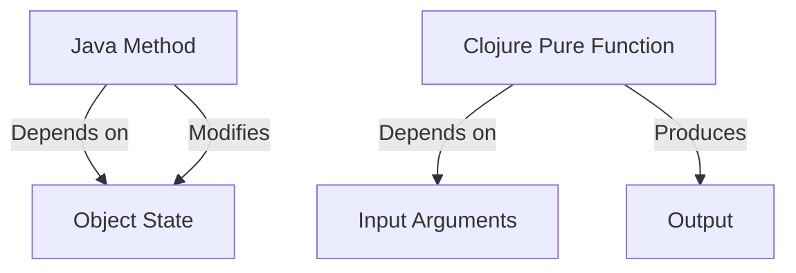

## 4.2 Advantages of Pure Functions

In the realm of functional programming, pure functions are the cornerstone of writing clean, efficient, and maintainable code. As we delve into the advantages of pure functions, we'll explore how they enhance testability, facilitate parallelization, enable effective caching and memoization, and contribute to the maintainability of your codebase. These benefits are crucial for developing scalable applications in Clojure, a language that embraces functional paradigms. Let's embark on this exploration, drawing parallels to Java's object-oriented programming (OOP) concepts to aid those transitioning from Java to Clojure.

### **Testability**

Pure functions are deterministic; they always produce the same output for the same input, without side effects. This predictability makes them inherently easier to test compared to functions that rely on external state or mutable data. In Java OOP, testing often involves setting up complex environments with mocks and stubs to isolate the unit under test. In contrast, pure functions in Clojure require no such scaffolding, as they depend solely on their input arguments.

#### **Example of Testing a Pure Function**

Let's consider a simple pure function in Clojure that calculates the square of a number:

```clojure
(defn square [x]
  (* x x))
```

To test this function, we simply provide input values and verify the output:

```clojure
(deftest test-square
  (is (= 4 (square 2)))
  (is (= 9 (square 3)))
  (is (= 16 (square 4))))
```

In this example, testing is straightforward and does not require any additional setup. This simplicity reduces the likelihood of errors in tests and increases confidence in the correctness of the function.

### **Parallelization**

Pure functions have no side effects and do not depend on shared state, making them ideal candidates for parallel execution. In Java, managing concurrency often involves complex synchronization mechanisms to prevent race conditions. With pure functions, these concerns are alleviated, as there is no mutable state to protect.

#### **Parallel Execution with Pure Functions**

Consider a scenario where we need to process a list of numbers in parallel:

```clojure
(def numbers (range 1 1000000))

(defn process-number [n]
  (* n n))

(def processed-numbers
  (pmap process-number numbers))
```

In this example, `pmap` is used to apply the `process-number` function to each element in the `numbers` list in parallel. Since `process-number` is pure, there are no concerns about data races or synchronization, resulting in efficient parallel processing.

### **Caching and Memoization**

Memoization is a technique used to cache the results of expensive function calls and reuse them when the same inputs occur again. Pure functions are perfectly suited for memoization because their output depends only on their input. In Java, memoization can be complex due to mutable state and side effects, but in Clojure, it is straightforward and reliable.

#### **Implementing Memoization**

Clojure provides a built-in `memoize` function to facilitate caching:

```clojure
(defn expensive-computation [x]
  (Thread/sleep 1000) ; Simulate a time-consuming operation
  (* x x))

(def memoized-computation (memoize expensive-computation))

(time (memoized-computation 10)) ; Takes 1 second
(time (memoized-computation 10)) ; Returns instantly
```

In this example, the first call to `memoized-computation` with an argument of `10` takes time to compute, but subsequent calls with the same argument return instantly, demonstrating the efficiency of memoization with pure functions.

### **Maintainability**

Pure functions contribute significantly to the maintainability of code. Their self-contained nature and lack of side effects make them easier to reason about, refactor, and reuse. In Java OOP, maintaining code often involves understanding complex interactions between objects and managing state changes. Pure functions, however, encapsulate logic in a way that minimizes dependencies and side effects.

#### **Refactoring with Pure Functions**

Refactoring code that uses pure functions is less risky because changes to one function do not ripple through the system, affecting other parts of the codebase. This modularity allows developers to improve and optimize individual functions without unintended consequences.

### **Visual Aids and Diagrams**

To further illustrate these concepts, let's examine a visual representation of how pure functions interact compared to Java OOP methods.



**Diagram Description**: This diagram contrasts a Java method that depends on and modifies object state with a Clojure pure function that relies solely on input arguments to produce output. The absence of state dependencies in pure functions simplifies parallelization, testing, and refactoring.

### **References and Further Reading**

- [Clojure Official Documentation](https://clojure.org/reference)
- [Clojure Community Resources](https://clojure.org/community/resources)
- [Transitioning from OOP to Functional Programming](https://www.lispcast.com/oo-to-fp/)

### **Knowledge Check**

To reinforce your understanding of pure functions and their advantages, consider these questions:

1. How do pure functions enhance testability compared to Java OOP methods?
2. What makes pure functions suitable for parallel execution?
3. Explain how memoization works with pure functions.
4. Discuss the impact of pure functions on code maintainability.

### **Try It Yourself**

Experiment with the code examples provided. Try modifying the `expensive-computation` function to simulate different time-consuming operations and observe how memoization affects performance. Consider implementing your own pure functions and testing them to gain hands-on experience.

### **Summary**

Pure functions are a fundamental concept in functional programming, offering numerous advantages in terms of testability, parallelization, caching, and maintainability. By embracing pure functions in Clojure, developers can build scalable, efficient, and maintainable applications. As you continue your journey into functional programming, keep exploring these concepts and applying them to real-world scenarios.

## **Test Your Knowledge: Advantages of Pure Functions Quiz**



### Pure functions are easier to test because they:
- [x] Do not rely on external state or side effects
- [ ] Require complex mocks and stubs
- [ ] Depend on shared mutable state
- [ ] Always produce different outputs for the same inputs

> **Explanation:** Pure functions are deterministic and do not have side effects, making them straightforward to test without the need for mocks or stubs.

### Which of the following is a key benefit of using pure functions for parallel processing?
- [x] No need for synchronization
- [ ] Increased risk of race conditions
- [ ] Dependence on shared state
- [ ] Complexity in managing concurrency

> **Explanation:** Pure functions do not rely on shared state, eliminating the need for synchronization and reducing the risk of race conditions.

### Memoization is effective with pure functions because:
- [x] They always produce the same output for the same input
- [ ] They rely on mutable state
- [ ] They have unpredictable side effects
- [ ] They require complex caching mechanisms

> **Explanation:** Pure functions' deterministic nature allows for reliable caching of results through memoization.

### How do pure functions contribute to maintainability?
- [x] They are self-contained and minimize dependencies
- [ ] They increase complexity and dependencies
- [ ] They require frequent updates and refactoring
- [ ] They depend on external state

> **Explanation:** Pure functions encapsulate logic, reducing dependencies and making code easier to maintain and refactor.

### In Clojure, memoization is implemented using:
- [x] The `memoize` function
- [ ] The `cache` library
- [ ] The `synchronize` keyword
- [ ] The `state` function

> **Explanation:** Clojure provides a built-in `memoize` function to facilitate caching of pure function results.

### Pure functions are suitable for parallel execution because they:
- [x] Do not modify shared state
- [ ] Depend on external resources
- [ ] Require complex synchronization
- [ ] Have side effects

> **Explanation:** Pure functions do not modify shared state, making them ideal for parallel execution without synchronization concerns.

### What is a common challenge when testing impure functions?
- [x] Managing external dependencies and side effects
- [ ] Ensuring they have no side effects
- [ ] Verifying deterministic behavior
- [ ] Simplifying test cases

> **Explanation:** Impure functions often depend on external state, requiring additional setup to manage dependencies and side effects during testing.

### Which of the following is NOT an advantage of pure functions?
- [ ] Predictable behavior
- [x] Dependence on global variables
- [ ] Easier refactoring
- [ ] Simplified testing

> **Explanation:** Pure functions do not depend on global variables, contributing to their predictability and ease of testing and refactoring.

### Pure functions are characterized by:
- [x] Deterministic outputs and no side effects
- [ ] Dependence on mutable state
- [ ] Complex interactions with external systems
- [ ] Frequent changes to global variables

> **Explanation:** Pure functions produce deterministic outputs and do not have side effects, making them predictable and reliable.

### True or False: Pure functions in Clojure can be safely executed in parallel.
- [x] True
- [ ] False

> **Explanation:** Pure functions can be executed in parallel without synchronization issues because they do not rely on shared mutable state.


