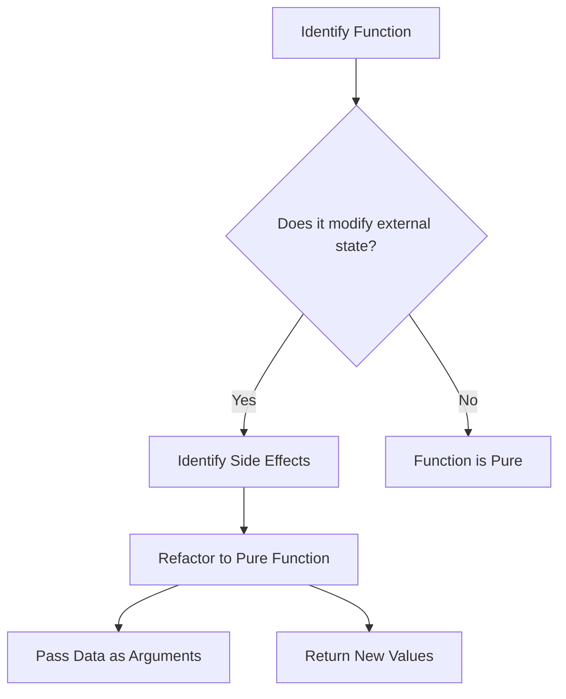

## 4.3 Avoiding Side Effects in Functions

In the realm of functional programming, one of the key principles is to write functions that are pure, meaning they do not have side effects. This section will explore what side effects are, why they matter, and how to avoid them in Clojure, enabling you to build more predictable and maintainable applications.

### Understanding Side Effects

**Side effects** occur when a function interacts with the outside world or modifies some state outside its local environment. In contrast, a **pure function** is one that, given the same input, will always return the same output without modifying any external state.

#### Impact of Side Effects on Function Purity

Side effects can lead to unpredictable behavior, making it difficult to understand, test, and maintain code. They introduce dependencies on the external state, which can change unexpectedly, leading to bugs that are hard to trace. In contrast, pure functions are deterministic and easier to reason about, test, and refactor.

#### Common Side Effects

1. **Modifying Global Variables**: Changing the state of a variable that exists outside the function scope.
2. **I/O Operations**: Reading from or writing to files, databases, or network resources.
3. **Mutating Arguments**: Altering the data passed into the function.
4. **Logging**: Writing logs to a file or console.
5. **Random Number Generation**: Producing different outputs for the same input due to randomness.

### Strategies to Avoid Side Effects

To embrace functional programming fully, it is crucial to avoid side effects. Here are some strategies to achieve this:

#### Passing in Necessary Data

Instead of relying on external state, pass all necessary data into the function as arguments. This ensures that the function does not depend on any external variables, making it self-contained and predictable.

```clojure
(defn calculate-area [length width]
  (* length width))
```

In this example, `calculate-area` is a pure function because it relies only on its input parameters.

#### Returning New Values

Instead of modifying existing data structures, return new ones. Clojure's immutable data structures make this approach efficient and straightforward.

```clojure
(defn add-to-list [lst item]
  (conj lst item))
```

Here, `add-to-list` returns a new list with the added item, leaving the original list unchanged.

#### Using Local Variables

Use local bindings within functions to avoid modifying external variables. Clojure's `let` form allows you to define local variables that are only accessible within the function's scope.

```clojure
(defn calculate-total [prices]
  (let [tax-rate 0.05
        total (reduce + prices)]
    (* total (+ 1 tax-rate))))
```

In this function, `tax-rate` and `total` are local variables, ensuring that no external state is altered.

#### Refactoring Impure Functions

Refactoring impure functions involves identifying side effects and restructuring the code to eliminate them. Let's consider a function that modifies a global variable:

```clojure
(def total-sales 0)

(defn add-sale [amount]
  (set! total-sales (+ total-sales amount)))
```

To refactor this function into a pure one, we can pass the current total as an argument and return the new total:

```clojure
(defn add-sale [current-total amount]
  (+ current-total amount))
```

Now, `add-sale` no longer modifies `total-sales` directly, making it pure.

### Practical Examples and Code Refactoring

#### Example 1: Refactoring a Logging Function

Consider a function that logs messages to the console:

```clojure
(defn log-message [message]
  (println "Log: " message))
```

To refactor this function, we can separate the logging side effect from the message formatting:

```clojure
(defn format-log-message [message]
  (str "Log: " message))

(defn log-message [formatted-message]
  (println formatted-message))
```

Now, `format-log-message` is pure, and the side effect is isolated in `log-message`.

#### Example 2: Handling Randomness

A function that generates random numbers is inherently impure:

```clojure
(defn random-number []
  (rand-int 100))
```

To refactor, pass the random number generator as a parameter:

```clojure
(defn random-number [rng]
  (rng 100))

(random-number rand-int)
```

This approach allows for easier testing and control over randomness.

### Visualizing Side Effects and Pure Functions

Below is a flowchart illustrating the process of identifying and refactoring side effects:



**Caption**: Flowchart depicting the steps to identify and refactor side effects in functions.

### References and Further Reading

For more on functional programming and Clojure, consider the following resources:

- [Clojure Official Documentation](https://clojure.org/reference)
- [Clojure Community Resources](https://clojure.org/community/resources)
- [Transitioning from OOP to Functional Programming](https://www.lispcast.com/oo-to-fp/)

### Knowledge Check

1. **What is a side effect in functional programming?**
   - A side effect occurs when a function interacts with the outside world or modifies some state outside its local environment.

2. **Why is avoiding side effects important?**
   - Avoiding side effects leads to more predictable, testable, and maintainable code.

3. **How can you refactor a function that modifies a global variable?**
   - Pass the variable as an argument and return a new value instead of modifying the global variable.

4. **What is a pure function?**
   - A pure function is one that, given the same input, always returns the same output without modifying any external state.

5. **How can randomness be handled in a pure function?**
   - Pass the random number generator as a parameter to control randomness and make the function testable.

### Exercises

1. **Refactor the following impure function to be pure:**

```clojure
(def counter 0)

(defn increment-counter []
  (set! counter (inc counter)))
```

2. **Create a pure function that reads a list of prices and returns the total with tax, without modifying the original list.**

3. **Write a pure function that takes a list and an item, and returns a new list with the item added, without using `conj`.**

### Encouraging Engagement

Embracing functional programming can be challenging, but with each step, you'll gain a deeper understanding and see tangible benefits in your codebase. Keep experimenting and refactoring your functions to achieve purity and avoid side effects.

---

## **Test Your Knowledge: Avoiding Side Effects in Functions Quiz**



### What is a side effect in functional programming?

- [x] A change in state outside the function
- [ ] A function that returns a value
- [ ] A function that takes no arguments
- [ ] A function that uses recursion

> **Explanation:** A side effect is when a function changes some state outside its local environment.

### Why should we avoid side effects in functions?

- [x] To make code more predictable and testable
- [ ] To increase code execution speed
- [ ] To reduce the number of lines of code
- [ ] To make functions more complex

> **Explanation:** Avoiding side effects makes code more predictable, easier to test, and maintain.

### How can you refactor a function that modifies a global variable?

- [x] Pass the variable as an argument and return a new value
- [ ] Use a different global variable
- [ ] Remove the function entirely
- [ ] Use a loop to modify the variable

> **Explanation:** By passing the variable as an argument and returning a new value, the function becomes pure.

### What is a pure function?

- [x] A function that always produces the same output for the same input
- [ ] A function that modifies external state
- [ ] A function that performs I/O operations
- [ ] A function that uses global variables

> **Explanation:** A pure function always produces the same output for the same input and does not modify external state.

### How can randomness be handled in a pure function?

- [x] Pass the random number generator as a parameter
- [ ] Use a fixed random seed
- [ ] Generate random numbers inside the function
- [ ] Avoid using randomness altogether

> **Explanation:** Passing the random number generator as a parameter allows for control over randomness and makes the function testable.

### Which of the following is a common side effect?

- [x] Modifying a global variable
- [ ] Returning a value
- [ ] Using recursion
- [ ] Passing arguments

> **Explanation:** Modifying a global variable is a common side effect as it changes state outside the function.

### What is the benefit of using local variables within functions?

- [x] They prevent modification of external state
- [ ] They increase code complexity
- [ ] They reduce function arguments
- [ ] They make functions slower

> **Explanation:** Local variables prevent modification of external state, contributing to function purity.

### How can you ensure a function is self-contained?

- [x] Pass all necessary data as arguments
- [ ] Use global variables
- [ ] Perform I/O operations inside the function
- [ ] Modify external state

> **Explanation:** Passing all necessary data as arguments ensures the function is self-contained and does not rely on external state.

### What is the purpose of returning new values in functional programming?

- [x] To avoid modifying existing data structures
- [ ] To increase memory usage
- [ ] To make functions slower
- [ ] To reduce function arguments

> **Explanation:** Returning new values avoids modifying existing data structures, maintaining immutability and purity.

### True or False: Logging is considered a side effect.

- [x] True
- [ ] False

> **Explanation:** Logging is considered a side effect as it involves writing to an external system (console, file, etc.).



---
