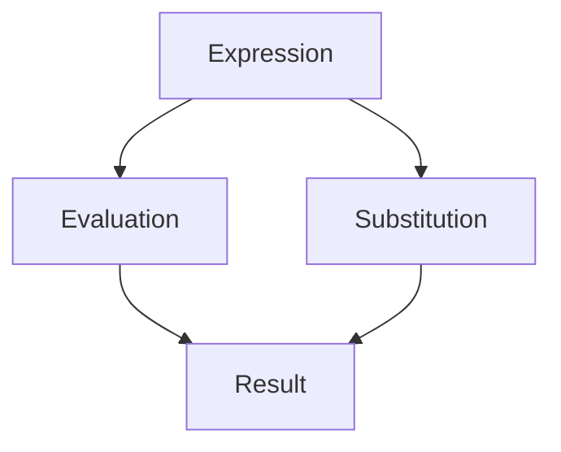

## 4.4 Referential Transparency Explained

In the realm of functional programming, referential transparency is a cornerstone concept that significantly impacts how we write, understand, and maintain code. It is closely tied to the idea of pure functions, which we explored earlier in this chapter. Let's delve into what referential transparency means, why it is important, and how it can be leveraged to create more robust and maintainable applications using Clojure.

### **Definition of Referential Transparency**

Referential transparency is a property of parts of a program where an expression can be replaced with its corresponding value without changing the program's behavior. In simpler terms, if a function consistently produces the same output for the same input, it is referentially transparent. This concept is foundational in functional programming because it ensures predictability and reliability in code execution.

#### **Relation to Pure Functions**

A function is considered pure if it meets two criteria:
1. It always returns the same result given the same arguments.
2. It has no side effects, meaning it does not alter any state outside its scope or interact with the outside world (e.g., modifying a global variable, writing to a file, etc.).

Referential transparency is inherently linked to pure functions because a function that is referentially transparent is, by definition, pure. This allows us to reason about our programs more effectively, as we can substitute expressions with their values confidently.

### **Importance of Referential Transparency**

#### **Code Substitution and Reasoning**

One of the primary benefits of referential transparency is that it allows for code substitution. This means that any expression in a program can be replaced with its evaluated result without affecting the program's correctness. This property is invaluable for several reasons:

- **Simplified Reasoning**: Developers can understand and predict program behavior more easily, as they can focus on the logic of expressions rather than tracking state changes.
- **Optimization**: Compilers and interpreters can optimize code more effectively by replacing expressions with their precomputed values, leading to performance improvements.
- **Refactoring**: Code can be refactored with confidence, knowing that substituting expressions will not introduce bugs.

#### **Implications in Debugging**

Referential transparency also plays a crucial role in debugging. Because expressions are predictable and consistent, developers can isolate and identify issues more easily. When debugging a referentially transparent function, you can be assured that the problem lies within the function itself or its inputs, not in hidden state changes or side effects.

### **Code Examples**

Let's explore some code examples to illustrate referential transparency in action. We'll use Clojure to demonstrate how expressions can be replaced with their corresponding values.

#### **Example 1: Simple Arithmetic Function**

Consider the following Clojure function:

```clojure
(defn add [x y]
  (+ x y))
```

This `add` function is referentially transparent because it consistently returns the sum of `x` and `y` without any side effects. We can replace a call to `(add 2 3)` with `5` anywhere in the program, and the behavior will remain unchanged.

```clojure
;; Original expression
(let [result (add 2 3)]
  (* result 2))

;; Substituted expression
(let [result 5]
  (* result 2))
```

Both expressions yield the same result, demonstrating the power of referential transparency.

#### **Example 2: Function with Immutable Data**

Let's look at a slightly more complex example involving immutable data structures:

```clojure
(defn update-map [m key value]
  (assoc m key value))
```

This function takes a map `m`, a `key`, and a `value`, and returns a new map with the `key` associated with the `value`. It does not modify the original map, maintaining referential transparency.

```clojure
;; Original expression
(let [original-map {:a 1 :b 2}
      updated-map (update-map original-map :c 3)]
  (println updated-map))

;; Substituted expression
(let [original-map {:a 1 :b 2}
      updated-map {:a 1 :b 2 :c 3}]
  (println updated-map))
```

Again, we can substitute the function call with its result without affecting program behavior.

### **Implications in Debugging and Understanding Code Flow**

Referential transparency simplifies debugging by narrowing down potential sources of errors. Since pure functions do not rely on external state, any unexpected behavior can be traced back to the function's logic or its inputs. This predictability reduces the cognitive load on developers, allowing them to focus on solving the problem rather than tracking down elusive state changes.

### **Try It Yourself**

To fully grasp referential transparency, try modifying the following code examples:

1. **Experiment with Different Inputs**: Change the inputs to the `add` and `update-map` functions and observe how the outputs remain consistent with the inputs.
2. **Introduce Side Effects**: Modify the functions to include side effects, such as printing to the console, and see how this affects referential transparency.
3. **Refactor Code**: Refactor a piece of imperative code into a referentially transparent function and note the improvements in readability and predictability.

### **Visual Aids**

To further illustrate the concept, let's use a diagram to show how referential transparency allows for code substitution:



**Diagram Description**: This flowchart illustrates the process of evaluating an expression and substituting it with its result. Referential transparency ensures that this substitution does not alter program behavior.

### **References and Links**

- [Clojure Official Documentation](https://clojure.org/reference)
- [Clojure Community Resources](https://clojure.org/community/resources)
- [Transitioning from OOP to Functional Programming](https://www.lispcast.com/oo-to-fp/)
- [Understanding Pure Functions](https://clojure.org/guides/learn/functions)

### **Knowledge Check**

To reinforce your understanding of referential transparency, consider the following questions:

- What makes a function referentially transparent?
- How does referential transparency aid in debugging?
- Can a function with side effects be referentially transparent? Why or why not?

### **Test Your Knowledge: Referential Transparency Explained Quiz**



### What is the primary characteristic of a referentially transparent function?

- [x] It always returns the same result for the same input.
- [ ] It modifies global state.
- [ ] It performs I/O operations.
- [ ] It depends on external variables.

> **Explanation:** A referentially transparent function consistently returns the same output for the same input, without side effects.

### How does referential transparency benefit code optimization?

- [x] Allows compilers to substitute expressions with precomputed values.
- [ ] Requires more memory to store intermediate results.
- [ ] Increases the complexity of code refactoring.
- [ ] Makes debugging more difficult.

> **Explanation:** Referential transparency enables compilers to optimize code by substituting expressions with their evaluated results, improving performance.

### Why is referential transparency important for debugging?

- [x] It ensures that functions have no hidden state changes.
- [ ] It makes code harder to understand.
- [ ] It requires additional logging.
- [ ] It complicates the testing process.

> **Explanation:** Referential transparency simplifies debugging by ensuring that functions do not rely on or modify external state, making it easier to identify issues.

### Which of the following is NOT a benefit of referential transparency?

- [ ] Simplified reasoning about code.
- [ ] Easier code refactoring.
- [ ] Enhanced performance optimization.
- [x] Increased reliance on global variables.

> **Explanation:** Referential transparency reduces reliance on global variables, as it promotes pure functions that do not depend on external state.

### Can a function with side effects be referentially transparent?

- [ ] Yes, if it only modifies local variables.
- [ ] Yes, if it performs I/O operations.
- [x] No, because side effects violate referential transparency.
- [ ] No, unless it uses global variables.

> **Explanation:** A function with side effects is not referentially transparent because it does not consistently produce the same result for the same input.

### What allows for code substitution in referential transparency?

- [x] Predictable and consistent function outputs.
- [ ] Dynamic typing of variables.
- [ ] Use of mutable state.
- [ ] Dependency on external libraries.

> **Explanation:** Code substitution is possible due to the predictable and consistent outputs of referentially transparent functions.

### How does referential transparency relate to pure functions?

- [x] All referentially transparent functions are pure.
- [ ] Pure functions can have side effects.
- [ ] Referential transparency requires mutable state.
- [ ] Pure functions depend on external state.

> **Explanation:** Referential transparency is a characteristic of pure functions, which consistently return the same result for the same input without side effects.

### What is a key advantage of referential transparency in functional programming?

- [x] Simplifies reasoning about program behavior.
- [ ] Increases the need for complex algorithms.
- [ ] Requires more memory for execution.
- [ ] Makes code less predictable.

> **Explanation:** Referential transparency simplifies reasoning about program behavior by ensuring consistent and predictable function outputs.

### In Clojure, how can we ensure a function is referentially transparent?

- [x] Avoid side effects and ensure consistent outputs.
- [ ] Use mutable data structures.
- [ ] Rely on global variables.
- [ ] Perform I/O operations within the function.

> **Explanation:** To ensure referential transparency, functions should avoid side effects and consistently return the same output for the same input.

### True or False: Referential transparency allows expressions to be replaced with their evaluated results without changing program behavior.

- [x] True
- [ ] False

> **Explanation:** This is true. Referential transparency ensures that expressions can be substituted with their evaluated results without affecting program behavior.



By embracing referential transparency, we can write more predictable, maintainable, and efficient code. As you continue to explore functional programming with Clojure, keep this concept in mind and apply it to your coding practices.
