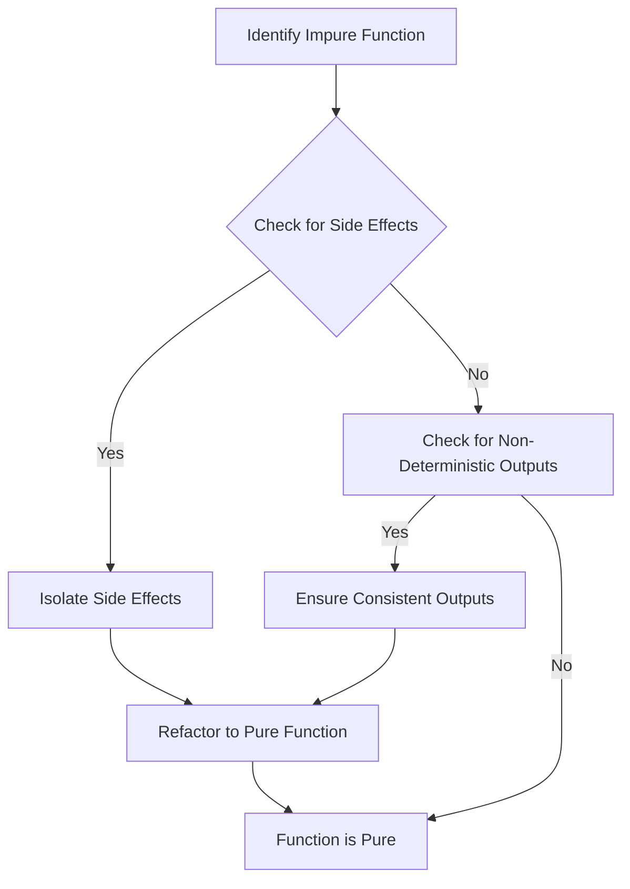

## 4.5 Identifying and Refactoring Impure Functions

In functional programming, pure functions are the cornerstone of writing reliable and maintainable code. Pure functions are those that, given the same input, will always return the same output and have no side effects. In this section, we will explore how to identify impure functions in your Clojure codebase and refactor them into pure functions. We will also discuss strategies for handling necessary side effects in a functional way.

### Analyzing Function Behavior

To identify impure functions, we need to understand what makes a function impure. Impure functions can exhibit the following behaviors:

- **Side Effects**: Modifying state, performing I/O operations, or interacting with external systems.
- **Non-Deterministic Outputs**: Returning different results for the same inputs due to reliance on external state or randomness.

#### Inspecting Functions for Hidden Side Effects

Let's examine a simple example of an impure function:

```clojure
(defn log-and-add [a b]
  (println "Adding numbers" a "and" b) ; Side effect: Printing to console
  (+ a b)) ; Pure operation
```

In the `log-and-add` function, the `println` statement introduces a side effect by printing to the console. This makes the function impure because it performs an action that affects the outside world.

**Steps to Identify Impurity:**

1. **Check for I/O Operations**: Look for functions that read from or write to files, databases, or the console.
2. **Examine State Modifications**: Identify functions that modify global variables or mutable data structures.
3. **Detect External Dependencies**: Determine if the function relies on external systems or services.

### Refactoring Techniques

Refactoring impure functions involves transforming them into pure functions by removing side effects and ensuring consistent outputs.

#### Step-by-Step Refactoring

1. **Isolate Side Effects**: Separate the pure logic from the side effects. For instance, in the `log-and-add` function, we can refactor it as follows:

    ```clojure
    (defn add [a b]
      (+ a b)) ; Pure function

    (defn log-addition [a b]
      (println "Adding numbers" a "and" b)) ; Side effect isolated
    ```

2. **Use Dependency Injection**: Pass dependencies as arguments to the function instead of relying on external state. This makes the function more testable and predictable.

3. **Encapsulate State Changes**: Use Clojure's immutable data structures and state management tools like atoms, refs, and agents to manage state changes functionally.

4. **Leverage Pure Core Functions**: Utilize Clojure's rich set of pure core library functions to build complex operations without introducing impurities.

### Using Pure Core Functions

Clojure provides a wealth of pure functions in its core library that can be used to perform common operations without side effects. These functions are designed to work with immutable data structures, ensuring that they don't modify the input data.

#### Example: Using `map` and `reduce`

```clojure
(defn sum-even-numbers [numbers]
  (reduce + (filter even? numbers)))

;; Usage
(sum-even-numbers [1 2 3 4 5 6]) ; => 12
```

In this example, `map`, `filter`, and `reduce` are pure functions that operate on the input data without modifying it.

### Dealing with Necessary Side Effects

In real-world applications, some side effects are unavoidable, such as logging, user input, or network communication. The key is to isolate these side effects and manage them in a controlled manner.

#### Strategies for Isolating Side Effects

1. **Edge of the System**: Perform side effects at the boundaries of your system, such as in the main entry point or specific I/O handling functions.

2. **Functional Interfaces**: Define functional interfaces that encapsulate side effects, allowing the core logic to remain pure.

3. **Use Monads or Effects Libraries**: Consider using monads or libraries like `core.async` to manage side effects in a more structured way.

#### Example: Isolating Side Effects

```clojure
(defn calculate-and-log [a b]
  (let [result (+ a b)]
    (println "Result:" result) ; Side effect
    result))

(defn main []
  (let [result (calculate-and-log 3 4)]
    (println "Final result:" result))) ; Side effect isolated to main
```

In this example, the `calculate-and-log` function performs a side effect by printing the result. By isolating this side effect in the `main` function, we keep the core logic pure.

### Visual Aids

To further illustrate the process of identifying and refactoring impure functions, let's use a flowchart to depict the steps involved:



**Diagram Description**: This flowchart outlines the steps to identify and refactor impure functions, starting with the identification of side effects and non-deterministic outputs, followed by refactoring to achieve purity.

### References and Links

- [Clojure Official Documentation](https://clojure.org/reference)
- [Transitioning from OOP to Functional Programming](https://www.lispcast.com/oo-to-fp/)
- [Clojure Community Resources](https://clojure.org/community/resources)

### Knowledge Check

To reinforce your understanding of identifying and refactoring impure functions, consider the following questions:

1. What makes a function impure in functional programming?
2. How can you isolate side effects in a Clojure function?
3. Why is it important to use pure core functions in Clojure?
4. What are some strategies for managing necessary side effects in a functional application?

### Encouraging Engagement

Embracing functional programming can be challenging, but with each step, you'll gain a deeper understanding and see tangible benefits in your codebase. By identifying and refactoring impure functions, you enhance the reliability and maintainability of your applications. Keep experimenting with the examples provided and apply these principles to your projects.

### Best Practices for Tags

- Use specific and relevant tags such as "Clojure", "Functional Programming", "Pure Functions", "Refactoring", "Side Effects", "Code Quality", "Immutability", "Best Practices".

### Test Your Knowledge: Identifying and Refactoring Impure Functions Quiz



### What is a common characteristic of impure functions?

- [x] They have side effects.
- [ ] They always return the same output for the same input.
- [ ] They do not modify any state.
- [ ] They are always deterministic.

> **Explanation:** Impure functions are characterized by their side effects, which can include modifying state or performing I/O operations.

### Which of the following is a pure function?

- [x] A function that returns the same result for the same inputs and has no side effects.
- [ ] A function that prints to the console.
- [ ] A function that modifies a global variable.
- [ ] A function that reads from a file.

> **Explanation:** A pure function consistently returns the same result for the same inputs and does not cause any side effects.

### How can you refactor a function with side effects?

- [x] Isolate the side effects and separate them from the pure logic.
- [ ] Remove all function calls.
- [ ] Convert all variables to global variables.
- [ ] Use random numbers to ensure variability.

> **Explanation:** Isolating side effects involves separating them from the pure logic, allowing the core function to remain pure.

### What is the role of dependency injection in refactoring?

- [x] It allows passing dependencies as arguments, making functions more testable and predictable.
- [ ] It removes the need for functions.
- [ ] It increases the complexity of the code.
- [ ] It makes functions dependent on global state.

> **Explanation:** Dependency injection involves passing dependencies as arguments, enhancing testability and predictability.

### Which Clojure core function is pure?

- [x] `reduce`
- [ ] `println`
- [ ] `slurp`
- [ ] `spit`

> **Explanation:** `reduce` is a pure function that operates on collections without side effects.

### How can you handle necessary side effects in a functional program?

- [x] Perform side effects at the boundaries of the system.
- [ ] Integrate side effects directly into core logic.
- [ ] Avoid using side effects altogether.
- [ ] Use side effects to control program flow.

> **Explanation:** Handling side effects at the system's boundaries allows the core logic to remain pure.

### Which strategy helps in managing state changes functionally?

- [x] Using Clojure's immutable data structures.
- [ ] Modifying global variables directly.
- [ ] Relying on mutable data structures.
- [ ] Ignoring state changes.

> **Explanation:** Immutable data structures in Clojure help manage state changes functionally without side effects.

### What is a benefit of using pure functions?

- [x] They are easier to test and reason about.
- [ ] They require more memory.
- [ ] They are slower in execution.
- [ ] They depend on external systems.

> **Explanation:** Pure functions are easier to test and reason about due to their consistent behavior and lack of side effects.

### Which of the following is an example of a side effect?

- [x] Writing to a database.
- [ ] Calculating the sum of two numbers.
- [ ] Returning a value based on input.
- [ ] Filtering a list of numbers.

> **Explanation:** Writing to a database is a side effect because it involves interacting with an external system.

### True or False: Pure functions can modify global variables.

- [ ] True
- [x] False

> **Explanation:** Pure functions do not modify global variables; they operate only on their input parameters.


