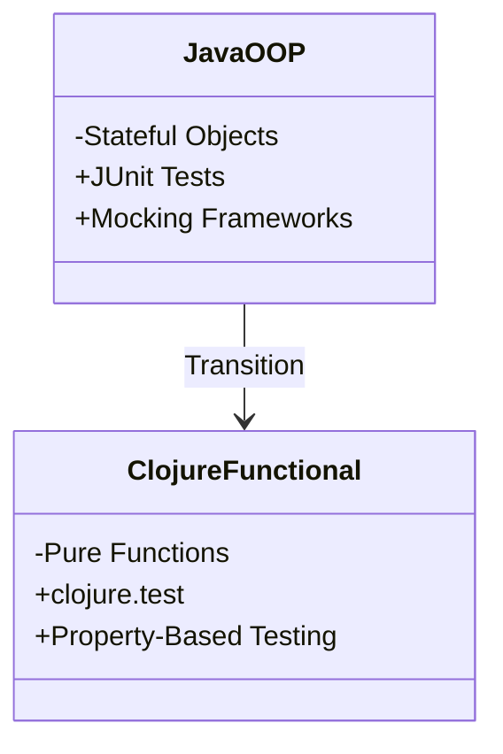

## 4.6 Writing Testable Functions

In the realm of software development, testing is a cornerstone of building reliable, maintainable, and scalable applications. In this section, we will delve into the art of writing testable functions in Clojure, focusing on unit testing and property-based testing. We will explore how the functional programming paradigm, particularly the use of pure functions, simplifies the testing process. Additionally, we will provide practical examples using Clojure's testing frameworks, such as `clojure.test`.

### Unit Testing Fundamentals

Unit testing is a practice where individual units of code, typically functions, are tested in isolation from the rest of the application. This approach ensures that each function behaves as expected under various conditions. 

#### Importance of Unit Testing

- **Early Bug Detection**: By testing functions individually, developers can catch bugs early in the development cycle, reducing the cost and effort required to fix them later.
- **Documentation**: Tests serve as a form of documentation, providing examples of how functions are intended to be used.
- **Refactoring Confidence**: With a robust suite of tests, developers can refactor code with confidence, knowing that any regressions will be caught by existing tests.
- **Code Quality**: Consistent unit testing leads to higher code quality and reliability.

#### Testing Pure Functions

Pure functions, which are a hallmark of functional programming, are functions that always produce the same output for the same input and have no side effects. This predictability makes them ideal candidates for unit testing.

**Advantages of Testing Pure Functions:**

- **Deterministic Outcomes**: Since pure functions are deterministic, their behavior is consistent, making it straightforward to define expected outcomes in tests.
- **Isolation**: Pure functions do not rely on external state, making them easy to test in isolation.
- **Simplicity**: The lack of side effects simplifies the setup and teardown processes in tests.

**Example: Testing a Pure Function**

Consider a simple pure function that calculates the square of a number:

```clojure
(defn square [x]
  (* x x))
```

To test this function, we can use the `clojure.test` framework:

```clojure
(ns myapp.core-test
  (:require [clojure.test :refer :all]
            [myapp.core :refer :all]))

(deftest test-square
  (testing "square function"
    (is (= 4 (square 2)))
    (is (= 9 (square 3)))
    (is (= 0 (square 0)))
    (is (= 1 (square -1)))))
```

In this example, we define a test suite using `deftest` and `testing` macros. We then use the `is` macro to assert that the output of the `square` function matches the expected results for various inputs.

### Property-Based Testing

While unit tests are great for verifying specific cases, property-based testing allows us to validate that a function behaves correctly over a wide range of inputs. This approach is particularly useful for discovering edge cases that might not be covered by traditional unit tests.

#### Introduction to Property-Based Testing

Property-based testing involves specifying properties or invariants that should hold true for any input. The testing framework then generates a wide range of inputs to verify these properties.

**Example: Property-Based Testing with `test.check`**

Let's use the `test.check` library to perform property-based testing on our `square` function. We'll verify the property that squaring a number should always yield a non-negative result.

```clojure
(ns myapp.core-test
  (:require [clojure.test :refer :all]
            [clojure.test.check :as tc]
            [clojure.test.check.properties :as prop]
            [clojure.test.check.generators :as gen]))

(def square-property
  (prop/for-all [x gen/int]
    (>= (square x) 0)))

(tc/quick-check 100 square-property)
```

In this example, we define a property using the `prop/for-all` macro, which states that for all integers `x`, the result of `square x` should be greater than or equal to zero. We then use `tc/quick-check` to run the property test with 100 randomly generated inputs.

### Example Tests with Clojure's Testing Frameworks

Clojure provides several testing frameworks, with `clojure.test` being the most commonly used. It is a simple yet powerful tool for writing both unit and property-based tests.

#### Writing Unit Tests with `clojure.test`

Let's expand our testing suite to include more complex functions. Consider a function that calculates the factorial of a number:

```clojure
(defn factorial [n]
  (reduce * (range 1 (inc n))))
```

To test this function, we can write the following unit tests:

```clojure
(deftest test-factorial
  (testing "factorial function"
    (is (= 1 (factorial 0)))
    (is (= 1 (factorial 1)))
    (is (= 2 (factorial 2)))
    (is (= 6 (factorial 3)))
    (is (= 24 (factorial 4)))))
```

#### Property-Based Testing with `clojure.test.check`

We can also apply property-based testing to the `factorial` function. One property we can test is that the factorial of `n` should be equal to `n` times the factorial of `n-1`.

```clojure
(def factorial-property
  (prop/for-all [n (gen/such-that pos? gen/nat)]
    (= (factorial n) (* n (factorial (dec n))))))

(tc/quick-check 100 factorial-property)
```

In this example, we use `gen/such-that` to generate positive integers and verify the recursive property of the factorial function.

### Try It Yourself

To gain a deeper understanding, try modifying the code examples above:

- **Add More Test Cases**: Extend the unit tests to cover additional edge cases, such as negative numbers or large inputs.
- **Explore Other Properties**: Define and test new properties for the `square` and `factorial` functions.
- **Integrate with CI/CD**: Set up a continuous integration pipeline to automatically run your tests on each code change.

### Visual Aids

To better understand the relationship between Java OOP and Clojure's functional paradigm in testing, consider the following diagram:



**Diagram Description**: This diagram illustrates the transition from Java's object-oriented testing approach, using stateful objects and JUnit, to Clojure's functional testing paradigm, which emphasizes pure functions and property-based testing.

### References and Links

- [Clojure Official Documentation](https://clojure.org/reference)
- [Clojure Community Resources](https://clojure.org/community/resources)
- [Transitioning from OOP to Functional Programming](https://www.lispcast.com/oo-to-fp/)
- [Clojure Testing Guide](https://clojure.org/guides/testing)
- [Test Check Library](https://github.com/clojure/test.check)

### Knowledge Check

To reinforce your understanding, consider the following questions:

1. What are the benefits of testing pure functions compared to impure ones?
2. How does property-based testing differ from traditional unit testing?
3. What is the purpose of using generators in property-based testing?

### Encouraging Engagement

Embracing functional programming and its testing methodologies can be challenging, but with each step, you'll gain a deeper understanding and see tangible benefits in your codebase. Remember, practice and experimentation are key to mastering these concepts.

### Best Practices for Tags

Use the following tags to categorize this section: "Clojure", "Functional Programming", "Unit Testing", "Property-Based Testing", "Pure Functions", "Test Automation", "Clojure.test", "Software Quality".

## **Test Your Knowledge: Writing Testable Functions Quiz**



### What is a key advantage of testing pure functions?

- [x] They produce deterministic outcomes.
- [ ] They require complex setup.
- [ ] They are inherently faster.
- [ ] They depend on external state.

> **Explanation:** Pure functions produce deterministic outcomes, which simplifies testing.

### Which Clojure library is commonly used for property-based testing?

- [ ] clojure.test
- [x] test.check
- [ ] clojure.spec
- [ ] speclj

> **Explanation:** `test.check` is a library used for property-based testing in Clojure.

### What does property-based testing focus on?

- [x] Validating properties over a range of inputs.
- [ ] Testing only edge cases.
- [ ] Ensuring code compiles.
- [ ] Mocking external services.

> **Explanation:** Property-based testing validates that properties hold true across a wide range of inputs.

### In the context of testing, what is a generator?

- [x] A tool for creating random inputs.
- [ ] A function that returns a fixed value.
- [ ] A method for compiling code.
- [ ] A process for deploying applications.

> **Explanation:** Generators create random inputs for testing properties in property-based testing.

### How does property-based testing enhance traditional unit testing?

- [x] It tests a broader range of inputs.
- [ ] It replaces all unit tests.
- [x] It discovers edge cases.
- [ ] It reduces the need for code reviews.

> **Explanation:** Property-based testing enhances unit testing by covering a broader range of inputs and discovering edge cases.

### What is the `clojure.test` framework used for?

- [x] Writing unit tests.
- [ ] Generating random data.
- [ ] Compiling Clojure code.
- [ ] Managing dependencies.

> **Explanation:** `clojure.test` is used for writing unit tests in Clojure.

### What is a key characteristic of pure functions?

- [x] They have no side effects.
- [ ] They modify global state.
- [x] They produce the same output for the same input.
- [ ] They depend on external services.

> **Explanation:** Pure functions have no side effects and produce consistent outputs for the same inputs.

### What is the purpose of the `is` macro in `clojure.test`?

- [x] To assert expected outcomes.
- [ ] To generate test data.
- [ ] To define properties.
- [ ] To compile code.

> **Explanation:** The `is` macro is used to assert that a test's expected outcomes are met.

### Why is it beneficial to test functions in isolation?

- [x] It simplifies debugging.
- [ ] It increases code complexity.
- [ ] It requires more dependencies.
- [ ] It slows down the testing process.

> **Explanation:** Testing functions in isolation simplifies debugging by focusing on individual units of code.

### True or False: Property-based testing can replace all unit tests.

- [ ] True
- [x] False

> **Explanation:** Property-based testing complements but does not replace traditional unit tests, as both have unique advantages.


