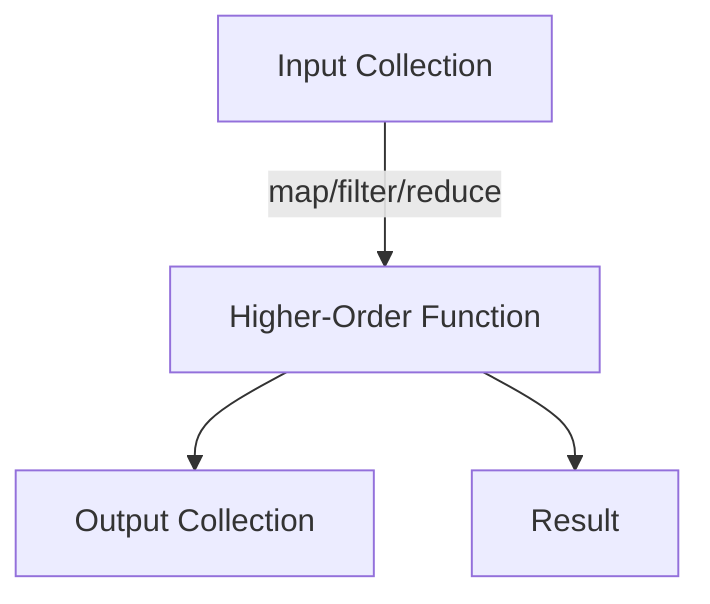

## 5.1 Understanding Higher-Order Functions

Higher-order functions are a cornerstone of functional programming, offering a powerful way to write flexible and reusable code. In Clojure, these functions are not only prevalent but also essential for creating scalable applications. In this section, we will explore what higher-order functions are, their significance in functional programming, and how they can be applied in real-world scenarios.

### Definition and Significance

**Higher-order functions** are functions that can take other functions as arguments or return functions as results. This capability allows for a high degree of abstraction and flexibility in code design. By enabling functions to operate on other functions, higher-order functions facilitate code reuse and modularity, which are key principles in functional programming.

In contrast to the object-oriented paradigm, where behavior is often encapsulated within objects, functional programming emphasizes the use of functions as first-class citizens. This means functions can be passed around just like any other data type. This paradigm shift from Java's object-oriented programming to Clojure's functional approach can be initially challenging but ultimately rewarding, as it leads to cleaner and more maintainable code.

#### Key Benefits of Higher-Order Functions

1. **Abstraction**: Higher-order functions abstract common patterns of computation, allowing developers to focus on the logic specific to their application.
2. **Reusability**: By encapsulating behavior in functions, code becomes more reusable across different parts of an application.
3. **Composability**: Functions can be composed to build more complex operations from simpler ones, promoting modular design.
4. **Expressiveness**: Code becomes more expressive and concise, reducing boilerplate and enhancing readability.

### Examples in Clojure

Clojure provides several built-in higher-order functions that are widely used in functional programming. Let's explore some of the most common ones: `map`, `filter`, and `reduce`.

#### `map`

The `map` function applies a given function to each element in a collection, returning a new collection of results. This is similar to the `forEach` method in Java, but `map` returns a new collection rather than modifying the existing one.

```clojure
(defn square [x]
  (* x x))

;; Using map to apply the square function to each element in a list
(def squared-numbers (map square [1 2 3 4 5]))
;; => (1 4 9 16 25)
```

In this example, `map` takes the `square` function and a list of numbers, applying `square` to each element and returning a new list of squared numbers.

#### `filter`

The `filter` function selects elements from a collection that satisfy a given predicate function. It is analogous to Java's `Stream.filter` method.

```clojure
(defn even? [x]
  (zero? (mod x 2)))

;; Using filter to select even numbers from a list
(def even-numbers (filter even? [1 2 3 4 5 6]))
;; => (2 4 6)
```

Here, `filter` uses the `even?` predicate to return a list of even numbers from the input list.

#### `reduce`

The `reduce` function is used to accumulate a result by applying a function to an initial value and each element of a collection. It is similar to Java's `Stream.reduce` method.

```clojure
;; Using reduce to sum a list of numbers
(def sum (reduce + 0 [1 2 3 4 5]))
;; => 15
```

In this example, `reduce` takes the `+` function, an initial value of `0`, and a list of numbers, returning the sum of the numbers.

### Function Manipulation

Higher-order functions allow for the manipulation of functions, enabling developers to create more abstract and flexible code. This capability is particularly useful in scenarios where the behavior of a function needs to be customized or extended.

#### Creating Custom Higher-Order Functions

Developers can create their own higher-order functions by writing functions that accept other functions as parameters or return functions as results.

```clojure
(defn apply-twice [f x]
  (f (f x)))

;; Using apply-twice with a function that doubles a number
(defn double [x]
  (* 2 x))

(apply-twice double 5)
;; => 20
```

In this example, `apply-twice` is a higher-order function that takes a function `f` and a value `x`, applying `f` to `x` twice. When used with the `double` function, it effectively quadruples the input value.

### Real-World Applications

Higher-order functions are not just theoretical constructs; they have practical applications in many real-world scenarios. Let's explore some areas where they simplify complex tasks.

#### Event Handling

In event-driven programming, higher-order functions can be used to create flexible event handlers. By passing different functions as handlers, developers can easily customize the behavior of an application in response to various events.

```clojure
(defn handle-click [event]
  (println "Button clicked!" event))

(defn handle-mouseover [event]
  (println "Mouse over!" event))

(defn register-event-handler [event-type handler]
  ;; Simulate registering an event handler
  (println (str "Registering handler for " event-type)))

(register-event-handler "click" handle-click)
(register-event-handler "mouseover" handle-mouseover)
```

In this example, `register-event-handler` is a higher-order function that registers different event handlers for different event types.

#### Asynchronous Programming

Higher-order functions are also useful in asynchronous programming, where they can be used to define callback functions that are executed upon the completion of asynchronous tasks.

```clojure
(defn async-operation [callback]
  ;; Simulate an asynchronous operation
  (future
    (Thread/sleep 1000)
    (callback "Operation completed")))

(defn on-completion [result]
  (println result))

(async-operation on-completion)
```

Here, `async-operation` simulates an asynchronous task that takes a `callback` function, which is executed once the task is complete.

### Try It Yourself

To deepen your understanding of higher-order functions, try modifying the examples above:

- Change the `square` function in the `map` example to a function that triples each number.
- Create a `filter` function that selects numbers greater than a given threshold.
- Write a `reduce` function that multiplies all numbers in a list.
- Experiment with creating your own higher-order function that applies a given function three times to an input.

### Visual Aids

To better understand the flow of data and function application in higher-order functions, consider the following diagram:



**Diagram Description**: This flowchart illustrates how an input collection is processed by a higher-order function (`map`, `filter`, or `reduce`), resulting in an output collection or a single result.

### References and Links

For further reading and exploration, consider the following resources:

- [Clojure Official Documentation](https://clojure.org/reference)
- [Clojure Community Resources](https://clojure.org/community/resources)
- [Transitioning from OOP to Functional Programming](https://www.lispcast.com/oo-to-fp/)

### Knowledge Check

To reinforce your understanding of higher-order functions, consider these questions:

- What are the key benefits of using higher-order functions in functional programming?
- How do `map`, `filter`, and `reduce` differ in their operation on collections?
- Can you describe a scenario where a higher-order function simplifies code complexity?

### Encouraging Engagement

Embracing functional programming can be challenging, but with each step, you'll gain a deeper understanding and see tangible benefits in your codebase. Experiment with the examples provided, and don't hesitate to explore further by creating your own higher-order functions.

### Best Practices for Tags

When tagging content related to higher-order functions, consider using specific and relevant tags such as "Clojure", "Functional Programming", "Higher-Order Functions", "Map", "Filter", "Reduce", "Java Migration", and "Asynchronous Programming".

## **Test Your Knowledge: Understanding Higher-Order Functions Quiz**



### What is a higher-order function?

- [x] A function that takes other functions as arguments or returns functions as results
- [ ] A function that only operates on numbers
- [ ] A function that modifies global variables
- [ ] A function that cannot be reused

> **Explanation:** Higher-order functions are those that can take other functions as arguments or return functions as results, allowing for greater abstraction and flexibility.

### Which Clojure function applies a given function to each element in a collection?

- [x] map
- [ ] filter
- [ ] reduce
- [ ] apply

> **Explanation:** The `map` function applies a given function to each element in a collection and returns a new collection of results.

### What is the purpose of the `filter` function in Clojure?

- [x] To select elements from a collection that satisfy a given predicate
- [ ] To apply a function to each element in a collection
- [ ] To accumulate a result from a collection
- [ ] To sort a collection

> **Explanation:** The `filter` function selects elements from a collection that satisfy a given predicate function.

### How does `reduce` differ from `map` and `filter`?

- [x] `reduce` accumulates a result using a function and an initial value
- [ ] `reduce` applies a function to each element and returns a collection
- [ ] `reduce` sorts a collection
- [ ] `reduce` filters elements based on a predicate

> **Explanation:** `reduce` accumulates a result by applying a function to an initial value and each element of a collection, unlike `map` and `filter`, which return collections.

### What is a practical application of higher-order functions?

- [x] Simplifying event handling
- [ ] Modifying global state
- [ ] Increasing code verbosity
- [ ] Decreasing code reusability

> **Explanation:** Higher-order functions can simplify complex tasks such as event handling by allowing flexible customization of behavior.

### Can higher-order functions be used in asynchronous programming?

- [x] Yes
- [ ] No

> **Explanation:** Higher-order functions can be used to define callback functions that are executed upon the completion of asynchronous tasks.

### Which of the following is a benefit of higher-order functions?

- [x] Abstraction
- [x] Reusability
- [ ] Increased complexity
- [ ] Reduced expressiveness

> **Explanation:** Higher-order functions provide abstraction and reusability, making code more modular and expressive.

### What does the `apply-twice` function do in the example provided?

- [x] Applies a given function twice to an input
- [ ] Applies a function once to an input
- [ ] Multiplies an input by two
- [ ] Divides an input by two

> **Explanation:** The `apply-twice` function takes a function `f` and a value `x`, applying `f` to `x` twice.

### What is the result of `(apply-twice double 5)` in the provided example?

- [x] 20
- [ ] 10
- [ ] 15
- [ ] 25

> **Explanation:** The `apply-twice` function applies the `double` function twice to the input `5`, resulting in `20`.

### True or False: Higher-order functions are unique to functional programming.

- [x] True
- [ ] False

> **Explanation:** Higher-order functions are a fundamental concept in functional programming, allowing functions to be passed as arguments or returned as results.


