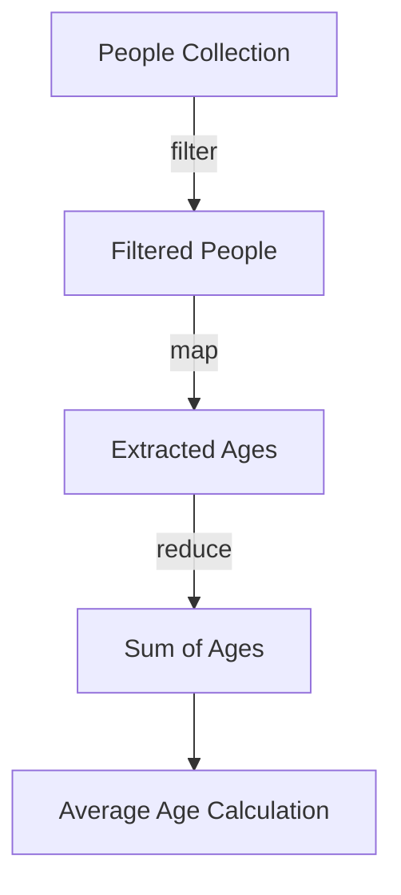

## 5.2 Using `map`, `filter`, and `reduce`

In the realm of functional programming, higher-order functions like `map`, `filter`, and `reduce` are indispensable tools for data transformation and processing. These functions allow us to operate on collections in a declarative manner, promoting code that is concise, expressive, and easy to reason about. In this section, we will delve into the mechanics of each function, explore practical examples, and demonstrate how they can be composed to build complex data processing pipelines.

### The `map` Function

The `map` function is a quintessential higher-order function in Clojure that applies a specified function to each element of a collection, returning a new sequence of results. This operation is akin to the `forEach` method in Java, but with a key distinction: `map` returns a new collection rather than modifying the original one.

#### How `map` Works

The `map` function takes two arguments: a function and a collection. It applies the function to each element of the collection, yielding a sequence of transformed elements.

```clojure
;; Define a simple function to square a number
(defn square [x]
  (* x x))

;; Use `map` to apply `square` to each element of a list
(def numbers [1 2 3 4 5])
(def squared-numbers (map square numbers))

;; Output: (1 4 9 16 25)
(println squared-numbers)
```

In this example, the `square` function is applied to each element of the `numbers` list, resulting in a new sequence of squared values.

#### Key Characteristics of `map`

- **Immutability**: `map` does not alter the original collection; it produces a new sequence.
- **Laziness**: The result of `map` is a lazy sequence, meaning that elements are computed only as needed.
- **Function Composition**: `map` can be composed with other functions to build complex transformations.

### The `filter` Function

The `filter` function is used to select elements from a collection that satisfy a given predicate function. This is similar to filtering a stream in Java using the `filter` method, but in Clojure, it is achieved in a more functional style.

#### How `filter` Works

`filter` takes a predicate function and a collection as arguments. It returns a new sequence containing only the elements for which the predicate returns true.

```clojure
;; Define a predicate function to check if a number is even
(defn even? [x]
  (zero? (mod x 2)))

;; Use `filter` to select even numbers from a list
(def even-numbers (filter even? numbers))

;; Output: (2 4)
(println even-numbers)
```

Here, `filter` applies the `even?` predicate to each element of the `numbers` list, retaining only the even numbers.

#### Key Characteristics of `filter`

- **Immutability**: Like `map`, `filter` does not modify the original collection.
- **Laziness**: The resulting sequence is lazy, evaluated only as elements are accessed.
- **Predicate Function**: The predicate function should return a boolean value.

### The `reduce` Function

The `reduce` function, also known as `fold` in other functional languages, aggregates elements of a collection into a single value using a reducing function. This is analogous to Java's `reduce` operation on streams.

#### How `reduce` Works

`reduce` takes a reducing function and a collection. Optionally, it can also take an initial value. The reducing function is applied to accumulate a result from the elements of the collection.

```clojure
;; Define a reducing function to sum two numbers
(defn sum [acc x]
  (+ acc x))

;; Use `reduce` to sum all numbers in a list
(def total-sum (reduce sum 0 numbers))

;; Output: 15
(println total-sum)
```

In this example, `reduce` accumulates the sum of all elements in the `numbers` list, starting from an initial value of `0`.

#### Key Characteristics of `reduce`

- **Aggregation**: `reduce` is used to combine elements into a single result.
- **Initial Value**: Providing an initial value is optional but can be useful for certain operations.
- **Non-Lazy**: Unlike `map` and `filter`, `reduce` is not lazy; it processes the entire collection immediately.

### Practical Examples

Let's explore some practical examples that illustrate how `map`, `filter`, and `reduce` can be used in data transformation tasks.

#### Example 1: Transforming and Filtering Data

Suppose we have a collection of integers, and we want to square each number and then filter out the even squares.

```clojure
;; Define a function to square and filter even numbers
(defn square-and-filter-even [numbers]
  (->> numbers
       (map square)
       (filter even?)))

;; Use the function on a list of numbers
(def even-squared-numbers (square-and-filter-even numbers))

;; Output: (4 16)
(println even-squared-numbers)
```

In this example, we use the threading macro `->>` to compose `map` and `filter`, creating a pipeline that first squares the numbers and then filters out the even ones.

#### Example 2: Aggregating Data

Consider a scenario where we need to calculate the product of all odd numbers in a list.

```clojure
;; Define a predicate for odd numbers
(defn odd? [x]
  (not (even? x)))

;; Define a reducing function for multiplication
(defn multiply [acc x]
  (* acc x))

;; Use `filter` and `reduce` to find the product of odd numbers
(def odd-product (->> numbers
                      (filter odd?)
                      (reduce multiply 1)))

;; Output: 15 (1 * 3 * 5)
(println odd-product)
```

Here, we filter the odd numbers and then use `reduce` to calculate their product, demonstrating how these functions can be combined to perform complex operations.

### Composition of Functions

The true power of `map`, `filter`, and `reduce` lies in their ability to be composed into pipelines that perform sophisticated data processing tasks. By chaining these functions, we can transform, filter, and aggregate data in a seamless and declarative manner.

#### Building Data Processing Pipelines

Let's consider a more complex example where we have a collection of maps representing people, and we want to calculate the average age of people whose names start with a specific letter.

```clojure
;; Sample data: a list of maps representing people
(def people [{:name "Alice" :age 30}
             {:name "Bob" :age 25}
             {:name "Charlie" :age 35}
             {:name "David" :age 40}])

;; Define a predicate function to check if a name starts with a letter
(defn name-starts-with? [letter person]
  (clojure.string/starts-with? (:name person) letter))

;; Define a function to extract the age from a person map
(defn extract-age [person]
  (:age person))

;; Calculate the average age of people whose names start with 'A'
(def average-age (->> people
                      (filter #(name-starts-with? "A" %))
                      (map extract-age)
                      (reduce + 0)
                      (/ (count (filter #(name-starts-with? "A" %) people)))))

;; Output: 30.0
(println average-age)
```

In this example, we use `filter` to select people whose names start with 'A', `map` to extract their ages, and `reduce` to calculate the sum of ages, which is then divided by the count to find the average.

### Visualizing Function Composition

To better understand how these functions work together, let's visualize the data flow in the previous example using a Mermaid.js diagram.



**Diagram Description**: This flowchart illustrates the process of filtering, mapping, and reducing a collection of people to calculate the average age. The data flows from the initial collection through each step, resulting in the final calculation.

### Try It Yourself

To deepen your understanding, try modifying the examples above:

- **Experiment with Different Functions**: Change the predicate or transformation functions to see how the output changes.
- **Combine with Other Higher-Order Functions**: Use `map`, `filter`, and `reduce` in conjunction with other Clojure functions to solve more complex problems.
- **Create Your Own Pipelines**: Design a data processing pipeline for a real-world dataset, such as filtering and aggregating sales data.

### References and Links

For further reading and exploration, consider these resources:

- [Clojure Official Documentation](https://clojure.org/reference)
- [Clojure Community Resources](https://clojure.org/community/resources)
- [Transitioning from OOP to Functional Programming](https://www.lispcast.com/oo-to-fp/)

### Knowledge Check

To reinforce your learning, let's summarize the key takeaways:

- **`map`** applies a function to each element of a collection, returning a new sequence.
- **`filter`** selects elements that satisfy a predicate function, producing a filtered sequence.
- **`reduce`** aggregates elements into a single value using a reducing function.
- These functions can be composed to create powerful data processing pipelines.

### Test Your Knowledge: Using `map`, `filter`, and `reduce` Quiz



### What does the `map` function return?

- [x] A new sequence with each element transformed by the given function.
- [ ] The original collection with elements modified in place.
- [ ] A single aggregated value.
- [ ] A boolean indicating if all elements satisfy a condition.

> **Explanation:** The `map` function returns a new sequence where each element is the result of applying the given function to the corresponding element in the original collection.

### How does `filter` determine which elements to include in its result?

- [x] By applying a predicate function to each element and including those for which the predicate returns true.
- [ ] By modifying elements in place based on a transformation function.
- [ ] By aggregating elements into a single value.
- [ ] By sorting the elements in the collection.

> **Explanation:** `filter` uses a predicate function to test each element, including only those that satisfy the condition (return true).

### What is the primary purpose of the `reduce` function?

- [x] To aggregate elements of a collection into a single value using a reducing function.
- [ ] To modify each element of a collection in place.
- [ ] To filter elements based on a predicate.
- [ ] To transform each element of a collection into a new sequence.

> **Explanation:** `reduce` is used to combine elements of a collection into a single result, often by applying a function that accumulates the result.

### Which of the following is true about the `map` function?

- [x] It is lazy and returns a sequence that is evaluated as needed.
- [ ] It modifies the original collection in place.
- [ ] It is eager and processes the entire collection immediately.
- [ ] It only works with numeric data types.

> **Explanation:** The `map` function in Clojure is lazy, meaning it produces a sequence that is evaluated only when needed.

### What is a common use case for combining `map`, `filter`, and `reduce`?

- [x] Building data processing pipelines that transform, filter, and aggregate data.
- [ ] Modifying a collection in place to meet specific criteria.
- [ ] Sorting a collection based on multiple conditions.
- [ ] Generating random data for testing purposes.

> **Explanation:** `map`, `filter`, and `reduce` are often combined to create pipelines that process data in multiple stages, transforming, filtering, and aggregating as needed.

### What does the `reduce` function require to operate correctly?

- [x] A reducing function and a collection, with an optional initial value.
- [ ] A predicate function and a collection.
- [ ] A transformation function and a collection.
- [ ] A single element to start the reduction.

> **Explanation:** `reduce` requires a reducing function and a collection, and optionally an initial value to start the accumulation.

### How can you ensure that a `filter` operation is efficient?

- [x] By using a predicate function that is simple and fast to evaluate.
- [ ] By modifying the collection in place.
- [ ] By using a reducing function instead of a predicate.
- [ ] By sorting the collection before filtering.

> **Explanation:** Ensuring the predicate function is simple and efficient helps `filter` operate quickly, as it evaluates the predicate for each element.

### What is the result of using `map` on an empty collection?

- [x] An empty sequence.
- [ ] An error indicating the collection is empty.
- [ ] A sequence with a single element.
- [ ] The original collection.

> **Explanation:** Applying `map` to an empty collection results in an empty sequence, as there are no elements to transform.

### In what scenario would you use `reduce` without an initial value?

- [x] When the collection has at least one element, and the reducing function can operate on pairs of elements.
- [ ] When the collection is empty.
- [ ] When you need to filter elements based on a condition.
- [ ] When the reducing function requires an initial accumulator.

> **Explanation:** `reduce` can operate without an initial value if the collection has elements, as it can use the first element as the initial accumulator.

### True or False: `map`, `filter`, and `reduce` can only be used with numeric data types.

- [ ] True
- [x] False

> **Explanation:** `map`, `filter`, and `reduce` can be used with any data types, as long as the functions provided are compatible with the elements in the collection.



By mastering `map`, `filter`, and `reduce`, you can unlock the full potential of functional programming in Clojure, enabling you to write concise, expressive, and efficient code. Embrace these powerful tools to transform your data processing tasks and elevate your functional programming skills.
