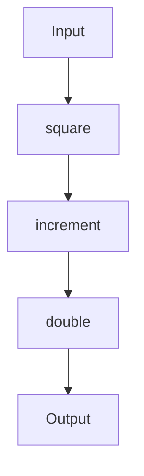

## 5.3 Function Composition Techniques

In the realm of functional programming, function composition is a fundamental concept that allows developers to build complex applications by combining simple, reusable functions. This approach not only enhances code readability and maintainability but also aligns with the core principles of functional programming, such as immutability and pure functions. In this section, we'll delve into the intricacies of function composition in Clojure, focusing on the `comp` function, the order of operations, and how to chain functions effectively.

### Understanding Composition

Function composition is the process of combining two or more functions to produce a new function. This new function, when invoked, applies the original functions in sequence, passing the output of one function as the input to the next. This technique is akin to the concept of method chaining in object-oriented programming (OOP), where methods are called in a sequence on the same object.

In Clojure, function composition is a powerful tool that allows developers to build complex operations from simple, well-defined functions. This not only makes the code more modular and easier to test but also encourages the reuse of existing functions, reducing redundancy.

### The `comp` Function

The `comp` function in Clojure is a built-in function that facilitates function composition. It takes multiple functions as arguments and returns a new function that represents the composition of those functions. The `comp` function is defined as follows:

```clojure
(defn comp
  [& fs]
  (reduce (fn [f g]
            (fn [& args]
              (f (apply g args))))
          fs))
```

This definition showcases how `comp` uses `reduce` to apply each function in the sequence, starting from the rightmost function and working its way left. This right-to-left composition is a crucial aspect of `comp` that developers must understand to use it effectively.

#### Example of `comp` Usage

Let's consider a simple example to illustrate the use of `comp`. Suppose we have the following functions:

```clojure
(defn square [x]
  (* x x))

(defn increment [x]
  (+ x 1))

(defn double [x]
  (* 2 x))
```

We can compose these functions using `comp` to create a new function that squares a number, increments it, and then doubles the result:

```clojure
(def square-increment-double (comp double increment square))

(println (square-increment-double 3)) ; Output: 20
```

In this example, the input `3` is first squared to `9`, then incremented to `10`, and finally doubled to `20`. The `comp` function allows us to express this sequence of operations succinctly and clearly.

### Order of Operations

Understanding the order of operations in function composition is critical. In Clojure, the `comp` function applies the functions from right to left. This means that the rightmost function is applied first, and the leftmost function is applied last. This order is similar to the mathematical notation for function composition, where `(f ∘ g)(x)` is equivalent to `f(g(x))`.

#### Importance of Order

The order of functions in `comp` can significantly affect the output of the composed function. Consider the following example:

```clojure
(defn add-two [x]
  (+ x 2))

(defn multiply-by-three [x]
  (* x 3))

(def add-then-multiply (comp multiply-by-three add-two))
(def multiply-then-add (comp add-two multiply-by-three))

(println (add-then-multiply 5)) ; Output: 21
(println (multiply-then-add 5)) ; Output: 17
```

In `add-then-multiply`, `add-two` is applied first, resulting in `7`, which is then multiplied by `3` to produce `21`. Conversely, in `multiply-then-add`, `multiply-by-three` is applied first, resulting in `15`, which is then incremented by `2` to produce `17`. This example highlights the importance of carefully considering the order of functions in `comp`.

### Chaining Functions

Function chaining is a technique that involves applying multiple functions in sequence, where the output of one function becomes the input of the next. In Clojure, `comp` provides a clean and concise way to chain functions, resulting in more readable and maintainable code.

#### Benefits of Chaining Functions

Chaining functions using `comp` offers several benefits:

1. **Readability**: By expressing complex operations as a sequence of simple, well-defined functions, the code becomes easier to read and understand.

2. **Modularity**: Each function in the chain can be developed, tested, and maintained independently, promoting modularity and reusability.

3. **Maintainability**: Changes to the logic can be made by modifying or replacing individual functions, reducing the risk of introducing bugs.

#### Example of Function Chaining

Consider the following example, where we chain functions to process a list of numbers:

```clojure
(defn filter-even [numbers]
  (filter even? numbers))

(defn square-numbers [numbers]
  (map square numbers))

(defn sum-numbers [numbers]
  (reduce + numbers))

(def process-numbers (comp sum-numbers square-numbers filter-even))

(println (process-numbers [1 2 3 4 5 6])) ; Output: 56
```

In this example, `filter-even` is applied first to filter out odd numbers, resulting in `[2 4 6]`. Then, `square-numbers` squares each number, producing `[4 16 36]`. Finally, `sum-numbers` sums the squared numbers, resulting in `56`. The use of `comp` allows us to express this sequence of operations in a clean and concise manner.

### Try It Yourself

To deepen your understanding of function composition, try modifying the examples above. For instance, experiment with different orders of functions in `comp` or create new functions to add to the chain. Observe how these changes affect the output and consider the implications for code readability and maintainability.

### Visualizing Function Composition

To further illustrate the concept of function composition, let's use a diagram to represent the flow of data through a composed function:



This diagram represents the flow of data through the `square-increment-double` function. The input is first passed to the `square` function, then to `increment`, and finally to `double`, resulting in the output.

### References and Links

For more information on function composition and related topics, consider exploring the following resources:

- [Clojure Official Documentation](https://clojure.org/reference)
- [Functional Programming Concepts](https://www.lispcast.com/oo-to-fp/)
- [Clojure Community Resources](https://clojure.org/community/resources)

### Knowledge Check

To reinforce your understanding of function composition in Clojure, consider the following questions and exercises:

1. What is the primary purpose of function composition in functional programming?
2. How does the `comp` function in Clojure differ from method chaining in Java OOP?
3. Experiment with creating a composed function that filters, maps, and reduces a collection of data. What challenges did you encounter?
4. How can the order of functions in `comp` affect the output of a composed function?

### Key Takeaways

- Function composition is a powerful technique in functional programming that allows developers to build complex operations from simple functions.
- The `comp` function in Clojure facilitates function composition by applying functions from right to left.
- Chaining functions using `comp` enhances code readability, modularity, and maintainability.
- Understanding the order of operations in `comp` is crucial for producing the desired output.

By mastering function composition techniques in Clojure, you'll be well-equipped to build scalable, maintainable applications that leverage the full power of functional programming.

## **Test Your Knowledge: Function Composition Techniques Quiz**



### What is function composition in Clojure?

- [x] Combining multiple functions into a single function
- [ ] Writing functions without side effects
- [ ] Using functions to manipulate data structures
- [ ] Organizing functions into namespaces

> **Explanation:** Function composition involves combining multiple functions to create a new function that applies them in sequence.

### How does the `comp` function apply functions?

- [x] From right to left
- [ ] From left to right
- [ ] In parallel
- [ ] Randomly

> **Explanation:** The `comp` function applies functions from right to left, meaning the rightmost function is applied first.

### What is a benefit of function chaining?

- [x] Improved code readability
- [ ] Increased execution speed
- [ ] Reduced memory usage
- [ ] Enhanced security

> **Explanation:** Function chaining improves code readability by expressing complex operations as a sequence of simple functions.

### Which of the following is a correct use of `comp`?

- [x] `(comp f g h)`
- [ ] `(comp (f g h))`
- [ ] `(f comp g h)`
- [ ] `(comp f, g, h)`

> **Explanation:** The correct syntax for using `comp` is `(comp f g h)`, where `f`, `g`, and `h` are functions.

### What is the output of `(comp inc double)` when applied to `3`?

- [x] `7`
- [ ] `8`
- [ ] `6`
- [ ] `4`

> **Explanation:** `double` is applied first, resulting in `6`, then `inc` is applied, resulting in `7`.

### Why is the order of functions in `comp` important?

- [x] It affects the output of the composed function
- [ ] It determines the execution speed
- [ ] It influences memory allocation
- [ ] It changes the function signatures

> **Explanation:** The order of functions in `comp` affects the output because functions are applied from right to left.

### What is a common use case for function composition?

- [x] Building complex operations from simple functions
- [ ] Optimizing network requests
- [ ] Managing database transactions
- [ ] Securing user authentication

> **Explanation:** Function composition is commonly used to build complex operations by combining simple functions.

### How can you modify a composed function?

- [x] By changing the order or functions in `comp`
- [ ] By rewriting all functions from scratch
- [ ] By adding more parameters to functions
- [ ] By using global variables

> **Explanation:** You can modify a composed function by changing the order or functions in `comp`.

### What is the primary advantage of using `comp` in Clojure?

- [x] Simplifying complex logic into readable code
- [ ] Increasing the speed of function execution
- [ ] Reducing the size of the codebase
- [ ] Enhancing security features

> **Explanation:** The primary advantage of using `comp` is to simplify complex logic into more readable code.

### Function composition is a key concept in which programming paradigm?

- [x] Functional programming
- [ ] Object-oriented programming
- [ ] Procedural programming
- [ ] Logic programming

> **Explanation:** Function composition is a key concept in functional programming, where functions are combined to build complex operations.


