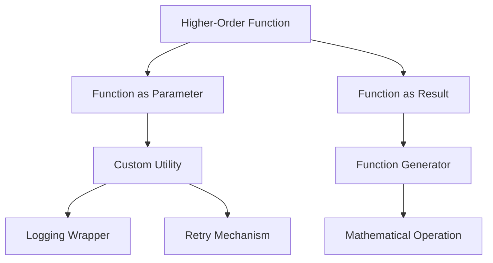

## 5.4 Creating Custom Higher-Order Functions

In the realm of functional programming, higher-order functions (HOFs) are a powerful tool that allows developers to write more abstract, flexible, and reusable code. In this section, we will delve into the creation of custom higher-order functions in Clojure, exploring how they can be used to accept functions as parameters, return functions as results, and dynamically generate new functions. We will also draw parallels to Java's object-oriented programming (OOP) concepts to aid Java developers transitioning to Clojure.

### Defining Higher-Order Functions

Higher-order functions are functions that can take other functions as arguments or return them as results. This capability allows for a high degree of abstraction and composability, enabling developers to build complex functionality from simple components.

#### Accepting Functions as Parameters

In Clojure, functions are first-class citizens, meaning they can be passed around just like any other data type. Let's start by defining a simple higher-order function that accepts another function as a parameter.

```clojure
(defn apply-operation [f x y]
  "Applies the function `f` to the arguments `x` and `y`."
  (f x y))

;; Example usage:
(defn add [a b] (+ a b))
(defn multiply [a b] (* a b))

(println (apply-operation add 5 3))     ; Output: 8
(println (apply-operation multiply 5 3)) ; Output: 15
```

In this example, `apply-operation` is a higher-order function that takes a function `f` and two numbers `x` and `y`. It applies the function `f` to `x` and `y`, demonstrating the flexibility of HOFs to work with different operations.

#### Returning Functions as Results

Higher-order functions can also return functions, enabling dynamic function generation. This is particularly useful for creating function factories or closures.

```clojure
(defn make-adder [n]
  "Returns a function that adds `n` to its argument."
  (fn [x] (+ x n)))

;; Example usage:
(def add-five (make-adder 5))
(println (add-five 10)) ; Output: 15

(def add-ten (make-adder 10))
(println (add-ten 10)) ; Output: 20
```

Here, `make-adder` returns a new function that adds a fixed number `n` to its argument. This demonstrates how HOFs can be used to generate new functions dynamically.

### Custom Utilities

Custom higher-order functions can be designed to enhance or modify existing functions. Common use cases include logging wrappers, retry mechanisms, and memoization.

#### Logging Wrappers

A logging wrapper can be used to log the input and output of a function, which is useful for debugging and monitoring.

```clojure
(defn with-logging [f]
  "Wraps function `f` to log its input and output."
  (fn [& args]
    (println "Calling with arguments:" args)
    (let [result (apply f args)]
      (println "Result:" result)
      result)))

;; Example usage:
(def logged-add (with-logging add))
(logged-add 3 4) ; Logs: Calling with arguments: (3 4) Result: 7
```

In this example, `with-logging` is a higher-order function that takes a function `f` and returns a new function that logs its input and output.

#### Retry Mechanisms

Retry mechanisms can be implemented using higher-order functions to handle transient errors in operations like network requests.

```clojure
(defn retry [f retries]
  "Retries function `f` up to `retries` times if it throws an exception."
  (fn [& args]
    (loop [attempt 0]
      (try
        (apply f args)
        (catch Exception e
          (if (< attempt retries)
            (do
              (println "Retrying..." attempt)
              (recur (inc attempt)))
            (throw e)))))))

;; Example usage:
(defn unreliable-function [x]
  (if (< (rand) 0.5)
    (throw (Exception. "Random failure"))
    x))

(def reliable-function (retry unreliable-function 3))
(println (reliable-function 42)) ; May retry up to 3 times
```

The `retry` function wraps another function `f` and retries it a specified number of times if it throws an exception.

### Function Generators

Function generators create new functions based on input parameters, allowing for highly customizable behavior.

#### Creating Mathematical Operations

Let's create a function that generates different mathematical operations based on input.

```clojure
(defn operation-generator [op]
  "Generates a mathematical operation based on the `op` keyword."
  (case op
    :add +
    :subtract -
    :multiply *
    :divide /))

;; Example usage:
(def add-fn (operation-generator :add))
(def subtract-fn (operation-generator :subtract))

(println (add-fn 10 5))       ; Output: 15
(println (subtract-fn 10 5))  ; Output: 5
```

The `operation-generator` function returns a mathematical operation function based on the provided keyword, showcasing the dynamic nature of function generation.

### Examples and Practical Applications

To solidify our understanding, let's explore some practical examples of custom higher-order functions in real-world scenarios.

#### Example: Caching Results

Caching results of expensive computations can significantly improve performance. We can create a higher-order function to cache results.

```clojure
(defn memoize [f]
  "Returns a memoized version of function `f`."
  (let [cache (atom {})]
    (fn [& args]
      (if-let [cached-result (get @cache args)]
        cached-result
        (let [result (apply f args)]
          (swap! cache assoc args result)
          result)))))

;; Example usage:
(def slow-function (memoize (fn [x] (Thread/sleep 1000) (* x x))))
(println (slow-function 4)) ; Takes 1 second, caches result
(println (slow-function 4)) ; Returns instantly from cache
```

The `memoize` function creates a cached version of any function, storing results in an atom for quick retrieval.

### Visual Aids

To better understand how higher-order functions work, let's use a diagram to illustrate the flow of data and function calls.



**Diagram Description:** This flowchart illustrates the process of creating and using higher-order functions in Clojure. It shows how functions can be used as parameters, returned as results, and utilized in custom utilities and function generators.

### Parallels with Java OOP

For Java developers, understanding higher-order functions can be facilitated by drawing parallels with familiar OOP concepts.

- **Function as Parameter:** Similar to passing a method reference or a lambda expression in Java.
- **Function as Result:** Comparable to returning a lambda or an anonymous class in Java.
- **Custom Utilities:** Analogous to decorators or aspects in Java, which modify behavior.

### References and Links

For further exploration of higher-order functions and functional programming in Clojure, consider the following resources:

- [Clojure Official Documentation](https://clojure.org/reference)
- [Clojure Community Resources](https://clojure.org/community/resources)
- [Transitioning from OOP to Functional Programming](https://www.lispcast.com/oo-to-fp/)

### Knowledge Check

Let's reinforce our understanding with some questions and exercises.

1. **What is a higher-order function?**
   - Answer: A function that takes other functions as arguments or returns a function as a result.

2. **Create a higher-order function that logs the execution time of a given function.**

3. **Modify the `retry` function to include a delay between retries.**

### Test Your Knowledge: Creating Custom Higher-Order Functions Quiz



### What is a higher-order function in Clojure?

- [x] A function that takes other functions as arguments or returns a function as a result.
- [ ] A function that only performs mathematical operations.
- [ ] A function that cannot accept parameters.
- [ ] A function that is only used for logging.

> **Explanation:** Higher-order functions can accept other functions as arguments or return them as results, allowing for flexible and reusable code.

### Which of the following is a practical use of higher-order functions?

- [x] Logging wrappers
- [x] Retry mechanisms
- [ ] Only mathematical operations
- [ ] None of the above

> **Explanation:** Higher-order functions can be used for a variety of purposes, including logging and retry mechanisms, by modifying or enhancing existing functions.

### How can you dynamically generate functions in Clojure?

- [x] By using function generators that return new functions based on input parameters.
- [ ] By using only predefined functions.
- [ ] By using classes and objects.
- [ ] By using loops.

> **Explanation:** Function generators allow the creation of new functions dynamically based on input, providing flexibility and customization.

### What is the purpose of the `memoize` function?

- [x] To cache results of expensive computations for improved performance.
- [ ] To slow down function execution.
- [ ] To delete cached data.
- [ ] To increase memory usage.

> **Explanation:** The `memoize` function caches results of function calls to avoid redundant computations, enhancing performance.

### How does a logging wrapper work in Clojure?

- [x] It wraps a function to log its input and output.
- [ ] It deletes log files.
- [ ] It changes the function's return type.
- [ ] It prevents function execution.

> **Explanation:** A logging wrapper is a higher-order function that logs the input and output of a wrapped function, aiding in debugging and monitoring.

### Which keyword is used to create a new function in Clojure?

- [x] `fn`
- [ ] `def`
- [ ] `class`
- [ ] `new`

> **Explanation:** The `fn` keyword is used to define anonymous functions in Clojure, which can be used in higher-order functions.

### What is the equivalent of a higher-order function in Java?

- [x] Lambda expressions or method references
- [ ] Classes only
- [ ] Interfaces only
- [ ] Loops

> **Explanation:** In Java, lambda expressions and method references serve a similar purpose to higher-order functions in Clojure, allowing functions to be passed as parameters.

### How can you implement a retry mechanism using higher-order functions?

- [x] By wrapping a function and retrying it upon failure
- [ ] By using a loop only
- [ ] By using a class
- [ ] By using a constant value

> **Explanation:** A retry mechanism can be implemented by wrapping a function in another function that retries it upon failure, utilizing higher-order functions.

### What is the benefit of using higher-order functions?

- [x] They provide abstraction and reusability.
- [ ] They make code harder to read.
- [ ] They decrease performance.
- [ ] They prevent code execution.

> **Explanation:** Higher-order functions offer abstraction and reusability, allowing developers to build complex functionality from simple components.

### True or False: Higher-order functions can only be used for mathematical operations.

- [ ] True
- [x] False

> **Explanation:** Higher-order functions have a wide range of applications beyond mathematical operations, including logging, retry mechanisms, and more.



By mastering the creation of custom higher-order functions, you can significantly enhance the flexibility and power of your Clojure applications. Embrace the functional paradigm, experiment with the provided examples, and explore the vast possibilities that higher-order functions offer.
