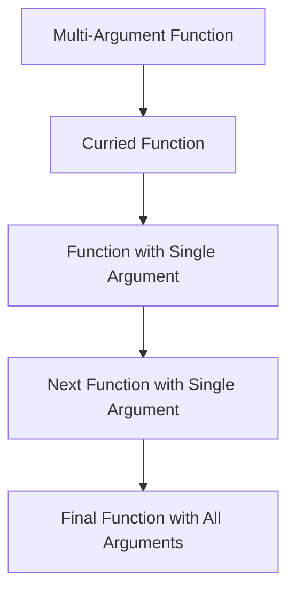

## 5.6 Currying and Partial Application

In the realm of functional programming, **currying** and **partial application** are powerful techniques that can significantly enhance the flexibility and readability of your code. These concepts are especially useful in Clojure, where functions are first-class citizens and play a central role in program design. In this section, we will explore these concepts in depth, providing clear explanations, illustrative examples, and practical applications.

### Understanding Currying

**Currying** is the process of transforming a function that takes multiple arguments into a sequence of functions, each taking a single argument. This technique is named after the mathematician Haskell Curry and is a fundamental concept in functional programming.

#### How Currying Works

When a function is curried, it doesn't immediately execute with all its arguments. Instead, it returns a new function that takes the next argument. This continues until all arguments are provided, at which point the original function is executed with the accumulated arguments.

#### Example of Currying in Clojure

While Clojure does not natively support currying out of the box, we can implement currying using higher-order functions. Let's illustrate this with an example:

```clojure
(defn curry
  "Transforms a multi-argument function into a curried version."
  [f]
  (fn [a]
    (fn [b]
      (fn [c]
        (f a b c)))))

(def add-three-numbers
  (curry (fn [x y z] (+ x y z))))

;; Usage
(def add-five-and-six (add-three-numbers 5))
(def add-six (add-five-and-six 6))
(def result (add-six 7))  ; Returns 18
```

In this example, the `curry` function takes a three-argument function and transforms it into a series of nested functions. Each function takes one argument and returns another function until all arguments are provided.

### Benefits of Currying

Currying offers several advantages:

1. **Function Reusability**: Curried functions can be reused with different arguments, promoting code reuse.
2. **Simplified Function Composition**: Currying enables easier composition of functions by breaking them down into smaller, single-argument functions.
3. **Enhanced Readability**: By reducing the number of arguments in each function, currying can make complex functions easier to understand and maintain.

### Partial Application Explained

**Partial application** is a related concept that involves fixing a few arguments of a function, producing another function of smaller arity. This technique is useful when you want to preset some arguments of a function and reuse it with different remaining arguments.

#### Using `partial` in Clojure

Clojure provides the `partial` function, which allows you to create partially applied functions easily. The `partial` function takes a function and one or more arguments, returning a new function with the given arguments pre-applied.

#### Example of Partial Application

Consider the following example where we use `partial` to create a function that adds a fixed number to its argument:

```clojure
(def add-ten (partial + 10))

;; Usage
(def result (add-ten 5))  ; Returns 15
```

Here, `add-ten` is a partially applied function that adds 10 to any number passed to it. This simplifies the code by reducing the need to repeatedly specify the same argument.

### Practical Applications of Currying and Partial Application

Currying and partial application can be particularly useful in scenarios where you need to preset configuration parameters or create specialized versions of generic functions.

#### Presetting Configuration Parameters

Suppose you have a function that logs messages with a specific log level. You can use partial application to create functions for logging at different levels:

```clojure
(defn log-message [level message]
  (println (str "[" level "] " message)))

(def log-info (partial log-message "INFO"))
(def log-error (partial log-message "ERROR"))

;; Usage
(log-info "This is an informational message.")
(log-error "This is an error message.")
```

In this example, `log-info` and `log-error` are specialized versions of `log-message` with preset log levels.

#### Simplifying Event Handling

In event-driven programming, currying and partial application can simplify event handler definitions by pre-filling context-specific information:

```clojure
(defn handle-event [context event]
  (println (str "Handling event " event " in context " context)))

(def handle-user-event (partial handle-event "user-context"))

;; Usage
(handle-user-event "click")  ; Outputs: Handling event click in context user-context
```

### Try It Yourself

Experiment with the provided examples by modifying the arguments and observing the results. Try creating your own curried and partially applied functions to gain a deeper understanding of these concepts.

### Visualizing Currying and Partial Application

To better understand how currying and partial application work, consider the following flowchart that illustrates the transformation of a multi-argument function into a curried function:



This diagram shows the step-by-step transformation of a function into a curried version, highlighting the sequence of single-argument functions.

### References and Further Reading

- [Clojure Official Documentation](https://clojure.org/reference)
- [Transitioning from OOP to Functional Programming](https://www.lispcast.com/oo-to-fp/)
- [Clojure Community Resources](https://clojure.org/community/resources)

### Knowledge Check

1. **What is currying, and how does it differ from partial application?**
2. **How can you implement currying in Clojure?**
3. **What are the benefits of using currying in functional programming?**
4. **Provide an example of partial application using Clojure's `partial` function.**
5. **How can currying and partial application improve code readability and maintainability?**

### Exercises

1. Implement a curried version of a function that multiplies three numbers.
2. Use partial application to create a function that subtracts a fixed number from its argument.
3. Create a logging function with preset log levels using partial application.

### Encouragement and Engagement

Embracing functional programming techniques like currying and partial application can be challenging, but with practice, you'll find that these tools greatly enhance your ability to write clean, efficient, and reusable code. Experiment with these concepts in your projects and explore their potential to simplify complex logic.

## **Test Your Knowledge: Currying and Partial Application Quiz**



### What is currying in functional programming?

- [x] Transforming a function with multiple arguments into a series of functions with single arguments
- [ ] Fixing a few arguments of a function to produce a new function
- [ ] A technique to optimize recursive functions
- [ ] A method for handling side effects in functions

> **Explanation:** Currying is the process of transforming a multi-argument function into a sequence of single-argument functions.

### How does partial application differ from currying?

- [x] Partial application involves fixing some arguments of a function
- [ ] Partial application transforms a function into a series of single-argument functions
- [ ] Partial application is a technique for optimizing loops
- [ ] Partial application is used for error handling in functions

> **Explanation:** Partial application involves fixing a few arguments of a function, producing another function of smaller arity.

### Which Clojure function is used for partial application?

- [x] `partial`
- [ ] `curry`
- [ ] `apply`
- [ ] `map`

> **Explanation:** The `partial` function in Clojure is used to create partially applied functions.

### What is the result of `(add-ten 5)` if `add-ten` is defined as `(partial + 10)`?

- [x] 15
- [ ] 10
- [ ] 5
- [ ] 20

> **Explanation:** The `add-ten` function adds 10 to its argument, so `(add-ten 5)` returns 15.

### Can currying simplify function composition?

- [x] Yes
- [ ] No

> **Explanation:** Currying simplifies function composition by breaking functions into smaller, single-argument functions, making them easier to compose.

### What is the benefit of using currying in functional programming?

- [x] It enhances function reusability
- [ ] It increases the number of function arguments
- [ ] It makes functions less readable
- [ ] It complicates function composition

> **Explanation:** Currying enhances function reusability by allowing functions to be reused with different arguments.

### How can currying improve code readability?

- [x] By reducing the number of arguments in each function
- [ ] By increasing the complexity of functions
- [ ] By making functions longer
- [ ] By adding more nested functions

> **Explanation:** Currying improves code readability by reducing the number of arguments in each function, making them easier to understand.

### What is the primary use of the `partial` function in Clojure?

- [x] To create partially applied functions
- [ ] To transform functions into curried versions
- [ ] To handle exceptions in functions
- [ ] To optimize recursive functions

> **Explanation:** The `partial` function is used to create partially applied functions by fixing some arguments.

### What is the output of `(log-info "This is a test")` if `log-info` is defined as `(partial log-message "INFO")`?

- [x] [INFO] This is a test
- [ ] [ERROR] This is a test
- [ ] [DEBUG] This is a test
- [ ] [INFO] Test

> **Explanation:** The `log-info` function logs messages with the "INFO" level, so the output is `[INFO] This is a test`.

### True or False: Currying and partial application are only useful in functional programming languages.

- [ ] True
- [x] False

> **Explanation:** While currying and partial application are fundamental in functional programming, they can be applied in other programming paradigms to enhance code flexibility and reuse.


